# 使用 CephFS 作为存储类

<AdSenseTitle/>

本文描述了如何使用 Kuboard / Kuberenetes 对接 CephFS 作为存储类，并完成如下场景：

* [动态提供存储卷](../pv.html#提供-provisioning)
* 绑定 PVC 到 Pod
* PVC 相关操作
  * 扩容
  * 克隆
  * 快照
  * 从快照恢复

## 前提条件

* 您已经安装了 Kubernetes 集群，且集群版本不低于 v1.17.0，安装方法请参考 [安装 Kubernetes 集群](/install/install-k8s.html)；

* 您已经安装了 Kuboard，且 Kuboard 版本不低于 v2.0.5，安装方法请参考 [安装 Kuboard](/install/install-dashboard.html)；

* 您已经安装了 Ceph 集群， Ceph 集群版本不低于 v15.2.3，且已经在集群中创建了一个 FileSystem，安装方法请参考 [Deploying a new Ceph Cluster with cephadm](https://docs.ceph.com/en/latest/cephadm/install/)

  > * Ceph 当前推荐的集群安装方式有 [Deploying a new Ceph Cluster with cephadm](https://docs.ceph.com/en/latest/cephadm/install/) 和 [Rook](https://rook.io/docs/rook/v1.4/ceph-quickstart.html)；
  > * Kuboard 可以同时兼容两种形式安装的 Ceph 集群，本文描述了如何对接使用 Cephadm 安装的 Ceph 集群，如果想了解如何对接 Rook 安装的 Ceph 集群，请参考文档 [CephFS 存储类 - Rook](./rook-config.html)；
  > * Kuboard 也可以兼容其他形式安装的 Ceph 集群，例如 Ceph-ansible、DeepSea、puppet-ceph、ceph-deploy；
  > * Kuboard 2.0.5 也可以对接更低版本的 Kubernetes 或 Ceph 集群，但是会有一部分功能受到限制，请参考 [Ceph CSI 功能特性对照表](https://github.com/ceph/ceph-csi) 中关于 CephFS 的部分。


## 初始化 CephFS CSI 插件

在第一次创建 CephFS StorageClass 时，Kuboard 界面会引导您完成一系列对集群的设置工作，每个集群中，此初始化设置只需要执行一次即可。

* 创建快照 CRD

  打开 Kuboard 集群概览页，按照下图的步骤，在界面的引导下，可以完成快照 CRD 的创建。

  > * 此步骤只在第一次创建 CephFS StorageClass 时需要执行。

  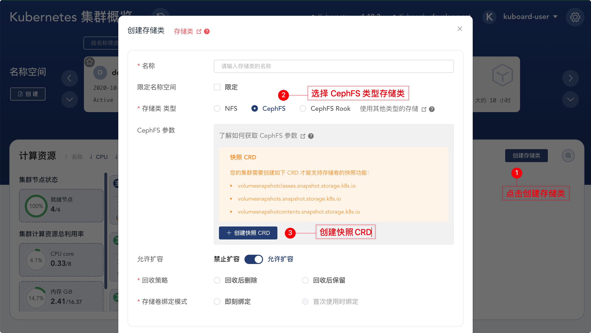

* 初始化 Ceph CSI 插件

  创建好了快照 CRD 之后，再次尝试创建存储类时，Kuboard 界面将引导您初始化 Ceph CSI 插件，按照下图所示步骤，可以打开 Ceph CSI 插件管理页面：

  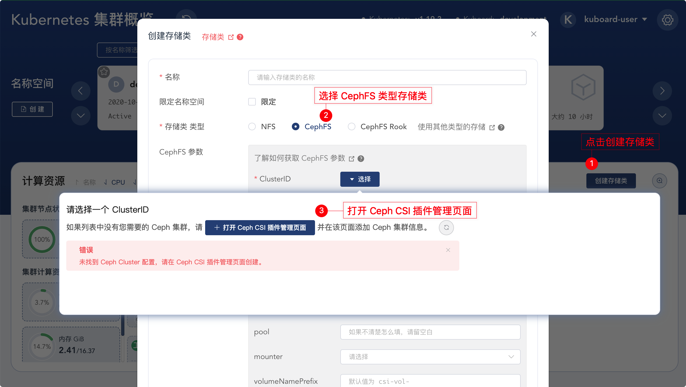

  Ceph CIS 插件管理页面的初始状态如下图所示：

  > * 如果您的集群节点不能访问互联，则您必须执行下图中的第二个步骤；
  > * 在您的集群节点可以访问互联网的情况下，此步骤为可选，如果执行此步骤，可以加快插件所需镜像的加载速度。

  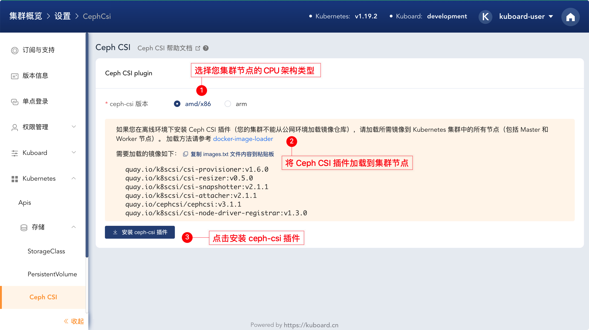

* 添加 Ceph 集群基本信息

  在完成上面步骤中 Ceph CSI 插件的安装以后，该页面的页尾会显示 Ceph 集群信息 维护的区域，点击页尾的编辑按钮，如果下图所示：

  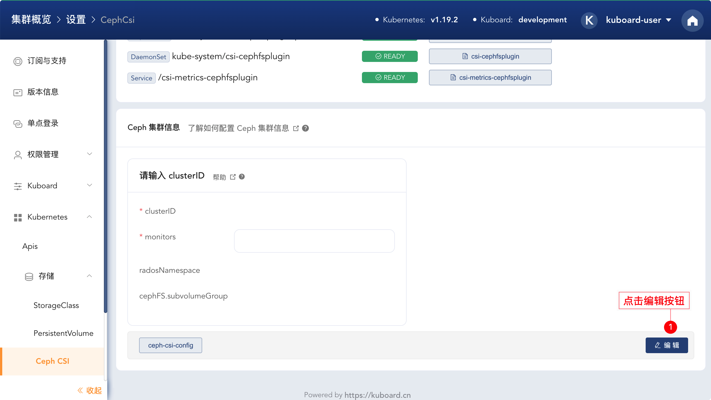

  点击编辑按钮之后，可以添加 Ceph 集群的基本信息：

  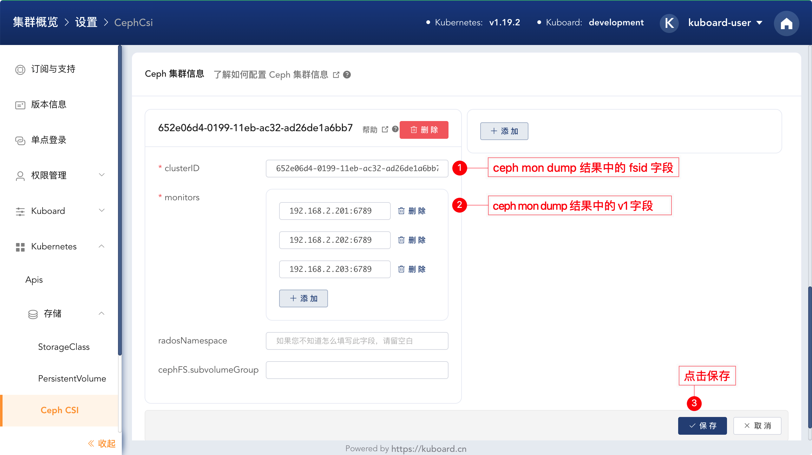

  ::: tip 获取 ceph 集群参数信息

  您必须能够通过 `ceph` 指令连接到 Ceph 集群，才可以获得上图中所需要的参数，具体步骤描述如下：

  在 Ceph 集群的节点上执行如下指令：

  ``` sh
  ceph mon dump
  ```

  输出结果如下所示：

  ``` {3,7,8,9}
  dumped monmap epoch 3
  epoch 3
  fsid 652e06d4-0199-11eb-ac32-ad26de1a6bb7
  last_changed 2020-09-28T15:00:22.672327+0000
  created 2020-09-28T14:46:38.231478+0000
  min_mon_release 15 (octopus)
  0: [v2:192.168.2.201:3300/0,v1:192.168.2.201:6789/0] mon.raspberry-01
  1: [v2:192.168.2.202:3300/0,v1:192.168.2.202:6789/0] mon.raspberry-02
  2: [v2:192.168.2.203:3300/0,v1:192.168.2.203:6789/0] mon.raspberry-03
  ```

  * 其中第三行 fsid 即为 clusterID
  * 第7、8、9 行的 `v1:` 与 `/0` 之间的字符串（例如：`192.168.2.201:6789`）即为 monitors 的连接信息

  :::

  

## 创建 CephFS StorageClass

完成上述初始化 CephFS CSI 插件的操作以后，您就可以创建 CephFS StorageClass 了，具体步骤如下所示：

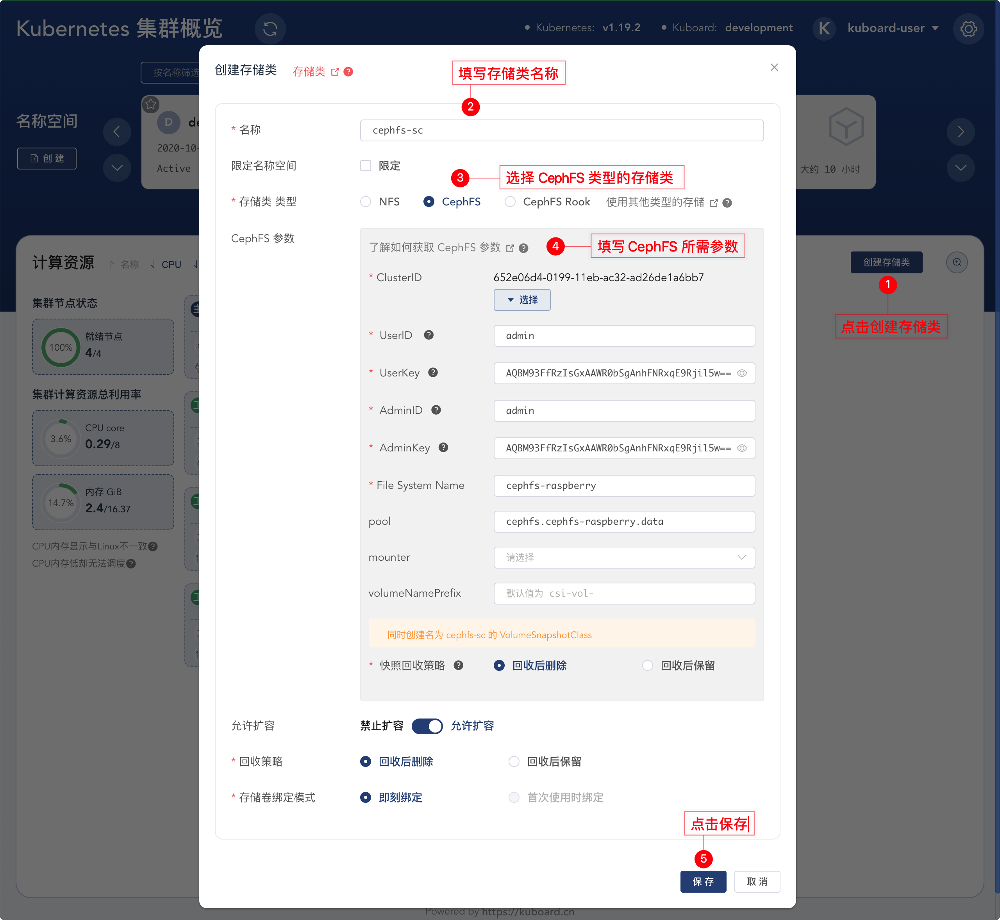

::: tip CephFS 参数获取方式

您必须能够使用 `ceph` 指令连接到 Ceph 集群，才能获得 CephFS 所需的参数，获取方式如下所述：

* UserID / UserKey / AdminID /AdminKey 

  假设您想要获取 `admin` 用户的 AdminKey，执行指令

  ```sh
  ceph auth get client.admin
  ```

  输出结果如下所示：

  ```
  exported keyring for client.admin
  [client.admin]
          key = AQBM93FfRzIsGxAAWR0bSgAnhFNRxqE9Rjil5w==
          caps mds = "allow *"
          caps mgr = "allow *"
          caps mon = "allow *"
          caps osd = "allow *"
  ```

  您还可以执行 `ceph auth ls` 指令查看 Ceph 集群中的用户列表，执行 `ceph auth get-or-create` 指令创建 Ceph 用户，更多与 Ceph 用户管理相关的信息，请参考 [Ceph User Management](https://docs.ceph.com/en/latest/rados/operations/user-management/)

* File System Name / pool

  执行 `ceph fs ls` 指令，该指令输出结果如下所示：

  ```
  name: cephfs-raspberry, metadata pool: cephfs.cephfs-raspberry.meta, data pools: [cephfs.cephfs-raspberry.data ]
  ```

  > 输出结果中：
  >
  > * name 字段作为 `File System Name` 的取值；
  > * data pools 字段中的一个作为  `pool` 字段的值。

:::


## 创建 PVC

完成 CephFS StorageClass 的创建后，进入名称空间界面，

* 创建 PVC：

  按照下图所示步骤创建 PVC

  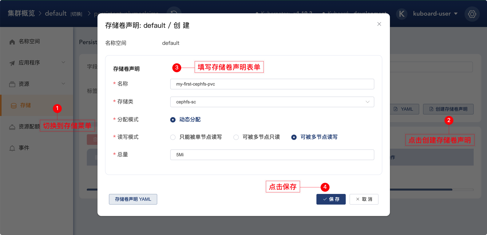

* 创建工作负载挂载该 PVC：

  按照下图所示步骤，可以进入创建工作负载的界面：

  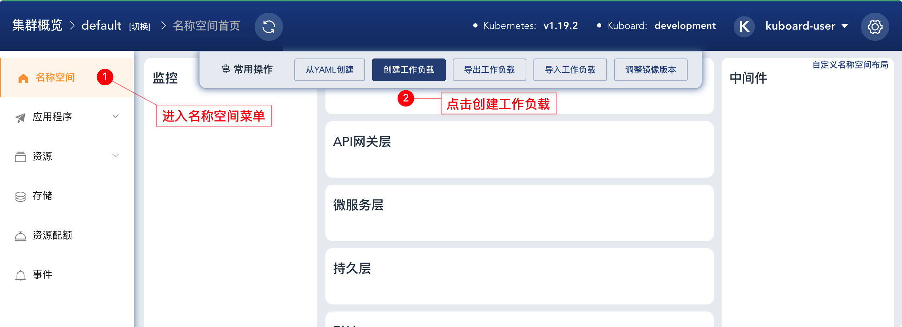

  按照下图所示步骤，创建一个工作负载用于测试 CephFS 存储：

  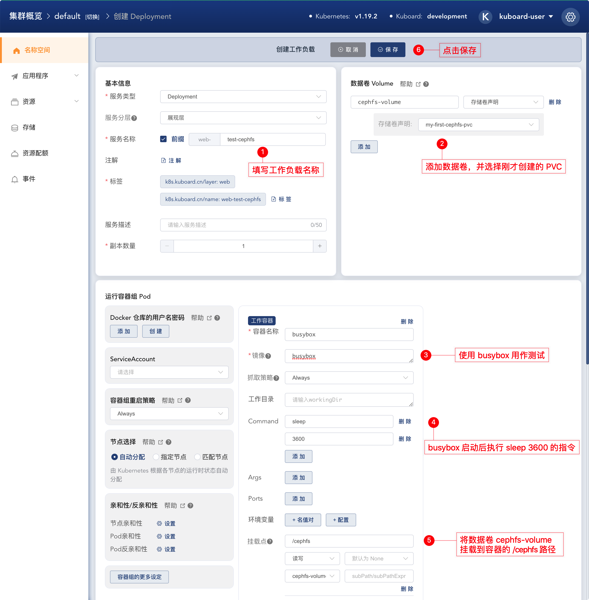

* 向存储卷中写入内容

  按照下图所示，进入刚才所创建工作负载的文件浏览器：

  

  点击 ***日志/终端*** 按钮后，将显示该工作负载的所有 Pod / Container，如下图所示：	

  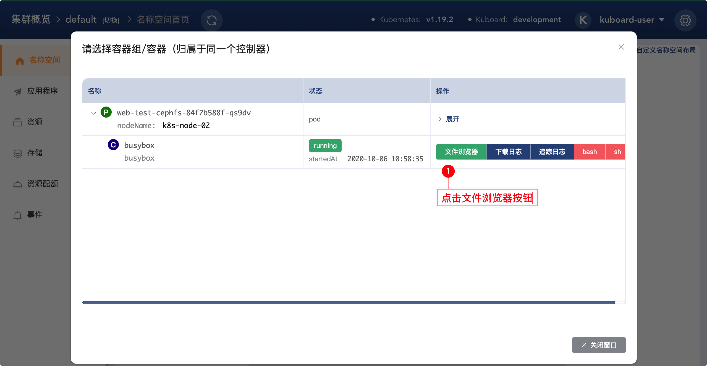

  点击文件浏览器按钮后，按照下图描述的步骤创建文件：

  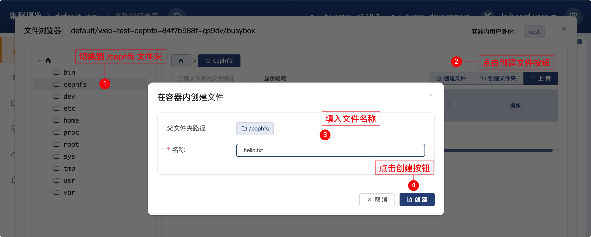

  创建完成后，可以查看到 `/cephfs` 目录的文件列表如下图所示：

  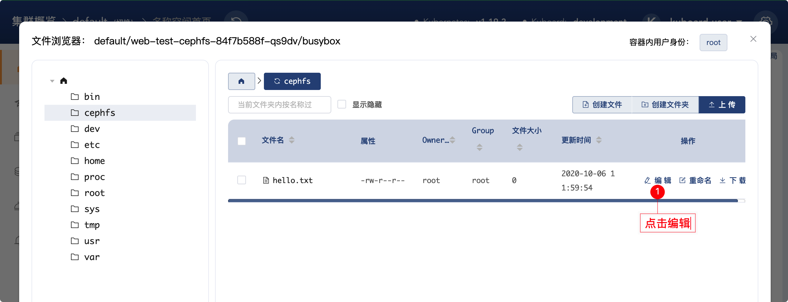

  点击编辑按钮后，按照下图描述的步骤往 hello.txt 文件中写入一些内容：

  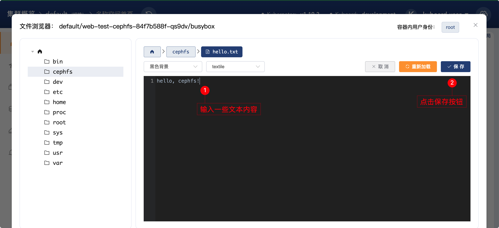

* 查看存储卷内容：

  切换到集群概览页，按照下图所示操作，可以查看到刚才写入到 CephFS 存储卷中的信息：

  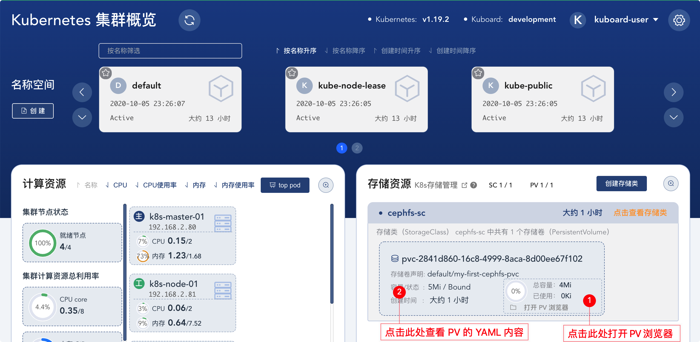

  您也可以查看 PersistentVolume 的 YAML 信息，获得该存储卷的 subVolume，然后通过 `cephfs-shell` 指令查看 Ceph 集群中存储的内容：

  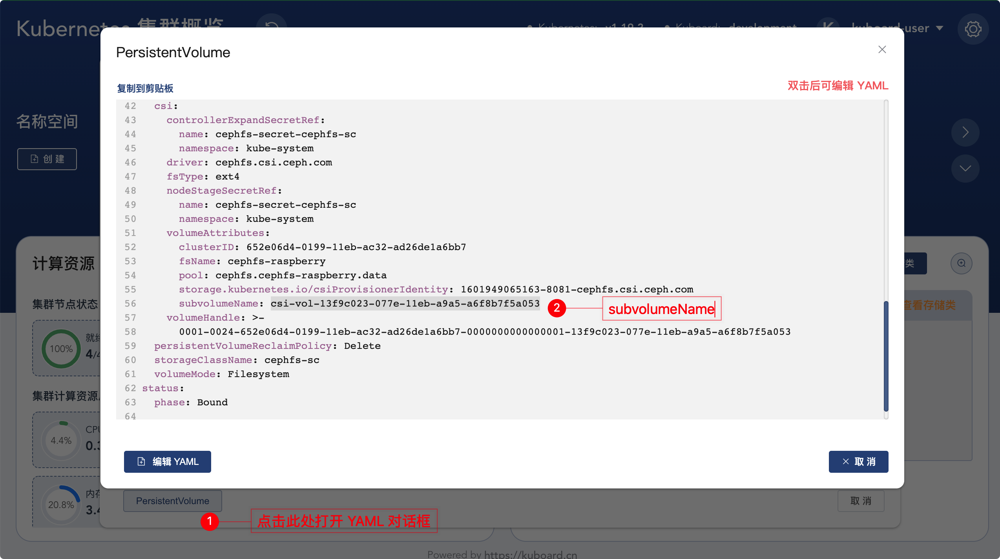

  `cephfs-shell` 的执行结果可以参考下图所示：关于如何使用 `cephfs-shell` 请参考文档 [CEPHFS SHELL](https://docs.ceph.com/en/latest/cephfs/cephfs-shell/)

  

## 对 PVC 执行操作


### 扩容

按照如下步骤，可以为存储卷执行扩容的操作：

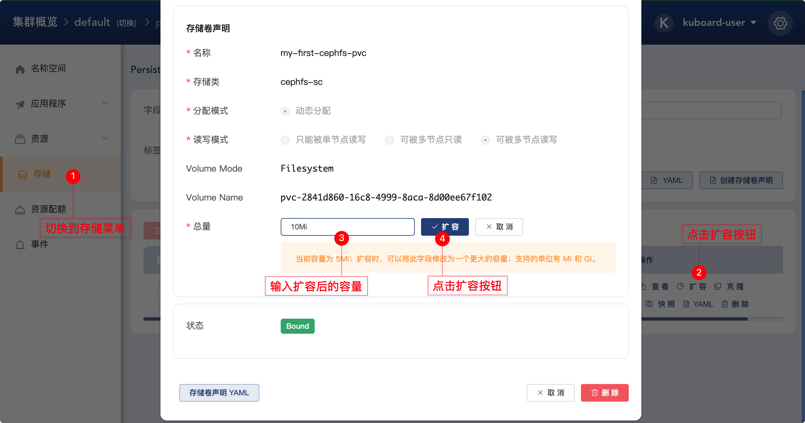

### 克隆

按照如下步骤，可以克隆存储卷


### 快照

按照如下步骤，进入快照页面：

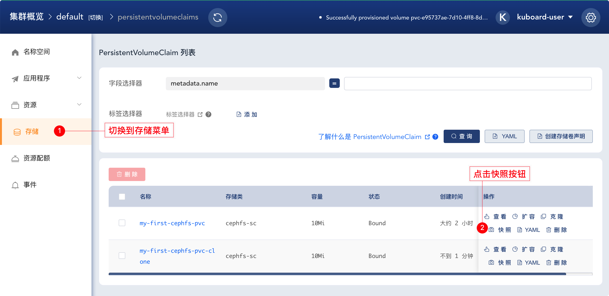

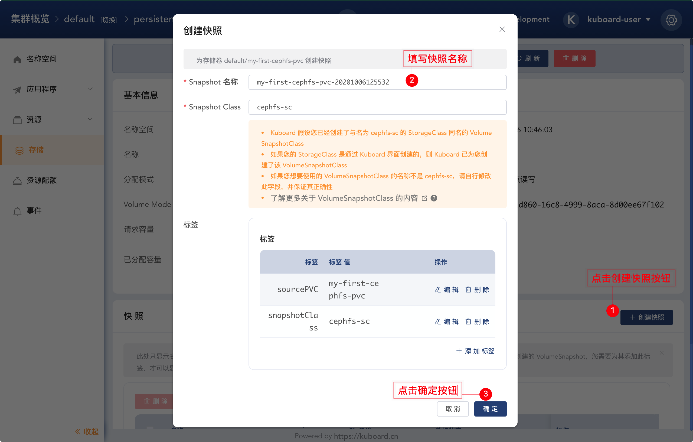

### 从快照恢复

在上面的步骤中创建快照以后，点击快照列表中的 ***恢复*** 按钮，可以将快照恢复到一个新建的 PVC 中。

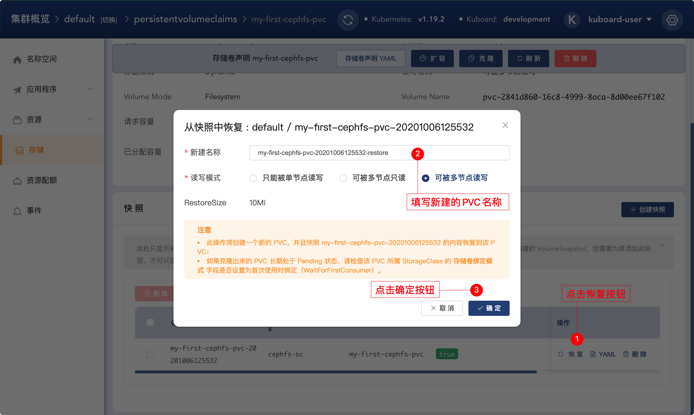
