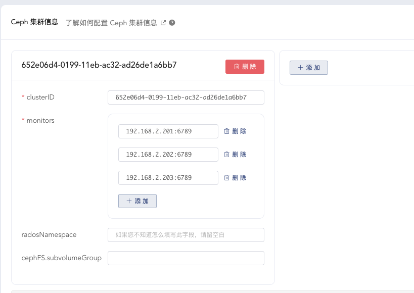

# CephFS 作为存储卷

<AdSenseTitle/>

### Ceph 集群信息

在浏览器打开 `http://your-node-ip:32567/namespace/kube-system/settings/storage/ceph-csi`，可以添加 Ceph 集群的连接参数信息，如下图所示：

<p>
  
</p>

在 Ceph 集群的节点上执行如下指令，

``` sh
ceph mon dump
```

输出结果如下所示：

``` {3,7,8,9}
dumped monmap epoch 3
epoch 3
fsid 652e06d4-0199-11eb-ac32-ad26de1a6bb7
last_changed 2020-09-28T15:00:22.672327+0000
created 2020-09-28T14:46:38.231478+0000
min_mon_release 15 (octopus)
0: [v2:192.168.2.201:3300/0,v1:192.168.2.201:6789/0] mon.raspberry-01
1: [v2:192.168.2.202:3300/0,v1:192.168.2.202:6789/0] mon.raspberry-02
2: [v2:192.168.2.203:3300/0,v1:192.168.2.203:6789/0] mon.raspberry-03
```

* 其中第三行 fsid 即为 clusterID
* 第31、32、33 行的 `v1:` 与 `/0` 之间的字符串（例如：`192.168.2.201:6789`）即为 monitors 的连接信息

https://github.com/ceph/ceph-csi/blob/master/docs/capabilities.md
