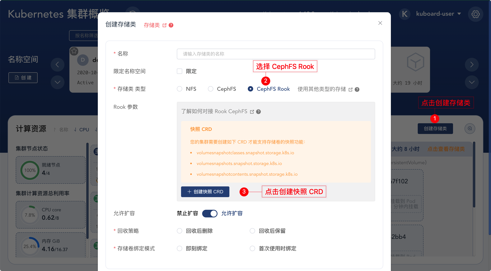
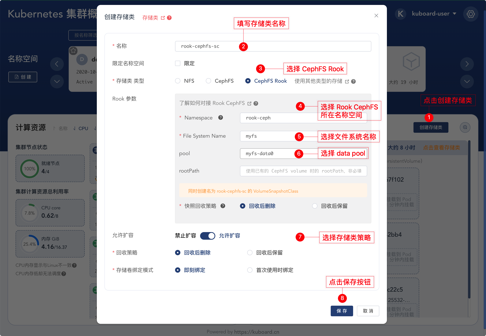

# 使用 CephFS 作为存储类 - Rook

<AdSenseTitle/>

本文描述了如何使用 Kuboard / Kuberenetes 对接 Rook 安装的 CephFS 作为存储类，并完成如下场景：

* 安装 Rook - Ceph
* 创建 StorageClass，[动态提供存储卷](../pv.html#提供-provisioning)
* 绑定 PVC 到 Pod
* PVC 相关操作
  * 扩容
  * 克隆
  * 快照
  * 从快照恢复

## 前提条件

* 您已经安装了 Kubernetes 集群，且集群版本不低于 v1.17.0，安装方法请参考 [安装 Kubernetes 集群](/install/install-k8s.html)；

  * Kubernetes 集群有至少 3 个工作节点，且每个工作节点都有一块初系统盘以外的 **未格式化** 的裸盘（工作节点是虚拟机时，未格式化的裸盘可以是虚拟磁盘），用于创建 3 个 Ceph OSD；

  * 也可以只有 1 个工作节点，挂载了一块 **未格式化** 的裸盘；

  * 在节点机器上执行 `lsblk -f ` 指令可以查看磁盘是否需被格式化，输出结果如下：

    ``` sh
    lsblk -f
    NAME                  FSTYPE      LABEL UUID                                   MOUNTPOINT
    vda
    └─vda1                LVM2_member       eSO50t-GkUV-YKTH-WsGq-hNJY-eKNf-3i07IB
      ├─ubuntu--vg-root   ext4              c2366f76-6e21-4f10-a8f3-6776212e2fe4   /
      └─ubuntu--vg-swap_1 swap              9492a3dc-ad75-47cd-9596-678e8cf17ff9   [SWAP]
    vdb
    ```

    如果 `FSTYPE` 字段不为空，则表示该磁盘上已经被格式化。在上面的例子中，可以将磁盘 `vdb` 用于 Ceph 的 OSD，而磁盘 `vda` 及其分区则不能用做 Ceph 的 OSD。

* 您已经安装了 Kuboard，且 Kuboard 版本不低于 v2.0.5，安装方法请参考 [安装 Kuboard](/install/install-dashboard.html)；

## 安装 Rook - Ceph

本章节参考 [Rook Ceph Storage Quickstart](https://rook.io/docs/rook/v1.5/ceph-quickstart.html) 在 Kubernetes 集群上快速安装了一个 Ceph 集群。

* 执行如下命令安装 Rook - Ceph 集群

  ``` sh
  kubectl create -f https://kuboard.cn/statics/learning/ceph/rook-1.5.4/crds.yaml
  kubectl create -f https://kuboard.cn/statics/learning/ceph/rook-1.5.4/common.yaml
  kubectl create -f https://kuboard.cn/statics/learning/ceph/rook-1.5.4/operator.yaml
  kubectl create -f https://kuboard.cn/statics/learning/ceph/rook-1.5.4/cluster.yaml
  ```

* 执行 `watch kubectl get pods -n rook-ceph` 指令，直到所有的 Pod 处于 `Running` 或者 `Completed` 状态，如下所示：

  > * 根据网速不同，完成 rook ceph 的安装部署可能需要 6 - 10 分钟；
  > * 相较于 [Rook Ceph Storage Quickstart](https://rook.io/docs/rook/v1.5/ceph-quickstart.html) 提供的脚本，您现在使用的脚本所做的唯一更改是：将 `k8s.gcr.io` 的镜像地址替换成了 `swr.cn-east-2.myhuaweicloud.com/kuboard-dependency`，以解决国内不能下载 k8s.gcr.io 镜像的问题；


  ```sh {1}
  watch kubectl get pods -n rook-ceph
  NAME                                                    READY   STATUS      RESTARTS   AGE
  csi-cephfsplugin-5hfb7                                  3/3     Running     0          39m
  csi-cephfsplugin-5xdz4                                  3/3     Running     0          39m
  csi-cephfsplugin-provisioner-5c65b94c8d-9txpv           6/6     Running     0          39m
  csi-cephfsplugin-provisioner-5c65b94c8d-rt4fp           6/6     Running     0          39m
  csi-cephfsplugin-pstw9                                  3/3     Running     0          39m
  csi-rbdplugin-ft4dk                                     3/3     Running     0          39m
  csi-rbdplugin-fxj9n                                     3/3     Running     0          39m
  csi-rbdplugin-provisioner-569c75558-h2jv7               6/6     Running     0          39m
  csi-rbdplugin-provisioner-569c75558-q4fkt               6/6     Running     0          39m
  csi-rbdplugin-rw7jn                                     3/3     Running     0          39m
  rook-ceph-crashcollector-k8s-node-01-6fbb5cb4b8-nwvhj   1/1     Running     0          35m
  rook-ceph-crashcollector-k8s-node-02-5c67f6f9f5-qm47c   1/1     Running     0          37m
  rook-ceph-crashcollector-k8s-node-03-7f6cfc655b-b8cv2   1/1     Running     0          40m
  rook-ceph-mgr-a-5844874f9c-rqggg                        1/1     Running     0          35m
  rook-ceph-mon-a-67b6865644-4bkm9                        1/1     Running     0          40m
  rook-ceph-mon-b-59f855c47d-tg44q                        1/1     Running     0          40m
  rook-ceph-mon-d-7576586cc9-nn94w                        1/1     Running     0          37m
  rook-ceph-operator-6db6f67cd4-smhz8                     1/1     Running     0          41m
  rook-ceph-osd-prepare-k8s-node-01-x2p74                 0/1     Completed   0          35m
  rook-ceph-osd-prepare-k8s-node-02-7j4s7                 0/1     Completed   0          35m
  rook-ceph-osd-prepare-k8s-node-03-w2mgf                 0/1     Completed   0          35m
  rook-discover-9hzds                                     1/1     Running     0          41m
  rook-discover-gz7xv                                     1/1     Running     0          41m
  rook-discover-hljrn                                     1/1     Running     0          41m
  ```

* Ceph 集群部署好以后，可以通过 Ceph 提供 块存储、文件存储和对象存储。此处，我们通过如下指令来创建文件存储服务：

  > 参考文档 [Rook Ceph-FileSystem](https://rook.io/docs/rook/v1.5/ceph-filesystem.html)

  ``` sh
  cat > myfs.yaml <<EOF
  apiVersion: ceph.rook.io/v1
  kind: CephFilesystem
  metadata:
    name: myfs
    namespace: rook-ceph
  spec:
    metadataPool:
      replicated:
        size: 3
    dataPools:
      - replicated:
          size: 3
    preservePoolsOnDelete: true
    metadataServer:
      activeCount: 1
      activeStandby: true
  EOF
  
  kubectl create -f myfs.yaml
  ```


## 初始化快照 CRD

在第一次创建 CephFS Rook StorageClass 时，Kuboard 界面回引导您完成一系列对集群的设置工作，每个集群中，此初始化设置只需要执行一次即可。

* 创建快照 CRD

  打开 Kuboard 集群概览页，按照下图的步骤，在界面的引导下，可以完成 CRD 的创建。

  > 此步骤只在第一次创建 CephFS StorageClass 时需要执行

  

## 创建 CephFS Rook StorageClass

完成上述初始化快照 CRD 的操作以后，您就可以创建 CephFS Rook StorageClass 了，具体步骤如下图所示：



## 创建 PVC

创建 PVC、将 PVC 挂载到 Pod、并向存储卷中写入内容等操作步骤请参考 [创建 PVC](./k8s-config.html#创建-pvc)


## PVC 相关操作

PVC 创建以后，可以通过 Kuboard 界面执行如下操作：

* 扩容
* 克隆
* 快照
* 从快照恢复

具体操作步骤请参考 [对 PVC 执行操作](./k8s-config.html#对-pvc-执行操作)
