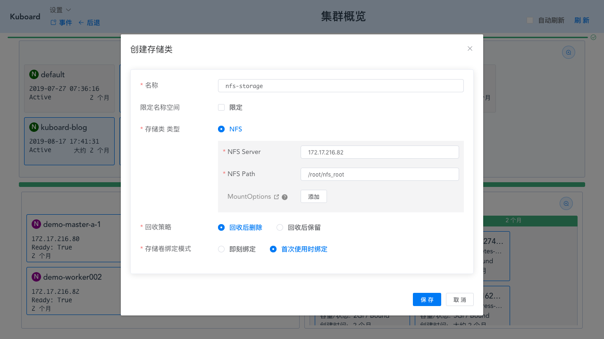

# 搭建NFS Server

<AdSenseTitle/>

## 背景

Kubernetes 对 Pod 进行调度时，以当时集群中各节点的可用资源作为主要依据，自动选择某一个可用的节点，并将 Pod 分配到该节点上。在这种情况下，Pod 中容器数据的持久化如果存储在所在节点的磁盘上，就会产生不可预知的问题，例如，当 Pod 出现故障，Kubernetes 重新调度之后，Pod 所在的新节点上，并不存在上一次 Pod 运行时所在节点上的数据。

为了使 Pod 在任何节点上都能够使用同一份持久化存储数据，我们需要使用网络存储的解决方案为 Pod 提供 [数据卷](./volume.html)。常用的网络存储方案有：NFS/cephfs/glusterfs。

本文介绍一种使用 centos 搭建 nfs 服务器的方法。此方法<font color="red">仅用于测试目的</font>，请根据您生产环境的实际情况，选择合适的 NFS 服务。

## 配置要求

* 两台 linux 服务器，centos 7
  * 一台用作 nfs server
  * 另一台用作 nfs 客户端

## 配置NFS服务器

::: tip
本章节中所有命令都以 root 身份执行
:::

* 执行以下命令安装 nfs 服务器所需的软件包
  ``` sh
  yum install -y nfs-utils
  ```
* 执行命令 `vim /etc/exports`，创建 exports 文件，文件内容如下：
  ```
  /root/nfs_root/ *(insecure,rw,sync,no_root_squash)
  ```
* 执行以下命令，启动 nfs 服务
  ```sh
  # 创建共享目录，如果要使用自己的目录，请替换本文档中所有的 /root/nfs_root/
  mkdir /root/nfs_root

  systemctl enable rpcbind
  systemctl enable nfs-server

  systemctl start rpcbind
  systemctl start nfs-server
  exportfs -r
  ```
* 检查配置是否生效
  ```sh
  exportfs
  # 输出结果如下所示
  /root/nfs_root /root/nfs_root
  ```

## 在客户端测试nfs

::: tip
* 本章节中所有命令都以 root 身份执行
* 服务器端防火墙开放111、662、875、892、2049的 tcp / udp 允许，否则远端客户无法连接。
:::

* 执行以下命令安装 nfs 客户端所需的软件包
  ``` sh
  yum install -y nfs-utils
  ```

* 执行以下命令检查 nfs 服务器端是否有设置共享目录
  ``` sh
  # showmount -e $(nfs服务器的IP)
  showmount -e 172.17.216.82
  # 输出结果如下所示
  Export list for 172.17.216.82:
  /root/nfs_root *
  ```
* 执行以下命令挂载 nfs 服务器上的共享目录到本机路径 `/root/nfsmount`
  ``` sh
  mkdir /root/nfsmount
  # mount -t nfs $(nfs服务器的IP):/root/nfs_root /root/nfsmount
  mount -t nfs 172.17.216.82:/root/nfs_root /root/nfsmount
  # 写入一个测试文件
  echo "hello nfs server" > /root/nfsmount/test.txt
  ```
* 在 nfs 服务器上执行以下命令，验证文件写入成功
  ``` sh
  cat /root/nfs_root/test.txt
  ```

## 在Kuboard中创建 NFS 存储类

* 打开 Kuboard 的集群概览页面，点击 **创建存储类** 按钮，如下图所示
  
  填写表单输入表单

  | 字段名称   | 填入内容       | 备注                              |
  | ---------- | -------------- | --------------------------------- |
  | 名称       | nfs-storage    | 请自定义名称                      |
  | NFS Server | 172.17.216.82  | 请使用您自己的NFS服务的IP地址     |
  | NFS Path   | /root/nfs_root | 请使用您自己的NFS服务所共享的路径 |
  
  

* 在场景中使用存储类
  
  此时您可以在自己的场景中使用刚创建的存储类。Kuboard官网上，有以下几个地方可以用到NFS存储类：
  * [导入 example 微服务](/guide/example/import.html)
  * [安装监控套件](/guide/example/monitor.html#安装监控套件)
