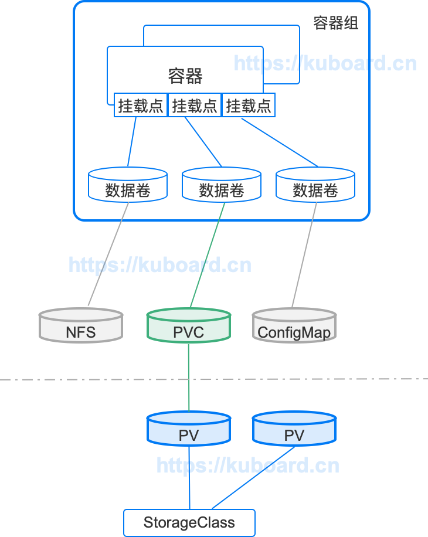
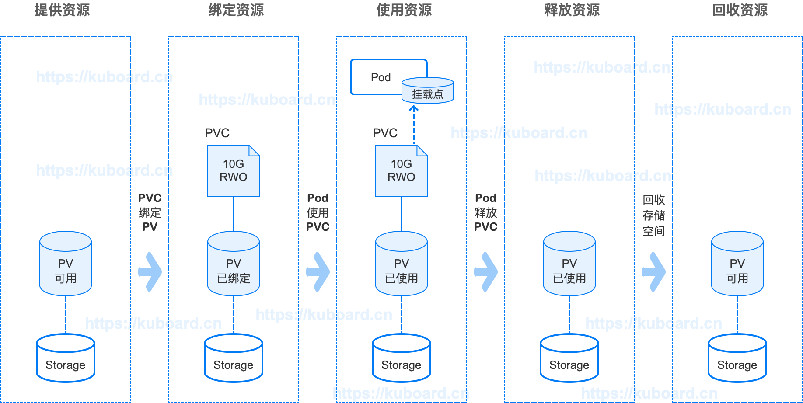
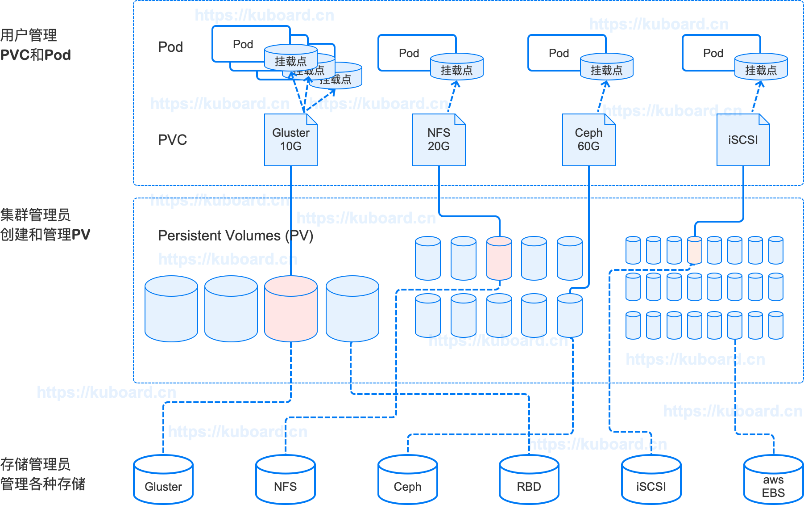
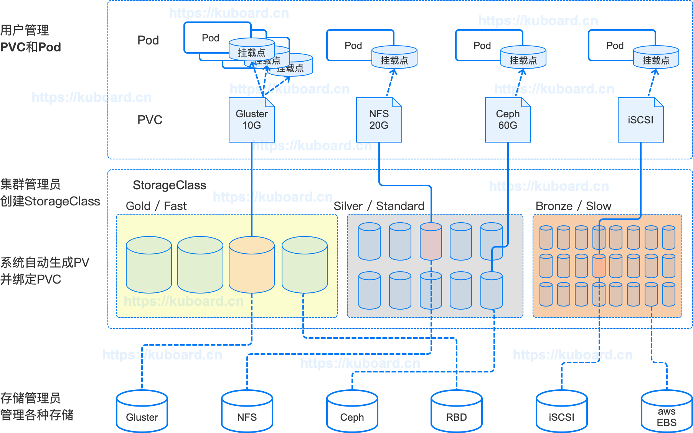
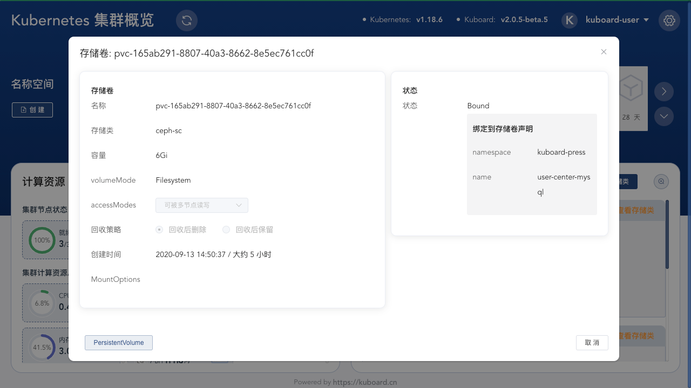
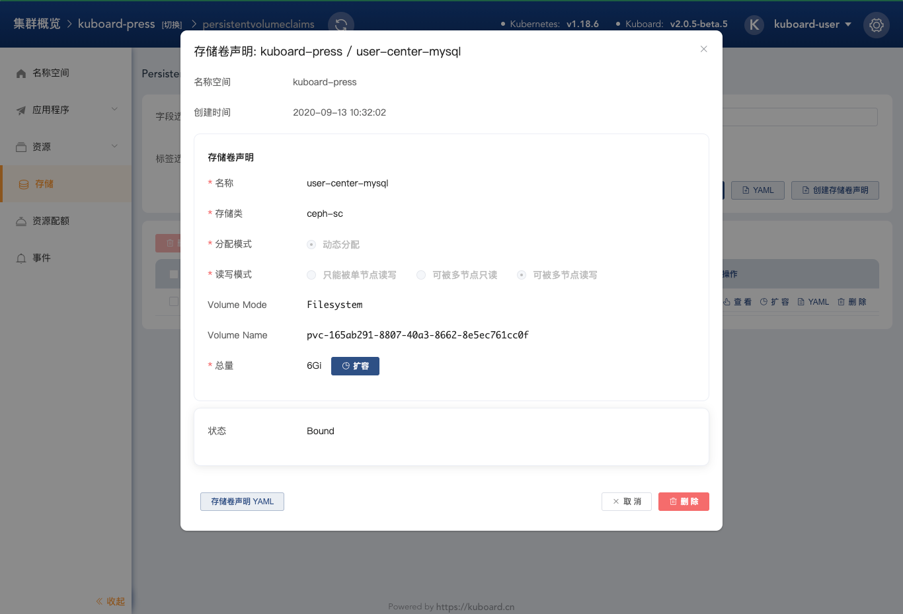

# 存储卷PersistentVolume

<AdSenseTitle/>

参考文档： Kubernetes 官方文档 [Persistent Volumes](https://kubernetes.io/docs/concepts/storage/persistent-volumes/)

## 概述

与管理计算资源相比，管理存储资源是一个完全不同的问题。为了更好的管理存储，Kubernetes 引入了 PersistentVolume 和 PersistentVolumeClaim 两个概念，将存储管理抽象成如何提供存储以及如何使用存储两个关注点。

::: tip 关注点分离

Kuboard 可以导出名称空间中应用程序的配置到一个 YAML 文件，然后在新的名称空间导入该 YAML 文件。
* 如果应用程序直接使用 nfs 类型的数据卷，则该 nfs 的 server 和 path 配置随应用程序一起导出到 YAML 文件中，到新的名称空间导入的应用程序还是对应原来的 nfs 配置（除非导入后手工修改 nfs 数据卷的 server/path 参数）。
* 如果应用程序使用 PersistentVolumeClaim 声明该应用需要使用一个存储卷，导出成 YAML 后，可以等到在新的名称空间再导入该 YAML 时，再决定应该使用什么类型的 PersistentVolume 以及对应的参数。（新的名称空间中，可能使用 cephfs 或 glusterfs，而不是 nfs）

通过 PersistentVolume 和 PersistentVolumeClaim，Kubernetes 分离了提供存储和使用存储着两个关注点：
* PersistentVolumeClaim 必须定义在与应用程序相同的名称空间中，关注应用程序如何使用存储，通常由应用程序管理员或开发人员负责
* PersistentVolume 只能定义在集群层面，关注集群如何提供存储，通常由集群管理员或者运维人员负责

:::

PersistentVolume（PV 存储卷）是集群中的一块存储空间，由集群管理员管理、或者由 Storage Class（存储类）自动管理。PV（存储卷）和 node（节点）一样，是集群中的资源（kubernetes 集群由存储资源和计算资源组成）。PersistentVolumeClaim（存储卷声明）是一种类型的 Volume（数据卷），PersistentVolumeClaim（存储卷声明）引用的 PersistentVolume（存储卷）有自己的生命周期，该生命周期独立于任何使用它的容器组。PersistentVolume（存储卷）描述了如何提供存储的细节信息（NFS、cephfs等存储的具体参数）。

PersistentVolumeClaim（PVC 存储卷声明）代表用户使用存储的请求。Pod 容器组消耗 node 计算资源，PVC 存储卷声明消耗 PersistentVolume 存储资源。Pod 容器组可以请求特定数量的计算资源（CPU / 内存）；PersistentVolumeClaim 可以请求特定大小/特定访问模式（只能被单节点读写/可被多节点只读/可被多节点读写）的存储资源。

根据应用程序的特点不同，其所需要的存储资源也存在不同的要求，例如读写性能等。集群管理员必须能够提供关于 PersistentVolume（存储卷）的更多选择，无需用户关心存储卷背后的实现细节。为了解决这个问题，Kubernetes 引入了 StorageClass（存储类）的概念

## 存储卷和存储卷声明的关系

存储卷和存储卷声明的关系如下图所示：

* PersistentVolume 是集群中的存储资源，通常由集群管理员创建和管理
* StorageClass 用于对 PersistentVolume 进行分类，如果正确配置，StorageClass 也可以根据 PersistentVolumeClaim 的请求动态创建 Persistent Volume
* PersistentVolumeClaim 是使用该资源的请求，通常由应用程序提出请求，并指定对应的 StorageClass 和需求的空间大小
* PersistentVolumeClaim 可以做为数据卷的一种，被挂载到容器组/容器中使用

## 存储卷声明的管理过程

PersistantVolume 和 PersistantVolumeClaim 的管理过程描述如下：

> 下图主要描述的是 PV 和 PVC 的管理过程，因为绘制空间的问题，将挂载点与Pod关联了，实际结构应该如上图所示：
> * Pod 中添加数据卷，数据卷关联PVC
> * Pod 中包含容器，容器挂载数据卷

### 提供 Provisioning

有两种方式为 PersistentVolumeClaim 提供 PersistentVolume : 静态、动态

* **静态提供 Static** <Badge text="Kuboard 界面暂禁用该特性" type="warn"/>
  
  集群管理员实现创建好一系列 PersistentVolume，它们包含了可供集群中应用程序使用的关于实际存储的具体信息。
  > Kuboard界面上暂时禁用了手工创建 PV 的功能，但是您仍然可以使用 YAML 文件创建，并在PVC中使用。

  

  
  

  
* **动态提供 Dynamic** <Badge text="Kuboard 已支持" type="success"/>

  在配置有合适的 StorageClass（存储类）且 PersistentVolumeClaim 关联了该 StorageClass 的情况下，kubernetes 集群可以为应用程序动态创建 PersistentVolume。
  
  

  
  

### 绑定 Binding

假设用户创建了一个 PersistentVolumeClaim 存储卷声明，并指定了需求的存储空间大小以及访问模式。Kubernets master 将立刻为其匹配一个 PersistentVolume 存储卷，并将存储卷声明和存储卷绑定到一起。如果一个 PersistentVolume 是动态提供给一个新的 PersistentVolumeClaim，Kubernetes master 会始终将其绑定到该 PersistentVolumeClaim。除此之外，应用程序将被绑定一个不小于（可能大于）其 PersistentVolumeClaim 中请求的存储空间大小的 PersistentVolume。一旦绑定，PersistentVolumeClaim 将拒绝其他 PersistentVolume 的绑定关系。PVC 与 PV 之间的绑定关系是一对一的映射。

PersistentVolumeClaim 将始终停留在 ***未绑定 unbound*** 状态，直到有合适的 PersistentVolume 可用。举个例子：集群中已经存在一个 50Gi 的 PersistentVolume，同时有一个 100Gi 的 PersistentVolumeClaim，在这种情况下，该 PVC 将一直处于 ***未绑定 unbound*** 状态，直到管理员向集群中添加了一个 100Gi 的 PersistentVolume。

### 使用 Using

对于 Pod 容器组来说，PersistentVolumeClaim 存储卷声明是一种类型的 Volume 数据卷。Kubernetes 集群将 PersistentVolumeClaim 所绑定的 PersistentVolume 挂载到容器组供其使用。

### 使用中保护 Storage Object in Use Protection

* 使用中保护（Storage Object in Use Protection）的目的是确保正在被容器组使用的 PersistentVolumeClaim 以及其绑定的 PersistentVolume 不能被系统删除，以避免可能的数据丢失。
* 如果用户删除一个正在使用中的 PersistentVolumeClaim，则该 PVC 不会立即被移除掉，而是推迟到该 PVC 不在被任何容器组使用时才移除；同样的如果管理员删除了一个已经绑定到 PVC 的 PersistentVolume，则该 PV 也不会立刻被移除掉，而是推迟到其绑定的 PVC 被删除后才移除掉。

### 回收 Reclaiming

当用户不在需要其数据卷时，可以删除掉其 PersistentVolumeClaim，此时其对应的 PersistentVolume 将被集群回收并再利用。Kubernetes 集群根据 PersistentVolume 中的 reclaim policy（回收策略）决定在其被回收时做对应的处理。当前支持的回收策略有：Retained（保留）、Recycled（重复利用）、Deleted（删除）

* **保留 Retain**

  保留策略需要集群管理员手工回收该资源。当绑定的 PersistentVolumeClaim 被删除后，PersistentVolume 仍然存在，并被认为是”已释放“。但是此时该存储卷仍然不能被其他 PersistentVolumeClaim 绑定，因为前一个绑定的 PersistentVolumeClaim 对应容器组的数据还在其中。集群管理员可以通过如下步骤回收该 PersistentVolume：
  * 删除该 PersistentVolume。PV 删除后，其数据仍然存在于对应的外部存储介质中（nfs、cefpfs、glusterfs 等）
  * 手工删除对应存储介质上的数据
  * 手工删除对应的存储介质，您也可以创建一个新的 PersistentVolume 并再次使用该存储介质

* **删除 Delete**
  
  删除策略将从 kubernete 集群移除 PersistentVolume 以及其关联的外部存储介质（云环境中的 AWA EBS、GCE PD、Azure Disk 或 Cinder volume）。

* **再利用 Recycle** <Badge text="Kuboard 暂不支持" type="warn"/>

  * 再利用策略将在 PersistentVolume 回收时，执行一个基本的清除操作（rm -rf /thevolume/*），并使其可以再次被新的 PersistentVolumeClaim 绑定。
  * 集群管理员也可以自定义一个 recycler pod template，用于执行清除操作。请参考 [Recycle](https://kubernetes.io/docs/concepts/storage/persistent-volumes/#recycle)

::: tip
动态提供的 PersistentVolume 将从其对应的 StorageClass 继承回收策略的属性。
:::

### 扩容 Expanding Persistent Volumes Claims

  Kubernetes v1.15 及以上版本 <Badge text="Kuboard 支持 CephFS 的扩容" type="success"/>
  该特性只针对极少数的 PersistentVolume 类型有效。请参考 [Expanding Persistent Volumes Claims](https://kubernetes.io/docs/concepts/storage/persistent-volumes/#expanding-persistent-volumes-claims)

## 存储卷类型

Kubernetes 支持 20 种存储卷类型（可参考 [Types of Persistent Volumes](https://kubernetes.io/docs/concepts/storage/persistent-volumes/#types-of-persistent-volumes)），如下所示：

* 非持久性存储
  * emptyDir
  * HostPath (只在单节点集群上用做测试目的)
* 网络连接性存储
  * SAN：iSCSI、ScaleIO Volumes、FC (Fibre Channel)
  * NFS：nfs，cfs
* 分布式存储
  * Glusterfs
  * RBD (Ceph Block Device)
  * CephFS
  * Portworx Volumes
  * Quobyte Volumes
* 云端存储
  * GCEPersistentDisk
  * AWSElasticBlockStore
  * AzureFile
  * AzureDisk
  * Cinder (OpenStack block storage)
  * VsphereVolume
  * StorageOS
* 自定义存储
  * FlexVolume
* 不推荐
  * Flocker (最近更新2016年 https://github.com/ClusterHQ/flocker/)

针对自建 Kubernetes 集群的情况，Kuboard 支持如下几种存储卷类型：
  * NFS <Badge text="Kuboard 已支持" type="success"/>
  * CephFS <Badge text="Kuboard 已支持" type="success"/>
    * Kuboard 版本不低于 v2.0.5-beta.5

## 存储卷 PersistentVolume

在 Kuboard 中查看 PersistentVolume 的界面如下图所示：

PersistentVolume 字段描述如下表所示：

| 字段名称                | 可选项/备注                                                  |
| ----------------------- | ------------------------------------------------------------ |
| 容量 Capacity           | 通常，一个 PersistentVolume 具有一个固定的存储容量（capacity） |
| Volume Mode             | FEATURE STATE: Kubernetes v1.13 beta Kubernetes 1.9 之前的版本，所有的存储卷都被初始化一个文件系统。当前可选项有：<li>block：使用一个 块设备（raw block device） </li><li>filesystem（默认值）：使用一个文件系统</li> |
| Access Modes            | <li>可被单节点读写-ReadWriteOnce </li><li>可被多节点只读-ReadOnlyMany </li><li>可被多节点读写-ReadWriteMany</li> |
| 存储类 StorageClassName | 带有存储类 StorageClassName 属性的 PersistentVolume 只能绑定到请求该 StorageClass 存储类的 PersistentVolumeClaim。 没有 StorageClassName 属性的 PersistentVolume 只能绑定到无特定 StorageClass 存储类要求的 PVC。 |
| 回收策略 Reclaim Policy | <li>保留 Retain – 手工回收 </li><li>再利用 Recycle – 清除后重新可用 (rm -rf /thevolume/*) </li><li>删除 Delete – 删除 PV 及存储介质</li> |
| Mount Options           | 挂载选项用来在挂载时作为 mount 命令的参数                    |
| 状态 Phase              | <li>Available – 可用的 PV，尚未绑定到 PVC</li><li>Bound – 已经绑定到 PVC</li><li>Released – PVC 已经被删除，但是资源还未被集群回收</li><li>Failed – 自动回收失败</li> |

## 存储卷声明 PersistentVolumeClaims

在 Kuboard 中查看存储卷声明的界面如下图所示：

| 字段名称              | 可选项/备注                                                  |
| --------------------- | ------------------------------------------------------------ |
| 存储类                | 只有该 StorageClass 存储类的 PV 才可以绑定到此 PVC           |
| 读写模式 Access Modes | <li>可被单节点读写-ReadWriteOnce </li><li>可被多节点只读-ReadOnlyMany </li><li>可被多节点读写-ReadWriteMany</li> |
| Volume Modes          | <li>block</li><li>filesystem - default</li>                  |
| 总量                  | 请求存储空间的大小。Kuboard 支持 CephFS 类型存储卷声明的扩容。 |

## 在数据卷中使用存储卷声明 Claims As Volumes

在您完成存储卷声明的定义后，您可以在 Kuboard 工作复杂编辑器的 ***数据卷 Volume*** 区域引用该存储卷声明，如下图所示：

