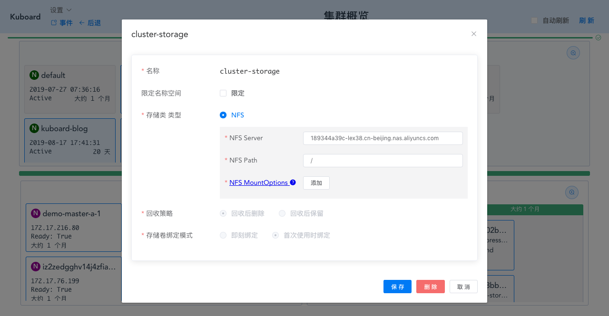

# 存储类 StorageClass

参考文档： Kubernetes 官网 [Storage Classes](https://kubernetes.io/docs/concepts/storage/storage-classes/)

## 存储类概述

StorageClass 存储类用于描述集群中可以提供的存储的类型。不同的存储类可能对应着不同的：
* 服务等级（quality-of-service level）
* 备份策略
* 集群管理员自定义的策略

Kubernetes 自身对存储类所代表的含义并无感知，由集群管理员自行约定。

## 存储类的种类

参考 [Storage Classes](https://kubernetes.io/docs/concepts/storage/storage-classes/)，Kubernetes 提供 19 种存储类 Provisioner，但是绝大多数与具体的云环境相关，如 AWSElasticBlockStore / AzureFile / AzureDisk / GCEPersistentDisk 等。

Kuboard 支持的存储类的种类如下：
* NFS <Badge text="Kuboard 已支持" type="success"/>
* CephFS <Badge text="Kuboard 正在计划中" type="warn"/>

## 存储类

在 Kuboard 中查看存储类，如下图所示：

### 回收策略 Reclaim Policy

由 StorageClass 动态创建的 PersistentVolume 将使用 StorageClass 中定义的回收策略。可选项有：

* 回收后删除 Delete
* 回收后保留 Retain

同一 StorageClass 中，手动创建的 PersistentVolume，将使用创建时手动指定的回收策略。

### 存储卷绑定模式 Volume Binding Mode

StorageClass 根据存储卷绑定模式的选项，确定何时执行 存储卷与存储卷声明的绑定、何时执行动态存储卷提供（动态创建存储卷）。可选项有：

* 即刻绑定 Immediate

  存储卷声明创建后，立刻动态创建存储卷并将其绑定到存储卷声明。

* 首次使用时绑定 WaitForFirstConsumer

  直到存储卷声明第一次被容器组使用时，才创建存储卷，并将其绑定到存储卷声明。
