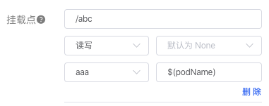

# 数据卷-挂载


<AdSenseTitle/>

> 参考文档： Kubernetes 文档 [Volumes](https://kubernetes.io/docs/concepts/storage/volumes/)

挂载是指将定义在 Pod 中的数据卷关联到容器，同一个 Pod 中的同一个数据卷可以被挂载到该 Pod 中的多个容器上。

## 数据卷内子路径

有时候我们需要在同一个 Pod 的不同容器间共享数据卷。使用 `volumeMounts.subPath` 属性，可以使容器在挂载数据卷时指向数据卷内部的一个子路径，而不是直接指向数据卷的根路径。

下面的例子中，一个 LAMP（Linux Apache Mysql PHP）应用的 Pod 使用了一个共享数据卷，HTML 内容映射到数据卷的 `html` 目录，数据库的内容映射到了 `mysql` 目录：

``` yaml {15,22}
apiVersion: v1
kind: Pod
metadata:
  name: my-lamp-site
spec:
    containers:
    - name: mysql
      image: mysql
      env:
      - name: MYSQL_ROOT_PASSWORD
        value: "rootpasswd"
      volumeMounts:
      - mountPath: /var/lib/mysql
        name: site-data
        subPath: mysql
        readOnly: false
    - name: php
      image: php:7.0-apache
      volumeMounts:
      - mountPath: /var/www/html
        name: site-data
        subPath: html
        readOnly: false
    volumes:
    - name: site-data
      persistentVolumeClaim:
        claimName: my-lamp-site-data
```

### 通过环境变量指定数据卷内子路径

**FEATURE STATE：** `Kubernetes v1.15` <Badge type="warning">beta</Badge>

使用 `volumeMounts.subPathExpr` 字段，可以通过容器的环境变量指定容器内路径。使用此特性时，必须启用 `VolumeSubpathEnvExpansion` [feature gate](https://kubernetes.io/docs/reference/command-line-tools-reference/feature-gates/) （自 Kubernetes v1.15 开始，是默认启用的。）

同一个 volumeMounts 中 `subPath` 字段和 `subPathExpr` 字段不能同时使用。

> 在Kuboard界面中，如果工作负载编辑器中挂载点的 subPath/subPathExpr 字段中包含 `$`，则 Kuboard 认为该字段为 subPathExpr，否则被认为是 subPath。例如，下图中的 $(podName) 将被认为是 subPathExpr ：<Badge type="default">Kuboard v1.0.6-beta.1</Badge>
>
> 

如下面的例子，该 Pod 使用 `subPathExpr` 在 hostPath 数据卷 `/var/log/pods` 中创建了一个目录 `pod1`（该参数来自于Pod的名字）。此时，宿主机目录 `/var/log/pods/pod1` 挂载到了容器的 `/logs` 路径：

``` yaml {9,19}
apiVersion: v1
kind: Pod
metadata:
  name: pod1
spec:
  containers:
  - name: container1
    env:
    - name: POD_NAME
      valueFrom:
        fieldRef:
          apiVersion: v1
          fieldPath: metadata.name
    image: busybox
    command: [ "sh", "-c", "while [ true ]; do echo 'Hello'; sleep 10; done | tee -a /logs/hello.txt" ]
    volumeMounts:
    - name: workdir1
      mountPath: /logs
      subPathExpr: $(POD_NAME)
      readOnly: false
  restartPolicy: Never
  volumes:
  - name: workdir1
    hostPath:
      path: /var/log/pods
```


## 容器内路径

`mountPath` 数据卷被挂载到容器的路径，不能包含 `:`

## 权限

容器对挂载的数据卷是否具备读写权限，如果 `readOnly` 为 `true`，则只读，否则可以读写（为 `false` 或者不指定）。默认为 `false`

## 挂载传播

数据卷的挂载传播（Mount Propagation）由 Pod 的 `spec.containers[*].volumeMounts.mountPropagation` 字段控制。可选的取值有：

* **None**： 默认值。在数据卷被挂载到容器之后，此数据卷不会再接受任何后续宿主机或其他容器挂载到该数据卷对应目录下的子目录的挂载。同样的，在容器中向该数据卷对应目录挂载新目录时，宿主机也不能看到。对应 Linux 的 `private` mount propagation 选项 [Linux内核文档](https://www.kernel.org/doc/Documentation/filesystems/sharedsubtree.txt)

* **HostToContainer**：在数据卷被挂载到容器之后，宿主机向该数据卷对应目录添加挂载时，对容器是可见的。对应 Linux 的 `rslave` mount propagation 选项 [Linux内核文档](https://www.kernel.org/doc/Documentation/filesystems/sharedsubtree.txt)

* **Bidirectional**：在数据卷被挂载到容器之后，宿主机向该数据卷对应目录添加挂载时，对容器是可见的；同时，从容器中向该数据卷创建挂载，同样也对宿主机可见。对应 Linux 的 `rshared` mount propagation 选项 [Linux内核文档](https://www.kernel.org/doc/Documentation/filesystems/sharedsubtree.txt)

::: danger
**Bidirectional** mount propagation 选项隐藏风险。如果在容器内进行不合适的挂载，可能影响宿主机的操作系统正常执行，因此，只有 privileged 容器才可以使用该选项。使用此选项时，建议对 Linux 内核的行为有所熟悉。此外，使用 Bidirectional 选项时，任何由 Pod 中容器在对应数据卷目录创建的挂载必须在容器终止时销毁（umounted）。
:::

### 额外配置

在部分系统中（CoreOS、RedHat/Centos、Ubuntu），Docker 的 mount share 选项必须事先配置好，步骤如下：

* **编辑 Docker 的 `systemd` service 文件**，将 `MountFlags` 设定如下：

  ```
  MountFlags=shared
  ```

  **或者移除 `MountFlags=slave`**

* 重启 Docker 守护进程：

  ``` sh
  sudo systemctl daemon-reload
  sudo systemctl restart docker
  ```
