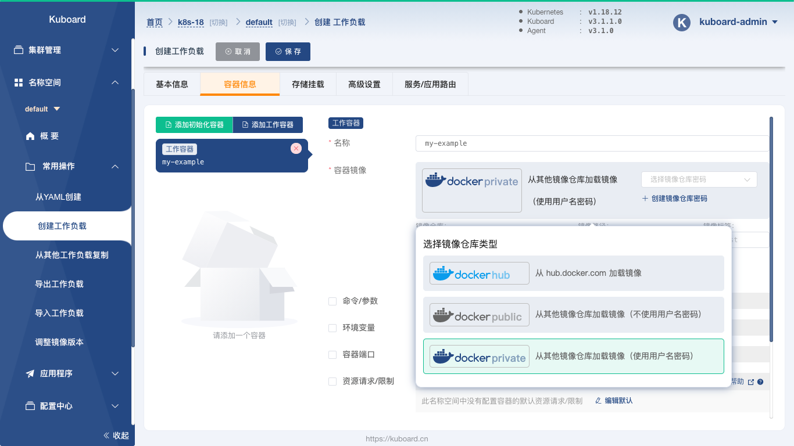
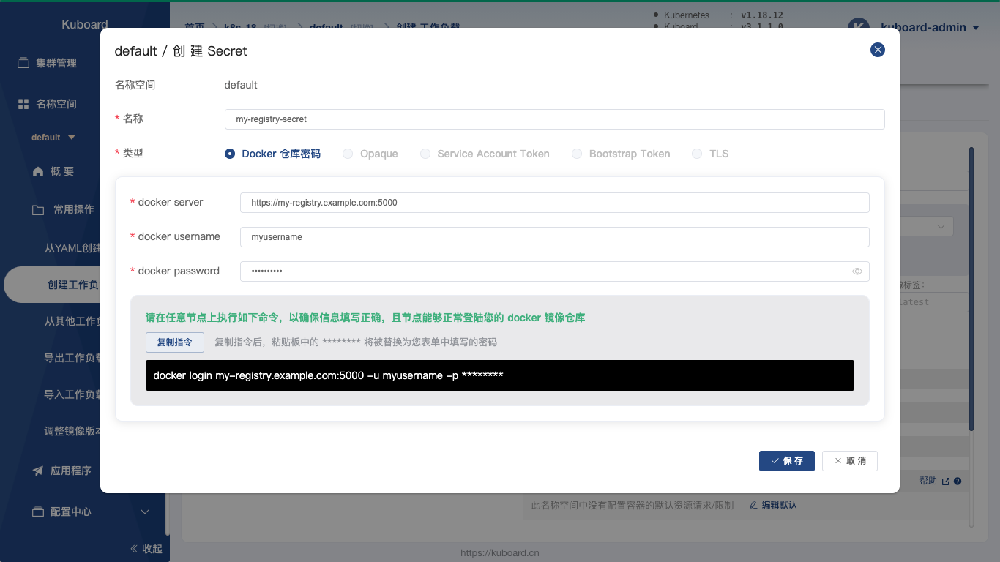
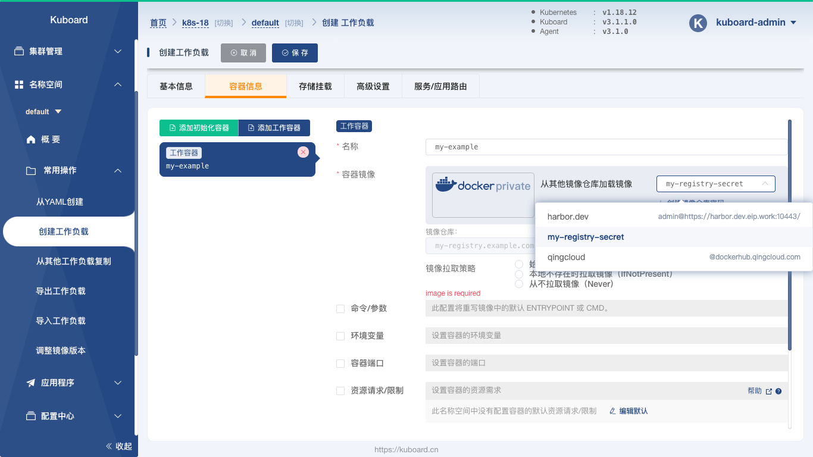
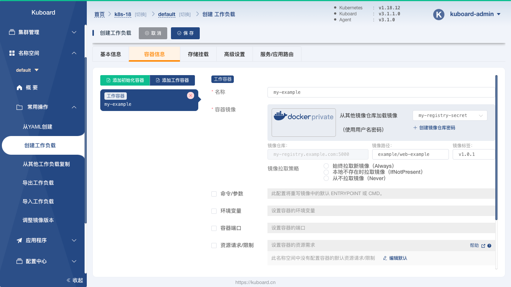
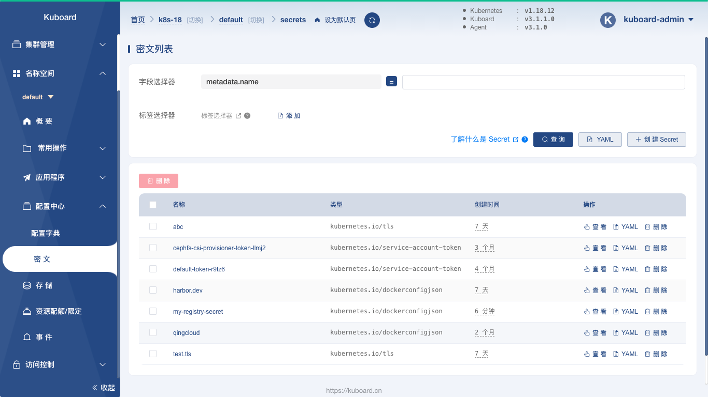

# 使用私有仓库中的docker镜像

<AdSenseTitle/>

企业通常会因为如下几个原因，需要搭建自己的私有 docker registry：
* 限制 docker 镜像的分发范围，例如：只允许在内网分发，或者只允许被授权的用户获取 docker 镜像
* 提高推送 docker 镜像以及抓取 docker 镜像时的网络传输速度

在这种情况下，您需要在 Kubernetes 中使用私有 docker registry 中的 docker 镜像。本文描述了如何通过 Kuboard 完成这个配置任务。

## 前提假设

假设您已经搭建了自己的私有 docker registry，并成功向其中推送了一个 docker 镜像，其主要参数如下：

| 参数名称       | 参数值                  | 备注           |
| -------------- | ----------------------- | -------------- |
| registry地址   | my-registry.example.com | 推荐使用域名，也可以是 ip 地址       |
| registry端口   | 5000                    | 必须支持 HTTPS |
| registry用户名 | myusername              |                |
| registry密码   | mypassowrd              |                |
| repository名字 | example                 |                |
| image名字      | web-example             |                |
| image标签      | v1.0.1                  |                |

并且，您可以在 kubernetes 集群中的任意节点通过如下 docker 命令成功抓取该 docker 镜像

``` sh
docker login my-registry.example.com:5000
# username:  提示 username 时，输入：myusername
# password:  提示 password 时，输入：mypassword
docker pull my-registry.example.com:5000/example/web-example:v1.0.1
```

::: tip

* 您的私有 docker registry 必须支持 HTTPS
* 如果搭建私有的 docker registry，作者只推荐 vmware 开源的 [Harbor](https://github.com/goharbor/harbor)
* 您也可以使用任何其他 docker registry，只要您能够在 kubernetes 集群的任意节点通过上面的 docker pull 命令成功抓取到该 docker registry 中的镜像

:::


## 创建工作负载

* 此处省略创建工作负载的详细描述，请参考 [部署 busybox](/guide/example/busybox.html)

* 在 ***容器信息*** 标签页，为容器选择镜像仓库类型为 `docker private`，如下图所示：

  

* 点击图中的创建镜像仓库密码，如下图所示：

  

  填写表单：

  | 字段名称        | 填写内容                     | 备注                         |
  | --------------- | ---------------------------- | ---------------------------- |
  | 名称            | my-registry-secret           | 可以使用便于您自己记忆的名字 |
  | 类型            | docker仓库密码               |                              |
  | docker server   | my-registry.example.com:5000 |                              |
  | docker username | myusername                   |                              |
  | docker password | mypassword                   |                              |
  
  
  
* 在上图中点击保存后，选择刚创建的 ***Secret*** ，如下图所示：

  

* 填写镜像的 ***路径*** 以及 ***标签***，如下图所示：

  

  


::: tip

* 工作负载只能引用同名称空间下的 Secrets

* 可以在 ***配置中心*** / ***密 文*** 菜单中管理已经创建的 ***Secret*** 列表，如下图所示：

  

:::
