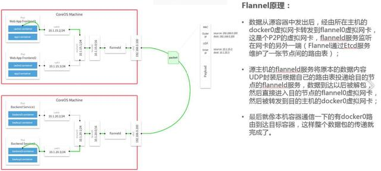
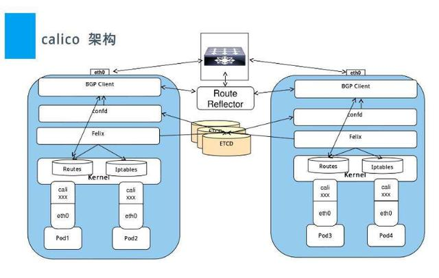
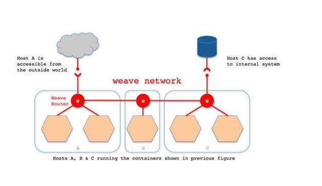

# 如何选择网络插件

<AdSenseTitle/>

> 本文转载自： [kubernetes网络插件对比分析（flannel、calico、weave）](https://www.toutiao.com/a6708893686517727748/)
>
> 原文作者：残花花败柳柳

本文将在介绍技术原理和相应术语的基础上，再集中探索与详细对比目前最流行的CNI插件：

- Flannel
- Calico
- Weave

# 介绍

网络架构是Kubernetes中较为复杂、让很多用户头疼的方面之一。Kubernetes网络模型本身对某些特定的网络功能有一定要求，但在实现方面也具有一定的灵活性。因此，业界已有不少不同的网络方案，来满足特定的环境和要求。

CNI意为容器网络接口，它是一种标准的设计，为了让用户在容器创建或销毁时都能够更容易地配置容器网络。在本文中，我们将集中探索与对比目前最流行的CNI插件：Flannel、Calico、Weave和Canal（技术上是多个插件的组合）。这些插件既可以确保满足Kubernetes的网络要求，又能为Kubernetes集群管理员提供他们所需的某些特定的网络功能。

# 背景

容器网络是容器选择连接到其他容器、主机和外部网络（如Internet）的机制。容器的Runtime提供了各种网络模式，每种模式都会产生不同的体验。

例如，Docker默认情况下可以为容器配置以下网络：

- none：将容器添加到一个容器专门的网络堆栈中，没有对外连接。
- host：将容器添加到主机的网络堆栈中，没有隔离。
- default bridge：默认网络模式。每个容器可以通过IP地址相互连接。
- 自定义网桥：用户定义的网桥，具有更多的灵活性、隔离性和其他便利功能。

Docker还可以让用户通过其他驱动程序和插件，来配置更高级的网络（包括多主机覆盖网络）。

CNI的初衷是创建一个框架，用于在配置或销毁容器时动态配置适当的网络配置和资源。下面链接中的CNI规范概括了用于配制网络的插件接口，这个接口可以让容器运行时与插件进行协调：

[CND SPEC](https://github.com/containernetworking/cni/blob/master/SPEC.md)

插件负责为接口配置和管理IP地址，并且通常提供与IP管理、每个容器的IP分配、以及多主机连接相关的功能。容器运行时会调用网络插件，从而在容器启动时分配IP地址并配置网络，并在删除容器时再次调用它以清理这些资源。

运行时或协调器决定了容器应该加入哪个网络以及它需要调用哪个插件。然后，插件会将接口添加到容器网络命名空间中，作为一个veth对的一侧。接着，它会在主机上进行更改，包括将veth的其他部分连接到网桥。再之后，它会通过调用单独的IPAM（IP地址管理）插件来分配IP地址并设置路由。

在Kubernetes中，kubelet可以在适当的时间调用它找到的插件，来为通过kubelet启动的pod进行自动的网络配置。

# 术语

在对CNI插件们进行比较之前，我们可以先对网络中会见到的相关术语做一个整体的了解。不论是阅读本文，还是今后接触到其他和CNI有关的内容，了解一些常见术语总是非常有用的。

一些最常见的术语包括：

- **第2层网络**：OSI（Open Systems Interconnections，开放系统互连）网络模型的“数据链路”层。第2层网络会处理网络上两个相邻节点之间的帧传递。第2层网络的一个值得注意的示例是以太网，其中MAC表示为子层。
- **第3层网络**：OSI网络模型的“网络”层。第3层网络的主要关注点，是在第2层连接之上的主机之间路由数据包。IPv4、IPv6和ICMP是第3层网络协议的示例。
- **VXLAN**：代表“虚拟可扩展LAN”。首先，VXLAN用于通过在UDP数据报中封装第2层以太网帧来帮助实现大型云部署。VXLAN虚拟化与VLAN类似，但提供更大的灵活性和功能（VLAN仅限于4096个网络ID）。VXLAN是一种封装和覆盖协议，可在现有网络上运行。
- **Overlay网络**：Overlay网络是建立在现有网络之上的虚拟逻辑网络。Overlay网络通常用于在现有网络之上提供有用的抽象，并分离和保护不同的逻辑网络。
- **封装**：封装是指在附加层中封装网络数据包以提供其他上下文和信息的过程。在overlay网络中，封装被用于从虚拟网络转换到底层地址空间，从而能路由到不同的位置（数据包可以被解封装，并继续到其目的地）。
- **网状网络**：网状网络（Mesh network）是指每个节点连接到许多其他节点以协作路由、并实现更大连接的网络。网状网络允许通过多个路径进行路由，从而提供更可靠的网络。网状网格的缺点是每个附加节点都会增加大量开销。
- **BGP**：代表“边界网关协议”，用于管理边缘路由器之间数据包的路由方式。BGP通过考虑可用路径，路由规则和特定网络策略，帮助弄清楚如何将数据包从一个网络发送到另一个网络。BGP有时被用作CNI插件中的路由机制，而不是封装的覆盖网络。

了解了技术术语和支持各类插件的各种技术之后，下面我们可以开始探索一些最流行的CNI插件了。

# CNI比较

**Flannel**

[flannel github 仓库](https://github.com/coreos/flannel)

由CoreOS开发的项目Flannel，可能是最直接和最受欢迎的CNI插件。它是容器编排系统中最成熟的网络结构示例之一，旨在实现更好的容器间和主机间网络。随着CNI概念的兴起，Flannel CNI插件算是早期的入门。

与其他方案相比，Flannel相对容易安装和配置。它被打包为单个二进制文件FlannelD，许多常见的Kubernetes集群部署工具和许多Kubernetes发行版都可以默认安装Flannel。Flannel可以使用Kubernetes集群的现有etcd集群来使用API存储其状态信息，因此不需要专用的数据存储。

Flannel配置第3层IPv4 Overlay网络。它会创建一个大型内部网络，跨越集群中每个节点。在此Overlay网络中，每个节点都有一个子网，用于在内部分配IP地址。在配置Pod时，每个节点上的Docker桥接口都会为每个新容器分配一个地址。同一主机中的Pod可以使用Docker桥接进行通信，而不同主机上的pod会使用flanneld将其流量封装在UDP数据包中，以便路由到适当的目标。

Flannel有几种不同类型的后端可用于封装和路由。默认和推荐的方法是使用VXLAN，因为VXLAN性能更良好并且需要的手动干预更少。

总的来说，Flannel是大多数用户的不错选择。从管理角度来看，它提供了一个简单的网络模型，用户只需要一些基础知识，就可以设置适合大多数用例的环境。一般来说，在初期使用Flannel是一个稳妥安全的选择，直到你开始需要一些它无法提供的东西。

**Calico**

[Calico github 仓库](https://github.com/projectcalico/cni-plugin)

Calico是Kubernetes生态系统中另一种流行的网络选择。虽然Flannel被公认为是最简单的选择，但Calico以其性能、灵活性而闻名。Calico的功能更为全面，不仅提供主机和pod之间的网络连接，还涉及网络安全和管理。Calico CNI插件在CNI框架内封装了Calico的功能。

在满足系统要求的新配置的Kubernetes集群上，用户可以通过应用单个manifest文件快速部署Calico。如果您对Calico的可选网络策略功能感兴趣，可以向集群应用其他manifest，来启用这些功能。

尽管部署Calico所需的操作看起来相当简单，但它创建的网络环境同时具有简单和复杂的属性。与Flannel不同，Calico不使用overlay网络。相反，Calico配置第3层网络，该网络使用BGP路由协议在主机之间路由数据包。这意味着在主机之间移动时，不需要将数据包包装在额外的封装层中。BGP路由机制可以本地引导数据包，而无需额外在流量层中打包流量。

除了性能优势之外，在出现网络问题时，用户还可以用更常规的方法进行故障排除。虽然使用VXLAN等技术进行封装也是一个不错的解决方案，但该过程处理数据包的方式同场难以追踪。使用Calico，标准调试工具可以访问与简单环境中相同的信息，从而使更多开发人员和管理员更容易理解行为。

除了网络连接外，Calico还以其先进的网络功能而闻名。 网络策略是其最受追捧的功能之一。此外，Calico还可以与服务网格Istio集成，以便在服务网格层和网络基础架构层中解释和实施集群内工作负载的策略。这意味着用户可以配置强大的规则，描述Pod应如何发送和接受流量，提高安全性并控制网络环境。

如果对你的环境而言，支持网络策略是非常重要的一点，而且你对其他性能和功能也有需求，那么Calico会是一个理想的选择。此外，如果您现在或未来有可能希望得到技术支持，那么Calico是提供商业支持的。一般来说，当您希望能够长期控制网络，而不是仅仅配置一次并忘记它时，Calico是一个很好的选择。

**Weave**

[weave ](https://www.weave.works/oss/net/)

Weave是由Weaveworks提供的一种Kubernetes CNI网络选项，它提供的模式和我们目前为止讨论的所有网络方案都不同。Weave在集群中的每个节点之间创建网状Overlay网络，参与者之间可以灵活路由。这一特性再结合其他一些独特的功能，在某些可能导致问题的情况下，Weave可以智能地路由。

为了创建网络，Weave依赖于网络中每台主机上安装的路由组件。然后，这些路由器交换拓扑信息，以维护可用网络环境的最新视图。当需要将流量发送到位于不同节点上的Pod时，Weave路由组件会自动决定是通过“快速数据路径”发送，还是回退到“sleeve”分组转发的方法。

快速数据路径依靠内核的本机Open vSwitch数据路径模块，将数据包转发到适当的Pod，而无需多次移入和移出用户空间。Weave路由器会更新Open vSwitch配置，以确保内核层具有有关如何路由传入数据包的准确信息。相反，当网络拓扑不适合快速数据路径路由时，sleeve模式可用作备份。它是一种较慢的封装模式，在快速数据路径缺少必要的路由信息或连接的情况下，它可以来路由数据包。当流量通过路由器时，它们会了解哪些对等体与哪些MAC地址相关联，从而允许它们以更少的跳数、更智能地路由后续流量。当网络更改导致可用路由改变时，这一相同的机制可以帮助每个节点进行自行更正。

与Calico一样，Weave也为Kubernetes集群提供网络策略功能。设置Weave时，网络策略会自动安装和配置，因此除了添加网络规则之外，用户无需进行其他配置。一个其他网络方案都没有、Weave独有的功能，是对整个网络的简单加密。虽然这会增加相当多的网络开销，但Weave可以使用NaCl加密来为sleeve流量自动加密所有路由流量，而对于快速数据路径流量，因为它需要加密内核中的VXLAN流量，Weave会使用IPsec ESP来加密快速数据路径流量。

对于那些寻求功能丰富的网络、同时希望不要增加大量复杂性或管理难度的人来说，Weave是一个很好的选择。它设置起来相对容易，提供了许多内置和自动配置的功能，并且可以在其他解决方案可能出现故障的场景下提供智能路由。网状拓扑结构确实会限制可以合理容纳的网络的大小，不过对于大多数用户来说，这也不是一个大问题。此外，Weave也提供收费的技术支持，可以为企业用户提供故障排除等等技术服务。

# **结语**

Kubernetes采用的CNI标准，让Kubernetes生态系统中的网络解决方案百花齐放。更多样的选择，意味着大多数用户将能够找到适合其当前需求和部署环境的CNI插件，同时还可以在环境发生变化时也能找到新的解决方案。

不同企业之间的运营要求差异很大，因此拥有一系列具有不同复杂程度和功能丰富性的成熟解决方案，大大有助于Kubernetes在满足不同用户独特需求的前提下，仍然能够提供一致的用户体验。
