# Kubernetes网络模型

<AdSenseTitle>

> 参考文档： [A Guide to the Kubernetes Networking Model](https://sookocheff.com/post/kubernetes/understanding-kubernetes-networking-model/)

Kubernetes 用来在集群上运行分布式系统。分布式系统的本质使得网络组件在 Kubernetes 中是至关重要也不可或缺的。理解 Kubernetes 的网络模型可以帮助你更好的在 Kubernetes 上运行、监控、诊断你的应用程序。

网络是一个很宽泛的领域，其中有许多成熟的技术。对于不熟悉网络整体背景的人而言，要将各种新的概念、旧的概念放到一起来理解（例如，网络名称空间、虚拟网卡、IP forwarding、网络地址转换等），并融汇贯通，是一个非常困难的事情。本文将尝试揭开 Kubernetes 网络的面纱，并讨论 Kubernetes 相关的网络技术，以及这些技术是如何支持 Kubernetes 网络模型的。

文章有点长，分成主要的几个部分：
* 首先讨论一些 Kubernetes 基础的术语，确保大家对关键措辞的理解是一致的
* 然后讨论 Kubernetes 网络模型，及其设计和实现
* 主要的内容是：通过不同的 use case 深入探讨 Kubernetes 中网络流量是如何路由的

[[TOC]]

</AdSenseTitle>


## Kubernetes基本概念

Kubernetes 基于少数几个核心概念，不断完善，提供了非常丰富和实用的功能。本章节罗列了这些核心概念，并简要的做了概述，以便更好地支持后面的讨论。熟悉 Kubernetes 的读者可跳过这个章节。

### Kubernetes API Server

操作 Kubernetes 的方式，是调用 Kubernetes API Server（kube-apiserver）的 API 接口。kubectl、kubernetes dashboard、kuboard 都是通过调用 kube-apiserver 的接口实现对 kubernetes 的管理。API server 最终将集群状态的数据存储在 [etcd](https://github.com/coreos/etcd) 中。

### 控制器Controller

控制器（Controller）是 Kubernetes 中最核心的抽象概念。在用户通过 kube-apiserver 声明了期望的状态以后，控制器通过不断监控 apiserver 中的当前状态，并对当前状态与期望状态之间的差异做出反应，以确保集群的当前状态不断地接近用户声明的期望状态。这个过程实现在一个循环中，参考如下伪代码：
``` go
while true:
  X = currentState()
  Y = desiredState()

  if X == Y:
    return  # Do nothing
  else:
    do(tasks to get to Y)
```
例如，当你通过 API Server 创建一个新的 Pod 对象时，Kubernetes调度器（是一个控制器）注意到此变化，并做出将该 Pod 运行在集群中哪个节点的决定。然后，通过 API Server 修改 Pod 对象的状态。此时，对应节点上的kubelet（是一个控制器）注意到此变化，并将在其所在节点运行该 Pod，设置需要的网络，使 Pod 在集群内可以访问。此处，两个控制器针对不同的状态变化做出反应，以使集群的当前状态与用户指定的期望状态匹配。

### 容器组Pod

Pod 是 Kubernetes 中的最小可部署单元。一个 Pod 代表了集群中运行的一个工作负载，可以包括一个或多个 docker 容器、挂载需要的存储，并拥有唯一的 IP 地址。Pod 中的多个容器将始终在同一个节点上运行。

### 节点Node

节点是Kubernetes集群中的一台机器，可以是物理机，也可以是虚拟机。

## Kubernetes网络模型

关于 Pod 如何接入网络这件事情，Kubernetes 做出了明确的选择。具体来说，Kubernetes 要求所有的网络插件实现必须满足如下要求：
* 所有的 Pod 可以与任何其他 Pod 直接通信，无需使用 NAT 映射（network address translation）
* 所有节点可以与所有 Pod 直接通信，无需使用 NAT 映射
* Pod 内部获取到的 IP 地址与其他 Pod 或节点与其通信时的 IP 地址是同一个

在这些限制条件下，需要解决如下四种完全不同的网络使用场景的问题：
1. Container-to-Container 的网络
2. Pod-to-Pod 的网络
3. Pod-to-Service 的网络
4. Internet-to-Service 的网络

## Container-to-Container的网络

通常，我们认为虚拟机中的网络通信是直接使用以太网设备进行的，如下图所示：

<p style="max-width: 480px">
  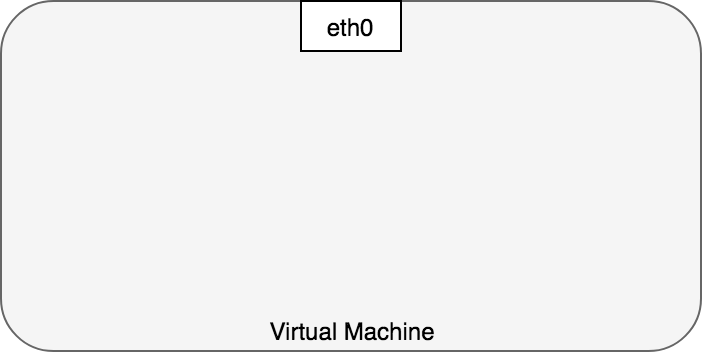
</p>

实际情况比这个示意图更加复杂一些。Linux系统中，每一个进程都在一个 [network namespace](http://man7.org/linux/man-pages/man8/ip-netns.8.html) 中进行通信，network namespace 提供了一个逻辑上的网络堆栈（包含自己的路由、防火墙规则、网络设备）。换句话说，network namespace 为其中的所有进程提供了一个全新的网络堆栈。

Linux 用户可以使用 `ip` 命令创建 network namespace。例如，下面的命令创建了一个新的 network namespace 名称为 `ns1`：
```sh
$ ip netns add ns1
```

当创建 network namespace 时，同时将在 `/var/run/netns` 下创建一个挂载点（mount point）用于存储该 namespace 的信息。

执行 `ls /var/run/netns` 命令，或执行 `ip` 命令，可以查看所有的 network namespace：
``` sh
$ ls /var/run/netns
ns1
$ ip netns
ns1
```

默认情况下，Linux 将所有的进程都分配到 root network namespace，以使得进程可以访问外部网络，如下图所示：

<p style="max-width: 480px">
  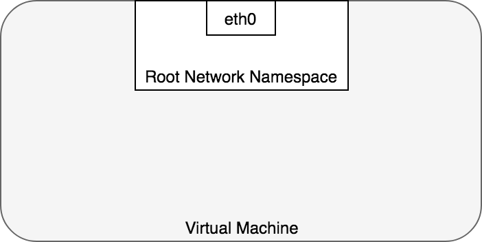
</p>

在 Kubernetes 中，Pod 是一组 docker 容器的集合，这一组 docker 容器将共享一个 network namespace。Pod 中所有的容器都：
* 使用该 network namespace 提供的同一个 IP 地址以及同一个端口空间
* 可以通过 localhost 直接与同一个 Pod 中的另一个容器通信

Kubernetes 为每一个 Pod 都创建了一个 network namespace。具体做法是，把一个 Docker 容器当做 “Pod Container” 用来获取 network namespace，在创建 Pod 中新的容器时，都使用 docker run 的 `--network:container` 功能来加入该 network namespace，参考 [docker run reference](https://docs.docker.com/engine/reference/run/#network-settings)。如下图所示，每一个 Pod 都包含了多个 docker 容器（`ctr*`），这些容器都在同一个共享的 network namespace 中：

<p style="max-width: 480px">
  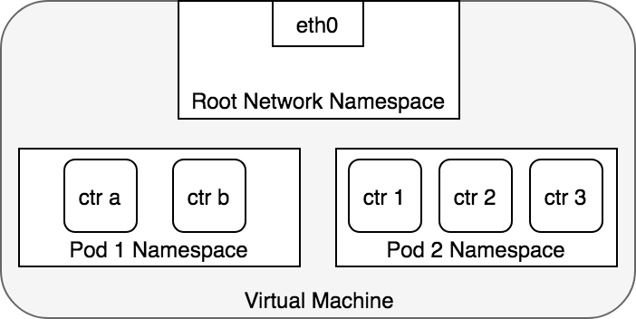
</p>

此外，Pod 中可以定义数据卷，Pod 中的容器都可以共享这些数据卷，并通过挂载点挂载到容器内部不同的路径，具体请参考 [存储卷](/learning/k8s-intermediate/persistent/pv.html)

## Pod-to-Pod的网络

在 Kubernetes 中，每一个 Pod 都有一个真实的 IP 地址，并且每一个 Pod 都可以使用此 IP 地址与 其他 Pod 通信。本章节可以帮助我们理解 Kubernetes 是如何在 Pod-to-Pod 通信中使用真实 IP 的，不管两个 Pod 是在同一个节点上，还是集群中的不同节点上。我们将首先讨论通信中的两个 Pod 在同一个节点上的情况，以避免引入跨节点网络的复杂性。

从 Pod 的视角来看，Pod 是在其自身所在的 network namespace 与同节点上另外一个 network namespace 进程通信。在Linux上，不同的 network namespace 可以通过 [Virtual Ethernet Device](http://man7.org/linux/man-pages/man4/veth.4.html) 或 ***veth pair*** (两块跨多个名称空间的虚拟网卡)进行通信。为连接 pod 的 network namespace，可以将 ***veth pair*** 的一段指定到 root network namespace，另一端指定到 Pod 的 network namespace。每一组 ***veth pair*** 类似于一条网线，连接两端，并可以使流量通过。节点上有多少个 Pod，就会设置多少组 ***veth pair***。下图展示了 veth pair 连接 Pod 到 root namespace 的情况：

<p style="max-width: 480px">
  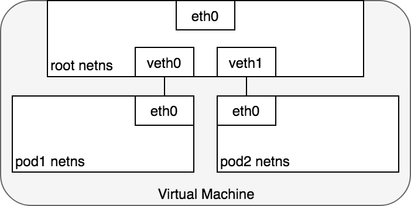
</p>

此时，我们的 Pod 都有了自己的 network namespace，从 Pod 的角度来看，他们都有自己的以太网卡以及 IP 地址，并且都连接到了节点的 root network namespace。为了让 Pod 可以互相通过 root network namespace 通信，我们将使用 network bridge（网桥）。

Linux Ethernet bridge 是一个虚拟的 Layer 2 网络设备，可用来连接两个或多个网段（network segment）。网桥的工作原理是，在源于目标之间维护一个转发表（forwarding table），通过检查通过网桥的数据包的目标地址（destination）和该转发表来决定是否将数据包转发到与网桥相连的另一个网段。桥接代码通过网络中具备唯一性的网卡MAC地址来判断是否桥接或丢弃数据。

网桥实现了 [ARP](https://en.wikipedia.org/wiki/Address_Resolution_Protocol) 协议，以发现链路层与 IP 地址绑定的 MAC 地址。当网桥收到数据帧时，网桥将该数据帧广播到所有连接的设备上（除了发送者以外），对该数据帧做出相应的设备被记录到一个查找表中（lookup table）。后续网桥再收到发向同一个 IP 地址的流量时，将使用查找表（lookup table）来找到对应的 MAC 地址，并转发数据包。

<p style="max-width: 480px">
  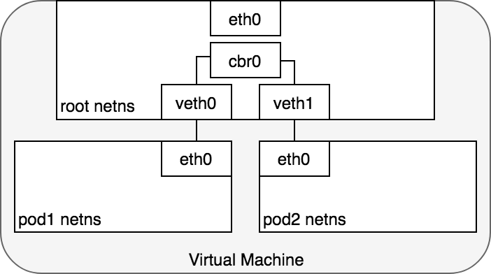
</p>

### 数据包的传递：Pod-to-Pod，同节点

在 network namespace 将每一个 Pod 隔离到各自的网络堆栈的情况下，虚拟以太网设备（virtual Ethernet device）将每一个 namespace 连接到 root namespace，网桥将 namespace 又连接到一起，此时，Pod 可以向同一节点上的另一个 Pod 发送网络报文了。下图演示了同节点上，网络报文从一个Pod传递到另一个Pod的情况。

<p style="max-width: 600px">
  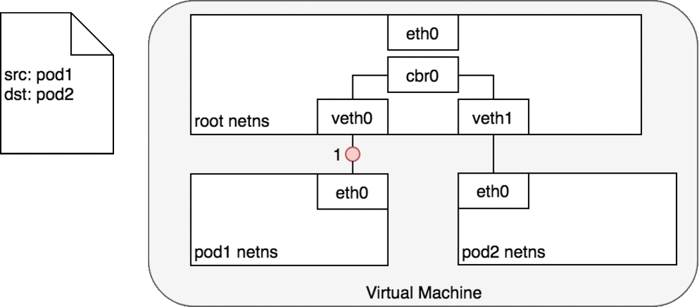
</p>

Pod1 发送一个数据包到其自己的默认以太网设备 `eth0`。
1. 对 Pod1 来说，`eth0` 通过虚拟以太网设备（veth0）连接到 root namespace
2. 网桥 `cbr0` 中为 `veth0` 配置了一个网段。一旦数据包到达网桥，网桥使用[ARP](https://en.wikipedia.org/wiki/Address_Resolution_Protocol) 协议解析出其正确的目标网段 `veth1`
3. 网桥 `cbr0` 将数据包发送到 `veth1`
4. 数据包到达 `veth1` 时，被直接转发到 Pod2 的 network namespace 中的 `eth0` 网络设备。

在整个数据包传递过程中，每一个 Pod 都只和 `localhost` 上的 `eth0` 通信，且数包被路由到正确的 Pod 上。与开发人员正常使用网络的习惯没有差异。

Kubernetes 的网络模型规定，在跨节点的情况下 Pod 也必须可以通过 IP 地址访问。也就是说，Pod 的 IP 地址必须始终对集群中其他 Pod 可见；且从 Pod 内部和从 Pod 外部来看，Pod 的IP地址都是相同的。接下来我们讨论跨节点情况下，网络数据包如何传递。

### 数据包的传递：Pod-to-Pod，跨节点

在了解了如何在同节点上 Pod 之间传递数据包之后，我们接下来看看如何在跨节点的 Pod 之间传递数据包。Kubernetes 网络模型要求 Pod 的 IP 在整个网络中都可访问，但是并不指定如何实现这一点。实际上，这是所使用网络插件相关的，但是，仍然有一些模式已经被确立了。

通常，集群中每个节点都被分配了一个 CIDR 网段，指定了该节点上的 Pod 可用的 IP 地址段。一旦发送到该 CIDR 网段的流量到达节点，就由节点负责将流量继续转发给对应的 Pod。下图展示了两个节点之间的数据报文传递过程。


<p style="max-width: 600px">
  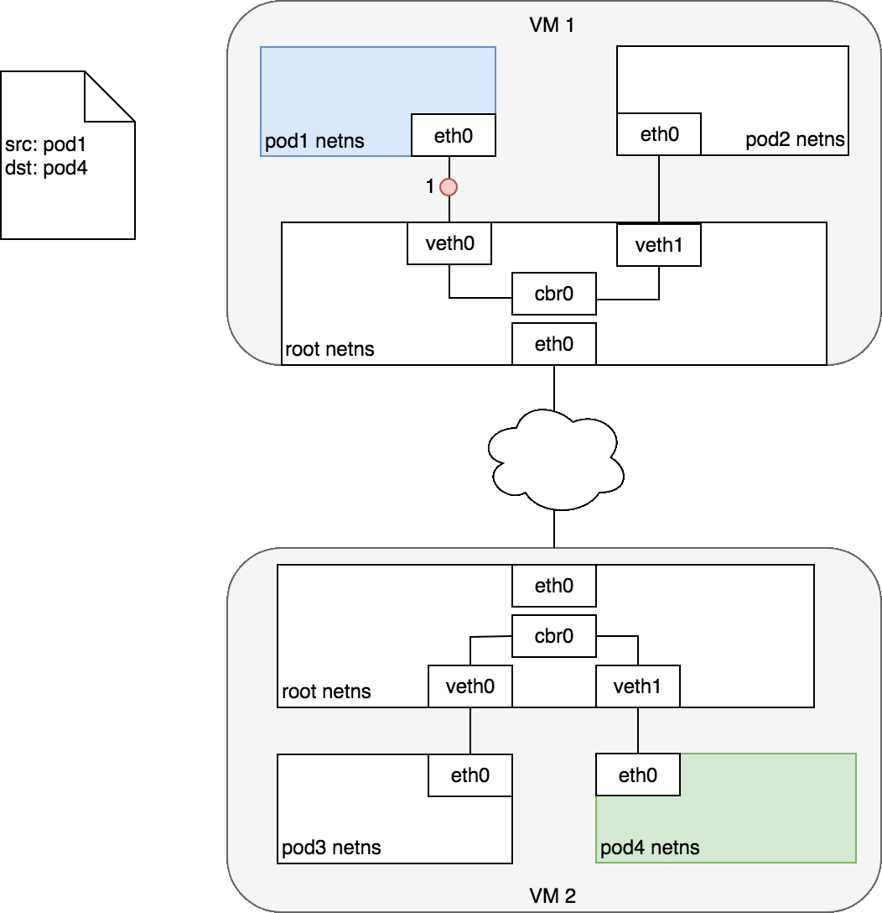
</p>

图中，目标 Pod（以绿色高亮）与源 Pod（以蓝色高亮）在不同的节点上，数据包传递过程如下：
1. 数据包从 Pod1 的网络设备 `eth0`，该设备通过 `veth0` 连接到 root namespace
2. 数据包到达 root namespace 中的网桥 `cbr0`
3. 网桥上执行 ARP 将会失败，因为与网桥连接的所有设备中，没有与该数据包匹配的 MAC 地址。一旦 ARP 失败，网桥会将数据包发送到默认路由（root namespace 中的 `eth0` 设备）。此时，数据包离开节点进入网络
4. 假设网络可以根据各节点的CIDR网段，将数据包路由到正确的节点
5. 数据包进入目标节点的 root namespace（VM2 上的 `eth0`）后，通过网桥路由到正确的虚拟网络设备（`veth1`）
6. 最终，数据包通过 `veth1` 发送到对应 Pod 的 `eth0`，完成了数据包传递的过程

通常来说，每个节点知道如何将数据包分发到运行在该节点上的 Pod。一旦一个数据包到达目标节点，数据包的传递方式与同节点上不同Pod之间数据包传递的方式就是一样的了。

此处，我们直接跳过了如何配置网络，以使得数据包可以从一个节点路由到匹配的节点。这些是与具体的网络插件实现相关的，如果感兴趣，可以深入查看某一个网络插件的具体实现。例如，AWS上，亚马逊提供了一个 [Container Network Interface(CNI) plugin](https://github.com/aws/amazon-vpc-cni-k8s) 使得 Kubernetes 可以在 Amazon VPC 上执行节点到节点的网络通信。

Container Network Interface(CNI) plugin 提供了一组通用 API 用来连接容器与外部网络。具体到容器化应用开发者来说，只需要了解在整个集群中，可以通过 Pod 的 IP 地址直接访问 Pod；网络插件是如何做到跨节点的数据包传递这件事情对容器化应用来说是透明的。AWS 的 CNI 插件通过利用 AWS 已有的 VPC、IAM、Security Group 等功能提供了一个满足 Kubernetes 网络模型要求的，且安全可管理的网络环境。

> 在 EC2（AWS 的虚拟机服务） 中，每一个实例都绑定到一个 elastic network interface （ENI）并且 VPC 中所有的 ENI 都是可连通的。默认情况下，每一个 EC2 实例都有一个唯一的 ENI，但是可以随时为 EC2 实例创建多个 ENI。AWS 的 kubernetes CNI plugin 利用了这个特点，并为节点上的每一个 Pod 都创建了一个新的 ENI。由于在 AWS 的基础设施中， VPC 当中的 ENI 已经相互连接了，这就使得每一个 Pod 的 IP 地址天然就可在 VPC 内直接访问。当 CNI 插件安装到集群上是，每一个节点（EC2实例）创建多个 elastic network interface 并且为其申请到 IP 地址，在节点上形成一个 CIDR 网段。当 Pod 被部署时，kubernetes 集群上以 DaemonSet 形式部署的一段程序将接收到该节点上 kubelet 发出的添加 Pod 到 网络的请求。这段程序将从节点的可用 ENI 池中找出一个可用的 IP 地址，并将 ENI 及 IP 地址分配给 Pod，具体做法是按照 [数据包的传递：Pod-to-Pod，同节点](#数据包的传递：pod-to-pod，同节点) 中描述的方式在 Linux 内核中连接虚拟网络设备和网桥。此时，Pod 可以被集群内任意节点访问了。

## Pod-to-Service的网络

我们已经了解了如何在 Pod 的 IP 地址之间传递数据包。然而，Pod 的 IP 地址并非是固定不变的，随着 Pod 的重新调度（例如水平伸缩、应用程序崩溃、节点重启等），Pod 的 IP 地址将会出现又消失。此时，Pod 的客户端无法得知该访问哪一个 IP 地址。Kubernetes 中，Service 的概念用于解决此问题。

一个 Kubernetes Service 管理了一组 Pod 的状态，可以追踪一组 Pod 的 IP 地址的动态变化过程。一个 Service 拥有一个 IP 地址，并且充当了一组 Pod 的 IP 地址的“虚拟 IP 地址”。任何发送到 Service 的 IP 地址的数据包将被负载均衡到该 Service 对应的 Pod 上。在此情况下，Service 关联的 Pod 可以随时间动态变化，客户端只需要知道 Service 的 IP 地址即可（该地址不会发生变化）。

从效果上来说，Kubernetes 自动为 Service 创建和维护了集群内部的分布式负载均衡，可以将发送到 Service IP 地址的数据包分发到 Service 对应的健康的 Pod 上。接下来我们讨论一下这是怎么做到的。

### netfilter and iptables

Kubernetes 利用 Linux 内建的网络框架 - `netfilter` 来实现负载均衡。Netfilter 是由 Linux 提供的一个框架，可以通过自定义 handler  的方式来实现多种网络相关的操作。Netfilter 提供了许多用于数据包过滤、网络地址转换、端口转换的功能，通过这些功能，自定义的 handler 可以在网络上转发数据包、禁止数据包发送到敏感的地址，等。

`iptables` 是一个 user-space 应用程序，可以提供基于决策表的规则系统，以使用 netfilter 操作或转换数据包。在 Kubernetes 中，kube-proxy 控制器监听 apiserver 中的变化，并配置 iptables 规则。当 Service 或 Pod 发生变化时（例如 Service 被分配了 IP 地址，或者新的 Pod 被关联到 Service），kube-proxy 控制器将更新 iptables 规则，以便将发送到 Service 的数据包正确地路由到其后端 Pod 上。iptables 规则将监听所有发向 Service 的虚拟 IP 的数据包，并将这些数据包转发到该Service 对应的一个随机的可用 Pod 的 IP 地址，同时 iptables 规则将修改数据包的目标 IP 地址（从 Service 的 IP 地址修改为选中的 Pod 的 IP 地址）。当 Pod 被创建或者被终止时，iptables 的规则也被对应的修改。换句话说，iptables 承担了从 Service IP 地址到实际 Pod IP 地址的负载均衡的工作。

在返回数据包的路径上，数据包从目标 Pod 发出，此时，iptables 规则又将数据包的 IP 头从 Pod 的 IP 地址替换为 Service 的 IP 地址。从请求的发起方来看，就好像始终只是在和 Service 的 IP 地址通信一样。

### IPVS

Kubernetes v1.11 开始，提供了另一个选择用来实现集群内部的负载均衡：[IPVS](/learning/k8s-intermediate/service/service-details.html#ipvs-代理模式)。 IPVS（IP Virtual Server）也是基于 netfilter 构建的，在 Linux 内核中实现了传输层的负载均衡。IPVS 被合并到 LVS（Linux Virtual Server）当中，充当一组服务器的负载均衡器。IPVS 可以转发 TCP / UDP 请求到实际的服务器上，使得一组实际的服务器看起来像是只通过一个单一 IP 地址访问的服务一样。IPVS 的这个特点天然适合与用在 Kubernetes Service 的这个场景下。

当声明一个 Kubernetes Service 时，你可以指定是使用 iptables 还是 IPVS 来提供集群内的负载均衡工鞥呢。IPVS 是转为负载均衡设计的，并且使用更加有效率的数据结构（hash tables），相较于 iptables，可以支持更大数量的网络规模。当创建使用 IPVS 形式的 Service 时，Kubernetes 执行了如下三个操作：
* 在节点上创建一个 dummy IPVS interface
* 将 Service 的 IP 地址绑定到该 dummy IPVS interface
* 为每一个 Service IP 地址创建 IPVS 服务器

将来，IPVS 有可能成为 kubernetes 中默认的集群内负载均衡方式。这个改变将只影响到集群内的负载均衡，本文后续讨论将以 iptables 为例子，所有讨论对 IPVS 是同样适用的。

### 数据包的传递：Pod-to-Service

<p style="max-width: 600px">
  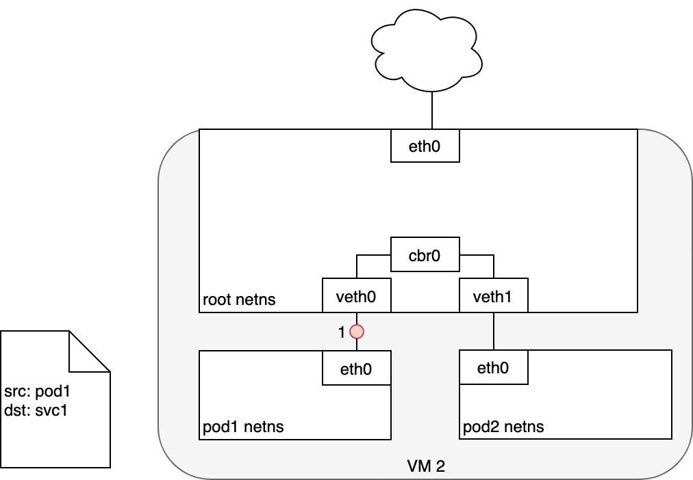
</p>

在 Pod 和 Service 之间路由数据包时，数据包的发起和以前一样：
1. 数据包首先通过 Pod 的 `eth0` 网卡发出
2. 数据包经过虚拟网卡 `veth0` 到达网桥 `cbr0`
3. 网桥上的 APR 协议查找不到该 Service，所以数据包被发送到 root namespace 中的默认路由 - `eth0`
4. 此时，在数据包被 `eth0` 接受之前，数据包将通过 iptables 过滤。iptables 使用其规则（由 kube-proxy 根据 Service、Pod 的变化在节点上创建的 iptables 规则）重写数据包的目标地址（从 Service 的 IP 地址修改为某一个具体 Pod 的 IP 地址）
5. 数据包现在的目标地址是 Pod 4，而不是 Service 的虚拟 IP 地址。iptables 使用 Linux 内核的 `conntrack` 工具包来记录具体选择了哪一个 Pod，以便可以将未来的数据包路由到同一个 Pod。简而言之，iptables 直接在节点上完成了集群内负载均衡的功能。数据包后续如何发送到 Pod 上，其路由方式与 [Pod-to-Pod的网络](#Pod-to-Pod的网络) 中的描述相同。

### 数据包的传递：Service-to-Pod

<p style="max-width: 600px">
  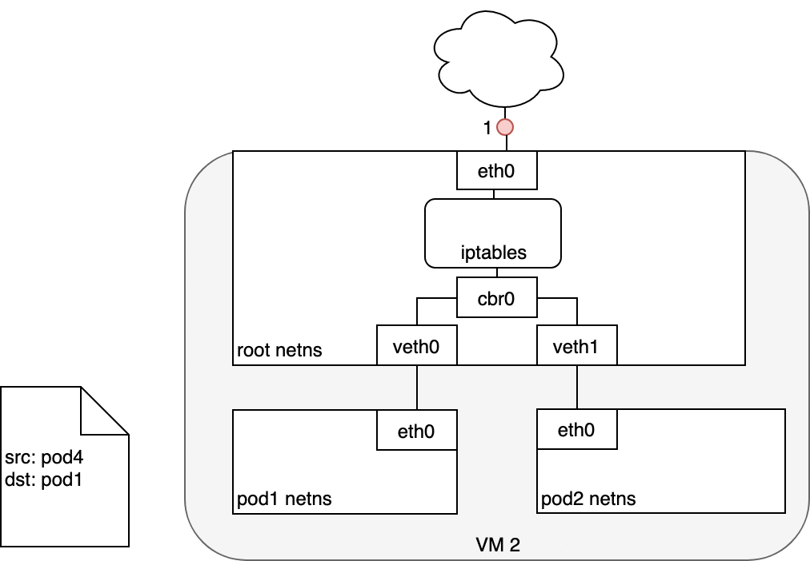
</p>

1. 接收到此请求的 Pod 将会发送返回数据包，其中标记源 IP 为接收请求 Pod 自己的 IP，目标 IP 为最初发送对应请求的 Pod 的 IP
2. 当数据包进入节点后，数据包将经过 iptables 的过滤，此时记录在 `conntrack` 中的信息将被用来修改数据包的源地址（从接收请求的 Pod 的 IP 地址修改为 Service 的 IP 地址）
3. 然后，数据包将通过网桥、以及虚拟网卡 `veth0`
4. 最终到达 Pod 的网卡 `eth0`

### 使用DNS

Kubernetes 也可以使用 DNS，以避免将 Service 的 cluster IP 地址硬编码到应用程序当中。Kubernetes DNS 是 Kubernetes 上运行的一个普通的 Service。每一个节点上的 `kubelet` 都使用该 DNS Service 来执行 DNS 名称的解析。集群中每一个 Service（包括 DNS Service 自己）都被分配了一个 DNS 名称。DNS 记录将 DNS 名称解析到 Service 的 ClusterIP 或者 Pod 的 IP 地址。[SRV 记录](/learning/k8s-intermediate/service/dns.html#srv-记录) 用来指定 Service 的已命名端口。

DNS Pod 由三个不同的容器组成：
* `kubedns`：观察 Kubernetes master 上 Service 和 Endpoints 的变化，并维护内存中的 DNS 查找表
* `dnsmasq`：添加 DNS 缓存，以提高性能
* `sidecar`：提供一个健康检查端点，可以检查 `dnsmasq` 和 `kubedns` 的健康状态

DNS Pod 被暴露为 Kubernetes 中的一个 Service，该 Service 及其 ClusterIP 在每一个容器启动时都被传递到容器中（环境变量及 /etc/resolves），因此，每一个容器都可以正确的解析 DNS。DNS 条目最终由 `kubedns` 解析，`kubedns` 将 DNS 的所有信息都维护在内存中。`etcd` 中存储了集群的所有状态，`kubedns` 在必要的时候将 `etcd` 中的 key-value 信息转化为 DNS 条目信息，以重建内存中的 DNS 查找表。

CoreDNS 的工作方式与 `kubedns` 类似，但是通过插件化的架构构建，因而灵活性更强。自 Kubernetes v1.11 开始，CoreDNS 是 Kubernetes 中默认的 DNS 实现。

## Internet-to-Service的网络

前面我们已经了解了 Kubernetes 集群内部的网络路由。下面，我们来探讨一下如何将 Service 暴露到集群外部：
* 从集群内部访问互联网
* 从互联网访问集群内部

### 出方向 - 从集群内部访问互联网

将网络流量从集群内的一个节点路由到公共网络是与具体网络以及实际网络配置紧密相关的。为了更加具体地讨论此问题，本文将使用 AWS VPC 来讨论其中的具体问题。

在 AWS，Kubernetes 集群在 VPC 内运行，在此处，每一个节点都被分配了一个内网地址（private IP address）可以从 Kubernetes 集群内部访问。为了使访问外部网络，通常会在 VPC 中添加互联网网关（Internet Gateway），以实现如下两个目的：
* 作为 VPC 路由表中访问外网的目标地址
* 提供网络地址转换（NAT Network Address Translation），将节点的内网地址映射到一个外网地址，以使外网可以访问内网上的节点

在有互联网网关（Internet Gateway）的情况下，虚拟机可以任意访问互联网。但是，存在一个小问题：Pod 有自己的 IP 地址，且该 IP 地址与其所在节点的 IP 地址不一样，并且，互联网网关上的 NAT 地址映射只能够转换节点（虚拟机）的 IP 地址，因为网关不知道每个节点（虚拟机）上运行了哪些 Pod （互联网网关不知道 Pod 的存在）。接下来，我们了解一下 Kubernetes 是如何使用 iptables 解决此问题的。

#### 数据包的传递：Node-to-Internet

下图中：
1. 数据包从 Pod 的 network namespace 发出
2. 通过 `veth0` 到达虚拟机的 root network namespace
3. 由于网桥上找不到数据包目标地址对应的网段，数据包将被网桥转发到 root network namespace 的网卡 `eth0`。在数据包到达 `eth0` 之前，iptables 将过滤该数据包。
4. 在此处，数据包的源地址是一个 Pod，如果仍然使用此源地址，互联网网关将拒绝此数据包，因为其 NAT 只能识别与节点（虚拟机）相连的 IP 地址。因此，需要 iptables 执行源地址转换（source NAT），这样子，对互联网网关来说，该数据包就是从节点（虚拟机）发出的，而不是从 Pod 发出的
5. 数据包从节点（虚拟机）发送到互联网网关
6. 互联网网关再次执行源地址转换（source NAT），将数据包的源地址从节点（虚拟机）的内网地址修改为网关的外网地址，最终数据包被发送到互联网

在回路径上，数据包沿着相同的路径反向传递，源地址转换（source NAT）在对应的层级上被逆向执行。

<p style="max-width: 600px">
  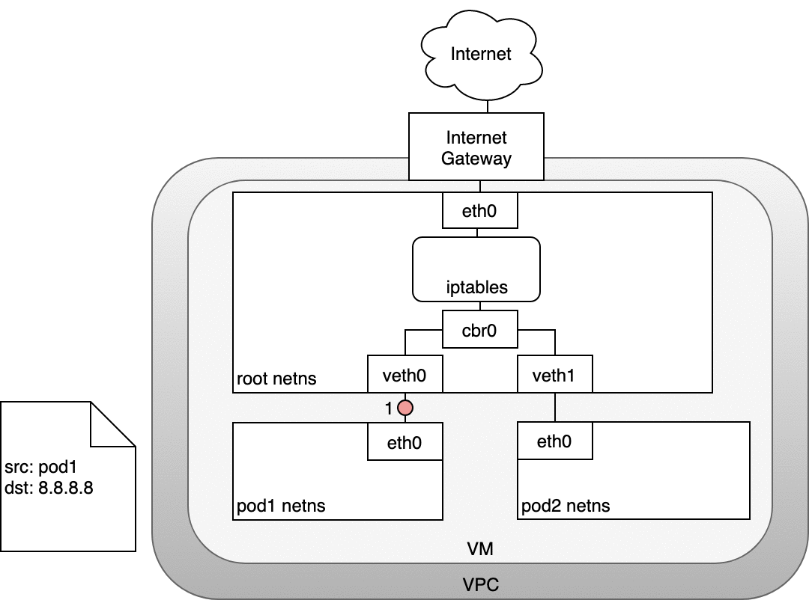
</p>

### 入方向 - 从互联网访问Kubernetes

入方向访问（从互联网访问Kubernetes集群）是一个非常棘手的问题。该问题同样跟具体的网络紧密相关，通常来说，入方向访问在不同的网络堆栈上有两个解决方案：
1. Service LoadBalancer
2. Ingress Controller

#### Layer 4：LoadBalancer

当创建 Kubernetes Service 时，可以指定其类型为 [LoadBalancer](/learning/k8s-intermediate/service/service-types.html#loadbalancer)。 LoadBalancer 的实现由 [cloud controller](https://kubernetes.io/docs/concepts/architecture/cloud-controller/) 提供，cloud controller 可以调用云供应商 IaaS 层的接口，为 Kubernetes Service 创建负载均衡器（如果您自建 Kubernetes 集群，可以使用 NodePort 类型的 Service，并手动创建负载均衡器）。用户可以将请求发送到负载均衡器来访问 Kubernetes 中的 Service。

在 AWS，负载均衡器可以将网络流量分发到其目标服务器组（即 Kubernetes 集群中的所有节点）。一旦数据包到达节点，Service 的 iptables 规则将确保其被转发到 Service 的一个后端 Pod。

#### 数据包的传递：LoadBalancer-to-Service

接下来了解一下 Layer 4 的入方向访问具体是如何做到的：
1. Loadbalancer 类型的 Service 创建后，cloud controller 将为其创建一个负载均衡器
2. 负载均衡器只能直接和节点（虚拟机沟通），不知道 Pod 的存在，当数据包从请求方（互联网）到达 LoadBalancer 之后，将被分发到集群的节点上
3. 节点上的 iptables 规则将数据包转发到合适的 Pod 上 （同 [数据包的传递：Service-to-Pod](#数据包的传递：service-to-pod)）

从 Pod 到请求方的相应数据包将包含 Pod 的 IP 地址，但是请求方需要的是负载均衡器的 IP 地址。iptables 和 `conntrack` 被用来重写返回路径上的正确的 IP 地址。

下图描述了一个负载均衡器和三个集群节点：
1. 请求数据包从互联网发送到负载均衡器
2. 负载均衡器将数据包随机分发到其中的一个节点（虚拟机），此处，我们假设数据包被分发到了一个没有对应 Pod 的节点（VM2）上
3. 在 VM2 节点上，kube-proxy 在节点上安装的 iptables 规则会将该数据包的目标地址判定到对应的 Pod 上（集群内负载均衡将生效）
4. iptables 完成 NAT 映射，并将数据包转发到目标 Pod

<p style="max-width: 480px">
  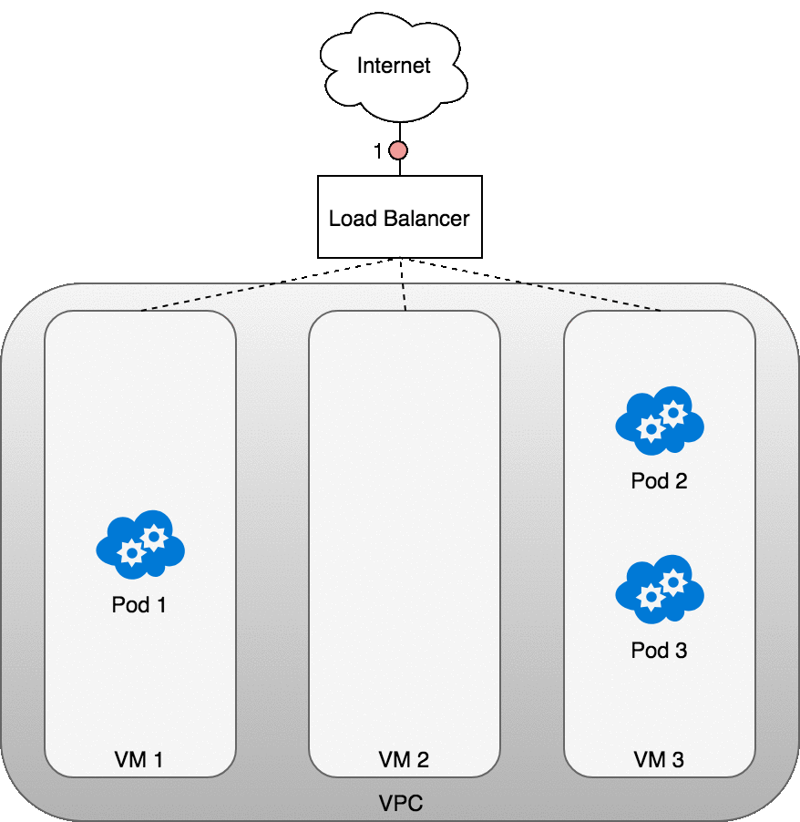
</p>

#### Layer 7：Ingress控制器

::: tip 译者注
本章节讲述的 Ingress 控制器实现方式是特定于 AWS 的，与 [nginx ingress controller](/learning/k8s-intermediate/service/ingress.html) 的具体做法有所不同
:::

Layer 7 网络入方向访问在网络堆栈的 HTTP/HTTPS 协议层面工作，并且依赖于 KUbernetes Service。要实现 Layer 7 网络入方向访问，首先需要将 Service 指定为 `NodtePort` 类型，此时 Kubernetes master 将会为该 Service 分配一个 [节点端口](/learning/k8s-intermediate/service/service-types.html#nodeport)，每一个节点上的 iptables 都会将此端口上的请求转发到 Service 的后端 Pod 上。此时，Service-to-Pod 的路由与 [数据包的传递：Service-to-Pod](#数据包的传递：service-to-pod) 的描述相同。

接下来，创建一个 Kubernetes [Ingress](/learning/k8s-intermediate/service/ingress.html) 对象可以将该 Service 发布到互联网。Ingress 是一个高度抽象的 HTTP 负载均衡器，可以将 HTTP 请求映射到 Kubernetes Service。在不同的 Kubernetes 集群中，Ingress 的具体实现可能是不一样的。与 Layer 4 的网络负载均衡器相似，HTTP 负载均衡器只理解节点的 IP 地址（而不是 Pod 的 IP 地址），因此，也同样利用了集群内部通过 iptables 实现的负载均衡特性。

在 AWS 中，ALB Ingress 控制器使用 Amazon 的 Layer 7 Application Load Balancer实现了 Kubernetes Ingress 的功能。下图展示了 AWS 上 Ingress 控制器的细节，也展示了网络请求是如何从 ALB 路由到 Kubernetes 集群的。


1. ALB Ingress Controller 创建后，将监听 Kubernetes API 上关于 Ingress 的事件。当发现匹配的 Ingress 对象时，Ingress Controller 开始创建 AWS 资源
2. AWS 使用 Application Load Balancer（ALB）来满足 Ingress 对象的要求，并使用 Target Group 将请求路由到目标节点
3. ALB Ingress Controller 为 Kubernetes Ingress 对象中用到的每一个 Kubernetes Service 创建一个 AWS Target Group
4. Listener 是一个 ALB 进程，由 ALB Ingress Controller 根据 Ingress 的注解（annotations）创建，监听 ALB 上指定的协议和端口，并接收外部的请求
5. ALB Ingress Controller 还根据 Kubernetes Ingress 中的路径定义，创建了 Target Group Rule，确保指定路径上的请求被路由到合适的 Kubernetes Service

#### 数据包的传递：Ingress-to-Service

Ingress-to-Service 的数据包传递与 LoadBalancer-to-Service 的数据包传递非常相似。核心差别是：
* Ingress 能够解析 URL 路径（可基于路径进行路由）
* Ingress 连接到 Service 的 NodePort

下图展示了 Ingress-to-Service 的数据包传递过程。
1. 创建 Ingress 之后，cloud controller 将会为其创建一个新的 Ingress Load Balancer
2. 由于 Load Balancer 并不知道 Pod 的 IP 地址，当路由到达 Ingress Load Balancer 之后，会被转发到集群中的节点上（Service的节点端口）
3. 节点上的 iptables 规则将数据包转发到合适的 Pod
4. Pod 接收到数据包

从 Pod 返回的响应数据包将包含 Pod 的 IP 地址，但是请求客户端需要的是 Ingress Load Balancer 的 IP 地址。iptables 和 `conntrack` 被用来重写返回路径上的 IP 地址。

<p style="max-width: 600px">
  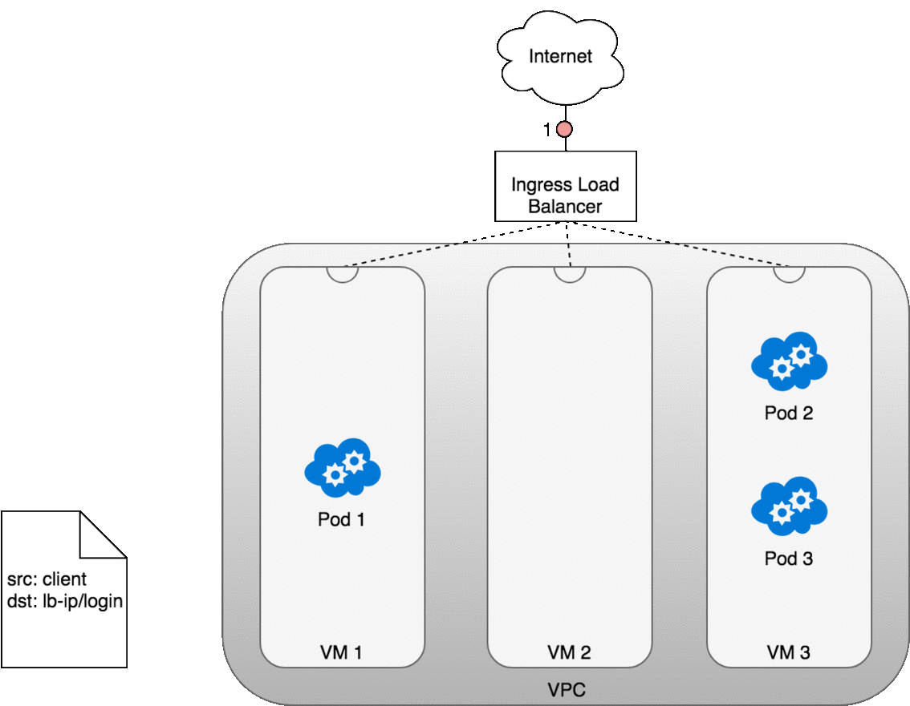
</p>
