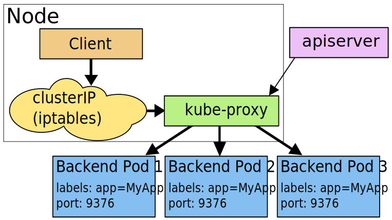
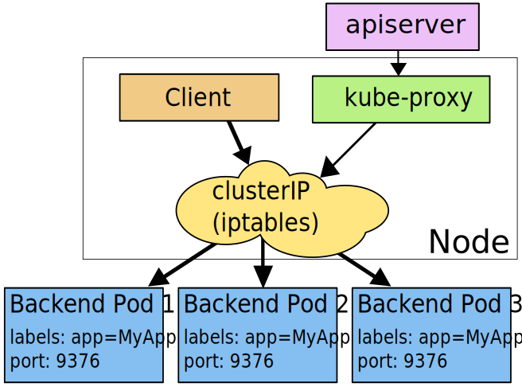
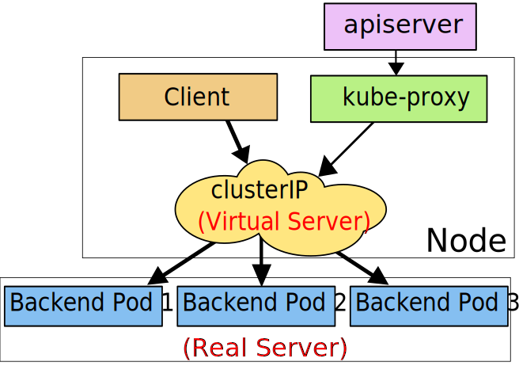

# Service 详细描述

参考文档：Kubernetes 官网文档：[Service](https://kubernetes.io/docs/concepts/services-networking/service/)

## 创建 Service

Kubernetes Servies 是一个 RESTFul 接口对象，可通过 yaml 文件创建。

例如，假设您有一组 Pod：
* 每个 Pod 都监听 9376 TCP 端口
* 每个 Pod 都有标签 app=MyApp

``` yaml
apiVersion: v1
kind: Service
metadata:
  name: my-service
spec:
  selector:
    app: MyApp
  ports:
    - protocol: TCP
      port: 80
      targetPort: 9376
```

上述 YAML 文件可用来创建一个 Service：
* 名字为 `my-service`
* 目标端口未 TCP 9376
* 选取所有包含标签 app=MyApp 的 Pod

关于 Service，您还需要了解：

* Kubernetes 将为该 Service 分配一个 IP 地址（ClusterIP 或 集群内 IP），供 Service Proxy 使用（参考[虚拟 IP 和 Service proxy](#虚拟-ip-和-service-proxy)）
* Kubernetes 将不断扫描符合该 selector 的 Pod，并将最新的结果更新到与 Service 同名 `my-service` 的 Endpoint 对象中。
  ::: tip
  Service 从自己的 IP 地址和 `port` 端口接收请求，并将请求映射到符合条件的 Pod 的 `targetPort`。为了方便，默认 `targetPort` 的取值 与 `port` 字段相同
  :::
* Pod 的定义中，Port 可能被赋予了一个名字，您可以在 Service 的 `targetPort` 字段引用这些名字，而不是直接写端口号。这种做法可以使得您在将来修改后端程序监听的端口号，而无需影响到前端程序。
* Service 的默认传输协议是 TCP，您也可以使用其他 [支持的传输协议](#支持的传输协议)。
* Kubernetes Service 中，可以定义多个端口，不同的端口可以使用相同或不同的传输协议。

## 创建 Service（无 label selector） <Badge text="Kuboard 暂不支持" type="warn"/>

Service 通常用于提供对 Kubernetes Pod 的访问，但是您也可以将其用于任何其他形式的后端。例如：

* 您想要在生产环境中使用一个 Kubernetes 外部的数据库集群，在测试环境中使用 Kubernetes 内部的 数据库
* 您想要将 Service 指向另一个名称空间中的 Service，或者另一个 Kubernetes 集群中的 Service
* 您正在将您的程序迁移到 Kubernetes，但是根据您的迁移路径，您只将一部分后端程序运行在 Kubernetes 中

在上述这些情况下，您可以定义一个没有 Pod Selector 的 Service。例如：

``` yaml
apiVersion: v1
kind: Service
metadata:
  name: my-service
spec:
  ports:
    - protocol: TCP
      port: 80
      targetPort: 9376
```

因为该 Service 没有 selector，相应的 Endpoint 对象就无法自动创建。您可以手动创建一个 Endpoint 对象，以便将该 Service 映射到后端服务真实的 IP 地址和端口：

``` yaml
apiVersion: v1
kind: Endpoints
metadata:
  name: my-service
subsets:
  - addresses:
      - ip: 192.0.2.42
    ports:
      - port: 9376
```

::: tip
* Endpoint 中的 IP 地址不可以是 loopback（127.0.0.0/8 IPv4 或 ::1/128 IPv6），或 link-local（169.254.0.0/16 IPv4、224.0.0.0/24 IPv4 或 fe80::/64 IPv6）
* Endpoint 中的 IP 地址不可以是集群中其他 Service 的 ClusterIP
:::

对于 Service 的访问者来说，Service 是否有 label selector 都是一样的。在上述例子中，Service 将请求路由到 Endpoint 192.0.2.42:9376 (TCP)。

ExternalName Service 是一类特殊的没有 label selector 的 Service，该类 Service 使用 DNS 名字。参考 [ExternalName](#externalname)

## 虚拟 IP 和服务代理

Kubernetes 集群中的每个节点都运行了一个 `kube-proxy`，负责为 Service（ExternalName 类型的除外）提供虚拟 IP 访问。

### 为何不使用 round-robin DNS

许多用户都对 Kubernetes 为何使用服务代理将接收到的请求转发给后端服务，而不是使用其他途径，例如：是否可以为 Service 配置一个 DNS 记录，将其解析到多个 A value（如果是 IPv6 则是 AAAA value），并依赖 round-robin（循环）解析？

Kubernetes 使用在 Service 中使用 proxy 的原因大致有如下几个：
* 一直以来，DNS 软件都不确保严格检查 TTL（Time to live），并且在缓存的 dns 解析结果应该过期以后，仍然继续使用缓存中的记录
* 某些应用程序只做一次 DNS 解析，并一直使用缓存下来的解析结果
* 即使应用程序对 DNS 解析做了合适的处理，为 DNS 记录设置过短（或者 0）的 TTL 值，将给 DNS 服务器带来过大的负载

### 版本兼容性

Kubernetes 支持三种 proxy mode（代理模式），他们的版本兼容性如下：

| 代理模式              | Kubernetes 版本 | 是否默认 |
| --------------------- | --------------- | -------- |
| User space proxy mode | v1.0 +          |          |
| Iptables proxy mode   | v1.1 +          | 默认     |
| Ipvs proxy mode       | v1.8 +          |          |

### User space 代理模式

**在 user space proxy mode 下：**

* kube-proxy 监听 kubernetes master 以获得添加和移除 Service / Endpoint 的事件
* kube-proxy 在其所在的节点（每个节点都有 kube-proxy）上为每一个 Service 打开一个随机端口
* kube-proxy 安装 iptables 规则，将发送到该 Service 的 ClusterIP（虚拟 IP）/ Port 的请求重定向到该随机端口
* 任何发送到该随机端口的请求将被代理转发到该 Service 的后端 Pod 上（kube-proxy 从 Endpoint 信息中获得可用 Pod）
* kube-proxy 在决定将请求转发到后端哪一个 Pod 时，默认使用 round-robin（轮询）算法，并会考虑到 Service 中的 `SessionAffinity` 的设定

如下图所示：

<p>
  
</p>

### Iptables 代理模式 <Badge text="默认模式" type="success"/>

**在 iptables proxy mode 下：**

* kube-proxy 监听 kubernetes master 以获得添加和移除 Service / Endpoint 的事件
* kube-proxy 在其所在的节点（每个节点都有 kube-proxy）上为每一个 Service 安装 iptable 规则
* iptables 将发送到 Service 的 ClusterIP / Port 的请求重定向到 Service 的后端 Pod 上
  * 对于 Service 中的每一个 Endpoint，kube-proxy 安装一个 iptable 规则
  * 默认情况下，kube-proxy 随机选择一个 Service 的后端 Pod

如下图所示：
<p>
  
</p>

**iptables proxy mode 的优点：**

* 更低的系统开销：在 linux netfilter 处理请求，无需在 userspace 和 kernel space 之间切换
* 更稳定

**与 user space mode 的差异：**

* 使用 iptables mode 时，如果第一个 Pod 没有响应，则创建连接失败
* 使用 user space mode 时，如果第一个 Pod 没有响应，kube-proxy 会自动尝试连接另外一个后端 Pod

您可以配置 Pod 就绪检查（readiness probe）确保后端 Pod 正常工作，此时，在 iptables 模式下 kube-proxy 将只使用健康的后端 Pod，从而避免了 kube-proxy 将请求转发到已经存在问题的 Pod 上。

### IPVS 代理模式

**在 IPVS proxy mode 下：**

* kube-proxy 监听 kubernetes master 以获得添加和移除 Service / Endpoint 的事件
* kube-proxy 根据监听到的事件，调用 netlink 接口，创建 IPVS 规则；并且将 Service/Endpoint 的变化同步到 IPVS 规则中
* 当访问一个 Service 时，IPVS 将请求重定向到后端 Pod

<p>
  
</p>

**IPVS 模式的优点**

IPVS proxy mode 基于 netfilter 的 hook 功能，与 iptables 代理模式相似，但是 IPVS 代理模式使用 hash table 作为底层的数据结构，并在 kernel space 运作。这就意味着
* IPVS 代理模式可以比 iptables 代理模式有更低的网络延迟，在同步代理规则时，也有更高的效率
* 与 user space 代理模式 / iptables 代理模式相比，IPVS 模式可以支持更大的网络流量

**IPVS 提供更多的负载均衡选项：**
* rr: round-robin
* lc: least connection (最小打开的连接数)
* dh: destination hashing
* sh: source hashing
* sed: shortest expected delay
* nq: never queue

::: tip
* 如果要使用 IPVS 模式，您必须在启动 kube-proxy 前为节点的 linux 启用 IPVS
* kube-proxy 以 IPVS 模式启动时，如果发现节点的 linux 未启用 IPVS，则退回到 iptables 模式
:::

### 代理模式总结

在所有的代理模式中，发送到 Service 的 IP:Port 的请求将被转发到一个合适的后端 Pod，而无需调用者知道任何关于 Kubernetes/Service/Pods 的细节。

Service 中额外字段的作用：
* `service.spec.sessionAffinity`
  * 默认值为 "None"
  * 如果设定为 "ClientIP"，则同一个客户端的连接将始终被转发到同一个 Pod
* `service.spec.sessionAffinityConfig.clientIP.timeoutSeconds`
  * 默认值为 10800 （3 小时）
  * 设定会话保持的持续时间

## 多端口的Service

Kubernetes 中，您可以在一个 Service 对象中定义多个端口，此时，您必须为每个端口定义一个名字。如下所示：

``` yaml
apiVersion: v1
kind: Service
metadata:
  name: my-service
spec:
  selector:
    app: MyApp
  ports:
    - name: http
      protocol: TCP
      port: 80
      targetPort: 9376
    - name: https
      protocol: TCP
      port: 443
      targetPort: 9377
```

::: tip
端口的名字必须符合 Kubernetes 的命名规则，且，端口的名字只能包含小写字母、数字、`-`，并且必须以数字或字母作为开头及结尾。

例如：

合法的 Port 名称：`123-abc`、`web`

非法的 Port 名称：`123_abc`、`-web`
:::

## 使用自定义的 IP 地址 <Badge text="Kuboard 正在计划中" type="warn"/>

创建 Service 时，如果指定 `.spec.clusterIP` 字段，可以使用自定义的 Cluster IP 地址。该 IP 地址必须是 APIServer 中配置字段 `service-cluster-ip-range` CIDR 范围内的合法 IPv4 或 IPv6 地址，否则不能创建成功。

可能用到自定义 IP 地址的场景：
* 想要重用某个已经存在的 DNS 条目
* 遗留系统是通过 IP 地址寻址，且很难改造

## 服务发现

Kubernetes 支持两种主要的服务发现模式：
* 环境变量
* DNS

### 环境变量

kubelet 查找有效的 Service，并针对每一个 Service，向其所在节点上的 Pod 注入一组环境变量。支持的环境变量有：
* [Docker links 兼容](https://docs.docker.com/network/links/) 的环境变量
* {SVCNAME}_SERVICE_HOST 和 {SVCNAME}_SERVICE_PORT
  * Service name 被转换为大写
  * 小数点 `.` 被转换为下划线 `_`

例如，Service `redis-master` 暴露 TCP 端口 6379，其 Cluster IP 为 10.0.0.11，对应的环境变量如下所示：

``` s
REDIS_MASTER_SERVICE_HOST=10.0.0.11
REDIS_MASTER_SERVICE_PORT=6379
REDIS_MASTER_PORT=tcp://10.0.0.11:6379
REDIS_MASTER_PORT_6379_TCP=tcp://10.0.0.11:6379
REDIS_MASTER_PORT_6379_TCP_PROTO=tcp
REDIS_MASTER_PORT_6379_TCP_PORT=6379
REDIS_MASTER_PORT_6379_TCP_ADDR=10.0.0.11
```

::: tip
如果要在 Pod 中使用基于环境变量的服务发现方式，必须先创建 Service，再创建调用 Service 的 Pod。否则，Pod 中不会有该 Service 对应的环境变量。

如果使用基于 DNS 的服务发现，您无需担心这个创建顺序的问题
:::

### DNS

如果按照 www.kuboard.cn 上的文档安装 Kubernetes，默认已经安装了 DNS 服务，[Core DNS](https://coredns.io/)。

CoreDNS 监听 Kubernetes API 上创建和删除 Service 的事件，并为每一个 Service 创建一条 DNS 记录。集群中所有的 Pod 都可以使用 DNS Name 解析到 Service 的 IP 地址。

例如，名称空间 `my-ns` 中的 Service `my-service`，将对应一条 DNS 记录 `my-service.my-ns`。 名称空间 `my-ns` 中的Pod可以直接 `nslookup my-service` （`my-service.my-ns` 也可以）。其他名称空间的 Pod 必须使用 `my-service.my-ns`。`my-service` 和 `my-service.my-ns` 都将被解析到 Service 的 Cluster IP。

Kubernetes 同样支持 DNS SRV（Service）记录，用于查找一个命名的端口。假设 `my-service.my-ns` Service 有一个 TCP 端口名为 `http`，则，您可以 `nslookup _http._tcp.my-service.my-ns` 以发现该Service 的 IP 地址及端口 `http`

对于 `ExternalName` 类型的 Service，只能通过 DNS 的方式进行服务发现。参考 [Service/Pod 的 DNS](./dns.html)

## Headless Services

“Headless” Service 不提供负载均衡的特性，也没有自己的 IP 地址。创建 “headless” Service 时，只需要指定 `.spec.clusterIP` 为 "None"。

“Headless” Service 可以用于对接其他形式的服务发现机制，而无需与 Kubernetes 的实现绑定。

对于 “Headless” Service 而言：
* 没有 Cluster IP
* kube-proxy 不处理这类 Service
* Kubernetes不提供负载均衡或代理支持

DNS 的配置方式取决于该 Service 是否配置了 selector：

* 配置了 Selector
  
  Endpoints Controller 创建 `Endpoints` 记录，并修改 DNS 配置，使其直接返回指向 selector 选取的 Pod 的 IP 地址

* 没有配置 Selector

  Endpoints Controller 不创建 `Endpoints` 记录。DNS服务返回如下结果中的一种：
  * 对 ExternalName 类型的 Service，返回 CNAME 记录
  * 对于其他类型的 Service，返回与 Service 同名的 `Endpoints` 的 A 记录

## 支持的传输协议

未完，待续，【2019年9月18日 22:33】
