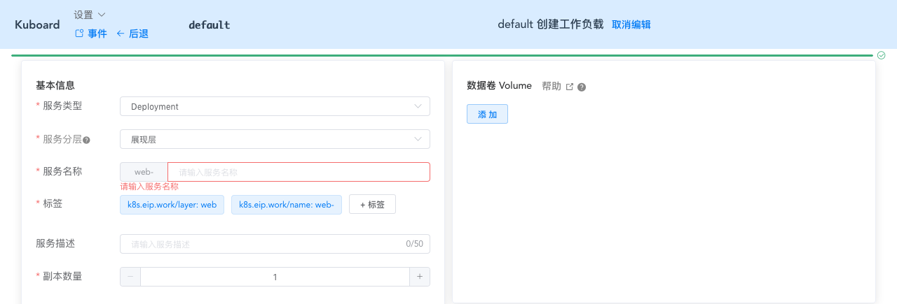
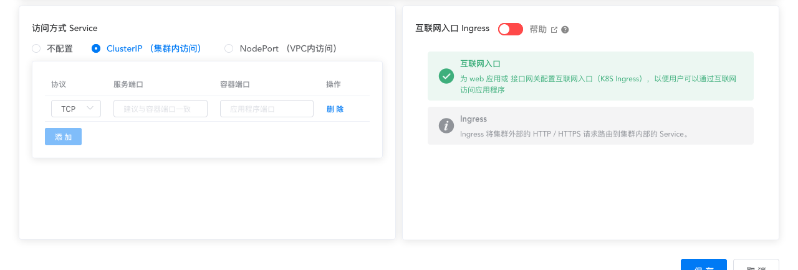

# Service概述

<AdSenseTitle/>

参考文档：Kubernetes 文档：[Service](https://kubernetes.io/docs/concepts/services-networking/service/)

## 为何需要 Service

Kubernetes 中 Pod 是随时可以消亡的（节点故障、容器内应用程序错误等原因）。如果使用 [Deployment](learning/k8s-intermediate/workload/wl-deployment/) 运行您的应用程序，Deployment 将会在 Pod 消亡后再创建一个新的 Pod 以维持所需要的副本数。每一个 Pod 有自己的 IP 地址，然而，对于 Deployment 而言，对应 Pod 集合是动态变化的。

这个现象导致了如下问题：
* 如果某些 Pod（假设是 'backends'）为另外一些 Pod（假设是 'frontends'）提供接口，在 'backends' 中的 Pod 集合不断变化（IP 地址也跟着变化）的情况下，'frontends' 中的 Pod 如何才能知道应该将请求发送到哪个 IP 地址？

Service 存在的意义，就是为了解决这个问题。

## Kubernetes Service

Kubernetes 中 Service 是一个 API 对象，通过 kubectl + YAML 或者 Kuboard，定义一个 Service，可以将符合 Service 指定条件的 Pod 作为可通过网络访问的服务提供给服务调用者。

Service 是 Kubernetes 中的一种服务发现机制：
* Pod 有自己的 IP 地址
* Service 被赋予一个唯一的 dns name
* Service 通过 label selector 选定一组 Pod
* Service 实现负载均衡，可将请求均衡分发到选定这一组 Pod 中

例如，假设有一个无状态的图像处理后端程序运行了 3 个 Pod 副本。这些副本是相互可替代的（前端程序调用其中任何一个都可以）。在后端程序的副本集中的 Pod 经常变化（销毁、重建、扩容、缩容等）的情况下，前端程序不应该关注这些变化。

Kubernetes 通过引入 Service 的概念，将前端与后端解耦。

## 在 Kuboard 中使用 Service

从 Kuboard 工作负载编辑器的视角来看，Service 与其他重要的 Kubernetes 对象之间的关系如下图所示：

  

图中，Service 先连线到 Controller，Controller 在连线到容器组，这种表示方式只是概念上的，期望用户在使用 Kubernetes 的时候总是通过 Controller 创建 Pod，然后再通过 Service 暴露为网络服务，通过 Ingress 对集群外提供互联网访问。

事实上，Service 与 Controller 并没有直接联系，Service 通过 label selector 选择符合条件的 Pod，并将选中的 Pod 作为网络服务的提供者。从这个意义上来讲，您可以有很多种方式去定义 Service 的 label selector，然而，最佳的实践是，在 Service 中使用与 Controller 中相同的 label selector。如上图所示。

::: tip
使用 Kubernetes 的最佳实践：
* Service 与 Controller 同名
* Service 与 Controller 使用相同的 label selector

在 Kuboard 中创建工作负载时，工作负载的名字（服务名称字段）将作为 Deployment（StatefulSet/DaemonSet）的名字，也将作为 Service、Ingress 的名字
:::

在 Kuboard 工作负载编辑器中，Service 如下图所示：

...

