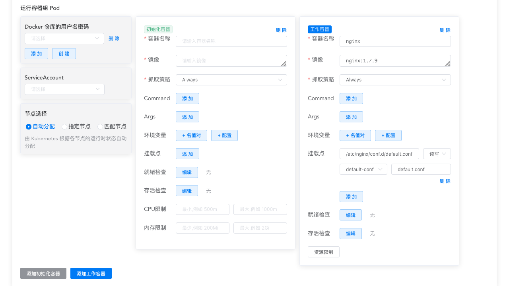

# 容器组_初始化容器

参考文档： Kubernetes  [Init Containers](https://kubernetes.io/docs/concepts/workloads/pods/init-containers/)

<AdSenseTitle/>

## 初始化容器介绍

Pod 可以包含多个工作容器，也可以包含一个或多个初始化容器，初始化容器在工作容器启动之前执行。

初始化容器与工作容器完全相同，除了如下几点：

* 初始化容器总是运行并自动结束
* kubelet 按顺序执行 Pod 中的初始化容器，前一个初始化容器成功结束后，下一个初始化容器才开始运行。所有的初始化容器成功执行后，才开始启动工作容器
* 如果 Pod 的任意一个初始化容器执行失败，kubernetes 将反复重启该 Pod，直到初始化容器全部成功（除非 Pod 的 restartPolicy 被设定为 Never）
* 初始化容器的 Resource request / limits 处理不同，请参考 [Resources](#Resources)
* 初始化容器不支持 [就绪检查 readiness probe](/learning/k8s-intermediate/workload/pod-lifecycle.html#container-probes)，因为初始化容器必须在 Pod ready 之前运行并结束

## 使用初始化容器

初始化容器可以指定不同于工作容器的镜像，这使得初始化容器相较于直接在工作容器中编写启动相关的代码更有优势：

* 初始化容器可以包含工作容器中没有的工具代码或者自定义代码。例如：您无需仅仅为了少量的 setup 工作（使用 sed, awk, python 或 dig 进行环境设定）而重新从一个基础镜像制作另外一个镜像
* 初始化容器可以更安全地执行某些使工作容器变得不安全的代码
* 应用程序的镜像构建者和部署者可以各自独立地工作，而无需一起构建一个镜像
* 初始化容器相较于工作容器，可以以另外一个视角处理文件系统。例如，他们可以拥有访问 Secrets 的权限，而工作容器却不一定被授予该权限
* 初始化容器在任何工作容器启动之前结束运行，这个特性使得我们可以阻止或者延迟工作容器的启动，直到某些前提条件得到满足。一旦前提条件满足，所有的工作容器将同时并行启动

### Examples

下面是一些使用初始化容器的例子：

* 使用一行 shell 命令，等待某一个 Service 启动后再启动工作容器

  ``` sh
  for i in {1..100}; do sleep 1; if dig myservice; then exit 0; fi; done; exit 1
  ```

* 使用 Pod 的信息将其注册到某一个远程服务：

  ``` sh
  curl -X POST http://$MANAGEMENT_SERVICE_HOST:$MANAGEMENT_SERVICE_PORT/register -d 'instance=$(<POD_NAME>)&ip=$(<POD_IP>)'
  ```

* 等候一定时间再启动工作容器

  ```sh
  sleep 60
  ```

* 将 Git repository 克隆到一个数据卷
* 根据某些参数，运行一个模板工具动态生成工作容器所需要的配置文件

### 在 Kuboard 中使用初始化容器

Kuboard 工作负载编辑器中支持定义初始化容器，如下图所示，左下角可 ***添加初始化容器*** 初始化容器按照添加的顺序显示在容器组中，且始终显示在工作容器的前面。




## 初始化容器的行为

* Pod 的启动时，首先初始化网络和数据卷，然后按顺序执行每一个初始化容器。任何一个初始化容器都必须成功退出，才能开始下一个初始化容器。如果某一个容器启动失败或者执行失败，kubelet 将根据 Pod 的 restartPolicy 决定是否重新启动 Pod。
* 只有所有的初始化容器全都执行成功，Pod 才能进入 ready 状态。初始化容器的端口是不能够通过 kubernetes Service 访问的。Pod 在初始化过程中处于 Pending 状态，并且同时有一个 type 为 `initializing` status 为 `True` 的 [Condition](./pod-lifecycle.html#pod-conditions)
* 如果 Pod 重启，所有的初始化容器也将被重新执行。
* 您可以重启、重试、重新执行初始化容器，因此初始化容器中的代码必须是 **幂等** 的。具体来说，向 emptyDir 写入文件内容的代码应该考虑到该文件已经存在的情况。请参考 [幂等](/glossary/idempotent.html) 获得更多信息
* 您可以组合使用就绪检查和 activeDeadlineSeconds <Badge text="Kuboard 暂不支持" type="warn"/>，以防止初始化容器始终失败。
* Pod 中不能包含两个同名的容器（初始化容器和工作容器也不能同名）。


### Resources

在确定初始化容器的执行顺序以后，以下 resource 使用规则将适用：

* 所有初始化容器中最高的 resource request/limit 是最终生效的 request/limit
* 对于 Pod 来说，最终生效的 resource request/limit 是如下几个当中较高的一个：
  * 所有工作容器某一个 resource request/limit 的和
  * 最终生效的初始化容器的 request/limit 的和
* Kubelet 依据最终生效的 request/limit 执行调度，这意味着，在执行初始化容器时，就已经为 Pod 申请了其资源需求

<!-- The QoS (quality of service) tier of the Pod’s effective QoS tier is the QoS tier for init containers and app containers alike.
Quota and limits are applied based on the effective Pod request and limit.

Pod level control groups (cgroups) are based on the effective Pod request and limit, the same as the scheduler.

Pod restart reasons
A Pod can restart, causing re-execution of init containers, for the following reasons:

A user updates the Pod specification, causing the init container image to change. Any changes to the init container image restarts the Pod. App container image changes only restart the app container.
The Pod infrastructure container is restarted. This is uncommon and would have to be done by someone with root access to nodes.
All containers in a Pod are terminated while restartPolicy is set to Always, forcing a restart, and the init container completion record has been lost due to garbage collection. -->

### Pod 重启的原因

Pod 重启时，所有的初始化容器都会重新执行，Pod 重启的原因可能有：

* 用户更新了 Pod 的定义，并改变了初始化容器的镜像
  * 改变任何一个初始化容器的镜像，将导致整个 Pod 重启
  * 改变工作容器的镜像，将只重启该工作容器，而不重启 Pod
* Pod 容器基础设施被重启（例如 docker engine），这种情况不常见，通常只有 node 节点的 root 用户才可以执行此操作
* Pod 中所有容器都已经结束，restartPolicy 是 Always，且初始化容器执行的记录已经被垃圾回收，此时将重启整个 Pod
