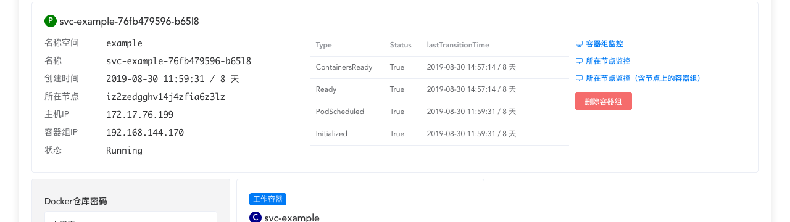
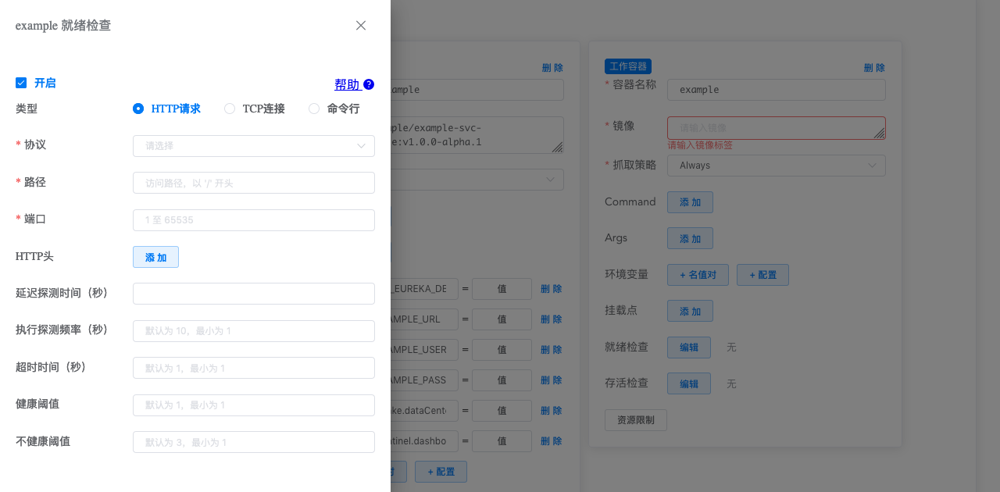
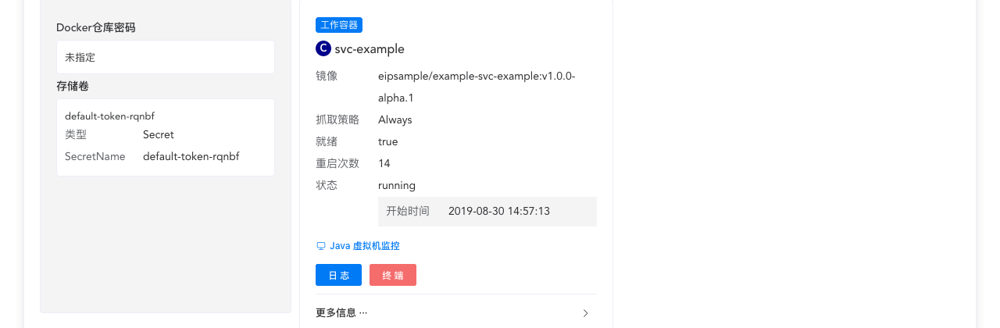

# 容器组_生命周期

参考文档： Kubernetes 文档 [Pod Lifecycle](https://kubernetes.io/docs/concepts/workloads/pods/pod-lifecycle/)

<AdSenseTitle/>

[[TOC]]

## Pod phase

Pod phase 代表其所处生命周期的阶段。Pod phase 并不是用来代表其容器的状态，也不是一个严格的状态机。

phase 的可能取值有：

| Phase  | 描述                                                         |
| ------------ | ------------------------------------------------------------ |
| Pending      | Kubernetes 已经创建并确认该 Pod。此时可能有两种情况：<li>Pod 还未完成调度（例如没有合适的节点）</li><li>正在从 docker registry 下载镜像</li> |
| Running      | 该 Pod 已经被绑定到一个节点，并且该 Pod 所有的容器都已经成功创建。其中至少有一个容器正在运行，或者正在启动/重启 |
| Succeeded    | Pod 中的所有容器都已经成功终止，并且不会再被重启             |
| Failed       | Pod 中的所有容器都已经终止，至少一个容器终止于失败状态：容器的进程退出码不是 0，或者被系统 kill |
| Unknown      | 因为某些未知原因，不能确定 Pod 的状态，通常的原因是 master 与 Pod 所在节点之间的通信故障 |

## Pod conditions

每一个 Pod 都有一个数组描述其是否达到某些指定的条件。Pod condition 数组在 Kuboard 中的显示如下图所示：

该数组的每一行可能有六个字段：

| 字段名                                                     | 描述                                                         |
| ---------------------------------------------------------- | ------------------------------------------------------------ |
| type                                                       | type 是最重要的字段，可能的取值有：<li>**PodScheduled：**  Pod 已被调度到一个节点</li><li>**Ready：**         Pod 已经可以接受服务请求，应该被添加到所匹配 Service 的负载均衡的资源池</li><li>**Initialized：**Pod 中所有初始化容器已成功执行</li><li>**Unschedulable：**不能调度该 Pod（缺少资源或者其他限制）</li><li>**ContainersReady：**Pod 中所有容器都已就绪</li> |
| status                                                     | 能的取值有：<li>True</li><li>False</li><li>Unknown</li>      |
| reason <Badge text="Kuboard 暂不显示" type="warn"/>        | Condition 发生变化的原因，使用一个符合驼峰规则的英文单词描述 |
| message <Badge text="Kuboard 暂不显示" type="warn"/>       | Condition 发生变化的原因的详细描述，human-readable           |
| lastTransitionTime                                         | Condition 发生变化的时间戳                                   |
| lastProbeTime <Badge text="Kuboard 暂不显示" type="warn"/> | 上一次针对 Pod 做健康检查/就绪检查的时间戳                   |

## 容器的检查

Probe 是指 kubelet 周期性地检查容器的状况。有三种类型的 Probe：

* **ExecAction：** 在容器内执行一个指定的命令。如果该命令的退出状态码为 0，则成功
* **TCPSocketAction：** 探测容器的指定 TCP 端口，如果该端口处于 open 状态，则成功
* **HTTPGetAction：** 探测容器指定端口/路径上的 HTTP Get 请求，如果 HTTP 响应状态码在 200 到 400（不包含400）之间，则成功

Probe 有三种可能的结果：

* **Success：** 容器通过检测
* **Failure：** 容器未通过检测
* **Unknown：** 检测执行失败，此时 kubelet 不做任何处理

Kubelet 可以在两种情况下对运行中的容器执行 Probe：

* **就绪检查 readinessProbe：** 确定容器是否已经就绪并接收服务请求。如果就绪检查失败，kubernetes 将该 Pod 的 IP 地址从所有匹配的 Service 的资源池中移除掉。
* **健康检查 livenessProbe：** 确定容器是否正在运行。如果健康检查失败，kubelete 将结束该容器，并根据 restart policy（重启策略）确定是否重启该容器。

### 何时使用 健康检查/就绪检查？

* 如果容器中的进程在碰到问题时可以自己 crash，您并不需要执行健康检查；kubelet 可以自动的根据 Pod 的 restart policy（重启策略）执行对应的动作

* 如果您希望在容器的进程无响应后，将容器 kill 掉并重启，则指定一个健康检查 liveness probe，并同时指定 restart policy（重启策略）为 Always 或者 OnFailure

* 如果您想在探测 Pod 确实就绪之后才向其分发服务请求，请指定一个就绪检查 readiness probe。此时，就绪检查的内容可能和健康检查相同。就绪检查适合如下几类容器：
  * 初始化时需要加载大量的数据、配置文件
  * 启动时需要执行迁移任务
  * 其他

::: tip
如果您想在删除 Pod 前停止向其分发服务请求，您无需为此而指定就绪检查。在删除 Pod 时，kubelete 自动将 Pod 置于 unready 状态，并等待其中的容器停止。
:::

### Kuboard 中配置健康检查/就绪检查

Kuboard 可以在工作负载编辑器中配置健康检查/就绪检查，界面如下所示：

<!-- 
$$ Pod and Container status
-->

## 容器的状态

一旦 Pod 被调度到节点上，kubelet 便开始使用容器引擎（通常是 docker）创建容器。容器有三种可能的状态：Waiting / Running / Terminated：

* **Waiting：** 容器的初始状态。处于 Waiting 状态的容器，仍然有对应的操作在执行，例如：拉取镜像、应用 Secrets等。
* **Running：** 容器处于正常运行的状态。容器进入 Running 状态之后，如果指定了 postStart hook，该钩子将被执行。
* **Terminated：** 容器处于结束运行的状态。容器进入 Terminated 状态之前，如果指定了 preStop hook，该钩子将被执行。

在 Kuboard 的工作负载查看界面中可查看到容器的状态如下图所示：

<!-- $$ Pod readiness gate
Kuboard 暂不支持 -->

## 重启策略

定义 Pod 或工作负载时，可以指定 restartPolicy，可选的值有：

* Always （默认值）
* OnFailure
* Never

restartPolicy 将作用于 Pod 中的所有容器。kubelete 将在五分钟内，按照递延的时间间隔（10s, 20s, 40s ......）尝试重启已退出的容器，并在十分钟后再次启动这个循环，直到容器成功启动，或者 Pod 被删除。

::: tip
控制器 Deployment/StatefulSet/DaemonSet 中，只支持 Always 这一个选项，不支持 OnFailure 和 Never 选项。
:::

## 容器组的存活期

通常，如果没有人或者控制器删除 Pod，Pod 不会自己消失。只有一种例外，那就是 Pod 处于 Scucceeded 或 Failed 的 phase，并超过了垃圾回收的时长（在 kubernetes master 中通过 terminated-pod-gc-threshold 参数指定），kubelet 自动将其删除。

<!-- 
Three types of controllers are available:

Use a Job for Pods that are expected to terminate, for example, batch computations. Jobs are appropriate only for Pods with restartPolicy equal to OnFailure or Never.

Use a ReplicationController, ReplicaSet, or Deployment for Pods that are not expected to terminate, for example, web servers. ReplicationControllers are appropriate only for Pods with a restartPolicy of Always.

Use a DaemonSet for Pods that need to run one per machine, because they provide a machine-specific system service.

All three types of controllers contain a PodTemplate. It is recommended to create the appropriate controller and let it create Pods, rather than directly create Pods yourself. That is because Pods alone are not resilient to machine failures, but controllers are.

If a node dies or is disconnected from the rest of the cluster, Kubernetes applies a policy for setting the phase of all Pods on the lost node to Failed.

$$ Examples

$$ What's next -->
