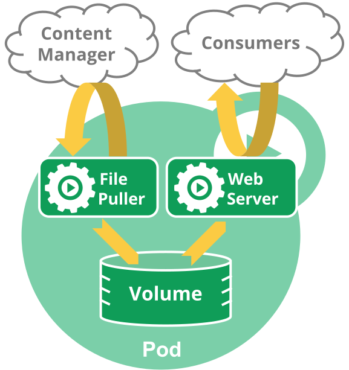

# 容器组_概述

参考文档：Kubernetes 官方文档 [Pod Overview](https://kubernetes.io/docs/concepts/workloads/pods/pod-overview/) [Pods](https://kubernetes.io/docs/concepts/workloads/pods/pod/)

术语中英文对照：

| 英文全称  | 英文缩写  | 中文翻译 |
| --------- | --------- | -------- |
| Pod       | Pod       | 容器组   |
| Container | Container | 容器     |
| Controller | Controller | 控制器    |

## 什么是 Pod 容器组

Pod（容器组）是 Kubernetes 中最小的可部署单元。一个 Pod（容器组）包含了一个应用程序容器（某些情况下是多个容器）、存储资源、一个唯一的网络 IP 地址、以及一些确定容器该如何运行的选项。Pod 容器组代表了 Kubernetes 中一个独立的应用程序运行实例，该实例可能由单个容器或者几个紧耦合在一起的容器组成。

Docker 是 Kubernetes Pod 中使用最广泛的容器引擎；Kubernetes Pod 同时也支持其他类型的容器引擎。

Kubernetes 集群中的 Pod 存在如下两种使用途径：
* 一个 Pod 中只运行一个容器。"one-container-per-pod" 是 Kubernetes 中最常见的使用方式。此时，您可以认为 Pod 容器组是该容器的 wrapper，Kubernetes 通过 Pod 管理容器，而不是直接管理容器。
* 一个 Pod 中运行多个需要互相协作的容器。您可以将多个紧密耦合、共享资源且始终在一起运行的容器编排在同一个 Pod 中，可能的情况有：
  * Content management systems, file and data loaders, local cache managers 等
  * log and checkpoint backup, compression, rotation, snapshotting 等
  * data change watchers, log tailers, logging and monitoring adapters, event publishers 等
  * proxies, bridges, adapters 等
  * controllers, managers, configurators, and updaters
  
::: tip 推荐阅读
  * [The Distributed System Toolkit: Patterns for Composite Containers](https://kubernetes.io/blog/2015/06/the-distributed-system-toolkit-patterns)
  * [Container Design Patterns](https://kubernetes.io/blog/2016/06/container-design-patterns/)
:::

每一个 Pod 容器组都是用来运行某一特定应用程序的一个实例。如果您想要水平扩展您的应用程序（运行多个实例），您运行多个 Pod 容器组，每一个代表应用程序的一个实例。Kubernetes 中，称其为 replication（复制副本）。Kubernetes 中 Controller（控制器）负责为应用程序创建和管理这些复制的副本。

## Pod 如何管理多个容器

Pod 的设计目的是用来支持多个互相协同的容器，是的他们形成一个有意义的服务单元。一个 Pod 中的多个容器很自然就可以随 Pod 被一起调度到集群中的同一个物理机或虚拟机上。Pod 中的容器可以：
* 共享资源、依赖
* 互相通信
* 相互协商何时以何种方式结束运行

::: tip 提示
将多个容器运行于同一个容器组中是一种相对高级复杂的使用方法。只有在您的容器相互之间紧密耦合是，您才应该使用这种方式。例如：您可能有一个容器是 web server，用来将共享数据卷中的文件作为网站发布出去，同时您有另一个 "sidecar" 容器从远程抓取并更新这些文件。如下图所示：

</img>

:::

某些 Pod 除了使用 app container （工作容器）以外，还会使用 init container （初始化容器），初始化容器运行并结束后，工作容器才开始启动。

Pod 为其成员容器提供了两种类型的共享资源：网络和存储
* 网络 Networking
  
  每一个 Pod 被分配一个独立的 IP 地址。Pod 中的所有容器共享一个网络名称空间：
  * 同一个 Pod 中的所有容器 IP 地址都相同
  * 同一个 Pod 中的不同容器不能使用相同的端口，否则会导致端口冲突
  * 同一个 Pod 中的不同容器可以通过 localhost:port 进行通信
  * 同一个 Pod 中的不同容器可以通过使用常规的进程间通信手段，例如 SystemV semaphores 或者 POSIX 共享内存

  ::: tip
  不同 Pod 上的两个容器如果要通信，必须使用对方 Pod 的 IP 地址 + 对方容器的端口号 进行网络通信
  :::

* 存储 Storage

  Pod 中可以定义一组共享的数据卷。Pod 中所有的容器都可以访问这些共享数据卷，以便共享数据。Pod 中数据卷的数据也可以存储持久化的数据，使得容器在重启后仍然可以访问到之前存入到数据卷中的数据。请参考 [数据卷 Volume](../persistent/volume.html)

## 使用 Pod 容器组

您应该尽量避免在 Kubernetes 中直接创建单个 Pod。因为在 Kubernetes 的设计中 Pod 是一个相对来说存活周期短暂，且随时会丢弃的实体。在 Pod 被创建后（您直接创建，或者间接通过 Controller 创建），将被调度到集群中的一个节点上运行。Pod 将一直保留在该节点上，直到 Pod 以下情况发生：
  * Pod 中的容器全部结束运行
  * Pod 被删除
  * 由于节点资源不够，Pod 被驱逐
  * 节点出现故障（例如死机）

::: tip
请不要混淆以下两个概念：
  * 重启 Pod 中的容器
  * 重启 Pod

Pod 本身并不会运行，Pod 仅仅是容器运行的一个环境
:::

Pod 本身并不能自愈（self-healing）。如果一个 Pod 所在的 Node （节点）出现故障，或者调度程序自身出现故障，Pod 将被删除；同理，当因为节点资源不够或节点维护而驱逐 Pod 时，Pod 也将被删除。Kubernetes 通过引入 Controller（控制器）的概念来管理 Pod 实例。在 Kubernetes 中，更为推荐的做法是使用 Controller 来管理 Pod，而不是直接创建 Pod。

## 容器组和控制器

用户应该始终使用控制器来创建 Pod，而不是直接创建 Pod，控制器可以提供如下特性：
* 水平扩展（运行 Pod 的多个副本）
* rollout（版本更新）
* self-healing（故障恢复）
  
  例如：当一个节点出现故障，控制器可以自动地在另一个节点调度一个配置完全一样的 Pod，以替换故障节点上的 Pod。

在 Kubernetes 中，广泛使用的控制器有：

* Deployment
* StatefulSet
* DaemonSet

控制器通过其中配置的 Pod Template 信息来创建 Pod。

### Pod Template

Pod Template 是关于 Pod 的定义，但是被包含在其他的 Kubernetes 对象中（例如 Deployment、StatefulSet、DaemonSet 等控制器）。控制器通过 Pod Template 信息来创建 Pod。正是由于 Pod Template 的存在，Kuboard 可以使用一个工作负载编辑器来处理不同类型的控制器。

::: tip
Pod 由控制器依据 Pod Template 创建以后，此时再修改 Pod Template 的内容，已经创建的 Pod 不会被修改。
:::

## Termination of Pods

Pod 代表了运行在集群节点上的进程，而进程的终止有两种方式：
* gracefully terminate （优雅地终止）
* 直接 kill，此时进程没有机会执行清理动作

**当用户发起删除 Pod 的指令时，Kubernetes 需要：**
* 让用户知道 Pod 何时被删除
* 确保删除 Pod 的指令最终能够完成

**Kubernetes 收到用户删除 Pod 的指令后：**
  1. 记录强制终止前的等待时长（grace period）
  2. 向 Pod 中所有容器的主进程发送 TERM 信号
  3. 一旦等待超时，向超时的容器主进程发送 KILL 信号
  4. 删除 Pod 在 API Server 中的记录

**举个例子：**
1. 用户通过 Kuboard 或者 kubectl 发起删除 Pod 的指令，默认 grace period （等待时长）为30秒
2. Pod 的最大存活时间被更新，超过此存活时间，将被认为是“dead”
3. Pod 的状态变更为 “Terminating”
4. （与步骤 3 同时）Kubelet 识别出 Pod 的状态是 “Terminating”并立刻开始关闭 Pod 的过程

   1. 如果 Pod 中的某个容器定义了 preStop hook，该钩子程序将被在容器内执行，如果 preStop hook 的执行超过了 grace period （等待时长），步骤二将被执行（并拥有额外的 2 秒等待时长）
   2. 向容器的主进程发送 TERM 信号
      ::: tip
      容器组的每一个容器并不是同一时间接受到 TERM 信号，如果容器的关闭顺序很重要，您可能需要为每一个容器都定义一个 preStop hook
      :::

5. （与步骤 3 同时）将 Pod 从 Service 的 endpoint 列表中移除（Service 不再将请求路由到该 Pod）。
6. 一旦超过 grace period（等待时长），向 Pod 中的任何仍在运行的进程发送 KILL 信号
7. Kubelet 将 Pod 从 API Server 中删除，Kuboard / kubectl 上不再显示该 Pod

默认情况下，删除 Pod 的 grace period（等待时长）是 30 秒。用户可以通过 kubectl delete 命令的选项 `--grace-period=<seconds>` 自己指定 grace period（等待时长）。如果您要强制删除 Pod，您必须为 kubectl delete 命令同时指定两个选项 `--grace-period=0` 和 `--force`
