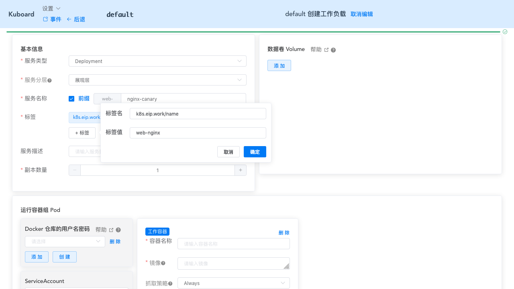

# 金丝雀发布（灰度发布）

<AdSenseTitle/>

[返回 Deployment](./#deployment-概述)

如果您想使用 Deployment 将最新的应用程序版本发布给一部分用户（或服务器），您可以为每个版本创建一个 Deployment，此时，应用程序的新旧两个版本都可以同时获得生产上的流量。

<b-card>
<b-tabs content-class="mt-3">
<b-tab title="使用 kubectl 执行金丝雀发布" active>

* 部署第一个版本

  第一个版本的 Deployment 包含了 3 个Pod副本，Service 通过 label selector `app: nginx` 选择对应的 Pod，nginx 的标签为 `1.7.9`
  ``` yaml
  apiVersion: apps/v1
  kind: Deployment
  metadata:
    name: nginx-deployment
    labels:
      app: nginx
  spec:
    replicas: 3
    selector:
      matchLabels:
        app: nginx
    template:
      metadata:
        labels:
          app: nginx
      spec:
        containers:
        - name: nginx
          image: nginx:1.7.9
  ---
  apiVersion: v1
  kind: Service
  metadata:
    name: nginx-service
    labels:
      app: nginx
  spec:
    selector:
      app: nginx
    ports:
    - name: nginx-port
      protocol: TCP
      port: 80
      nodePort: 32600
      targetPort: 80
    type: NodePort
  ```

* 假设此时想要发布新的版本 nginx `1.8.0`，可以创建第二个 Deployment：

  ``` yaml
  apiVersion: apps/v1
  kind: Deployment
  metadata:
    name: nginx-deployment-canary
    labels:
      app: nginx
      track: canary
  spec:
    replicas: 1
    selector:
      matchLabels:
        app: nginx
        track: canary
    template:
      metadata:
        labels:
          app: nginx
          track: canary
      spec:
        containers:
        - name: nginx
          image: nginx:1.8.0
  ```

  ::: tip
  * 因为 Service 的LabelSelector 是 `app: nginx`，由 `nginx-deployment` 和 `nginx-deployment-canary` 创建的 Pod 都带有标签 `app: nginx`，所以，Service 的流量将会在两个 release 之间分配
  * 在新旧版本之间，流量分配的比例为两个版本副本数的比例，此处为 1:3
  :::

* 当您确定新的版本没有问题之后，可以将 `nginx-deployment` 的镜像标签修改为新版本的镜像标签，并在完成对 `nginx-deployment` 的滚动更新之后，删除 `nginx-deployment-canary` 这个 Deployment

</b-tab>
<b-tab title="使用 Kuboard 执行金丝雀发布">

在 Kuboard 执行金丝雀发布的过程，与使用 kubectl 的过程相同，此处特别说明的一点是，当使用 Kuboard 创建 `web-nginx-canary` Deployment时，如何解决其Pod 的标签被 `web-nginx` 的Service包含的问题：

* 当填写部署的名称 `web-nginx-canary` 之后，将默认创建两个标签，且不可修改：`k8s.eip.work/layer:web` 和 `k8s.eip.work/name:web-nginx-canary`
* 此时，手工创建标签 `k8s.eip.work/name:web-nginx`，可以覆盖原默认创建的标签
* 完成创建后，`web-nginx-canary` 的 Pod 也包含标签 `k8s.eip.work/layer:web` 和 `k8s.eip.work/name:web-nginx`，可以被 `web-nginx` 的Service选中
* 通过 Kuboard 创建 `web-nginx-canary` 部署时，无需配置 Service 和 Ingress



</b-tab>
</b-tabs>
</b-card>

::: danger 局限性
按照 Kubernetes 默认支持的这种方式进行金丝雀发布，有一定的局限性：
* 不能根据用户注册时间、地区等请求中的内容属性进行流量分配
* 同一个用户如果多次调用该 Service，有可能第一次请求到了旧版本的 Pod，第二次请求到了新版本的 Pod
:::

::: tip
在 Kubernetes 中不能解决上述局限性的原因是：Kubernetes Service 只在 TCP 层面解决负载均衡的问题，并不对请求响应的消息内容做任何解析和识别。如果想要更完善地实现金丝雀发布，可以考虑如下三种选择：
* 业务代码编码实现
* Spring Cloud 灰度发布
* Istio 灰度发布
:::
