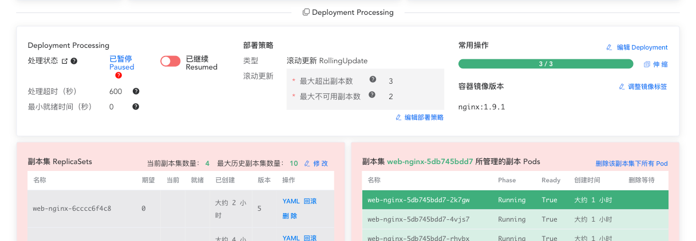
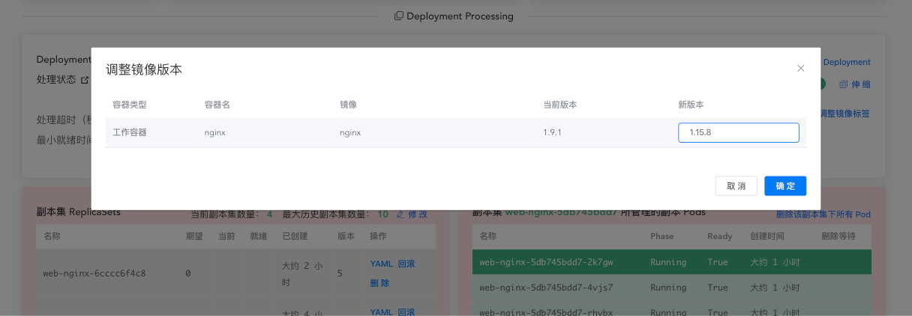
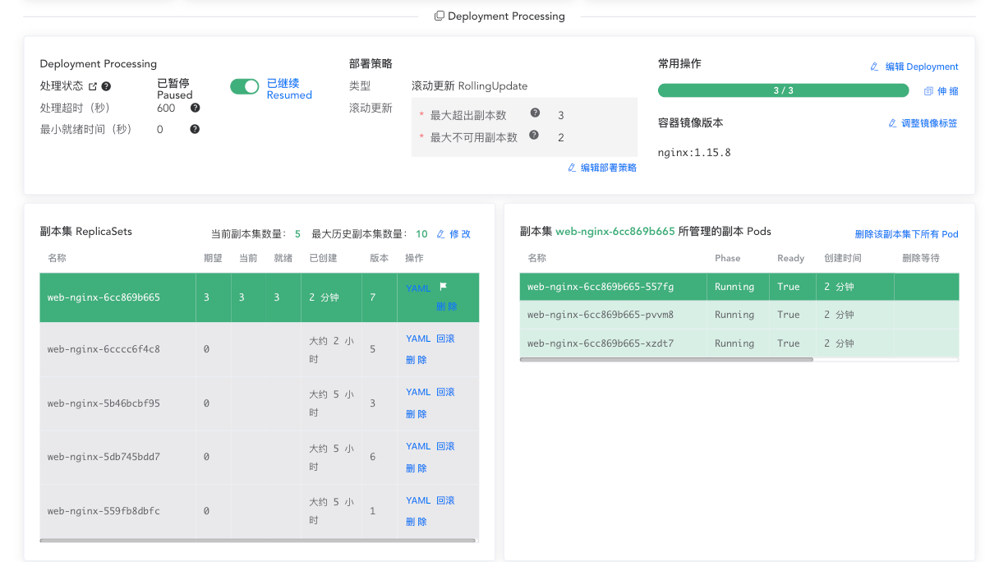

# 暂停和继续 Deployment

<AdSenseTitle/>

[返回 Deployment](./#deployment-概述)

您可以先暂停 Deployment，然后再触发一个或多个更新，最后再继续（resume）该 Deployment。这种做法使得您可以在暂停和继续中间对 Deployment 做多次更新，而无需触发不必要的滚动更新。

以我们在 [创建Deployment](./create.html) 中创建的 Deployment 为例。

> 本文提供了两种途径对 Deployment 执行暂停和继续操作：
> * 使用 kubectl 暂停和继续 Deployment
> * 使用 Kuboard 暂停和继续 Deployment

<b-card>
<b-tabs content-class="mt-3">
<b-tab title="使用 kubectl 暂停 Deployment">

* 执行命令 `kubectl get deployment`，查看 Deployment 信息，输出结果如下所示：

  ```
  NAME      DESIRED   CURRENT   UP-TO-DATE   AVAILABLE   AGE
  nginx     3         3         3            3           1m
  ```

  执行命令 `kubectl get rs`，查看 ReplicaSet 信息，输出结果如下所示：
  ```
  NAME               DESIRED   CURRENT   READY     AGE
  nginx-2142116321   3         3         3         1m
  ```

* 执行命令 `kubectl rollout pause deployment.v1.apps/nginx-deployment` 暂停 Deployment，输出结果如下所示：

  ```
  deployment.apps/nginx-deployment paused
  ```

* 执行命令 `kubectl set image deployment.v1.apps/nginx-deployment nginx=nginx:1.9.1`，更新 Deployment 的容器镜像，输出结果如下所示：
  ```
  deployment.apps/nginx-deployment image updated
  ```
* 执行命令 `kubectl rollout history deployment.v1.apps/nginx-deployment`，可查看到尚未生成新的 Deployment 版本（revision），输出结果如下所示：
  ```
  deployments "nginx"
  REVISION  CHANGE-CAUSE
  1   <none>
  ```
* 执行命令 `kubectl get rs` 可查看到没有新的滚动更新开始执行，输出结果如下所示：

  ```
  NAME               DESIRED   CURRENT   READY     AGE
  nginx-2142116321   3         3         3         2m
  ```

* 如果需要的话，您可以针对 Deployment 执行更多的修改，例如，执行命令 `kubectl set resources deployment.v1.apps/nginx-deployment -c=nginx --limits=cpu=200m,memory=512Mi` 更新其 resource 限制，输出结果如下所示：

  ```
  deployment.apps/nginx-deployment resource requirements updated
  ```

* 执行命令 `kubectl describe deployment nginx-deployment`，确保 Deployment 的信息已被正确修改。
  ::: tip
  暂停 Deployment 之前的信息当前仍然在起作用，而暂停 Deployment 之后，修改的 Deployment 信息尚未生效，因为该 Deployment 被暂停了。
  :::

* 最后，执行命令 `kubectl rollout resume deployment.v1.apps/nginx-deployment`，继续（resume）该 Deployment，可使前面所有的变更一次性生效，输出结果如下所示：
  ```
  deployment.apps/nginx-deployment resumed
  ```
* 执行命令 `kubectl get rs -w` 观察滚动更新的进展，输出结果如下所示：
  ```
  NAME               DESIRED   CURRENT   READY     AGE
  nginx-2142116321   2         2         2         2m
  nginx-3926361531   2         2         0         6s
  nginx-3926361531   2         2         1         18s
  nginx-2142116321   1         2         2         2m
  nginx-2142116321   1         2         2         2m
  nginx-3926361531   3         2         1         18s
  nginx-3926361531   3         2         1         18s
  nginx-2142116321   1         1         1         2m
  nginx-3926361531   3         3         1         18s
  nginx-3926361531   3         3         2         19s
  nginx-2142116321   0         1         1         2m
  nginx-2142116321   0         1         1         2m
  nginx-2142116321   0         0         0         2m
  nginx-3926361531   3         3         3         20s
  ```

* 执行命令 `kubectl get rs` 查看 ResultSet 的最终状态，输出结果如下所示：
  ```
  NAME               DESIRED   CURRENT   READY     AGE
  nginx-2142116321   0         0         0         2m
  nginx-3926361531   3         3         3         28s
  ```

  ::: tip
  您不能回滚（rollback）一个已暂停的 Deployment，除非您继续（resume）该 Deployment。
  :::

</b-tab>
<b-tab title="使用 Kuboard 暂停 Deployment" active>


* 在 Deployment 详情页中点击 ***处理状态*** 的开关，可以暂停 Deployment 处理，修改后如下图所示：

  

* 点击 ***调整镜像标签*** 按钮，设置新版本为 `1.15.8`，如下图所示：

  保存后，可以看到 Deployment 中已经将容器镜像版本修改为 `nginx:1.15.8`，然而，Deployment 控制器此时并未执行滚动更新的过程，因为 Deployment 的处理已经被暂停。

  

* 点击 ***处理状态*** 的开关，将其设定为 `已继续`，Deployment 将立刻开始执行滚动更新，最终结果如下图所示：

  


</b-tab>
</b-tabs>
</b-card>


[返回 Deployment](./#deployment-概述)
