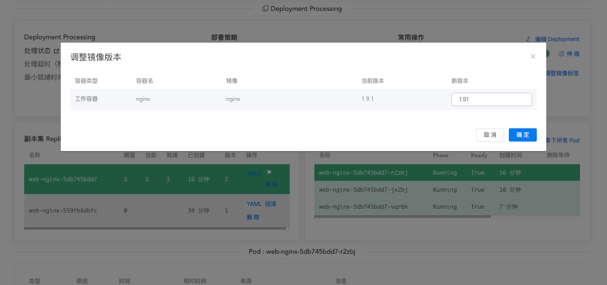
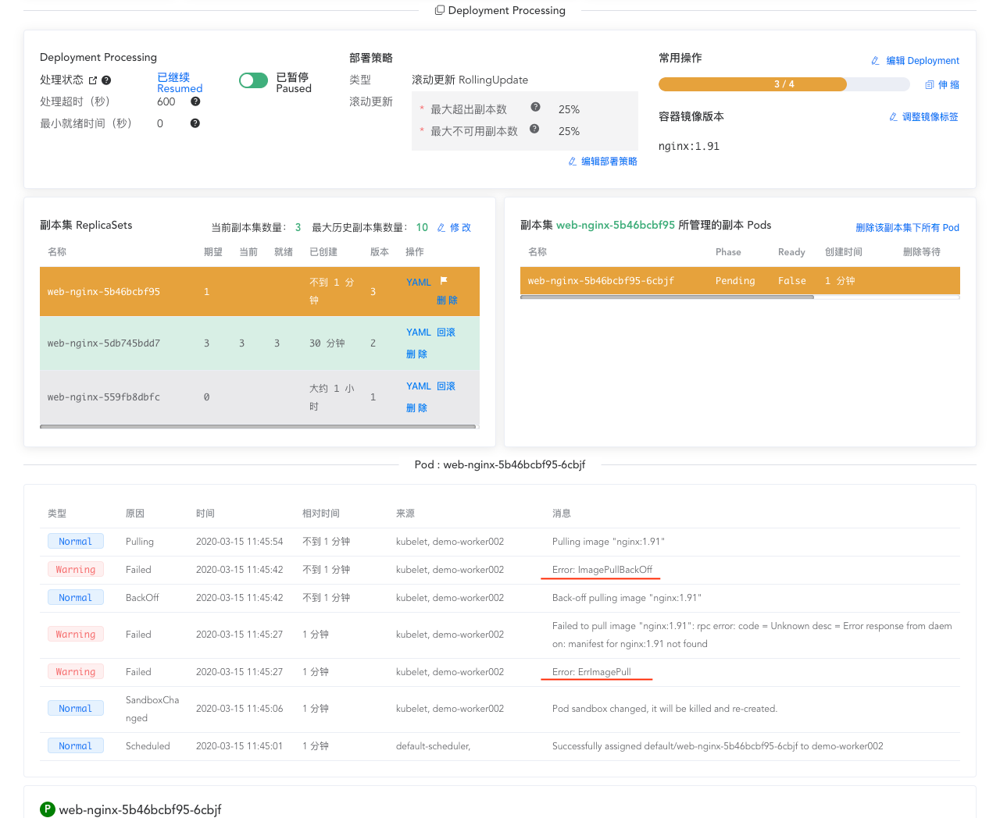

# 回滚 Deployment

<AdSenseTitle/>

[返回 Deployment](./#deployment-概述)

某些情况下，您可能想要回滚（rollback）Deployment，例如：Deployment 不稳定（可能是不断地崩溃）。默认情况下，kubernetes 将保存 Deployment 的所有更新（rollout）历史。您可以设定 revision history limit 来确定保存的历史版本数量。

::: tip
当且仅当 Deployment 的 `.spec.template` 字段被修改时（例如，您修改了容器的镜像），kubernetes 将为其创建一个 Deployment revision（版本）。Deployment 的其他更新（例如：修改 `.spec.replicas` 字段）将不会创建新的 Deployment reviesion（版本）。
:::

> 本文提供了两种途径对 Deployment 执行回滚操作：
> * 使用 kubectl 回滚 Deployment
> * 使用 Kuboard 回滚 Deployment

<b-card>
<b-tabs content-class="mt-3">
<b-tab title="使用 kubectl 回滚 Deployment">

<h2>模拟更新错误</h2>

* 假设您在更新 Deployment 的时候，犯了一个拼写错误，将 `nginx:1.9.1` 写成了 `nginx:1.91`

  ``` sh
  kubectl set image deployment.v1.apps/nginx-deployment nginx=nginx:1.91 --record=true
  ```
  输出结果如下所示：

  ```
  deployment.apps/nginx-deployment image updated
  ```

* 该更新将卡住，您可以执行命令 `kubectl rollout status deployment.v1.apps/nginx-deployment` 检查其状态，输出结果如下所示：

  ```
  Waiting for rollout to finish: 1 out of 3 new replicas have been updated...
  ```
* 执行命令 `kubectl get rs` 您将看到两个旧的 ReplicaSet（nginx-deployment-1564180365 and nginx-deployment-2035384211）和一个新的 ReplicaSet (nginx-deployment-3066724191) 。如下所示：

  ```
  NAME                          DESIRED   CURRENT   READY   AGE
  nginx-deployment-1564180365   3         3         3       25s
  nginx-deployment-2035384211   0         0         0       36s
  nginx-deployment-3066724191   1         1         0       6s
  ```
* 执行命令 `kubectl get pods`，您将看到 1 个由新 ReplicaSet 创建的 Pod 卡在抓取 image 的死循环里：
  
  ```
  NAME                                READY     STATUS             RESTARTS   AGE
  nginx-deployment-1564180365-70iae   1/1       Running            0          25s
  nginx-deployment-1564180365-jbqqo   1/1       Running            0          25s
  nginx-deployment-1564180365-hysrc   1/1       Running            0          25s
  nginx-deployment-3066724191-08mng   0/1       ImagePullBackOff   0          6s
  ```

  ::: tip
  Deployment Controller 将自动停止有问题的更新（rollout），不会继续 scale up 新的 ReplicaSet。maxUnavailable 参数指定了最多会有几个 Pod 副本卡住，该参数的默认值是 25%。
  :::

* 执行命令 `kubectl describe deployment` 查看 Deployment 的详情，输出结果如下所示：

  ```
  Name:           nginx-deployment
  Namespace:      default
  CreationTimestamp:  Tue, 15 Mar 2016 14:48:04 -0700
  Labels:         app=nginx
  Selector:       app=nginx
  Replicas:       3 desired | 1 updated | 4 total | 3 available | 1 unavailable
  StrategyType:       RollingUpdate
  MinReadySeconds:    0
  RollingUpdateStrategy:  25% max unavailable, 25% max surge
  Pod Template:
    Labels:  app=nginx
    Containers:
    nginx:
      Image:        nginx:1.91
      Port:         80/TCP
      Host Port:    0/TCP
      Environment:  <none>
      Mounts:       <none>
    Volumes:        <none>
  Conditions:
    Type           Status  Reason
    ----           ------  ------
    Available      True    MinimumReplicasAvailable
    Progressing    True    ReplicaSetUpdated
  OldReplicaSets:     nginx-deployment-1564180365 (3/3 replicas created)
  NewReplicaSet:      nginx-deployment-3066724191 (1/1 replicas created)
  Events:
    FirstSeen LastSeen    Count   From                    SubobjectPath   Type        Reason              Message
    --------- --------    -----   ----                    -------------   --------    ------              -------
    1m        1m          1       {deployment-controller }                Normal      ScalingReplicaSet   Scaled up replica set nginx-deployment-2035384211 to 3
    22s       22s         1       {deployment-controller }                Normal      ScalingReplicaSet   Scaled up replica set nginx-deployment-1564180365 to 1
    22s       22s         1       {deployment-controller }                Normal      ScalingReplicaSet   Scaled down replica set nginx-deployment-2035384211 to 2
    22s       22s         1       {deployment-controller }                Normal      ScalingReplicaSet   Scaled up replica set nginx-deployment-1564180365 to 2
    21s       21s         1       {deployment-controller }                Normal      ScalingReplicaSet   Scaled down replica set nginx-deployment-2035384211 to 1
    21s       21s         1       {deployment-controller }                Normal      ScalingReplicaSet   Scaled up replica set nginx-deployment-1564180365 to 3
    13s       13s         1       {deployment-controller }                Normal      ScalingReplicaSet   Scaled down replica set nginx-deployment-2035384211 to 0
    13s       13s         1       {deployment-controller }                Normal      ScalingReplicaSet   Scaled up replica set nginx-deployment-3066724191 to 1
  ```

  为了修复这个问题，您需要将其回滚到之前的一个稳定版本。

<h2>检查 Deployment 的更新历史</h2>

1. 执行命令 `kubectl rollout history deployment.v1.apps/nginx-deployment` 检查 Deployment 的历史版本，输出结果如下所示：
  
    ```
    deployments "nginx-deployment"
    REVISION    CHANGE-CAUSE
    1           kubectl apply --filename=https://k8s.io/examples/controllers/nginx-deployment.yaml --record=true
    2           kubectl set image deployment.v1.apps/nginx-deployment nginx=nginx:1.9.1 --record=true
    3           kubectl set image deployment.v1.apps/nginx-deployment nginx=nginx:1.91 --record=true
    ```
    **CHANGE-CAUSE** 是该 revision（版本）创建时从 Deployment 的 annotation `kubernetes.io/change-cause` 拷贝而来。

    您可以通过如下方式制定 **CHANGE-CAUSE** 信息：

    * 为 Deployment 增加注解，`kubectl annotate deployment.v1.apps/nginx-deployment kubernetes.io/change-cause="image updated to 1.9.1"`
    * 执行 kubectl apply 命令时，增加 `--record` 选项
    * 手动编辑 Deployment 的 `.metadata.annotation` 信息

2. 执行命令 `kubectl rollout history deployment.v1.apps/nginx-deployment --revision=2`，查看 revision（版本）的详细信息，输出结果如下所示：
    ```
    deployments "nginx-deployment" revision 2
      Labels:       app=nginx
              pod-template-hash=1159050644
      Annotations:  kubernetes.io/change-cause=kubectl set image deployment.v1.apps/nginx-deployment nginx=nginx:1.9.1 --record=true
      Containers:
      nginx:
        Image:      nginx:1.9.1
        Port:       80/TCP
        QoS Tier:
            cpu:      BestEffort
            memory:   BestEffort
        Environment Variables:      <none>
      No volumes.
    ```

<h2>回滚到前一个 revision（版本）</h2>

下面的步骤可将 Deployment 从当前版本回滚到前一个版本（version 2）

1. 执行命令 `kubectl rollout undo deployment.v1.apps/nginx-deployment` 将当前版本回滚到前一个版本，输出结果如下所示：
  
    ```
    deployment.apps/nginx-deployment
    ```

    或者，您也可以使用 `--to-revision` 选项回滚到前面的某一个指定版本，执行如下命令：

    ```sh
    kubectl rollout undo deployment.v1.apps/nginx-deployment --to-revision=2
    ```
    输出结果如下：
    ```
    deployment.apps/nginx-deployment
    ```
    更详细的信息，请参考 [kubectl rollout](https://kubernetes.io/docs/reference/generated/kubectl/kubectl-commands#rollout)

    此时，Deployment 已经被回滚到前一个稳定版本。您可以看到 Deployment Controller 为该 Deployment 产生了 DeploymentRollback event。

2. 执行命令 `kubectl get deployment nginx-deployment`，检查该回滚是否成功，Deployment 是否按预期的运行，输出结果如下：

    ```
    NAME               DESIRED   CURRENT   UP-TO-DATE   AVAILABLE   AGE
    nginx-deployment   3         3         3            3           30m
    ```
3. 执行命令 `kubectl describe deployment nginx-deployment` 查看 Deployment 的详情，输出结果如下：
    ```
    Name:                   nginx-deployment
    Namespace:              default
    CreationTimestamp:      Sun, 02 Sep 2018 18:17:55 -0500
    Labels:                 app=nginx
    Annotations:            deployment.kubernetes.io/revision=4
                            kubernetes.io/change-cause=kubectl set image deployment.v1.apps/nginx-deployment nginx=nginx:1.9.1 --record=true
    Selector:               app=nginx
    Replicas:               3 desired | 3 updated | 3 total | 3 available | 0 unavailable
    StrategyType:           RollingUpdate
    MinReadySeconds:        0
    RollingUpdateStrategy:  25% max unavailable, 25% max surge
    Pod Template:
      Labels:  app=nginx
      Containers:
      nginx:
        Image:        nginx:1.9.1
        Port:         80/TCP
        Host Port:    0/TCP
        Environment:  <none>
        Mounts:       <none>
      Volumes:        <none>
    Conditions:
      Type           Status  Reason
      ----           ------  ------
      Available      True    MinimumReplicasAvailable
      Progressing    True    NewReplicaSetAvailable
    OldReplicaSets:  <none>
    NewReplicaSet:   nginx-deployment-c4747d96c (3/3 replicas created)
    Events:
      Type    Reason              Age   From                   Message
      ----    ------              ----  ----                   -------
      Normal  ScalingReplicaSet   12m   deployment-controller  Scaled up replica set nginx-deployment-75675f5897 to 3
      Normal  ScalingReplicaSet   11m   deployment-controller  Scaled up replica set nginx-deployment-c4747d96c to 1
      Normal  ScalingReplicaSet   11m   deployment-controller  Scaled down replica set nginx-deployment-75675f5897 to 2
      Normal  ScalingReplicaSet   11m   deployment-controller  Scaled up replica set nginx-deployment-c4747d96c to 2
      Normal  ScalingReplicaSet   11m   deployment-controller  Scaled down replica set nginx-deployment-75675f5897 to 1
      Normal  ScalingReplicaSet   11m   deployment-controller  Scaled up replica set nginx-deployment-c4747d96c to 3
      Normal  ScalingReplicaSet   11m   deployment-controller  Scaled down replica set nginx-deployment-75675f5897 to 0
      Normal  ScalingReplicaSet   11m   deployment-controller  Scaled up replica set nginx-deployment-595696685f to 1
      Normal  DeploymentRollback  15s   deployment-controller  Rolled back deployment "nginx-deployment" to revision 2
      Normal  ScalingReplicaSet   15s   deployment-controller  Scaled down replica set nginx-deployment-595696685f to 0
    ```

</b-tab>
<b-tab title="使用 Kuboard 回滚 Deployment" active>


## 模拟更新错误

* 假设您更新 Deployment 的时候，犯了一个拼写错误，将 `1.9.1` 写成了 `1.91`，如下图所示：

  

* 该更新将卡住，新的副本集中的 Pod 将因为抓取不到镜像而不能启动，并陷入不断抓取镜像的死循环当中，如下图所示：

  


## 检查 Deployment 的更新历史，并回滚

* 上图中，显示了该 Deployment 有三个副本集，分别对应 Deployment 的版本 `1`、`2`、`3`。点击某一个副本集上的 ***回滚*** 按钮，Kuboard 将为您对比两个版本之间的差异，如下图所示：

  

* 点击 **确认回滚** 按钮，将回滚到选定的版本


</b-tab>
</b-tabs>
</b-card>

[返回 Deployment](./#deployment-概述)
