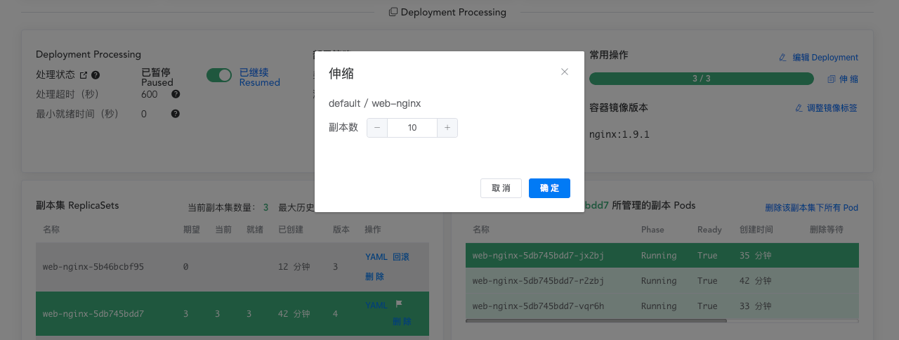
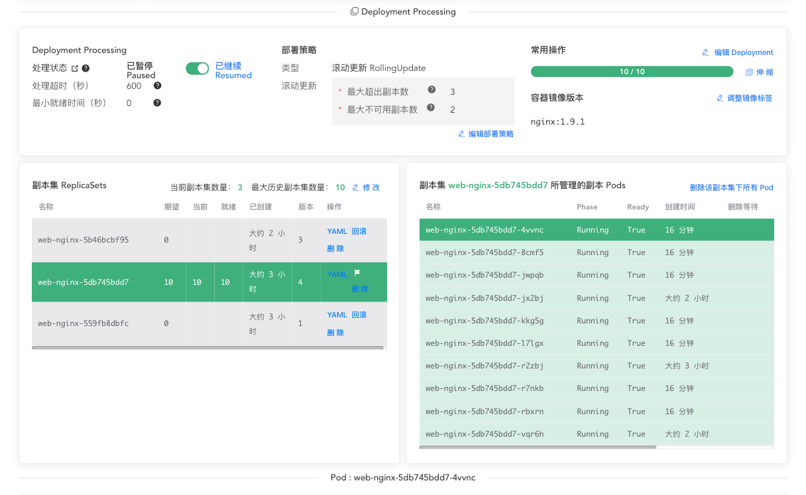
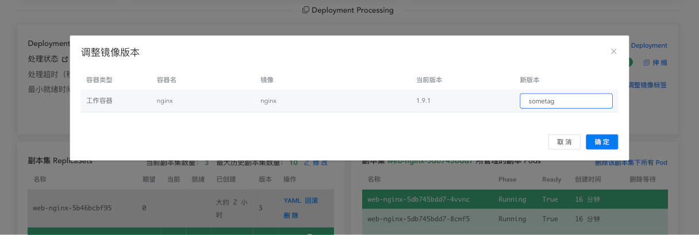
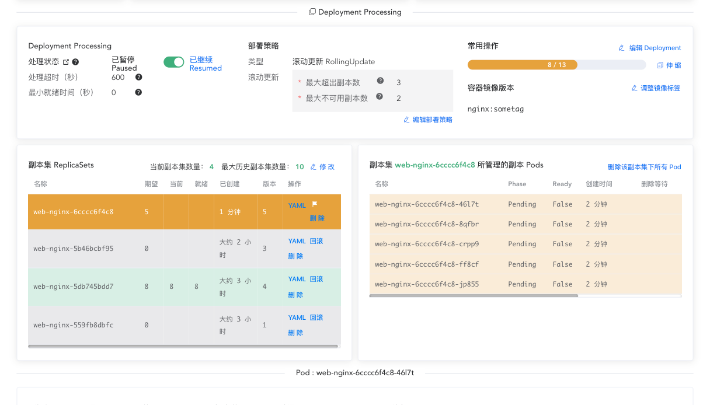
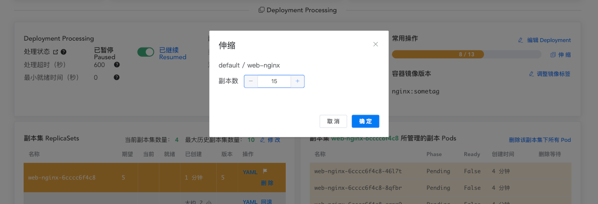
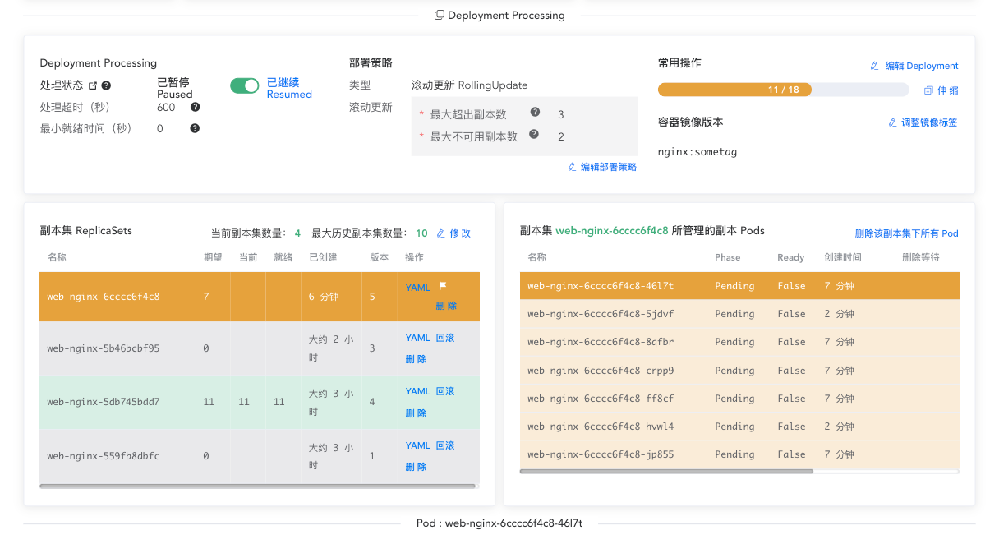

# 伸缩 Deployment

<AdSenseTitle/>

[返回 Deployment](./#deployment-概述)

伸缩（Scaling） Deployment，是指改变 Deployment 中 Pod 的副本数量，以应对实际业务流量的变化。

> 本文提供了两种途径对 Deployment 执行伸缩操作：
> * 使用 kubectl 伸缩 Deployment
> * 使用 Kuboard 伸缩 Deployment

<b-card>
<b-tabs content-class="mt-3">
<b-tab title="使用 kubectl 伸缩 Deployment">

<h2>执行伸缩</h2>

* 执行命令 `kubectl scale deployment.v1.apps/nginx-deployment --replicas=10`，可以伸缩 Deployment，输出结果如下所示：

  ```
  deployment.apps/nginx-deployment scaled
  ```
  如果您的集群启用了自动伸缩（[horizontal Pod autoscaling](https://kubernetes.io/docs/tasks/run-application/horizontal-pod-autoscale-walkthrough/)），执行以下命令，您就可以基于 CPU 的利用率在一个最大和最小的区间自动伸缩您的 Deployment：
  ``` sh
  kubectl autoscale deployment.v1.apps/nginx-deployment --min=10 --max=15 --cpu-percent=80
  ```
  输出结果如下所示：
  ```
  deployment.apps/nginx-deployment scaled
  ```

<h2>按比例伸缩</h2>

滚动更新（RollingUpdate） Deployment 过程中同一时间点运行应用程序的多个版本。如果一个 Deployment 正在执行滚动更新（RollingUpdate）的过程中（也可能暂停了滚动更新），您或者自动伸缩器（autoscaler）对该 Deployment 执行伸缩操作，此时，Deployment Controller 会按比例将新建的 Pod 分配到当前活动的 ReplicaSet（有 Pod 的 ReplicaSet） 中，以避免可能的风险。这种情况叫做按比例伸缩（Proportional Scaling）

例如，假设您已经运行了一个 10 副本数的 Deployment，其 maxSurge=3, maxUnavailable=2。

* 执行命令 `kubectl get deployment`，确认 Deployment 中的 10 个副本都在运行。输出结果如下所示：

  ```
  NAME                 DESIRED   CURRENT   UP-TO-DATE   AVAILABLE   AGE
  nginx-deployment     10        10        10           10          50s
  ```

* 执行命令 `kubectl set image deployment.v1.apps/nginx-deployment nginx=nginx:sometag`，将容器镜像更新到一个不存在的版本，输出结果如下所示：

  ```
  deployment.apps/nginx-deployment image updated
  ```

* 执行命令 `kubectl get rs`，检查滚动更新的状态，输出结果如下：
  ```
  NAME                          DESIRED   CURRENT   READY     AGE
  nginx-deployment-1989198191   5         5         0         9s
  nginx-deployment-618515232    8         8         8         1m
  ```
  更新容器镜像之后，Deployment Controller 将开始进行滚动更新（RollingUpdate），并创建一个新的 ReplicaSet `nginx-deployment-1989198191`，但是由于 maxUnavailable 的限定，该滚动更新将被阻止。

* 执行命令 `kubectl scale deployment.v1.apps/nginx-deployment --replicas=15`，将 Deployment 的 replicas 调整到 15。此时，Deployment Controller 需要决定如何分配新增的 5 个 Pod 副本。根据“按比例伸缩”的原则：
  * 更大比例的新 Pod 数被分配到副本数最多的 ReplicaSet
  * 更小比例的新 Pod 数被分配到副本数最少的 ReplicaSet
  * 如果还有剩余的新 Pod 数未分配，则将被增加到副本数最多的 ReplicaSet
  * 副本数为 0 的 ReplicaSet，scale up 之后，副本数仍然为 0

* 在本例中，3 个新副本被添加到旧的 ReplicaSet，2个新副本被添加到新的 ReplicaSet。如果新的副本都达到就绪状态，滚动更新过程最终会将所有的副本数添加放到新 ReplicaSet。执行命令 `kubectl get deployment` 查看 Deployment 的情况，输出结果如下所示：

  ```
  NAME                 DESIRED   CURRENT   UP-TO-DATE   AVAILABLE   AGE
  nginx-deployment     15        18        7            8           7m
  ```

  执行命令 `kubectl get rs` 查看 ReplicaSet 的情况，输出结果如下所示：
  ```
  NAME                          DESIRED   CURRENT   READY     AGE
  nginx-deployment-1989198191   7         7         0         7m
  nginx-deployment-618515232    11        11        11        7m
  ```

</b-tab>
<b-tab title="使用 Kuboard 伸缩 Deployment" active>


## 执行伸缩

* 在 Deployment 详情页面，点击 ***伸缩*** 按钮，调整副本数并保存，如下图所示：

  即可完成对 Deployment 的伸缩操作；

  

* `kubectl autoscale` 指令可以执行对 Deployment 的自动伸缩，目前 Kuboard 界面还不支持此操作。

  请参考 [horizontal Pod autoscaling](https://kubernetes.io/docs/tasks/run-application/horizontal-pod-autoscale-walkthrough/)


## 按比例伸缩

滚动更新（RollingUpdate） Deployment 过程中同一时间点运行应用程序的多个版本。如果一个 Deployment 正在执行滚动更新（RollingUpdate）的过程中（也可能暂停了滚动更新），您或者自动伸缩器（autoscaler）对该 Deployment 执行伸缩操作，此时，Deployment Controller 会按比例将新建的 Pod 分配到当前活动的 ReplicaSet（有 Pod 的 ReplicaSet） 中，以避免可能的风险。这种情况叫做按比例伸缩（Proportional Scaling）

例如，假设您已经运行了一个 10 副本数的 Deployment，其 maxSurge=3, maxUnavailable=2。

* 点击 Deployment 详情页面中的 ***部署策略*** 下的 ***编辑部署策略*** 按钮，如下图所示：

  将 *最大超出副本数* 修改为 `3`；

  将 *最大不可用副本数* 修改为 `2`；

  修改后保存。

  

* 确认当前 10 个副本正在运行，如下图所示：

  

* 点击 ***调整镜像标签*** 按钮，将容器镜像更新到一个不存在的标签，例如 `sometag`，如下图所示：

  

* 此时，Deployment 将新建一个副本集，并且其期望的副本数为 `5`，原来的副本集的期望副本数被调整为 `8`，如下图所示：

  由于新副本集中的 Pod 不能获取到镜像，因此滚动更新将卡在这个位置。

  

* 点击 ***伸缩*** 按钮，将期望副本数调整为 `15`，如下图所示：

  

* 此时，由于比原来期望的副本数增加了 5，新增副本数将按比例增加到新、旧两个副本集，最终结果如下图所示：

  


</b-tab>
</b-tabs>
</b-card>

[返回 Deployment](./#deployment-概述)
