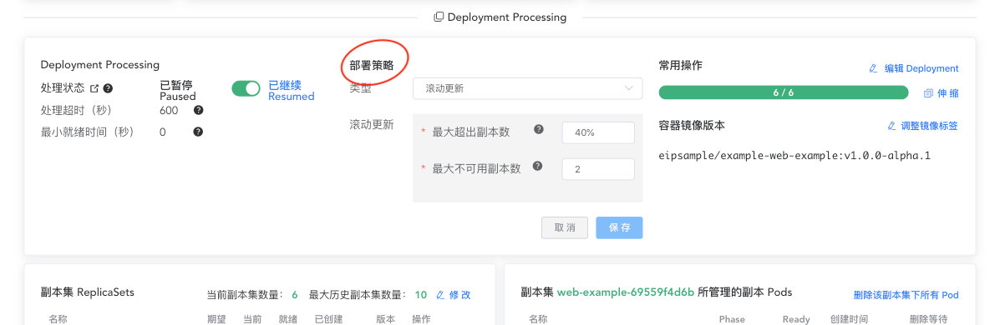

# 部署策略

<AdSenseTitle/>

[返回 Deployment](./#deployment-概述)

通过 Deployment 中 `.spec.strategy` 字段，可以指定使用 `滚动更新 RollingUpdate` 的部署策略还是使用 `重新创建 Recreate` 的部署策略

Kuboard 中，可以通过如下界面编辑部署策略。

其中字段的含义如下：

| 字段名称         | 可选值                 | 字段描述                                                     |
| ---------------- | ---------------------- | ------------------------------------------------------------ |
| 类型             | 滚动更新 重新创建 | 如果选择重新创建，Deployment将先删除原有副本集中的所有 Pod，然后再创建新的副本集和新的 Pod。如此，更新过程中将出现一段应用程序不可用的情况； |
| 最大超出副本数   | 数字或百分比           |    滚动更新过程中，可以超出期望副本数的最大值。  该取值可以是一个绝对值（例如：5），也可以是一个相对于期望副本数的百分比（例如：10%）；  如果填写百分比，则以期望副本数乘以该百分比后向上取整的方式计算对应的绝对值；  当最大超出副本数 maxUnavailable 为 0 时，此数值不能为 0；默认值为 25%。  例如：假设此值被设定为 30%，当滚动更新开始时，新的副本集（ReplicaSet）可以立刻扩容，  但是旧 Pod 和新 Pod 的总数不超过 Deployment 期待副本数（spec.repilcas）的 130%。  一旦旧 Pod 被终止后，新的副本集可以进一步扩容，但是整个滚动更新过程中，新旧 Pod 的总  数不超过 Deployment 期待副本数（spec.repilcas）的 130%。 |
| 最大不可用副本数 | 数字或百分比           |                    滚动更新过程中，不可用副本数的最大值。  该取值可以是一个绝对值（例如：5），也可以是一个相对于期望副本数的百分比（例如：10%）；  如果填写百分比，则以期望副本数乘以该百分比后向下取整的方式计算对应的绝对值；  当最大超出副本数 maxSurge 为 0 时，此数值不能为 0；默认值为 25%；  例如：假设此值被设定为 30%，当滚动更新开始时，旧的副本集（ReplicaSet）可以缩容到期望  副本数的 70%；在新副本集扩容的过程中，一旦新的 Pod 已就绪，旧的副本集可以进一步缩容，  整个滚动更新过程中，确保新旧就绪副本数之和不低于期望副本数的 70%。                                          |

[返回 Deployment](./#deployment-概述)
