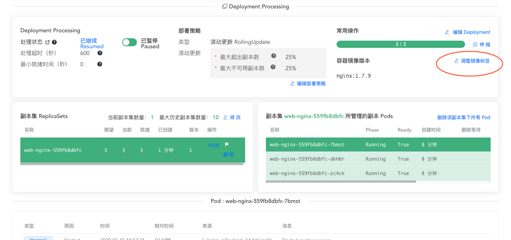
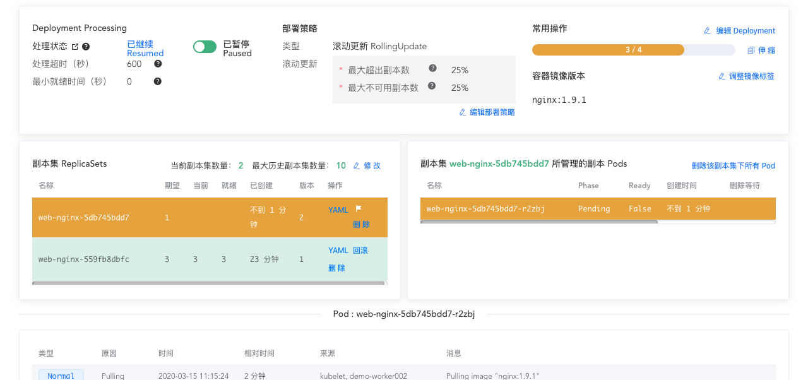
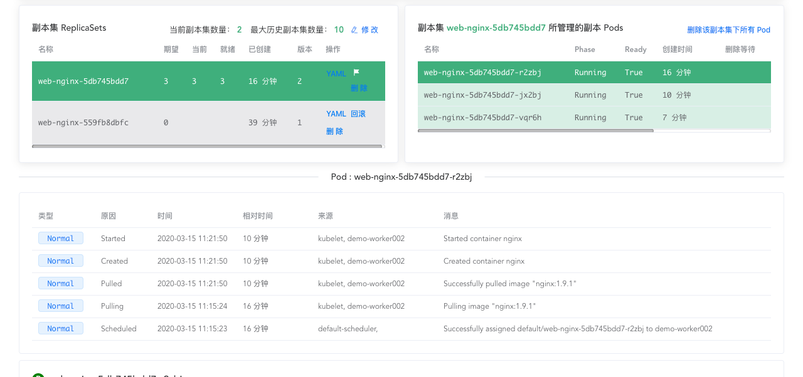

# 更新 Deployment

<AdSenseTitle/>

[返回 Deployment](./#deployment-概述)

## 执行更新

::: tip
当且仅当 Deployment 的 Pod template（`.spec.template`）字段中的内容发生变更时（例如标签、容器的镜像被改变），Deployment 的发布更新（rollout）将被触发。Deployment 中其他字段的变化（例如修改 .spec.replicas 字段）将不会触发 Deployment 的发布更新（rollout）
:::

> 本文提供了两种途径对 Deployment 执行发布更新（rollout）：
> * 使用 kubectl 更新 Deployment
> * 使用 Kuboard 更新 Deployment

<b-card>
<b-tabs content-class="mt-3">
<b-tab title="使用 kubectl 更新 Deployment">


**使用下述步骤更新您的 Deployment**

1. 执行以下命令，将容器镜像从 nginx:1.7.9 更新到 nginx:1.9.1

  ```sh
  kubectl --record deployment.apps/nginx-deployment set image deployment.v1.apps/nginx-deployment nginx=nginx:1.9.1
  ```

  输出结果如下所示：

  ```
  deployment.apps/nginx-deployment image updated
  ```

  或者，您可以 `edit` 该 Deployment，并将 `.spec.template.spec.containers[0].image` 从 `nginx:1.7.9` 修改为 `nginx:1.9.1` 

  ```sh
  kubectl edit deployment.v1.apps/nginx-deployment
  ```
  输出结果如下所示

  ```
  deployment.apps/nginx-deployment edited
  ```

2. 查看发布更新（rollout）的状态，执行命令：

  ```sh
  kubectl rollout status deployment.v1.apps/nginx-deployment
  ```
  输出结果如下所示：
  ```
  Waiting for rollout to finish: 2 out of 3 new replicas have been updated...
  ```
  或者
  ```
  deployment.apps/nginx-deployment successfully rolled out
  ```

**查看更新后的 Deployment 的详情：**

* 更新（rollout）成功后，您可以执行命令 `kubectl get deployments` 以查看更新结果。输出信息如下所示：

  ```
  NAME               DESIRED   CURRENT   UP-TO-DATE   AVAILABLE   AGE
  nginx-deployment   3         3         3            3           36s
  ```

* 执行命令 `kubectl get rs` Deployment 的更新是通过创建一个新的 3 个副本数的 ReplicaSet 并同时将旧的 Replicaset 的副本数缩容到 0 个副本 来达成的。输出结果如下所示：

  ```
  NAME                          DESIRED   CURRENT   READY   AGE
  nginx-deployment-1564180365   3         3         3       6s
  nginx-deployment-2035384211   0         0         0       36s
  ```

* 执行命令 `kubectl get pods`，此时将只显示新的 Pod，输出结果如下所示：

  ```
  NAME                                READY     STATUS    RESTARTS   AGE
  nginx-deployment-1564180365-khku8   1/1       Running   0          14s
  nginx-deployment-1564180365-nacti   1/1       Running   0          14s
  nginx-deployment-1564180365-z9gth   1/1       Running   0          14s
  ```
  * 如果您想要修改这些新的 Pod，您只需要再次修改 Deployment 的 Pod template。
  * Deployment 将确保更新过程中，任意时刻只有一定数量的 Pod 被关闭。默认情况下，Deployment 确保至少 `.spec.replicas` 的 75% 的 Pod 保持可用（25% max unavailable）
  * Deployment 将确保更新过程中，任意时刻只有一定数量的 Pod 被创建。默认情况下，Deployment 确保最多 `.spec.replicas` 的 25% 的 Pod 被创建（25% max surge）

  例如，如果您仔细观察上述 Deployment 的更新过程，您将注意到 Deployment Controller 先创建一个新 Pod，然后删除一个旧 Pod，然后再创建新的，如此循环，直到全部更新。Deployment Controller 不会 kill 旧的 Pod，除非足够数量的新 Pod 已经就绪，Deployment Controller 也不会创新新 Pod 直到足够数量的旧 Pod 已经被 kill。这个过程将确保更新过程中，任意时刻，最少 2 个 / 最多 4 个 Pod 可用。

* 执行命令 `kubectl describe deployments` 查看 Deployment 详情，输出结果如下所示：
  
  ```
  Name:                   nginx-deployment
  Namespace:              default
  CreationTimestamp:      Thu, 30 Nov 2017 10:56:25 +0000
  Labels:                 app=nginx
  Annotations:            deployment.kubernetes.io/revision=2
  Selector:               app=nginx
  Replicas:               3 desired | 3 updated | 3 total | 3 available | 0 unavailable
  StrategyType:           RollingUpdate
  MinReadySeconds:        0
  RollingUpdateStrategy:  25% max unavailable, 25% max surge
  Pod Template:
  Labels:  app=nginx
  Containers:
    nginx:
      Image:        nginx:1.9.1
      Port:         80/TCP
      Environment:  <none>
      Mounts:       <none>
    Volumes:        <none>
  Conditions:
    Type           Status  Reason
    ----           ------  ------
    Available      True    MinimumReplicasAvailable
    Progressing    True    NewReplicaSetAvailable
  OldReplicaSets:  <none>
  NewReplicaSet:   nginx-deployment-1564180365 (3/3 replicas created)
  Events:
    Type    Reason             Age   From                   Message
    ----    ------             ----  ----                   -------
    Normal  ScalingReplicaSet  2m    deployment-controller  Scaled up replica set nginx-deployment-2035384211 to 3
    Normal  ScalingReplicaSet  24s   deployment-controller  Scaled up replica set nginx-deployment-1564180365 to 1
    Normal  ScalingReplicaSet  22s   deployment-controller  Scaled down replica set nginx-deployment-2035384211 to 2
    Normal  ScalingReplicaSet  22s   deployment-controller  Scaled up replica set nginx-deployment-1564180365 to 2
    Normal  ScalingReplicaSet  19s   deployment-controller  Scaled down replica set nginx-deployment-2035384211 to 1
    Normal  ScalingReplicaSet  19s   deployment-controller  Scaled up replica set nginx-deployment-1564180365 to 3
    Normal  ScalingReplicaSet  14s   deployment-controller  Scaled down replica set nginx-deployment-2035384211 to 0
  ```

  此时，在 `Events` 中，您可以看到：
  * 您创建 Deployment 时，Deployment Controller 创建了一个 ReplicaSet (nginx-deployment-2035384211) 并直接将其 scale up 到 3 个副本。
  * 当您更新 Deployment 时，Deployment Controller 先创建一个新的 ReplicaSet (nginx-deployment-1564180365) 并将其 scale up 到 1 个副本，然后 scale down 旧的 ReplicaSet 到 2。
  * Deployment Controller 继续 scale up 新的 ReplicaSet 并 scale down 旧的 ReplicaSet，直到最后，新旧两个 ReplicaSet，一个副本数为 3，另一个副本数为 0。

</b-tab>
<b-tab title="使用 Kuboard 更新 Deployment" active>


1. 进入 Deployment 查看界面，如下图所示：

   

2. 点击上图中的 ***调整镜像标签*** 按钮

   将新版本字段修改为 `1.9.1`，并点击 ***确定*** 按钮，如下图所示：

   

   

3. 等待 Kubernetes 完成应用的滚动更新：

   更新过程中，截图如下：

   

   完成更新后，截图如下：

   


</b-tab>
</b-tabs>
</b-card>

## 覆盖更新 Rollover （更新过程中再更新）

每创建一个 Deployment，Deployment Controller 都为其创建一个 ReplicaSet，并设定其副本数为期望的 Pod 数（ `.spec.replicas` 字段）。如果 Deployment 被更新，旧的 ReplicaSet 将被 Scale down，新建的 ReplicaSet 将被 Scale up；直到最后新旧两个 ReplicaSet，一个副本数为 `.spec.replias`，另一个副本数为 0。这个过程称为 rollout。

当 Deployment 的 rollout 正在进行中的时候，如果您再次更新 Deployment 的信息，此时 Deployment 将再创建一个新的 ReplicaSet 并开始将其 scale up，将先前正在 scale up 的 ReplicaSet 也作为一个旧的 ReplicaSet，并开始将其 scale down。

例如：
* 假设您创建了一个 Deployment 有 5 个 nginx:1.7.9 的副本；
* 您立刻更新该 Deployment 使得其 `.spec.replicas` 为 5，容器镜像为 `nginx:1.9.1`，而此时只有 3 个 nginx:1.7.9 的副本已创建；
* 此时，Deployment Controller 将立刻开始 kill 已经创建的 3 个 nginx:1.7.9 的 Pod，并开始创建 nginx:1.9.1 的 Pod。Deployment Controller 不会等到 5 个 nginx:1.7.9 的 Pod 都创建完之后在开始新的更新


[返回 Deployment](./#deployment-概述)
