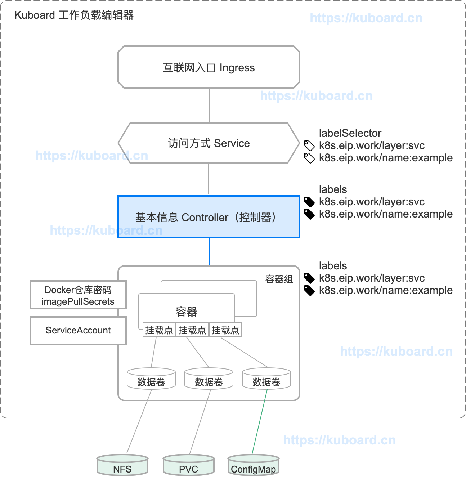
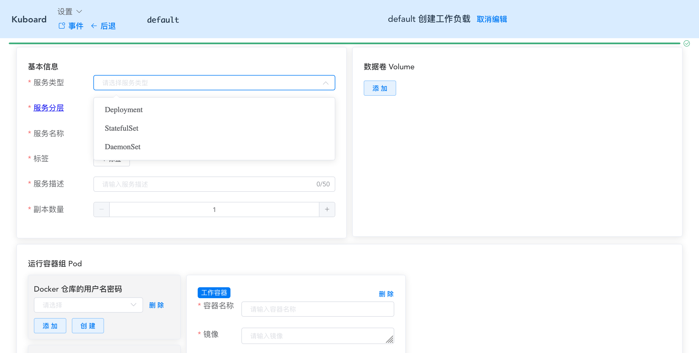

# 控制器_概述

## 概述

Pod（容器组）是 Kubernetes 中最小的调度单元，您可以通过 kubectl 直接创建一个 Pod。Pod 本身并不能自愈（self-healing）。如果一个 Pod 所在的 Node （节点）出现故障，或者调度程序自身出现故障，Pod 将被删除；同理，当因为节点资源不够或节点维护而驱逐 Pod 时，Pod 也将被删除。

Kubernetes 通过引入 Controller（控制器）的概念来管理 Pod 实例。在 Kubernetes 中，您应该始终通过创建 Controller 来创建 Pod，而不是直接创建 Pod。**控制器可以提供如下特性：**
* 水平扩展（运行 Pod 的多个副本）
* rollout（版本更新）
* self-healing（故障恢复）
  例如：当一个节点出现故障，控制器可以自动地在另一个节点调度一个配置完全一样的 Pod，以替换故障节点上的 Pod。

**在 Kubernetes 支持的控制器有如下几种：**

* [Deployment](./wl-deployment/) <Badge text="Kuboard 已支持" type="success"/>
* [StatefulSet](./wl-statefulset/) <Badge text="Kuboard 已支持" type="success"/>
* [DaemonSet](./wl-daemonset/) <Badge text="Kuboard 已支持" type="success"/>

* [CronJob](./wl-cronjob/) <Badge text="Kuboard 正在计划中" type="warn"/>
* [Jobs - Run to Completion](./wl-job/) <Badge text="Kuboard 正在计划中" type="warn"/>

* [ReplicaSet](https://kubernetes.io/docs/concepts/workloads/controllers/replicaset/)<Badge text="使用 Deployment" type="error"/> 
  
  > Kubernetes 官方推荐使用 Deployment 替代 ReplicaSet

* [ReplicationController](https://kubernetes.io/docs/concepts/workloads/controllers/replicationcontroller/) <Badge text="使用 Deployment" type="error"/> 
  
  > Kubernetes 官方推荐使用 Deployment 替代 ReplicationController

* [Garbage Collection](https://kubernetes.io/docs/concepts/workloads/controllers/garbage-collection/)

  > Kuboard 暂时不支持

* [TTL Controller for Finished Resources](https://kubernetes.io/docs/concepts/workloads/controllers/ttlafterfinished/)

  > Kuboard 暂时不支持

::: tip
常规的部署任务中所需要的控制器类型，Kuboard 都已经支持。以典型的 Spring Cloud 等微服务框架而言，Kuboard 已经可以非常好地对其进行运维和管理。
:::

## 在 Kuboard 中的体现

在 Kuboard 工作负载编辑器中，控制器的概念如下图所示：

</img>

**界面如下图所示：**

