# 导入 example 微服务

<AdSenseTitle/>

## 前提

必须具备如下条件：

* Kubernetes 集群
* 导入 example 微服务时，要求 Kubernetes 集群版本不低于 1.14.0 <Badge type="error">重要</Badge>
* 已经安装 [Kuboard v3](/install/v3/install.html)
* 集群中存在有效的存储类，如果没有请参考 [创建存储类](/learning/k8s-intermediate/persistent/nfs.html#在kuboard中创建-nfs-存储类)

## 创建名称空间

创建新的名称空间，用来导入 example。在 Kuboard 的集群页面菜单中，导航到 `名称空间-选择` 菜单，如图所示：

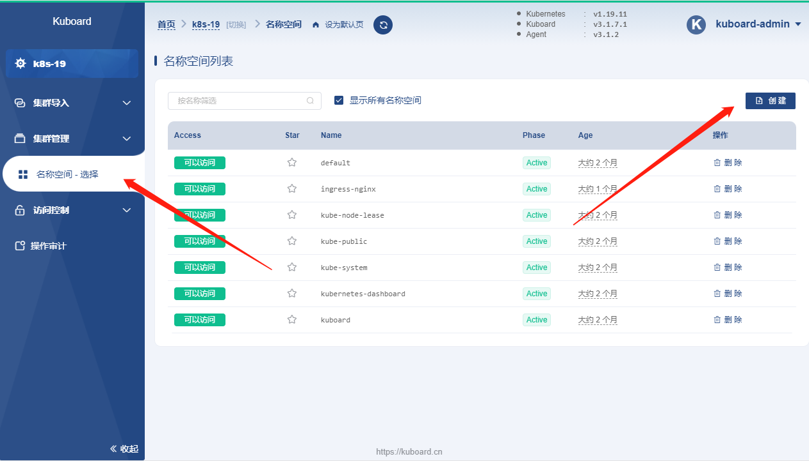

## 导入 example

* 下载 <a :href="$withBase('/kuboard_example_v3.yaml')" download="kuboard_example.yaml">kuboard_example.yaml</a> 文件

* 在完成 `example` 名称空间的创建以后，导航到菜单项 `名称空间` --> `example` --> `常用操作` --> `导入工作负载`，如下图所示：

  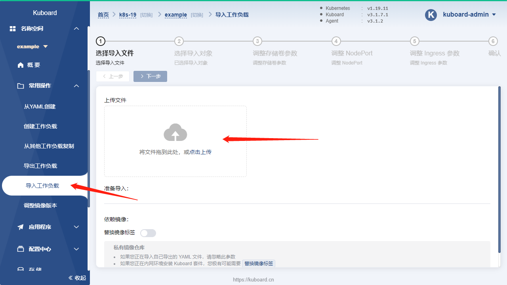

* 点击 ***上传文件*** 按钮

  并选择刚才下载的 `kuboard_example.yaml` 文件，如下图所示：
  
  * 图中将标注此文件中可导入对象的类型及个数；
  * `依赖镜像` 中的 `替换镜像标签` 选项，可以方便您在离线环境下进行导入。

  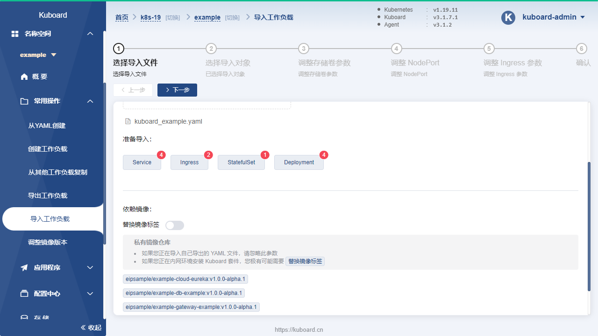

* 点击 ***下一步*** 

  默认选择所有的工作负载，如下图所示：

  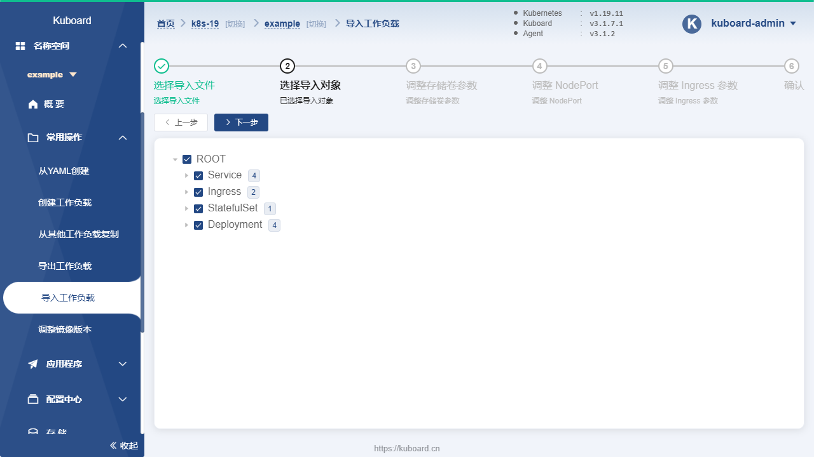

* 点击 ***下一步***

  为存储卷声明 `db-example-storage` 选择合适的存储类，如下图所示：

  | 字段名称           | 填写内容           | 说明                                                         |
  | ------------------ | ------------------ | ------------------------------------------------------------ |
  | 数据卷类型         | db-example-storage | NFS：容器组直连NFS 存储卷声明：容器组使用存储卷声明     |
  | 是否新建存储卷声明 | 创建新存储卷声明   | 使用已有存储卷声明：可以使用事先创建好的存储卷声明 创建新存储卷声明：可以创建新存储卷声明 |
  | 分配模式           | 动态分配           |                                                              |
  | 读写模式           | 可被多节点读写     | 只能被单节点读写、可被多节点只读、可被多节点读写             |
  | 总量               | 2Gi                | 2Gi代表 2G空间                                               |

  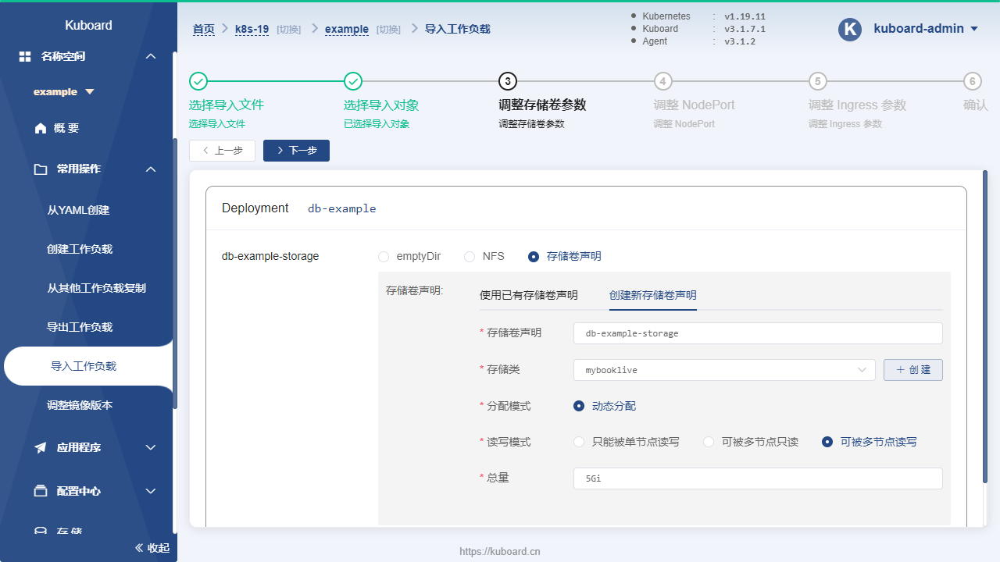

* 点击 ***下一步***

  默认没有需要调整的 NodePort

  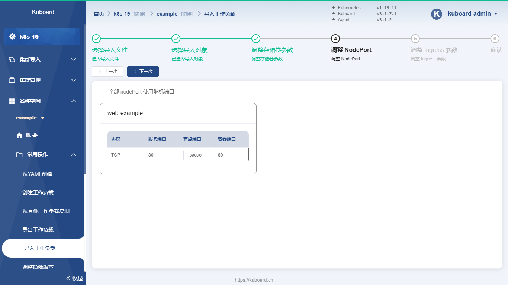

* 点击 ***下一步***

  填写新的 Ingress 域名，如下图所示：

  | 字段名称         | 填写内容                           | 说明                                                         |
  | ---------------- | ---------------------------------- | ------------------------------------------------------------ |
  | cloud-eureka域名 | cloud-eureka.example.demo.kuboard.cn | 使用您自己的域名， 在测试环境建议使用如下域名格式： workloadname.namespace-name.cluster-name.domain.com 该域名应该解析到您worker节点的外网地址，或者worker 节点 80/443 端口对应负载均衡服务器的外网地址。 |
  | web-example      | web-example.example.demo.eip       |                                                              |
  
  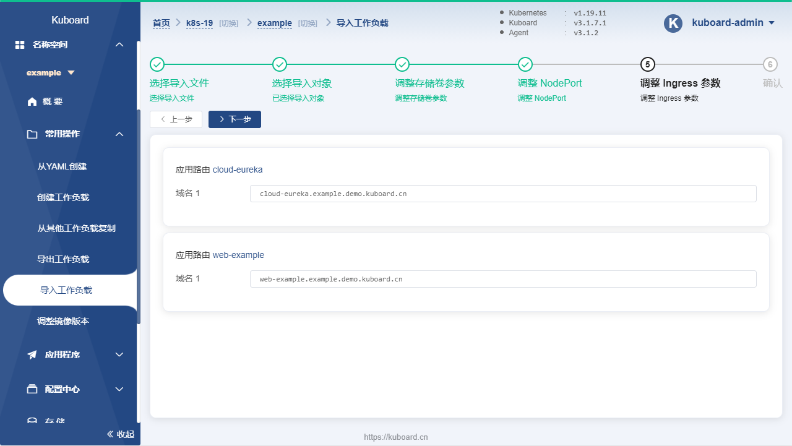

* 点击 ***下一步***

  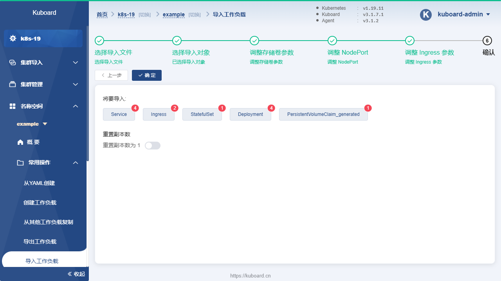

* 点击 ***确定***

  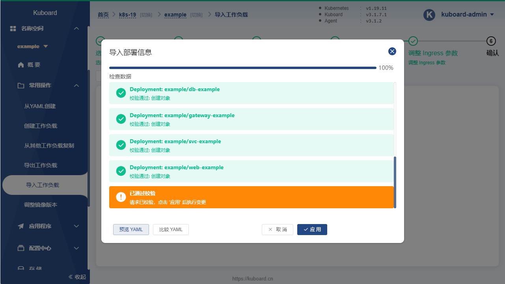

* 完成导入
  
  在界面提示下，点击 ***应用***、 ***确定***，完成 `example` 应用的最终导入。

* 点击 ***已完成***

  可在名称空间概览页中查看到刚才导入的 example 的所有工作负载，如下图所示：

  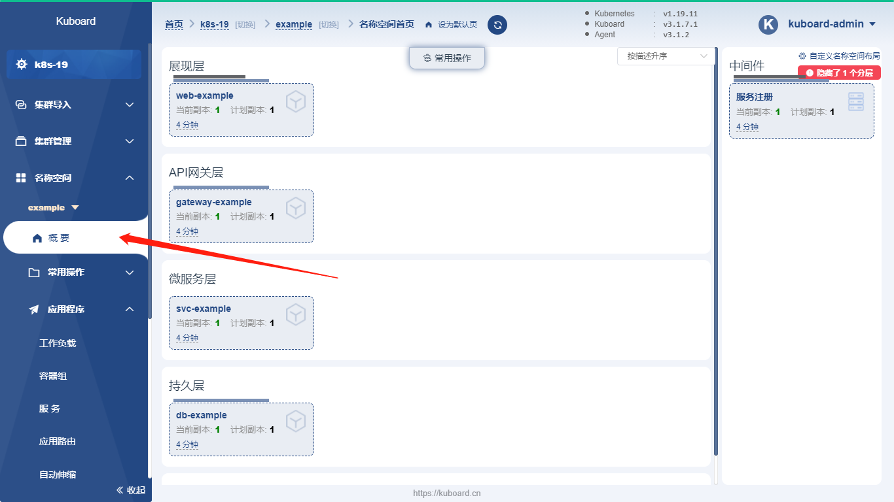

## 验证 web-example

* 点击工作负载 ***web-example***

  切换到 ***服务*** 标签页，可以看到该服务公布了 30090 这个节点端口，如下图所示：

  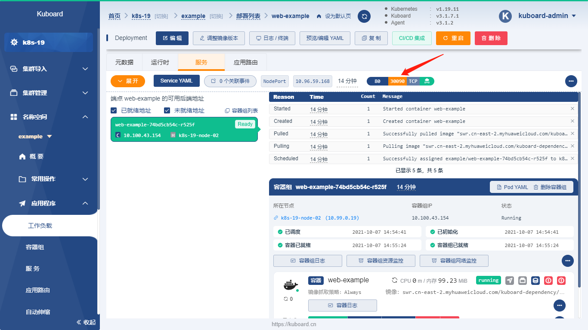
  

* 在浏览器地址栏中输入 `http://任意节点IP:30090`，将打开如下页面：

  **Example 部署成功**

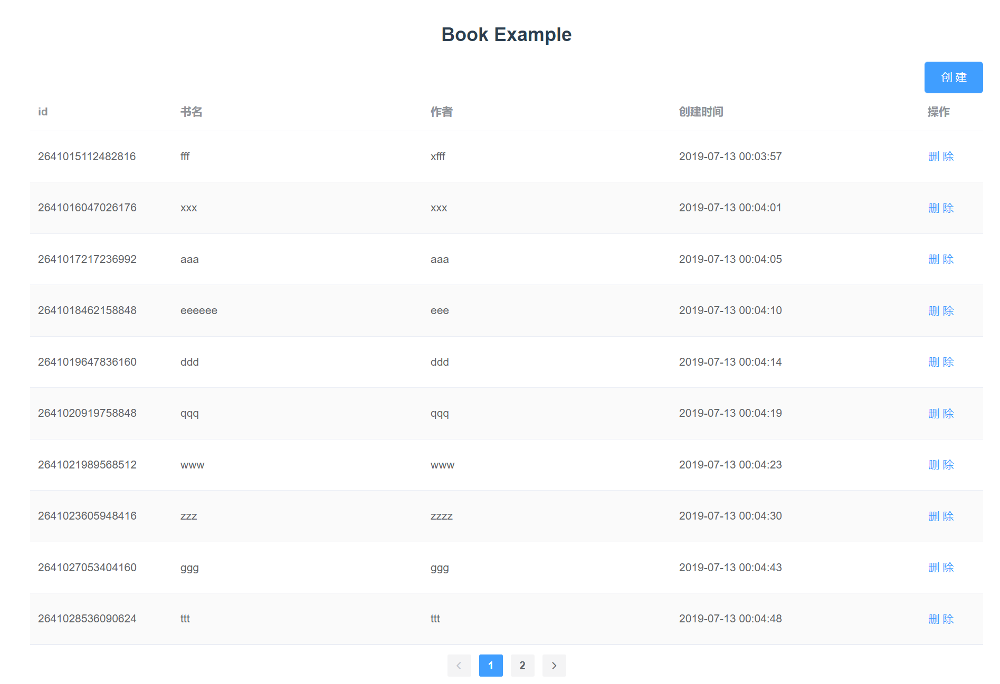

::tada:: ::tada:: ::tada::