# 容器应用的设计原则、模式和反模式

<AdSenseTitle>

> 转载文章： [基于容器应用，著名的设计原则、模式和反模式](https://blog.csdn.net/cpongo2/article/details/90172525)
> 
> 作者：naughty

</AdSenseTitle>

容器和容器编排（Kubernetes）的广泛使用，让我们可以轻松的构建基于微服务的“云原生”（Cloud Native）的应用。容器成为了云时代的新的编程单元，类似面向对象概念下的**对象**，J2EE中的**组件**或者函数式编程中的**函数**。

在面向对象时代，有许多著名的设计原则，模式和反模式等，例如：

- [SOLID](https://zh.wikipedia.org/wiki/SOLID_(面向对象设计)) (**单一功能、开闭原则、里氏替换、接口隔离**以及**依赖反转**）
- [Design Patterns: Elements of Reusable Object-Oriented Software](https://zh.wikipedia.org/wiki/设计模式：可复用面向对象软件的基础)
- [Anti-Pattern](https://zh.wikipedia.org/wiki/反面模式)

在新的容器背景下，相应的原则和模式有助于帮助我们更好的构建“云原生”的应用。我们可以看到，这些原则和模式并非对之前模式的颠覆和推翻，更像是适应新环境的演进版本。

## 设计原则

### 单一职责原则

单一职责原则 SINGLE CONCERN PRINCIPLE (SCP)

与OO的单一功能相对应，每一个容器应该提供单一的职责，只关注于做好一件事。单一职责使得容器更容易重用。通常容器对应于一个进程，而该进程专注于做好一件事。

<p style="max-width: 360px;">
  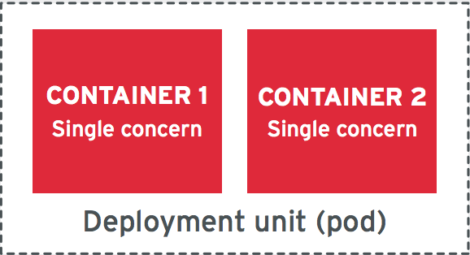
</p>


### 高可观测性原则

高可观测性原则 HIGH OBSERVABILITY PRINCIPLE (HOP)

容器像对象一样，应该是一个封装良好的黑盒子。但是在云的环境下，这个黑盒子应该提供良好的观测接口，使得其在云的环境下得到相应的监控和管理。这样，整个应用才能提供一致的生命周期的管理。

<p style="max-width: 480px;">
  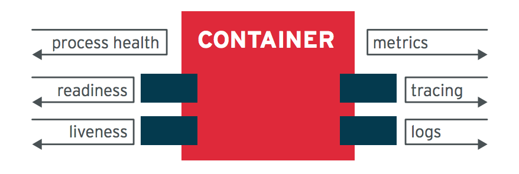
</p>

可观测性包含：

- 提供健康检查 Health Check，或者心跳
- 提供状态
- 把日志输出到标准输出(STDOUT)和标准出错(STDERR)
- 等等 

### 生命周期确认原则

生命周期确认原则 LIFE-CYCLE CONFORMANCE PRINCIPLE (LCP)

生命周期确认原则指的是容器应该提供和平台交互来处理相应的生命周期的变化。

<p style="max-width: 480px;">
  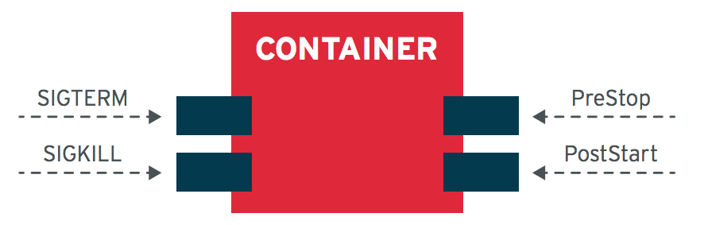
</p>


- 捕获并响应Terminate (SIGTERM)信号，来尽快优雅的终止服务进程，以避免kill (SIGKILL)信号强行终止进程。例如一下的NodeJS代码。

  ``` go
  process.on('SIGTERM', function () {
    console.log("Received SIGTERM. Exiting.")
    server.close(function () {
      process.exit(0);
    });
  });
  ```

   

- 返回退出码

  ``` go
  process.exit(0);
  ```

### 镜像不可变原则

镜像不可变原则 IMAGE IMMUTABILITY PRINCIPLE (IIP)

在运行时，配置可以不同，但是镜像应该是不可变的。

<p style="max-width: 360px;">
  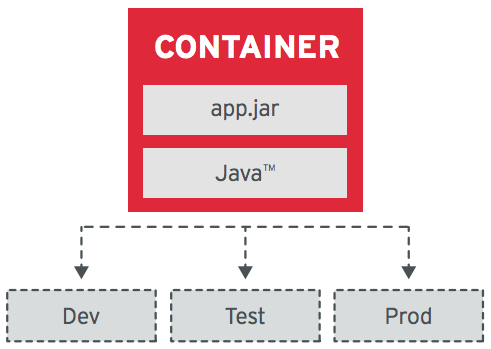
</p>

我们可以理解为镜像是个类，是容器是对象实例，类是不变的，而容器是拥有不同配置参数的镜像实例。

### 进程用完既丢原则

进程用完既丢原则 PROCESS DISPOSABILITY PRINCIPLE (PDP)

在云环境下，我们应该假定所有的容器都是临时的，它随时有可能被其它的容器实例所替代。

<p style="max-width: 320px;">
  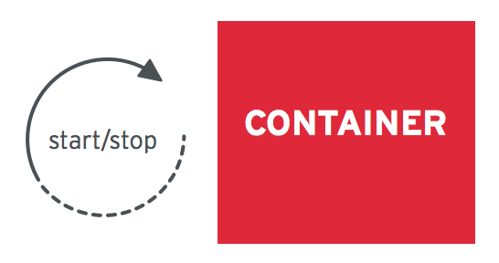
</p>

这也就意味着需要把容器的状态保存在容器之外。并且尽可能快速的启动和终止容器。通常越小的容器就越容易实现这一点。

### 自包含原则

自包含原则 SELF-CONTAINMENT PRINCIPLE (S-CP)

容器在构建的时候应该包含所有的依赖，也就是所说容器在运行时不应该有任何的外部依赖。

<p style="max-width: 360px;">
  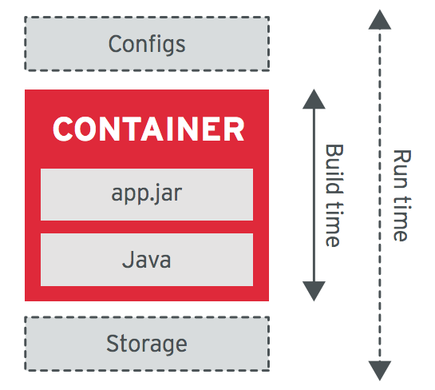
</p>

### 限制运行资源原则

限制运行资源原则 RUNTIME CONFINEMENT PRINCIPLE (RCP)

容器的最佳实践应该是在运行时指定容器对资源配置的需求。例如需要多少的内存，CPU等等。这样做可以使得容器编排能都更有效的调度和管理资源。

<p style="max-width: 360px;">
  
</p>

## 模式

许多容器应用的模式和Pod的概念相关，Pod是Kubernetes为了有效的管理容器而提出的概念，它是容器的集合，我们可以理解为“超容器”（我随便发明的）。Pod包含的容器之间就好像运行在同一台机器上，这些容器共享Localhost主机地址，可以本机通信，共享卷等等。

<p style="max-width: 360px;">
  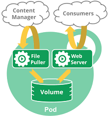
</p>

Kubernetes 类似云上OS，提供了用容器构建云原生应用的最佳实践。我们看看这些常见的模式都有什么。

### SideCar


<p style="max-width: 480px;">
  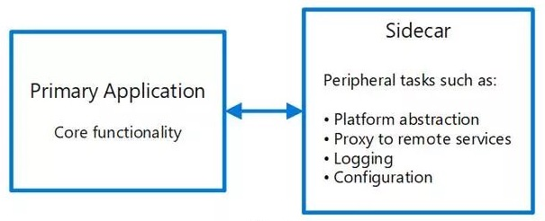
</p>

Sidecar是最常见的模式，在同一个Pod中，我们需要把不同的责任分在不同的容器中，对外部提供一个完整的功能。

<p style="max-width: 480px;">
  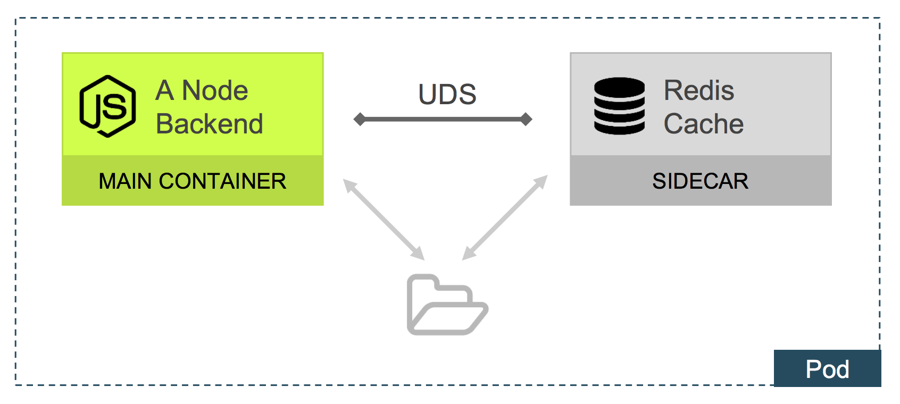
</p>

这样的例子有很多，例如：

- 上图中的Node后端和提供缓存的Redis
- Web服务器和收集日志的服务
- Web服务器和负责监控服务器性能数据的服务

这样做有点类似面向对象的[组合模式](https://en.wikipedia.org/wiki/Composite_pattern)，好处有很多：

### 代理容器

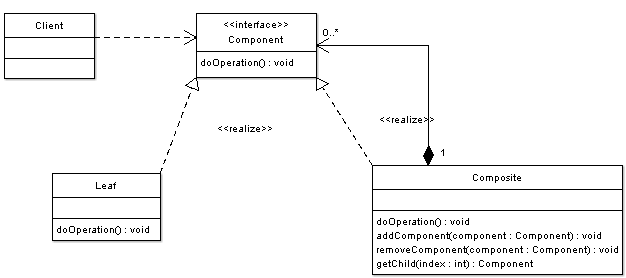

- 应用单一职责原则，每一个容器只负责专注做好一件事。
- 隔离，容器之间不会出现互相竞争资源，当一个次要功能（例如日志收集或者缓存）失效或者崩溃的时候，对主要功能的影响降至最小。
- 可以对每一个容器进行独立的生命周期管理
- 可以对每一个容器进行独立的弹性扩张
- 可以方便的替换其中一个容器

### 适配器容器

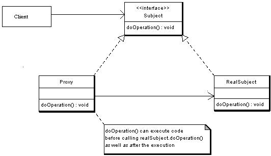

类似于面向对象的[Proxy模式](https://en.wikipedia.org/wiki/Proxy_pattern)，利用Pod中一个容器提供对外的访问连接。如下图中Node后端总是通过Service Discovery容器来和外部进行通信。

<p style="max-width: 540px;">
  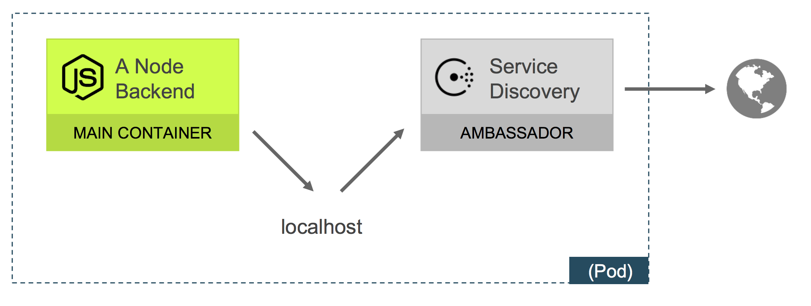
</p>

这样做，负责Node模块开发的只需要假定所有的通信都是来自于本机，而把通信的复杂性交给代理容器，去处理诸如负载均衡，安全，过滤请求，必要时中断通信等功能。

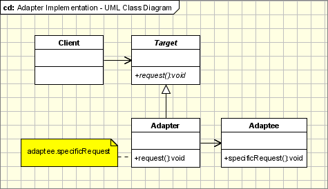

大家常常会把面向对象的Proxy模式，Bridge模式和[Adapter模式](https://en.wikipedia.org/wiki/Adapter_pattern)搞混，因为单单从UML关系图上来看，它们都大同小异。似乎只是取了不同的名字。事实也确实如此，就像几乎所有的OO模式都是组合模式的衍生，所有容器模式都是边车模式的衍生。

在下图的例子中，如果Logging Adapter的名字不提及Adapter，我们不会认为这是个适配器模式。

<p style="max-width: 540px;">
  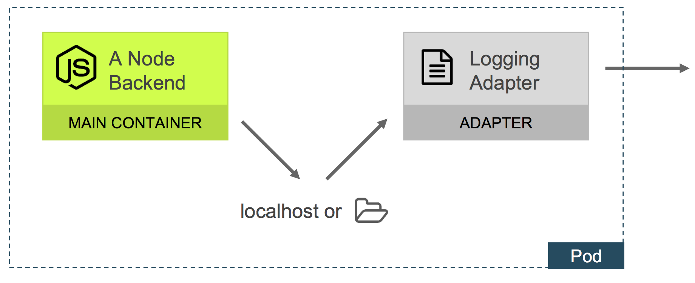
</p>

其实适配器模式关注的是如果把Pod内部的不同容器的功能通过适配器统一的暴漏出来。在上图中，如果我们再多加一个容器，它同时会向卷中写入日志的化，这样就更清楚了。Logging Adapter适配不同容器用不同的接口提供的日志，并提供统一的访问接口。

### 容器链

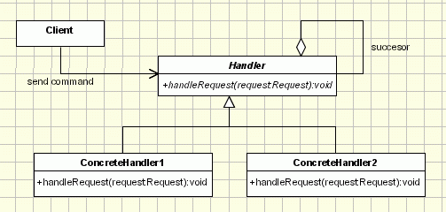

类似于OO的[责任链模式](http://www.oodesign.com/chain-of-responsibility-pattern.html)，把负责不同功能的容器按照依赖顺序链在一起，也是一种常见的模式。

<p style="max-width: 600px;">
  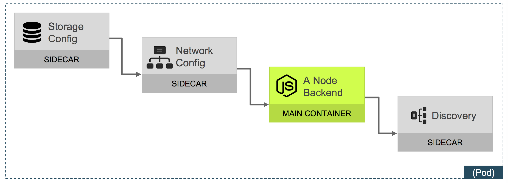
</p>

### 准备就绪的Pod

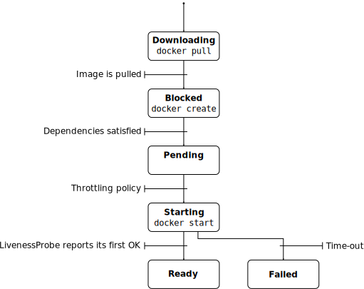

通常作为服务的容器有一个启动的过程，在启动过程中，服务是不可用的。Kubernetes提供了[Readiness](/learning/k8s-intermediate/workload/pod-lifecycle.html#容器的检查)探测功能。

``` yaml
readinessProbe:
  httpGet:
    path: /
    port: 5000
  timeoutSeconds: 1
  periodSeconds: 5
```

和其它模式相比，这个更像是一个使用Kubernetes的最佳实践。

## 反模式

### 构建环境和运行环境混杂在一起

应该使得用于生产的运行环境的镜像尽可能的小，避免在运行环境的镜像中包含构建时的残留。

例如下面的Dockerfile例子：

``` dockerfile
FROM ubuntu:14.04

RUN apt-get update
RUN apt-get install gcc
RUN gcc hello.c -o /hello
```

在这个构建的镜像中，有很多不需要也不应该出现在生产环境中的东西，例如gcc，源代码hello.c。这样的结果既不安全（直接暴漏源代码），也会有性能开销（过大的镜像体积导致加载变慢）。

Docker17.05 以后提供的[multi-stage builds](https://docs.docker.com/develop/develop-images/multistage-build/)也可以解决这个问题。

### 直接使用Pod

避免直接使用Pod，用Deployment来管理Pod。利用Deployment可以很方便的对Pod进行扩展和管理。

### 使用latest标签

Latest标签用于标记最近的稳定版本，然而在创建容器时，尽可能避免在生产环境使用Latest标签。即使使用imagePullPolicy选项为alway。

### 快速失败的任务

Job是Kubernetes提供的只运行一次的容器，和service正好相反。要避免快速失败

``` yaml
apiVersion: batch/v1
kind: Job
metadata:
  name: bad
spec:
  template:
    metadata:
      name: bad
    spec:
      restartPolicy: Never
      containers:
      - name: box
        image: busybox
        command: ["/bin/sh", "-c", "exit 1"]
```

如果你尝试在你的cluster里面创建以上的Job，你可能会碰到如下的状态。

```
$ kubectl describe jobs 
Name:		bad
Namespace:	default
Image(s):	busybox
Selector:	controller-uid=18a6678e-11d1-11e7-8169-525400c83acf
Parallelism:	1
Completions:	1
Start Time:	Sat, 25 Mar 2017 20:05:41 -0700
Labels:		controller-uid=18a6678e-11d1-11e7-8169-525400c83acf
		job-name=bad
Pods Statuses:	1 Running / 0 Succeeded / 24 Failed
No volumes.
Events:
  FirstSeen	LastSeen	Count	From			SubObjectPath	Type		Reason			Message
  ---------	--------	-----	----			-------------	--------	------			-------
  1m		1m		1	{job-controller }			Normal		SuccessfulCreate	Created pod: bad-fws8g
  1m		1m		1	{job-controller }			Normal		SuccessfulCreate	Created pod: bad-321pk
  1m		1m		1	{job-controller }			Normal		SuccessfulCreate	Created pod: bad-2pxq1
  1m		1m		1	{job-controller }			Normal		SuccessfulCreate	Created pod: bad-kl2tj
  1m		1m		1	{job-controller }			Normal		SuccessfulCreate	Created pod: bad-wfw8q
  1m		1m		1	{job-controller }			Normal		SuccessfulCreate	Created pod: bad-lz0hq
  1m		1m		1	{job-controller }			Normal		SuccessfulCreate	Created pod: bad-0dck0
  1m		1m		1	{job-controller }			Normal		SuccessfulCreate	Created pod: bad-0lm8k
  1m		1m		1	{job-controller }			Normal		SuccessfulCreate	Created pod: bad-q6ctf
  1m		1s		16	{job-controller }			Normal		SuccessfulCreate	(events with common reason combined)
```

因为任务快速失败。Kubernetes认为任务没能成功启动，尝试创建新的容器以恢复这个失败，导致的Cluster会在短时间创建大量的容器，这样的结果可能会消耗大量的计算资源。

在Spec中使用.spec.activeDeadlineSeconds来避免这个问题。这个参数定了等待多长时间重试失败的Job。

## 参考资料

- [https://www.redhat.com/cms/managed-files/cl-cloud-native-container-design-whitepaper-f8808kc-201710-v3-en.pdf](https://www.redhat.com/cms/managed-files/cl-cloud-native-container-design-whitepaper-f8808kc-201710-v3-en.pdf)
- [https://www.slideshare.net/luebken/container-patterns](https://www.slideshare.net/luebken/container-patterns)
- [https://github.com/luebken/container-patterns](https://github.com/luebken/container-patterns)
- [https://kubernetes.io/blog/2015/06/the-distributed-system-toolkit-patterns/](https://kubernetes.io/blog/2015/06/the-distributed-system-toolkit-patterns/)
- [http://docs.projectatomic.io/container-best-practices/](http://docs.projectatomic.io/container-best-practices/)
- [https://www.usenix.org/system/files/conference/hotcloud16/hotcloud16_burns.pdf](http://https//www.usenix.org/system/files/conference/hotcloud16/hotcloud16_burns.pdf)
- [https://github.com/gravitational/workshop/blob/master/k8sprod.md](https://github.com/gravitational/workshop/blob/master/k8sprod.md)
