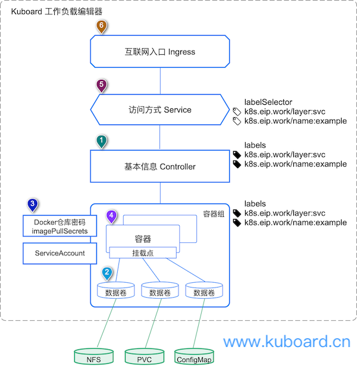
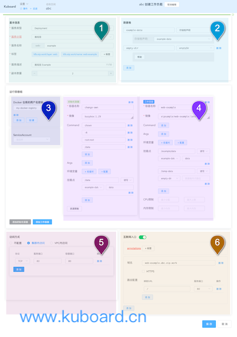

# 从微服务视角理解Kubernetes

<AdSenseTitle/>

## 微服务

当我们谈论微服务的时候，总避免不了说 Spring Cloud / Dubbo，这些微服务架构的采用，确实达到了我们对他的期许：分布式、熔断/限流、高可用、可扩展、分离关注、链路追踪、小团队快速迭代。

然而，微服务架构的引入在解决单体应用的一些问题的同时，也给我们带来了新的复杂度：
* 更多的技术组件
* 更多的部署单元
* 更复杂的部署脚本

Kuboard 为了降低 Kubernetes 学习使用门槛，提供了：
* **K8S快速安装文档**
  
  过去仅仅是安装 Kubernetes 这件事情，初学者都需要用 1 个星期甚至 1 个月才能搞定。如今 Kuboard 提供了安装文档，每天有300多人验证的，初学者30分钟即可完成安装，碰到问题还可在QQ社群在线免费答疑。

* **免费K8S教程**
  
  Kubernetes 作为一款开源软件，其官方文档为英文，市面上大部分中文书籍与当前最新的版本存在出入。kuboard.cn 提供了最新的 K8S 免费中文教程，整理了最佳学习路径，帮助初学者快速完成从入门到投产的过程。

* **管理面板**

  使用 Kuboard 作为 Kubernetes 管理面板，无需编写 yaml 文件，直接以图形界面完成 Kubernetes 的管理和运维任务

* **微服务实战**
  
  以当下主流的 Spring Cloud 微服务架构作为例子，完成在 Kubernetes 上落地微服务架构的任务。

Kuboard 在落地 Spring Cloud 微服务的过程中，设计了如下图所示的微服务参考架构：

该图的左侧是 DevOps 平台，涵盖构建、测试、包管理、部署及运维、监控及评估。右侧是运行时平台，分成互联网层、展现层、微服务层、数据层。

### 运行时环境：

* 展现层主要是前端项目（Vue、微信小程序等），通过服务网关的路由调用微服务层 SpringBoot 实现的各种业务接口；一个大型互联网产品中，需要多少个展现层的前端项目主要取决于两个因素：该产品有多少中类型的参与方、每一种参与方各有多少种渠道接入方式。例如，某交易撮合平台，其需要的展现层项目如下列表所示：

  | 参与方     | 渠道       | 展现层项目       |
  | ---------- | ---------- | ---------------- |
  | 散客 | PC浏览器   | 官网       |
  |            | 移动站     | 移动站     |
  |            | 微信小程序 | 微信小程序 |
  |            | App        | APP        |
  | 大客户     | PC浏览器   | VIP客户端  |
  | 平台方     | PC浏览器   | 运营工作台 |
  | 供应商     | 微信小程序 | 接单工具   |
  |            | APP        | 接单APP    |

  展现层项目由于参与方不同，账号体系也就不同，因此，鉴权授权的逻辑也有较大的差异，基于这样的考虑，我们为不同的展现层项目各自部署对应的接入网关 Spring Cloud Gateway。

* 微服务层的项目包括 Spring Cloud Gateway 的主要组件，例如：服务注册 Eureka、服务网关 Spring Cloud Gateway、实现微服务的 Spring Boot项目，还有一些服务层用到的中间件（消息队列 Rabbit MQ、缓存服务 Redis等）

  服务层里，项目数量最多的类型是实现微服务的 Spring Boot 项目。使用微服务架构，如何将单体应用的各个模块拆分成多个微服务单元，一直一个大家很关注却未能深入探讨的问题。作者设计过多个微服务系统的架构之后，认为，一个合理的服务拆分方式是以领域驱动设计的结果作为参考，可以将每一个领域的上下文边界对应为一个微服务单元。如此一来，在使用服务网关隔离的前后端分离的微服务架构中，前端微服务划的分重要依据是参与方类型 + 接入渠道，后端微服务划分的重要依据是领域设计的上下文边界。

  作为一个完整的交易撮合平台，涉及到的业务领域较为庞大，涉及到数十个业务问题领域。合理拆分的微服务架构，可以使得企业对不同的问题领域分而治之。

### DevOps平台

运行时环境采纳了微服务架构后，因为技术组件的多样性、业务领域的多样性，导致了微服务拆分之后，产生了数十个微服务可部署单元。这个情况给技术团队带来了前所未有的挑战：

* 构建次数多，人工难以完成

* 部署实例多，无法人工管理
* 运行实例多，出了故障不好定位

在解决这些问题的过程中，最终摸索出了一套以 Kubernetes 为关键环节的微服务 DevOps 平台。

如上图所示，假设有20+ 开发人员，

* 每天提交100次代码，将每天产生100余次构建和自动测试，新增80-100个 docker 镜像
* 每天更新开发环境、测试环境各一次，每次重新部署20+ 个 docker container
* 每周更新 STAGING 环境 3-4次，每周更新 PRODUCTION 环境 1-2 次

在单体应用的时候，即使是手工打包也是能够完成每天发布新版本的要求的。但是在微服务环境下，这个工作就必须交给 DevOps 的 Pipe Line 来完成。

DevOps 在构建阶段的主角是 GitLab、npm、maven、docker、Harbor等工具集，在部署和运维环节的主角就是Kubernetes了。

## 微服务 + Kubernetes

最开始尝试容器化的时候，使用了 docker、docker-compose，但是docker-compose的编排能力有限，在考虑分布式方案时，从 docker swarm、kuberenetes 之中选择了 Kubernetes，然而，Kubernetes 相较于 docker-compose，有一个很高的学习门槛，集群的安装管理、YAML 文件的编写、多环境（开发环境、测试环境、准生产环境、生产环境）的配置、分布式环境下的问题诊断和性能优化等，一系列的问题需要解决，团队中也出现一些抵触情绪，对新事物持观望的态度。

Kubernetes在诸多大厂的成功实施，仍然让我们坚信这条道路的正确性。为了解决 Kubernetes 学习门槛高、YAML 文件编写复杂等一系列现实中的困难，我们研发了 Kuboard，一款 Kubernetes 的图形化管理控制工具。

Kuboard 诞生于 Spring Cloud 微服务落地的实践过程中，他在管理和使用 Kubernetes 的时候，也更多地是从微服务的视角来看待 Kubernetes。

具体体现在如下三个视角：

* 集群概览
* 名称空间
* 工作负载

### 集群概览

从管理和部署微服务的视角来看，微服务应用是分布式应用，应该部署在一个分布式集群当中，这个集群由诸多计算资源和存储资源组成，微服务本身不应该关心最终使用了哪个计算节点，持久化存储被存放在什么位置；为了更好地利用资源，一个集群应该被划分成多个名称空间，每个名称空间内可以部署一整套微服务应用，名称空间之间不应相互干扰。

如下图所示：***Kuboard 集群概览界面***

Kuboard 集群概览视角，映射了 Kubernetes 中的如下几个重要概念：

* Cluster
* Node
* Storage Class / Persistent Volume
* Namespace

### 名称空间

在集群概览界面中，点击一个名称空间，可以进入Kuboard名称空间界面。一个名称空间内部，是微服务部署相关的所有重要元素。与本文开头的微服务参考架构相匹配，Kuboard 认为，微服务的主要分层包括：

* 展现层
* 网关层
* 服务层
* 持久层
* 中间件层
* 监控层

如下图所示：***Kuboard名称空间截图***

Kuboard 名称空间视角，映射了 Kubernetes 中的如下几个重要概念：

* Workload（Deployment、StatefulSet、DaemonSet）
* Service（微服务上方如果有浅蓝色长条块，说明该微服务有配置 Service）
* Ingress（微服务上方如果有黑色短条块，说明该微服务有配置 Ingress）
* Secrets（用来配置私有 docker 镜像仓库的用户名密码、HTTPS 的证书等信息，可在创建微服务 Workload 时引用）
* ConfigMap（配置，用来存储配置信息，可定义微服务的公共环境变量，并在创建微服务 Workload 时引用）
* Persistent Volume Claim（存储卷声明，用来声明存储卷，可在创建微服务 Workload 时引用）

Kuboard 名称空间界面中，还为典型的运维场景提供了便捷的操作入口，例如：

* 创建工作负载（通过工作负载编辑器完成微服务应用的部署，而不是编写冗长的YAML文件，再使用复杂的 kubectl 命令）
* 导出工作负载（选择名称空间中的微服务元素，导出到一个文件中）
* 导入工作负载（将 Kuboard 导出的 YAML 文件导入到一个新的名称空间中，通过导出和导入的功能，用户可以快速的将开发环境复制成测试环境）
* 容器组列表（查看当前名称空间中的容器组，可批量删除选中容器组，删除容器组后，Kubernetes将重新 Schedule一个容器组以替换被删除的容器组，此时将重新抓取镜像，此特性可用于测试环境中在 image tag 不改变的情况下的版本更新）
* 调整镜像版本（修改容器镜像的标签，此特性用于在正式环境中进行版本更新的操作）
* 高亮显示包含错误事件的微服务（如截图中红色的微服务 busybox）

### 工作负载

从名称空间界面中点击一个工作负载（微服务），可进入 Kuboard 工作负载编辑器界面。Kuboard 当前已经支持的工作负载 Workload 类型有：Deployment / StatefulSet / DaemonSet。

Kubernetes 中，与 Workload 相关的概念非常多，Kuboard 从微服务部署的实际需要出发，按照下图所示的方式理解这些相关概念：

Kuboard 工作负载视图中，关联的 Kubernetes 中如下几个重要的概念：

* Label / Label Selector
* Workload Controller 工作负载控制器（Deployment / StatefulSet / DaemonSet）
* Volume 数据卷
* ImagePullSecrets （Docker 仓库用户名密码，用于访问私有 docker  镜像仓库）
* ServiceAccount
* Container 容器
* Service 访问方式
* Ingress 互联网入口

Kuboard 认为，掌握这些概念并正确理解这些概念的关系之后，就可以胜任使用 Kubernetes 部署微服务的工作，为了使事情变得更简单，避免编写冗长的 YAML 文件，Kuboard 以此概念为基础，设计了 Kuboard 工作负载编辑器，如下图所示：

## 微服务 + 监控/评估

如何监控和评估微服务的运行状况，并根据监控结果进行问题的定位和诊断？基于 Kubernetes / Spring Cloud / Java 等，开源社区已经提供了非常丰富的监控组件，例如：

* 资源层监控：Prometheus + Grafana + Node Exporter 等组件，监控Kubernetes 节点的 CPU、内存、网络、磁盘等使用情况
* 中间件层监控：Prometheus + Grafana + MySQL Exporter + Nginx Exporter + JVM Exporter 等，监控 MySQL、Nginx、JVM 等中间件的使用情况
* 链路/APM监控：Pinpoint / Skywalking 等监控工具，监控应用程序的性能表现

各种监控系统各有侧重，如果想要取得比较好的监控效果，必须克服如下几个困难：

* 搭建和配置监控系统
* 定位和诊断问题时，在不同监控系统中来回切换，进入监控系统并寻找对应微服务的监控结果

Kuboard 认为，应该以微服务视角快速查看到该微服务在不同层面的监控结果。因此，在 Kuboard 的工作负载（微服务）查看界面中，可以直接点击进入不同监控系统对应的监控结果，无需再监控系统内反复查找。如一下截图所示：

点击图中 ***Nginx 监控***、 ***容器组监控***、 ***所在节点监控*** 等按钮，可以直接打开该容器组对应的监控界面。因为篇幅的限制，此处不再展开描述，请点击 <a target="_blank" :href="`http://demo.kuboard.cn/dashboard?k8sToken=${$site.themeConfig.kuboardToken}`">
  Kuboard 在线体验
</a> 查看具体的监控效果。

## 总结

Kuboard 产生于 Spring Cloud 微服务落地的实践中，并在许多的实际项目中投入了使用，以微服务的视角理解和审视了 Kubernetes，并基于Kubernetes为用户提供了4个微服务视图：

* 集群概览视图
* 名称空间视图
* 工作负载视图
* 监控视图

Kuboard 在实际项目中经过多次历练，功能不断完善，成长为一个基于 Kubernetes 的成熟的微服务管理工具。自 www.kuboard.cn 推出以来，得到了众多网友非常多的反馈，碰到问题，可以通过 Kuboard 社群得到支持。
