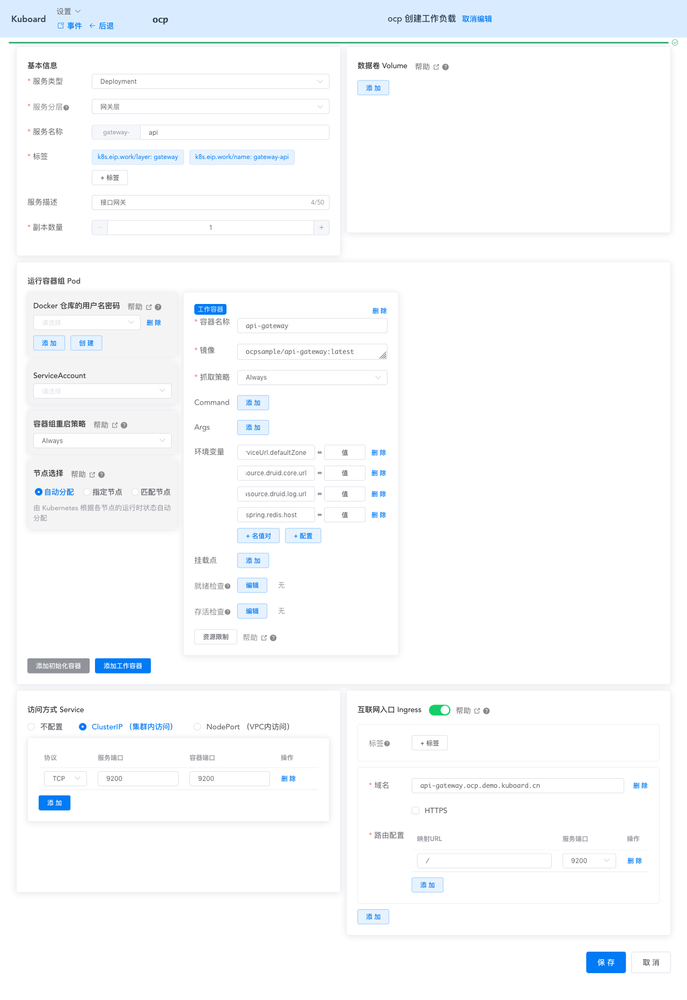
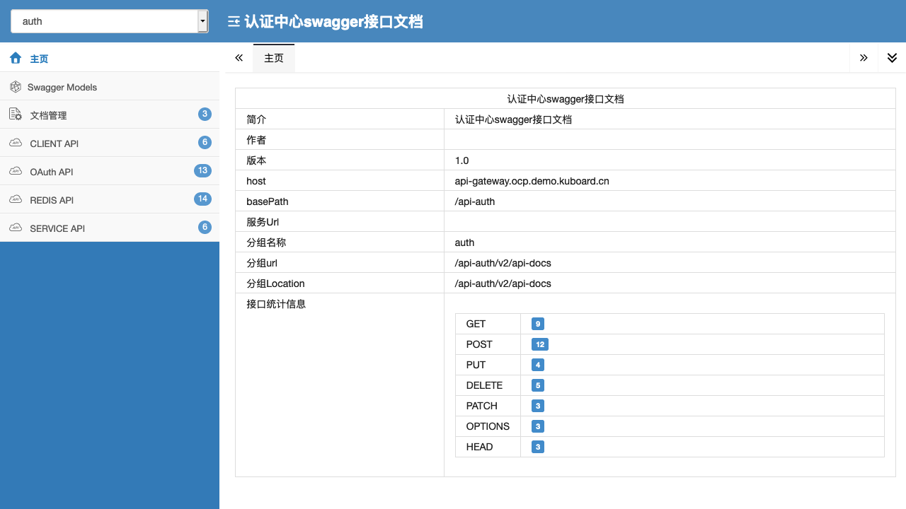

# 在K8S上部署api-gateway

<AdSenseTitle/>

本文假设您已经完成了 [在Kubernetes 上部署 Spring Cloud - OCP](./) 系列教程的前面部分，并已经完成了 eureka-server、api-gateway-mysql、log-center-mysql、redis、auth-server、user-center 在 K8S 上的部署。

## 理解api-gateway

api-gateway 是一个 Spring Boot 项目，其配置文件位于路径 `api-gateway/src/main/resources`，该目录内容如下所示：

``` sh
├── application.yml
├── bootstrap.yml
└── mybatis.cfg.xml
```

### 监听端口

参考 `bootstrap.yml` 的如下代码片段，api-gateway监听 7000 端口

``` yaml {3}
#端口配置
server:
  port: 9200
```

### 依赖项

api-gateway 的部署依赖有：
* eureka-server
* mysql
* redis

上述依赖在教程的前面部分都已经完成部署。

这些依赖项的情况与 [auth-server依赖项](./auth-server.html#依赖项) 的情况大致相同，此处不再重复描述


## 确定部署方案

api-gateway 为无状态服务，使用 Deployment 部署。

根据 [在K8S上部署eureka-server](./eureka-server.html)、 [在K8S上部署mysql](./mysql.html)、 [在K8S上部署redis](./redis.html) 的部署结果，我们应该通过环境变量覆盖 api-gateway 的如下参数：

* eureka.client.serviceUrl.defaultZone

  ```
  http://cloud-eureka-0.cloud-eureka.ocp.svc.cluster.local:1111/eureka,http://cloud-eureka-1.cloud-eureka.ocp.svc.cluster.local:1111/eureka,http://cloud-eureka-2.cloud-eureka.ocp.svc.cluster.local:1111/eureka
  ```
* spring.datasource.druid.core.url
  
  ```
  jdbc:mysql://db-auth-center:3306/oauth-center?useUnicode=true&characterEncoding=utf-8&allowMultiQueries=true&useSSL=false
  ```
* spring.datasource.druid.core.username
  
  `root` 与默认配置相同
* spring.datasource.druid.core.password

  `root` 与默认配置相同
* spring.datasource.druid.log.url
  
  ```
  jdbc:mysql://db-log-center:3306/log-center?useUnicode=true&characterEncoding=utf-8&allowMultiQueries=true&useSSL=false
  ```
* spring.datasource.druid.log.username
  
  `root` 与默认配置相同
* spring.datasource.druid.log.password
  
  `root` 与默认配置相同
* spring.redis.host
  
  `cloud-redis`
* spring.redis.port
  
  `6379` 与默认配置相同

## 部署api-gateway

* 在 Kuboard 界面进入 `ocp` 名称空间，点击 **创建工作负载** 按钮，并填写表单，如下图所示：

  | 字段名称 | 填写内容                                                     | 备注                                        |
  | -------- | ------------------------------------------------------------ | ------------------------------------------- |
  | <div style="min-width:70px;">服务类型</div> | Deployment                                                   |                                             |
  | 服务分层 | 网关层                                                       |                                             |
  | 服务名称 | api                                                 |                                             |
  | 服务描述 | 接口网关                                                     |                                             |
  | 副本数   | 1                                                            |                                             |
  | 容器名称 | api-gateway                                                 |                                             |
  | 镜像     | ocpsample/api-gateway:latest                                 |                                             |
  | 抓取策略 | Always                                                       |                                             |
  | 环境变量 | <div style="min-width: 400px;"><font color="blue">eureka.client.serviceUrl.defaultZone=</font>http://cloud-eureka-0.cloud-eureka.ocp.svc.cluster.local:1111/eureka,http://cloud-eureka-1.cloud-eureka.ocp.svc.cluster.local:1111/eureka,http://cloud-eureka-2.cloud-eureka.ocp.svc.cluster.local:1111/eureka<br /><font color="blue">spring.datasource.druid.core.url=</font>jdbc:mysql://db-auth-center:3306/oauth-center?useUnicode=true&characterEncoding=utf-8&allowMultiQueries=true&useSSL=false<br /><font color="blue">spring.datasource.druid.log.url=</font>jdbc:mysql://db-log-center:3306/log-center?useUnicode=true&characterEncoding=utf-8&allowMultiQueries=true&useSSL=false<br /><font color="blue">spring.redis.host=</font>cloud-redis</div> | 填入 kuboard 时<br/>环境变量名后面不带 `=`<br/>此处的内容与前面的mysql 和 redis 的部署匹配，请谨慎修改 |
  | Service  | ClusterIP（集群内访问）<br />协议`TCP` 服务端口`9200` 容器端口 `9200` |                                             |
  | Ingress  | 域名 `api-gateway.ocp.demo.kuboard.cn`<br />URL `/` 服务端口 `9200` | 请使用您自己的Ingress域名                                        |

  ::: tip 域名
  * 该域名由 `工作负载名`.`名称空间`.`集群名字`.`一级域名` 组成，这种命名规则下，只需要将 `*.demo.kuboard.cn` 的域名解析指向集群 Ingress Controller 的地址就可以
  * 关于 Ingress，请参考 [Ingress通过互联网访问您的应用](/learning/k8s-intermediate/service/ingress.html)
  :::

  
  
  ## 检查部署结果

* 在浏览器访问 [http://api-gateway.ocp.demo.kuboard.cn/doc.html](http://api-gateway.ocp.demo.kuboard.cn/doc.html)
  > 此处请使用您自己的 url

  


* :tada: :tada: :tada: 您已在 K8S 上完成了 api-gateway 的部署
