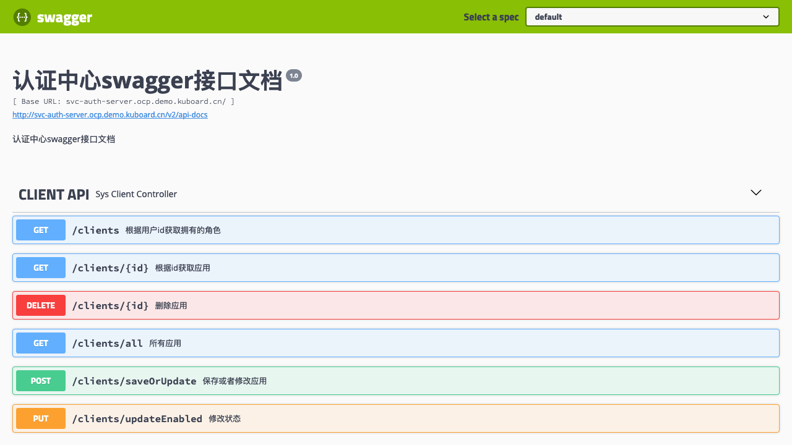

# 在K8S上部署auth-center

本文假设您已经完成了 [在Kubernetes 上部署 Spring Cloud - OCP](./) 系列教程的前面部分，并已经完成了 eureka-server、auth-center-mysql、redis 在 K8S 上的部署。

## 理解auth-server

auth-server 是一个 Spring Boot 项目，其配置文件位于路径 `oauth-center/auth-server/src/main/resources`，该目录内容如下所示：

``` sh
├── application.yml
├── bootstrap.yml
└── mybatis.cfg.xml
```

### 监听端口

参考 `bootstrap.yml` 的如下代码片段，auth-server 监听 8000 端口

``` yaml {3}
#端口
server:
  port: 8000
#  port: ${randomServerPort.value[8000,8000]}    #随机端口
```

### 依赖项

auth-server 的部署依赖有：
* eureka-server
* mysql
* redis

上述依赖在教程的前面部分都已经完成部署。

* **eureka-server** 依赖项

参考 `bootstrap.yml` 的如下代码片段，auth-server 中默认配置的 eureka-server 的地址为 `http://127.0.0.1:1111/eureka`

``` yaml {5}
#eureka client 配置          
eureka:
  client:
    serviceUrl:
      defaultZone:  http://127.0.0.1:1111/eureka  #http://130.75.131.241:8761/eureka,http://130.75.131.248:8762/eureka
      #http://134.224.249.33:1111/eureka/  正式库
      #http://134.224.249.33:1111/eureka/  测试库
```

* **mysql** 依赖项

参考 `application.yml` 的如下代码片段，auth-server 中默认配置的 mysql 的连接参数如下：

``` yaml {10,11,12,15,16,17}
spring:
  session:
    store-type: redis  
  datasource:
    dynamic:
      enable: true
    druid: 
      # JDBC 配置(驱动类自动从url的mysql识别,数据源类型自动识别)
      core:
        url: jdbc:mysql://59.110.164.254:3306/oauth-center?useUnicode=true&characterEncoding=utf-8&allowMultiQueries=true&useSSL=false 
        username: root
        password: root
        driver-class-name:  com.mysql.jdbc.Driver
      log:
        url: jdbc:mysql://59.110.164.254:3306/log-center?useUnicode=true&characterEncoding=utf-8&allowMultiQueries=true&useSSL=false 
        username: root
        password: root
        driver-class-name:  com.mysql.jdbc.Driver
```

* **redis** 依赖项

参考 `application.yml` 的如下代码片段，auth-server 中默认配置的 redis 的连接参数如下：

``` yaml {5,6}
spring:
  # ... ... ...
  redis:
  ################### redis 单机版 start ########################## 
    host: 59.110.164.254
    port: 6379    
    timeout: 6000
    database: 3
```

## 确定部署方案

auth-server 为无状态服务，使用 Deployment 部署。

根据 [在K8S上部署eureka-server](./eureka-server.html)、 [在K8S上部署mysql](./mysql.html)、 [在K8S上部署redis](./redis.html) 的部署结果，我们应该通过环境变量覆盖 auth-server 的如下参数：

* eureka.client.serviceUrl.defaultZone

  ```
  http://cloud-eureka-0.cloud-eureka.ocp.svc.cluster.local:1111/eureka,http://cloud-eureka-1.cloud-eureka.ocp.svc.cluster.local:1111/eureka,http://cloud-eureka-2.cloud-eureka.ocp.svc.cluster.local:1111/eureka
  ```
* spring.datasource.druid.core.url
  
  ```
  jdbc:mysql://db-auth-center:3306/oauth-center?useUnicode=true&characterEncoding=utf-8&allowMultiQueries=true&useSSL=false
  ```
* spring.datasource.druid.core.username
  
  `root` 与默认配置相同
* spring.datasource.druid.core.password

  `root` 与默认配置相同
* spring.datasource.druid.log.url
  
  ```
  jdbc:mysql://db-log-center:3306/log-center?useUnicode=true&characterEncoding=utf-8&allowMultiQueries=true&useSSL=false
  ```
* spring.datasource.druid.log.username
  
  `root` 与默认配置相同
* spring.datasource.druid.log.password
  
  `root` 与默认配置相同
* spring.redis.host
  
  `cloud-redis`
* spring.redis.port
  
  `6379` 与默认配置相同

## 部署auth-server

* 在 Kuboard 界面进入 `ocp` 名称空间，点击 **创建工作负载** 按钮，并填写表单，如下图所示：

  | 字段名称 | 填写内容                                                     | 备注                                        |
  | -------- | ------------------------------------------------------------ | ------------------------------------------- |
  | <div style="min-width:70px;">服务类型</div> | Deployment                                                   |                                             |
  | 服务分层 | 服务层                                                       |                                             |
  | 服务名称 | auth-server                                                  |                                             |
  | 服务描述 | 认证中心                                                     |                                             |
  | 副本数   | 1                                                            |                                             |
  | 容器名称 | auth-server                                                  |                                             |
  | 镜像     | ocpsample/auth-server:latest                                 |                                             |
  | 抓取策略 | Always                                                       |                                             |
  | 环境变量 | <div style="min-width: 400px;"><font color="blue">eureka.client.serviceUrl.defaultZone=</font>http://cloud-eureka-0.cloud-eureka.ocp.svc.cluster.local:1111/eureka,http://cloud-eureka-1.cloud-eureka.ocp.svc.cluster.local:1111/eureka,http://cloud-eureka-2.cloud-eureka.ocp.svc.cluster.local:1111/eureka<br /><font color="blue">spring.datasource.druid.core.url=</font>jdbc:mysql://db-auth-center:3306/oauth-center?useUnicode=true&characterEncoding=utf-8&allowMultiQueries=true&useSSL=false<br /><font color="blue">spring.datasource.druid.log.url=</font>jdbc:mysql://db-log-center:3306/log-center?useUnicode=true&characterEncoding=utf-8&allowMultiQueries=true&useSSL=false<br /><font color="blue">spring.redis.host=</font>cloud-redis</div> | 此处的内容与前面的mysql 和 redis 的部署匹配，请谨慎修改 |
  | Service  | ClusterIP（集群内访问）<br />协议`TCP` 服务端口`8000` 容器端口 `8000` |                                             |
  | Ingress  | 域名 `svc-auth-server.ocp.demo.kuboard.cn`<br />URL `/` 服务端口 `8000` | 请使用您自己的Ingress域名                                        |

  ::: tip 域名
  * 该域名由 `工作负载名`.`名称空间`.`集群名字`.`一级域名` 组成，这种命名规则下，只需要将 `*.demo.kuboard.cn` 的域名解析指向集群 Ingress Controller 的地址就可以
  * 在测试环境，为了更好地测试，才为 svc 配置 Ingress
  * 服务层的服务通过 eureka-server 进行服务发现，因此，原则上不需要为 Spring Cloud 在服务层的 Pod 配置 Kubernetes Service，此处是为了配置 Ingress 才启用 Kubernetes Service
  :::

  

## 检查部署结果

* 在浏览器访问 [http://svc-auth-server.ocp.demo.kuboard.cn/swagger-ui.html](http://svc-auth-server.ocp.demo.kuboard.cn/swagger-ui.html)
  > 此处请使用您自己的 url

  

* :tada: :tada: :tada: 您已在 K8S 上完成了 auth-server 的部署
