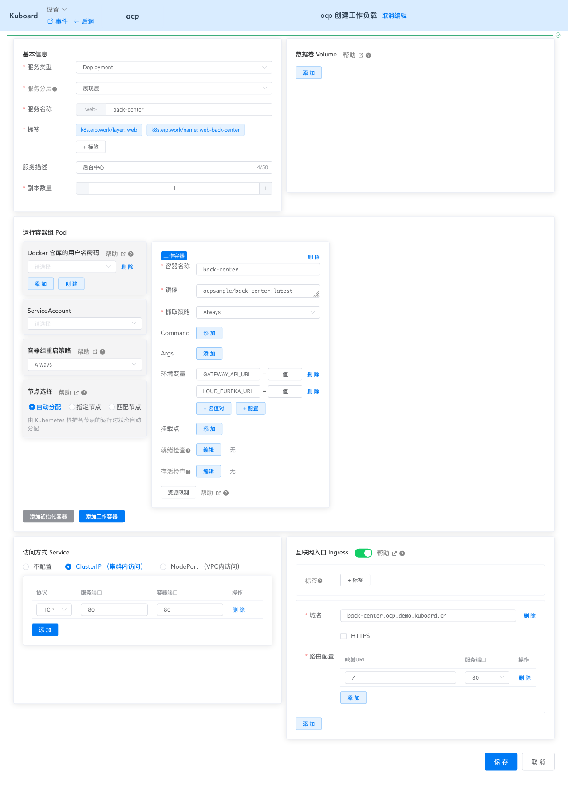
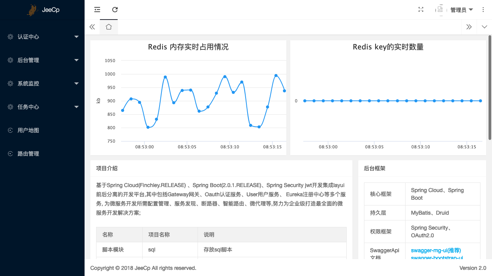

# 在K8S上部署back-center

本文假设您已经完成了 [在Kubernetes 上部署 Spring Cloud - OCP](./) 系列教程的前面部分，并已经完成了 eureka-server、user-center-mysql、log-center-mysql、redis、auth-server、user-center 在 K8S 上的部署。

## 理解back-center

back-server 是一个前端项目，OCP中，将其运行在一个 SpringBoot 中。

该项目中，与服务端连接的参数，请参考 `web-portal/back-center/src/main/view/static/module/config.js` 中的如下代码片段，OCP需要在前端项目中引用：
* `base_server` 即 api-gateway 的 URL 地址，`http://api-gateway.ocp.demo.kuboard.cn/`
* `eureka_server` 即 eureka-server 的 URL 地址 `http://cloud-eureka.ocp.demo.kuboard.cn/` （经确认，实际并没用到，我们在此处仍然修改该取值）

### 依赖项

back-center 的部署依赖有：
* api-gateway

上述依赖在教程的前面部分都已经完成部署。

## 确定部署方案

back-center 为无状态服务，使用 Deployment 部署。

前端项目中需要替换的两个参数都是 js 代码中的内容，执行点是客户端浏览器，因此，不能够通过环境变量注入该参数。由于我们只需要 `web-portal/back-center/src/main/view/static` 目录下的静态内容，且 js 中的变量不能像 java 一样，通过环境变量覆盖，此时，我们使用 nginx 部署该项目显得更为合理一些。

因此，我们为其构建一个 nginx 的 docker 镜像。

### 构建docker镜像

* 在 master 节点上执行本章节 “构建docker镜像” 的内容

* 创建文件 `/root/open-capacity-platform/web-portal/back-center/entry-point.sh`，内容如下所示：

  该文件在启动 nginx 前，从环境变量获得参数，并以此为依据，使用 sed 命令修改 config.js 中对应字段的取值，以便我们能够获得一个可以适应测试环境、生产环境部署的 docker 镜像。

  ``` sh
  #!/bin/sh
  echo "GATEWAY_API_URL  为 ${GATEWAY_API_URL}"
  echo "CLOUD_EUREKA_URL 为 ${CLOUD_EUREKA_URL}"
  sed -i "s#base_server.*#base_server: '${GATEWAY_API_URL}',#g" /usr/share/nginx/html/module/config.js
  sed -i "s#eureka_server.*#eureka_server: '${CLOUD_EUREKA_URL}',#g" /usr/share/nginx/html/module/config.js
  echo "参数修改完毕，如下所示："
  cat /usr/share/nginx/html/module/config.js
  echo ""
  echo "启动 nginx"
  nginx -g "daemon off;"
  ```

* 创建文件 `/root/open-capacity-platform/web-portal/back-center/dockerfile`，内容如下所示：

  ``` dockerfile
  FROM nginx:1.17.1
  LABEL maintainer="kuboard.cn"

  ADD ./entry-point.sh /entry-point.sh
  RUN chmod +x /entry-point.sh && rm -rf /usr/share/nginx/html

  # 创建环境变量的默认内容，防止 sed 脚本出错
  ENV GATEWAY_API_URL http://gateway_api_url_not_set/
  ENV CLOUD_EUREKA_URL http://cloud_eureka_url_not_set/
  ADD ./src/main/view/static /usr/share/nginx/html

  EXPOSE 80
  CMD ["/entry-point.sh"]
  ```

* 构建 docker 镜像并推送

  ``` sh
  # 切换到 back-center 目录
  cd /root/open-capacity-platform/web-portal/back-center
  # 使用你自己的 docker 用户名登录
  docker login
  # 构建镜像
  docker build -t ocpsample/back-center:latest .
  # 推送镜像
  docker push ocpsample/back-center:latest
  ```


## 部署back-center

* 在 Kuboard 界面进入 `ocp` 名称空间，点击 **创建工作负载** 按钮，并填写表单，如下图所示：

  | 字段名称 | 填写内容                                                     | 备注                                        |
  | -------- | ------------------------------------------------------------ | ------------------------------------------- |
  | <div style="min-width:70px;">服务类型</div> | Deployment                                                   |                                             |
  | 服务分层 | 展现层                                                       |                                             |
  | 服务名称 | back-center                                                 |                                             |
  | 服务描述 | 后台中心                                                     |                                             |
  | 副本数   | 1                                                            |                                             |
  | 容器名称 | back-center                                                 |                                             |
  | 镜像     | ocpsample/back-center:latest                                 |                                             |
  | 抓取策略 | Always                                                       |                                             |
  | 环境变量 | <div style="min-width: 400px;"><font color="blue">GATEWAY_API_URL=</font>http://api-gateway.ocp.demo.kuboard.cn/<br /><font color="blue">CLOUD_EUREKA_URL=</font>http://cloud-eureka.ocp.demo.kuboard.cn/</div> | 填入 kuboard 时<br/>环境变量名后面不带 `=`<br/> |
  | Service  | ClusterIP（集群内访问）<br />协议`TCP` 服务端口`80` 容器端口 `80` |                                             |
  | Ingress  | 域名 `back-center.ocp.demo.kuboard.cn/`<br />URL `/` 服务端口 `80` | 请使用您自己的Ingress域名                                        |

  ::: tip 域名
  * 该域名由 `工作负载名`.`名称空间`.`集群名字`.`一级域名` 组成，这种命名规则下，只需要将 `*.demo.kuboard.cn` 的域名解析指向集群 Ingress Controller 的地址就可以
  * 关于 Ingress，请参考 [Ingress通过互联网访问您的应用](/learning/k8s-intermediate/service/ingress.html)
  :::

  
  


## 检查部署结果

* 在浏览器访问 [http://back-center.ocp.demo.kuboard.cn/](http://back-center.ocp.demo.kuboard.cn/)
  > 此处请使用您自己的 url

  使用默认用户名密码 admin/admin 登录系统，可查看到登录后的结果如下所示：

  

* :tada: :tada: :tada: 您已在 K8S 上完成了 back-center的部署
