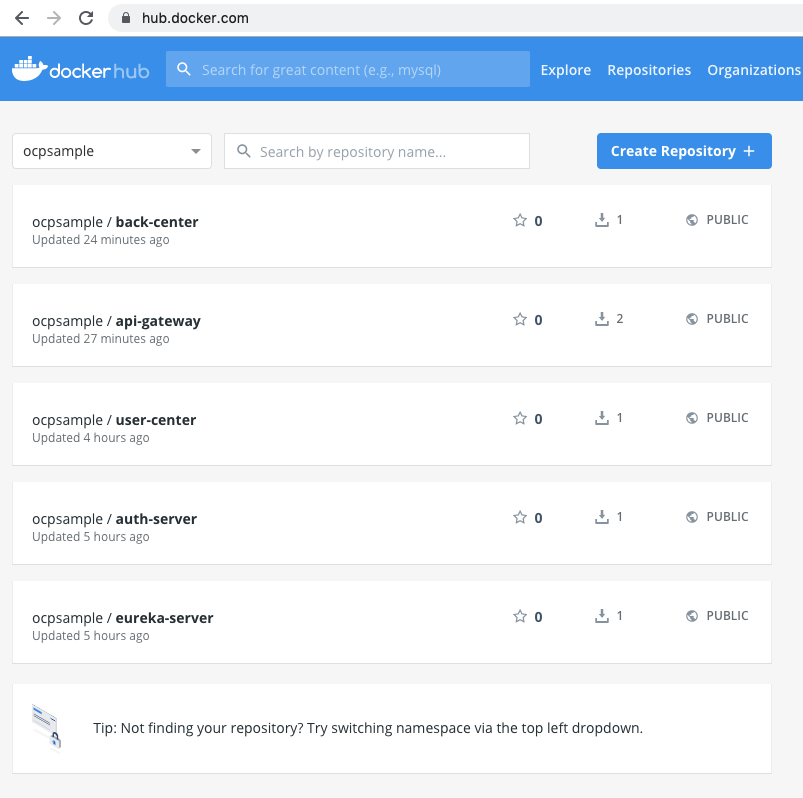

# 构建docker镜像并推送到仓库

<AdSenseTitle/>

本文假设您已经完成了 [准备OCP的构建环境和部署环境](./prepare.html)，在该文档的最后，我们将 Open Capacity Platform 的代码仓库克隆到了 master 节点的 /root/open-capacity-platform。

::: tip
* 假设您在 [https://hub.docker.com](https://hub.docker.com) 完成了注册，并获得了账号（本教程中，作者使用的 hub.docker.com 的账号为 `ocpsample`）
* 从完成后续教程的角度来看，您也可以不注册自己的 hub.docker.com 账号，不执行构建和镜像推送的操作，直接使用 ocpsamle 已经发布到 hub.docker.com 上的 docker 镜像完成本系列教程后面的部分。匿名在 [https://hub.docker.com](https://hub.docker.com) 搜索 `ocpsample`
:::


## 修改配置


修改 `/root/open-capacity-platform/pom.xml` 文件，修改其中的字段：
  *  `project --> properties --> docker.host` 修改为 `unix:///var/run/docker.sock`
  *  `project --> properties --> docker.image.prefix` 修改为 `ocpsample` （此处使用你在 https://hub.docker.com 的账号）

      ::: tip

      如果您使用自己的 docker 镜像仓库，您的 `docker.image.prefix` 要复杂一些，请参考 [使用私有仓库中的docker镜像](/learning/k8s-intermediate/private-registry.html)。具体而言，前缀应该由您的docker镜像仓库的多个参数组成，例如：
      <font color="blue" weight="500">my-registry.example.com</font>:<font color="green" weight="500">5000</font>/<font color="purple" weight="500">example</font>
      * 蓝色部分：registry 地址
      * 绿色部分：registry 端口
      * 紫色部分：repository 名字

      :::

``` xml {11,12}
  <properties>
    <java.version>1.8</java.version>
    <core.version>2.0.1</core.version>
    <log4j2.version>2.1</log4j2.version>
    <jasypt.version>1.14</jasypt.version>
    <hutool.version>4.1.13</hutool.version>
    <fastjson.version>1.2.60</fastjson.version>
    <disruptor.version>3.4.1</disruptor.version>
    <maven.compiler.source>1.8</maven.compiler.source>
    <maven.compiler.target>1.8</maven.compiler.target>
    <docker.host>unix:///var/run/docker.sock</docker.host>
    <docker.image.prefix>ocpsample</docker.image.prefix>
    <spring-boot.version>2.0.4.RELEASE</spring-boot.version>
    <net-devh-grpc.version>2.0.1.RELEASE</net-devh-grpc.version>
    <spring-platform.version>Cairo-SR3</spring-platform.version>
    <spring.social.version>1.1.6.RELEASE</spring.social.version>
    <spring-security.version>5.1.1.RELEASE</spring-security.version>
    <security-oauth2.version>2.3.4.RELEASE</security-oauth2.version>
    <commons-collections4.version>4.1</commons-collections4.version>
    <project.build.sourceEncoding>UTF-8</project.build.sourceEncoding>
    <hibernate-validator.verion>5.0.2.Final</hibernate-validator.verion>
    <flowable.version>6.4.1</flowable.version>
    <spring-cloud-dependencies.version>Finchley.SR2</spring-cloud-dependencies.version>
  </properties>
```

## 构建 jar 包

* 在 master 节点执行 `cd /root/open-capacity-platform`
* 在 master 节点执行 `mvn clean package -DskipTests`，输出结果如下所示

  ``` sh
  [INFO] zipkin-center ...................................... SUCCESS [  0.009 s]
  [INFO] zipkin-center-es ................................... SUCCESS [  0.003 s]
  [INFO] es-server .......................................... SUCCESS [  1.156 s]
  [INFO] es-client .......................................... SUCCESS [  0.515 s]
  [INFO] new-api-gateway .................................... SUCCESS [  1.956 s]
  [INFO] web-portal ......................................... SUCCESS [  0.004 s]
  [INFO] back-center ........................................ SUCCESS [  1.735 s]
  [INFO] ------------------------------------------------------------------------
  [INFO] BUILD SUCCESS
  [INFO] ------------------------------------------------------------------------
  [INFO] Total time:  01:09 min
  [INFO] Finished at: 2019-09-24T13:23:44+08:00
  [INFO] ------------------------------------------------------------------------
  ```
::: tip
* **构建时间**：
  * 在首次执行时 `mvn clean package -DskipTests` 时，由于需要从 maven 中央仓库拉取 OCP 所依赖的 jar 包以及 maven 所需要的 plugin 等资源，耗时比较长，作者第一次执行该命令时等候了 32 分钟。
  * 在第二次以及以后的执行中，只需要 1 分钟左右的时间即可完成构建
* **构建结果**：完成构建后，jar包存在于 java 模块的 `./target/` 目录下，例如 eureka-server 子模块的jar包位于路径 `/root/open-capacity-platform/register-center/eureka-server/target/eureka-server.jar`
  * jar文件所在目录是 java 项目的一种约定
  * jar文件的名字则在由子模块 pom.xml 文件中 `build.finalName` 字段指定。例如 `/root/open-capacity-platform/register-center/eureka-server/pom.xml` 中 `build.finalName` 字段为 `${project.artifactId}`，该变量的取值为 `eureka-server`，因此jar文件的名字为 eureka-server.jar
  * 其他jar文件可在对应子模块的 `./target/` 目录下找到
:::

## 构建docker镜像并推送到registry

### eureka-server

* 执行命令 `cd /root/open-capacity-platform/register-center/eureka-server`
* 执行命令 `mvn docker:build` 输出结果如下所示：

```
ProgressMessage{id=null, status=null, stream=null, error=null, progress=null, progressDetail=null}
Successfully built 2fa9cf75f7ba
Successfully tagged ocpsample/eureka-server:latest
[INFO] Built ocpsample/eureka-server
[INFO] ------------------------------------------------------------------------
[INFO] BUILD SUCCESS
[INFO] ------------------------------------------------------------------------
[INFO] Total time:  17.900 s
[INFO] Finished at: 2019-09-24T13:45:45+08:00
[INFO] ------------------------------------------------------------------------
```

  * OCP中由于全是 java 项目，因此使用了 docker 的 maven 插件 `com.spotify.docker-maven-plugin` 进行 docker 镜像的构建
    * 该插件的配置在子模块目录 pom.xml 文件的 `build.plugins` 字段
    * OCP 将该插件的两个全局配置项作为属性提取到了 `/root/open-capacity-platform/pom.xml` 文件中，即我们在 [修改配置](#修改配置) 章节提前修改好的属性 `docker.image.prefix` 和 `docker.host`
    > `docker-maven-plugin` 在 maven 环境中给我们带来了很大的便利，您仍然有必要熟悉 `docker build` 命令，以便您能够轻松地处理 php/nodejs/python 等类型的项目
    ``` xml {8,11}
      <!-- 首先加入pom ${docker.image.prefix} ： 这个是你的dockerhub注册上面的名字 gitgeek 这个是我注册的 
        ${project.artifactId} ： 项目的名称 dockerDirectory ： dockerfile的文件路径 -->
      <plugin>
        <groupId>com.spotify</groupId>
        <artifactId>docker-maven-plugin</artifactId>
        <version>0.4.13</version>
        <configuration>
          <imageName>${docker.image.prefix}/${project.artifactId}</imageName>
          <dockerDirectory>src/main/docker</dockerDirectory>
          <!-- docker远程服务器地址 -->
          <dockerHost>${docker.host}</dockerHost>
          <resources>
            <resource>
              <targetPath>/</targetPath>
              <directory>${project.build.directory}</directory>
              <include>${project.build.finalName}.jar</include>
            </resource>
          </resources>
        </configuration>
      </plugin>
    ```

* 执行命令 `docker login` 输入您在 hub.docker.com 的用户名密码，输出结果如下所示

``` sh
Login with your Docker ID to push and pull images from Docker Hub. If you don't have a Docker ID, head over to https://hub.docker.com to create one.
Username: ocpsample
Password: 
WARNING! Your password will be stored unencrypted in /root/.docker/config.json.
Configure a credential helper to remove this warning. See
https://docs.docker.com/engine/reference/commandline/login/#credentials-store

Login Succeeded
```

* 执行命令 `docker push ocpsample/eureka-server:latest`

  如果推送成功，将显示 

  ```
  The push refers to repository [docker.io/ocpsample/eureka-server]
  daf5b9e5336a: Layer already exists 
  b59179c58f56: Layer already exists 
  ceaf9e1ebef5: Layer already exists 
  9b9b7f3d56a0: Layer already exists 
  f1b5933fe4b5: Layer already exists 
  latest: digest: sha256:7fb0f1b566e9d9183c65f2ceed3740d210072b2317523b6399ef2745fe87b367 size: 1371
  ```

  > 推送速度取决于您与 hub.docker.com 之间的网络连接速度，时间有点儿长，您也可以直接使用本教程已经推送上去的镜像，直接进入在 Kubernetes 上部署的环节

### auth-server

过程与 eureka-server 相同，因此只写命令，不再写过程

``` sh
# 切换到目录
cd /root/open-capacity-platform/oauth-center/auth-server
# docker build
mvn docker:build
# docker push
docker push ocpsample/auth-server:latest
```

### user-center

``` sh
# 切换到目录
cd /root/open-capacity-platform/business-center/user-center
# docker build
mvn docker:build
# docker push
docker push ocpsample/user-center:latest
```

### api-gateway

``` sh
# 切换到目录
cd /root/open-capacity-platform/api-gateway
# docker build
mvn docker:build
# docker push
docker push ocpsample/api-gateway:latest
```

### back-center

``` sh
# 切换到目录
cd /root/open-capacity-platform/web-portal/back-center
# docker build
mvn docker:build
# docker push
docker push ocpsample/back-center:latest
```

## 查看镜像推送结果

使用 ocpsample 的用户名和密码登录 [https://hub.docker.com](https://hub.docker.com) 的 `Repositories` 菜单下可查看推送上去的镜像，如下图所示：

::: tip
* 请使用您自己在 hub.docker.com 的用户名和密码
:::



## 深度解析

### OCP的项目结构

Open Capacity Platform 中，使用一个三层结构在组织java项目：

* **【项目根路径】：** 对应 open-capacity-platform 的项目根路径，包含：
  * pom.xml，所有 java 项目的 parent，该 pom.xml 中需要以 module 的形式定义子模块的名称
  * **【模块分类】：** 对应 api-gateway / business-center / ... register-center 等模块
    * pom.xml，需要定义该模块的所有子模块
    * 某些情况下，第二层直接就是子模块代码，如 api-gateway / new-api-gateway 等
    * **【子模块代码】：** 对应（以 business-center 为例） file-center / generator-center / sms-center / user-center / workflow-center 等模块
      * pom.xml
      * 子模块的代码

**这种代码组织结构的优点：**

* OCP 可以将所有模块有机组织起来一个命令 `mvn clean build` 就可以完成所有项目的构建
* 模块之间的依赖设定比较便捷

**缺点**

* 所有模块全都在一个 gitee（github） 项目中，不能够按模块设定代码查看权限

### 另一种项目结构

相对于类似 OCP 的多层结构，还可以用扁平的结构组织 java 项目，即每一个模块一个 gitee（github） 项目，如果这样，OCP 的项目结构将如下所示：

* **`ocp-root`** 用于存放原 `open-capacity-platform/pom.xml` 文件
* **`ocp-$(category)-root`** 用于存放原 `open-capacity-platform/register-center/pom.xml` 等第二层 `【模块分类】` 的 pom.xml
* **`ocp-$(category)-$(modules)`** 用于存放原 `open-capacity-platform/register-center/eureka-server` 等第三层 `【子模块代码】` 的项目文件

**这种代码结构的优点：**

* 可以按照模块进行权限控制
* 可以将 DevOps 的 pipeline 文件直接存在 项目的根路径，并按模块控制 pipeline

**缺点**

* 需要先将 **ocp-root** / **ocp-category-root** 以及被其他模块依赖的 **ocp-modules** 提前构建并推送到私有 maven 仓库中（此时你还要自己搭建 maven 仓库）
* 模块的构建顺序需要人为控制

::: tip 如何选择

不同的结构，没有最好，只有最合适：
* OCP 作为开源项目，将所有模块放在同一个 gitee 项目中，便于管理和维护，同时也是为了让大家快速上手
* 大型团队按服务领域拆分模块之后，每个团队负责一个到多个模块，同时要控制代码的可见范围，可能倾向于操作起来更复杂的扁平式结构
* 先熟悉 OCP 的分层结构，在对 maven 以及 java 的包依赖有深入了解之后，在必要的时候再尝试扁平式的结构，对初学者来说，是一条友好的学习路径

:::
