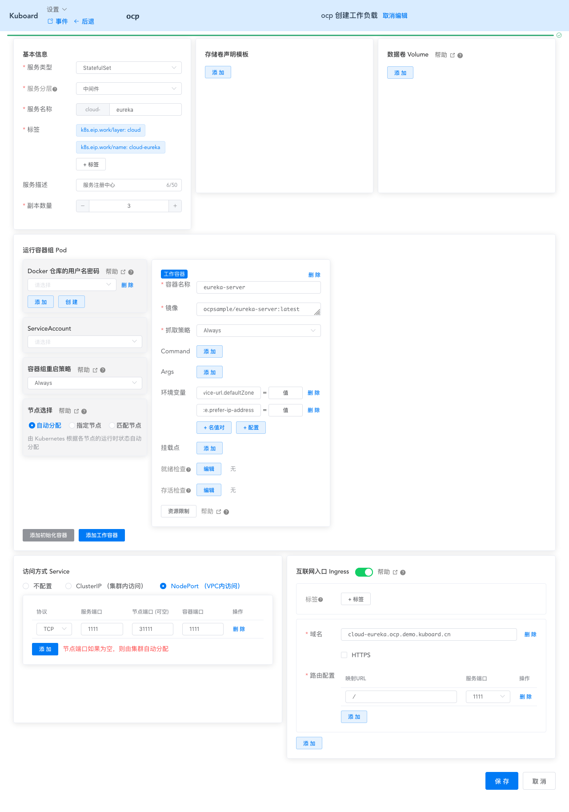
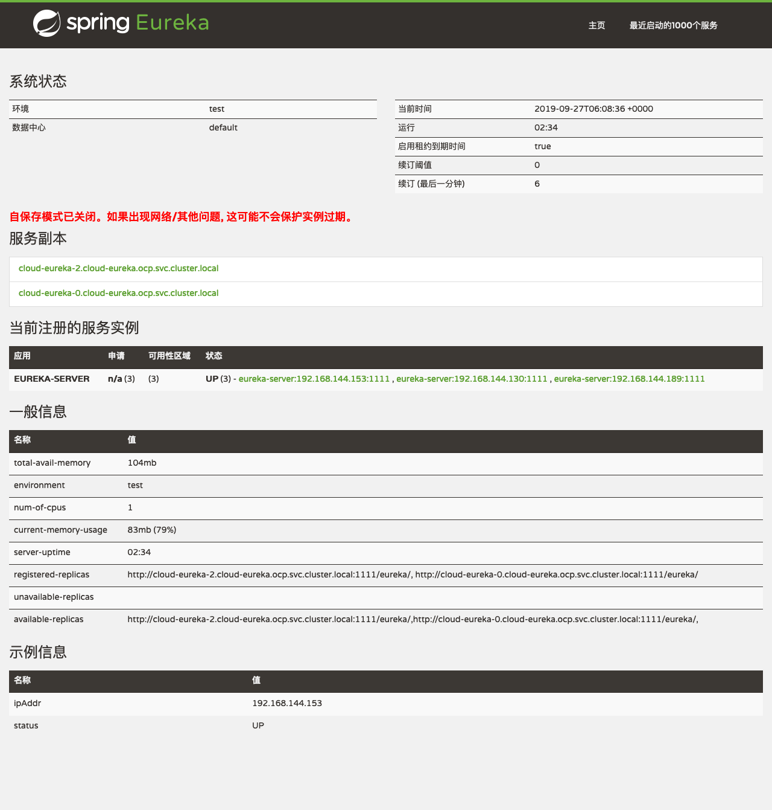

# 在K8S上部署eureka-server

<AdSenseTitle/>

本文假设您已经完成了 [在Kubernetes上部署SpringCloud-OCP](/learning/k8s-practice/ocp/) 教程的前序步骤：
* [准备OCP的构建环境和部署环境](/learning/k8s-practice/ocp/prepare.html)

* [构建docker镜像并推送到仓库](/learning/k8s-practice/ocp/build.html)
  
    > 也可以使用 `ocpsample/eureka-server:latest` 镜像
* 理解 Spring Cloud Eureka 组件，请参考 [Eureka服务注册与发现](https://www.jianshu.com/p/c18d140ad9f6)

## 理解eureka-server

本章节参考 eureka-server 的 [代码仓库](https://gitee.com/owenwangwen/open-capacity-platform/tree/2.0.1/register-center/eureka-server)，并着重从容器化部署的角度来理解 Spring Cloud eureka-server 以及 OCP 中 eureka-server 的配置文件。

`open-capacity-platform/register-center/eureka-server/src/main/resources` 目录中包含了 eureka-server 的配置文件，如下所示：

```sh
├── application-slave0.yml
├── application-slave1.yml
├── application-slave2.yml
├── application-slave3.yml
├── application.yml
└── bootstrap.yml
```

其中， `application-slave0.yml`，`application-slave1.yml`，`application-slave2.yml`，`application-slave3.yml` 为 spring boot 的 4 个 profile 配置，他们之间最重要的差异在于以下两个字段：

* server.port
* eureka.client.defaultZone

而 `application.yml` 文件中则指定了 `application-slave0.yml` 为默认 profile。通过 `eureka.client.service-url.defaultZone` 字段不难看出：

* 配置文件 slave0 为一组，在运行 eureka-server 单节点时使用（该文件中还有一些特定于测试环境的配置项）
* 配置文件 slave1/slave2/slave3 为一组，在运行 eureka-server 高可用时使用，为了避免端口冲突，为每一个实例单独定义了 `server.port` 字段，通过 `--spring.profiles.active `启动参数为 eureka-server 的实例指定激活的配置文件


## 确定部署方案

在 Kubernetes 中部署多个 eureka-server 的实例组成集群时，主要有如下考虑因素：

* 每个 eureka-server 需要被赋予一个唯一的 id，通过字段 `eureka.instance.instance-id` 指定。OCP 中，该字段的配置为 `${spring.application.name}:${spring.cloud.client.ip-address}:${spring.application.instance_id:${server.port}}`
  * Kubernetes 为每一个 Pod 分配一个 IP 地址，此要求可以满足
* eureka-server 的每一个实例需要知道集群中其他实例的地址和端口号，通过字段 `eureka.client.serviceUrl.defaultZone` 指定
  * 请参考 [StatefulSet的使用场景](/learning/k8s-intermediate/workload/wl-statefulset/#statefulset-使用场景) 以理解为何选择 StatefulSet 部署 eureka
  * 请参考 [StatefulSet稳定的网络ID](/learning/k8s-intermediate/workload/wl-statefulset/basics.html#稳定的网络-id) 以理解 StatefulSet 如何为其中的 Pod 分配 DNS name
* eureka-server 的多个实例之间，不能存在端口冲突
  * 请参考 [Kubernetes的网络模型](/learning/k8s-intermediate/service/connecting.html#kubernetes-的网络模型) 以理解 Kubernetes 中如何避免端口冲突

我们在 Kubernetes 上部署 eureka-server 时：

* 使用 StatefulSet 部署 eureka-server，副本数量为 3
* 使用 OCP eureka-server 的 application-slave0.yml 这个 profile
* 使用环境变量覆盖 `eureka.client.service-url.defaultZone` 取值，将其设置为： 
  ```
  http://cloud-eureka-0.cloud-eureka.ocp.svc.cluster.local:1111/eureka,http://cloud-eureka-1.cloud-eureka.ocp.svc.cluster.local:1111/eureka,http://cloud-eureka-2.cloud-eureka.ocp.svc.cluster.local:1111/eureka
  ```
  ::: tip
  通过 cloud-eureka-0.cloud-eureka 也可以访问到对应的 POD，但是此处必须使用完整域名，否则 eureka-server 将不被认为是 available
  :::
* 使用环境变量覆盖 `eureka.instance.prefer-ip-address` 取值，将其设置为：`false`
* 为 eureka-server 创建 Ingress，并分配域名 `cloud-eureka.ocp.demo.kuboard.cn`
  * 关于 Ingress，请参考 [Ingress通过互联网访问您的应用](/learning/k8s-intermediate/service/ingress.html)
  * 该域名由 `工作负载名`.`名称空间`.`集群名字`.`一级域名` 组成，这种命名规则下，只需要将 `*.demo.kuboard.cn` 的域名解析指向集群 Ingress Controller 的地址就可以，在测试环境中配置新的模块时非常方便。


## 部署eureka-server

本教程将 eureka-server 及其他 OCP 组件部署到 `ocp` 名称空间，并假设您已经创建好了该名称空间，参考 [创建名称空间](/guide/cluster/namespace.html)

* 在 Kuboard 界面中进入 `ocp` 名称空间，并点击页头的按钮 `创建工作负载`，如下图所示：

  填写表单：

  | 字段名称 | 填写内容                                                     | 备注 |
  | -------- | ------------------------------------------------------------ | ---- |
  | <div style="min-width:70px;">服务类型</div> | StatefulSet                                                  |      |
  | 服务分层 | 中间件                                                       |      |
  | 服务名称 | eureka                                                       |      |
  | 服务描述 | 服务注册中心                                                 |      |
  | 副本数量 | 3                                                            |      |
  | 容器名称 | eureka-server                                                |      |
  | 镜像     | ocpsample/eureka-server:latest                               |  也可以使用自己构建的镜像    |
  | 抓取策略 | Always                                                       |      |
  | 环境变量 | <div style="max-width: 600px;"><span style="color: blue;">eureka.client.service-url.defaultZone=</span>http://cloud-eureka-0.cloud-eureka.ocp.svc.cluster.local:1111/eureka,http://cloud-eureka-1.cloud-eureka.ocp.svc.cluster.local:1111/eureka,http://cloud-eureka-2.cloud-eureka.ocp.svc.cluster.local:1111/eureka</div> <div style="max-width: 600px;"><span style="color: blue;">eureka.instance.prefer-ip-address=</span>false</div> |  填入 kuboard 时<br/>环境变量名后面不带 `=`    |
  | Service  | NodePort：<br />协议 `TCP` 服务端口 `1111`节点端口 `31111` 容器端口 `1111` |   可从节点端口访问   |
  | Ingress  | 域名：cloud-eureka.ocp.demo.kuboard.cn<br />路由配置： 映射URL `/` 服务端口 `1111` |  可通过域名访问    |

  


* 点击 **保存** 按钮

* 点击 **应用** 按钮

* 点击 **完成** 按钮
  * 等待 eureka-server 完成部署
  * 根据您服务器到 hub.docker.com 的网速不同，等候的时间约 1-5 分钟


## 查看部署结果

<SharingBlock>

按照上面的部署方式，有如下两种方式可以从浏览器访问 eureka-server 的界面：

* 使用域名： [http://cloud-eureka.ocp.demo.kuboard.cn/](http://cloud-eureka.ocp.demo.kuboard.cn/)
* 使用节点端口：http://${任意节点的IP地址}:31111


eureka-server 界面如下图所示：



</SharingBlock>
