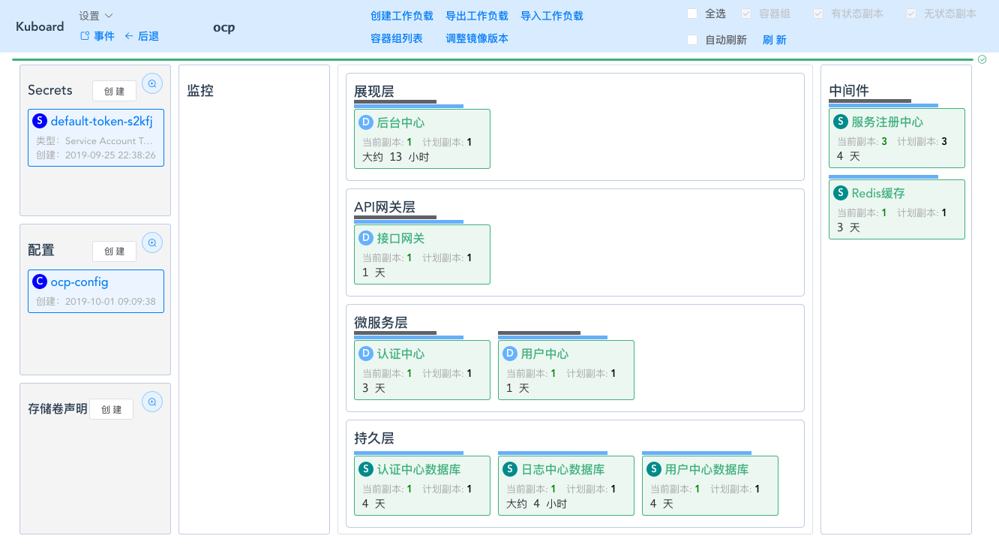
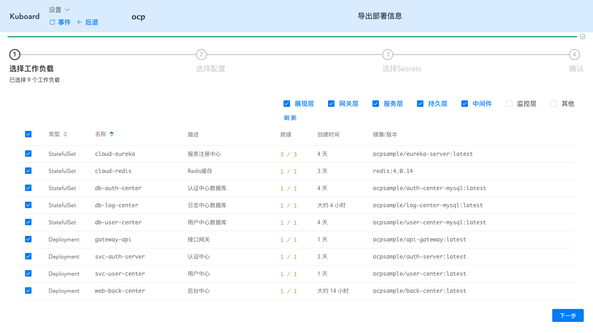
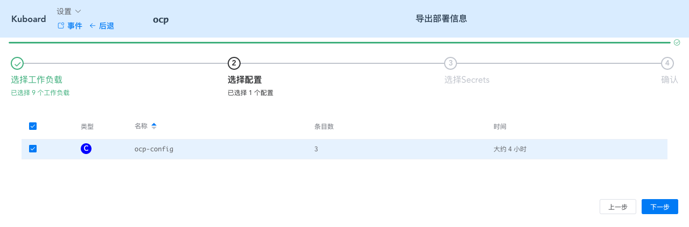
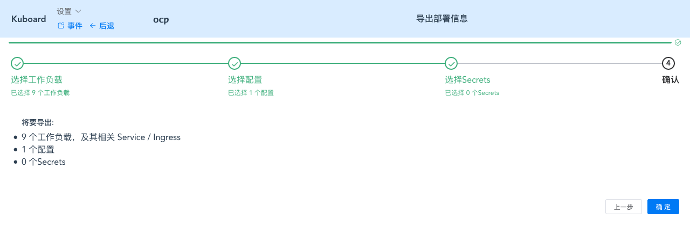
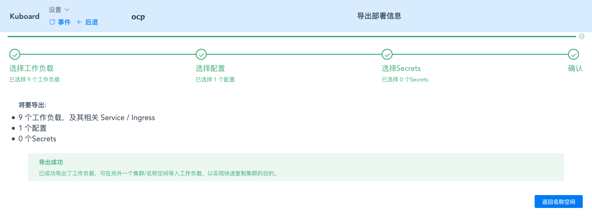

# 导出部署配置

<AdSenseTitle/>

通过本系列文章前面的部分，我们终于完整了 Spring Cloud OCP 的核心组件在 Kubernetes 上的部署。此时，Kuboard 的名称空间 `ocp` 界面的截图如下所示：

接下来，立刻要面临的问题是：假设刚部署完的环境是用于开发的，那我们如何快速部署一个新的环境用于测试呢？

Kuboard 支持您将此名称空间界面导出到一个 yaml 文件，并在另一个名称空间（或Kubernetes集群）中导入所有的配置。本文档后面的部分将描述导出配置的过程：

* 点击 **导出工作负载** 按钮

  选择 **展现层**、**网关层**、**服务层**、**持久层**、**中间件** 五个分层，点击刷新，然后全选所有的工作负载，如下图所示：

  

* 点击 **下一步** 按钮

  选择 `ocp-config`，如下图所示：

  

* 点击 **下一步** 按钮

  

* 点击 **下一步** 按钮

  

* 点击 **确定** 按钮

  并保存文件，文件名格式为 `kuboard_名称空间_年_月_日_时_分_秒.yaml`，例如  `kuboard_ocp_2019_10_01_12_56_14.yaml` 

  

:tada: :tada: :tada: 您已完成了部署和配置信息的导出，下一步可以在新的名称空间直接导入，请参考 [导入部署配置](./import.html)
