# 导入部署配置

<AdSenseTitle/>

## 获得yaml文件

在 [导出部署配置](./export.html) 中，我们将 Spring Cloud OCP 部署相关的所有信息导出到一个 yaml 文件，本文描述如何在一个新的名称空间（或者新的 Kubernetes 集群）中导入该部署信息，并形成一个新的独立的部署环境。

如果您还没有该 yaml 文件，可从此处
<a :href="$withBase('/practice/ocp/kuboard_ocp_2019_10_01_13_58_04.yaml')" download="kuboard_ocp_2019_10_01.yaml">下载 OCP部署yaml文件</a>

## 导入yaml文件

假设您已创建了名称空间 `ocp-import` 用来导入部署配置。请参考接下来的导入步骤：

* 点击 **导入工作负载** 按钮

  在此界面中上传前一个步骤导出的（或从 www.kuboard.cn 下载的）yaml 文件。如下图所示：

  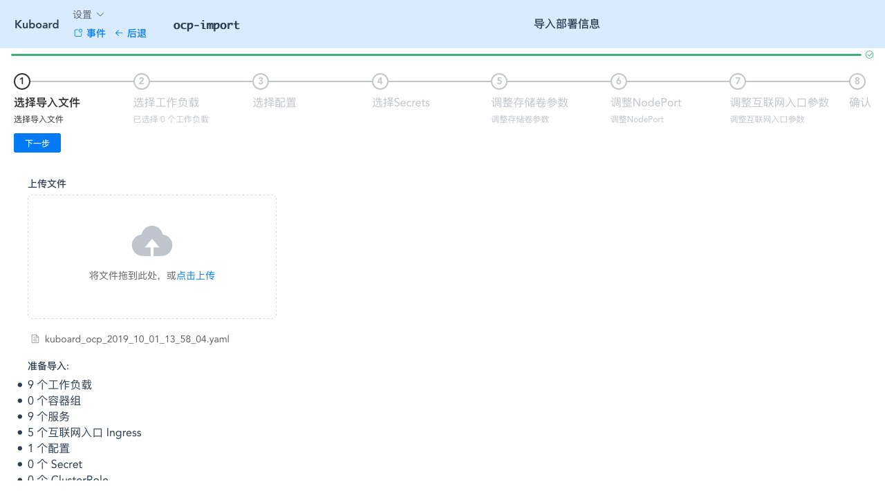

* 点击 **下一步** 按钮

  全选所有的工作负载，如下图所示：

  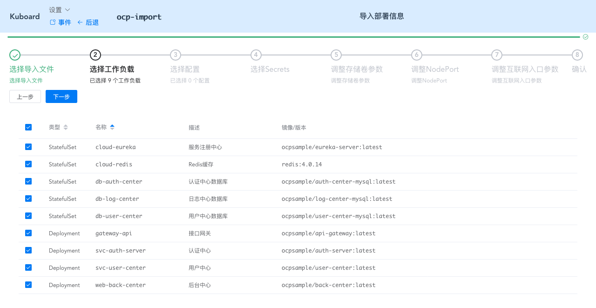

* 点击 **下一步** 按钮

  选中 `ocp-config` 如下图所示：

  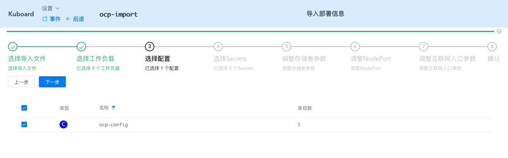

* 点击 **下一步** 按钮

  如下图所示：

  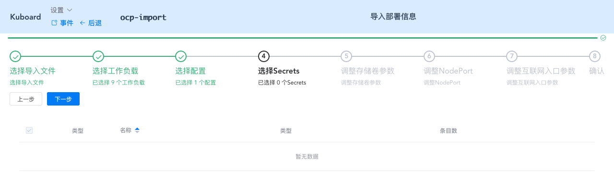

* 点击 **下一步** 按钮

  如下图所示：

  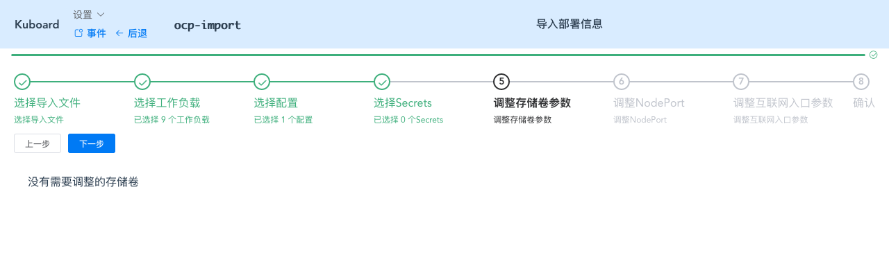

* 点击 **下一步** 按钮

  勾选 `使用随机端口` 此处由于我们在原集群的新名称空间中导入配置，因此，需要修改节点端口号，以避免冲突。如果您不知道该怎么分配端口号，可以在节点端口字段填写 `0`，集群将自动为您分配可用的节点端口。

  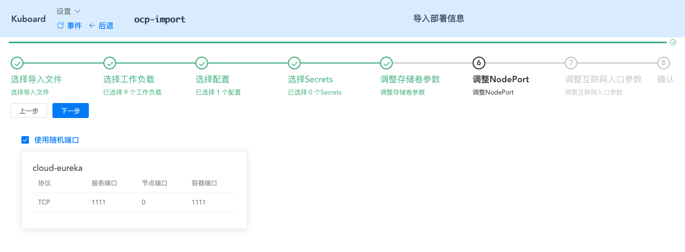

* 点击 **下一步** 按钮

  在此界面中调整对外的域名，以避免和原名称空间的部署产生域名冲突，如下图所示：

  * cloud-eureka.ocp-import.demo.kuboard.cn
  * api-gateway.ocp-import.demo.kuboard.cn
  * svc-auth-server.ocp-import.demo.kuboard.cn
  * svc-user-center.ocp-import.demo.kuboard.cn
  * back-center.ocp-import.demo.kuboard.cn

  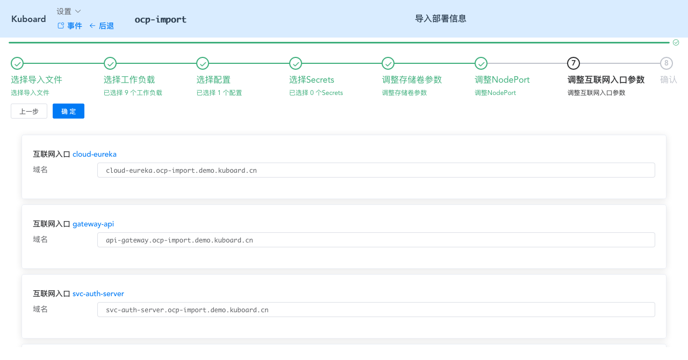

* 点击 **确定** 按钮

  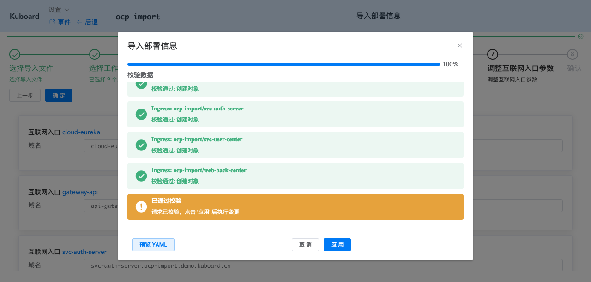

* 点击 **应用** 按钮

  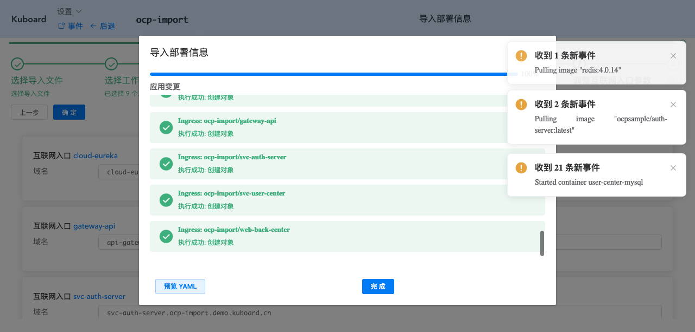

* 点击 **完成** 按钮

* 此时进入名称空间，可看到所有的配置和部署都已经完成导入。

## 导入后调整

* 导入到新的名称空间以后，ConfigMap中配置参数受到影响的部分需要调整，如下图所示：
  * eureka.client.serviceUrl.defaultZone = `http://cloud-eureka-0.cloud-eureka.ocp-import.svc.cluster.local:1111/eureka,http://cloud-eureka-1.cloud-eureka.ocp-import.svc.cluster.local:1111/eureka,http://cloud-eureka-2.cloud-eureka.ocp-import.svc.cluster.local:1111/eureka`
  * spring.datasource.druid.log.url = `jdbc:mysql://db-log-center:3306/log-center?useUnicode=true&characterEncoding=utf-8&allowMultiQueries=true&useSSL=false`
  * spring.redis.host = `cloud-redis`
  * GATEWAY_API_URL = `http://api-gateway.ocp-import.demo.kuboard.cn/`
  * CLOUD_EUREKA_URL = `http://cloud-eureka.ocp-import.demo.kuboard.cn/`

  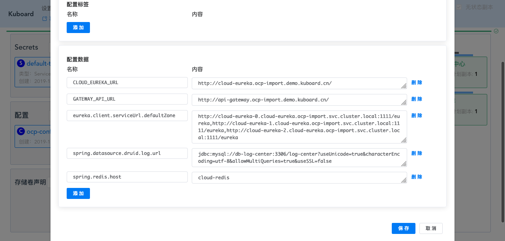

* 由于 ConfigMap 中的参数发生了变化，此时必须删除所以引用该 ConfigMap 中的容器组，Kubernetes 将自动创建新的容器组以替换被删除的容器组，新的容器组中，ConfigMap 的变更将生效。
  
  点击名称空间上方的 **容器组列表** 按钮，全选，并删除，如下图所示：

  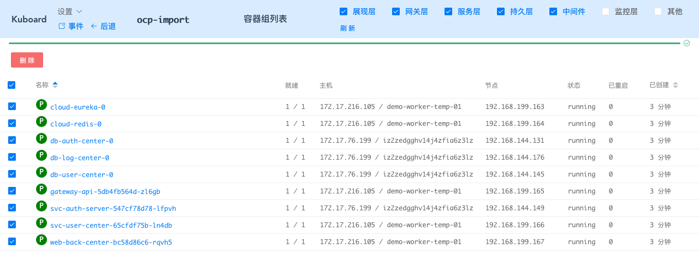

## 验证配置

* 在浏览器打开 `http://back-end.ocp-import.demo.kuboard.cn` （此域名已失效，以节省演示服务器空间，请使用您自己的域名），可登录 OCP 后台中心的界面。

:tada: :tada: :tada: 您成功学会了如何使用 Kuboard 快速复制一份 Spring Cloud 微服务架构的部署环境。

## Kuboard授权

使用 Kuboard 是免费的，请查看 [Kuboard 授权声明](/support/)
