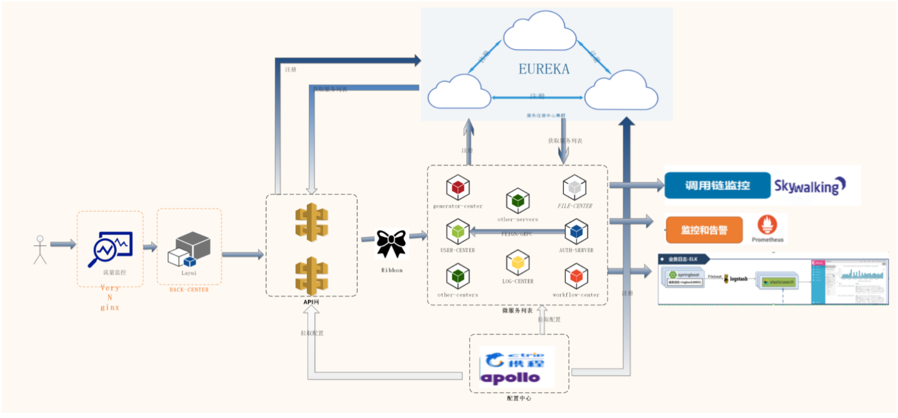

# Open_Capacity_Platform介绍

## 使用 Kuboard 在 K8S 上部署 OCP

Kuboard网站将陆续连载如何使用 Kuboard 部署 OCP 的如下组件：
* eureka-server
* auth-server
* user-center
* api-gateway
* back-center

与 OCP 相关的问题，请加 OCP 的 QQ群 483725710

<a target="_blank" href="//shang.qq.com/wpa/qunwpa?idkey=8d8ae84021c97e31010fd8e44f518e1129ebd3be9ee0c004ec2cf68e8860b6c2" onclick="openOutboundLink(this)">一键加入OCP社群 </a>

[进入 OCP 首页](https://gitee.com/owenwangwen/open-capacity-platform)

## OCP 介绍

简称ocp是基于layui+springcloud的企业级微服务框架(用户权限管理，配置中心管理，应用管理，....),其核心的设计目标是分离前后端，快速开发部署，学习简单，功能强大，提供快速接入核心接口能力，其目标是帮助企业搭建一套类似百度能力开放平台的框架；  

- 基于layui前后端分离的企业级微服务架构  
- 兼容spring cloud netflix & spring cloud alibaba  
- 优化Spring Security内部实现，实现API调用的统一出口和权限认证授权中心  
- 提供完善的企业微服务流量监控，日志监控能力   
- 提供完善的压力测试方案  
- 提供完善的灰度发布方案  
- 提供完善的微服务部署方案 

## **技术介绍**

## **功能介绍** 
- 统一安全认证中心
	- 支持oauth的四种模式登录
	- 支持用户名、密码加图形验证码登录
	- 支持第三方系统单点登录
- 微服务架构基础支撑
	- 服务注册发现、路由与负载均衡
	- 服务熔断与限流
	- 统一配置中心
	- 统一日志中心
	- 分布式锁
	- 分布式任务调度器
- 系统服务监控中心
	- 服务调用链监控 
	- 应用吞吐量监控 
	- 服务降级、熔断监控
	- 微服务服务监控
- 能力开放平台业务支撑
	- 网关基于应用方式API接口隔离
	- 下游服务基于RBAC权限管理，实现细粒度控制
	- 代码生成器中心  
	- 网关聚合服务内部Swagger接口文档
	- 统一跨域处理
	- 统一异常处理
- docker容器化部署
	- 基于rancher的容器化部署
	- 基于docker的elk日志监控
	- 基于docker的服务动态扩容 

## 用户权益
- 允许免费用于学习、毕设、公司项目、私活等。

## 禁止事项
- 代码50%以上相似度的二次开源。
- 注意：若禁止条款被发现有权追讨9999的授权费。
