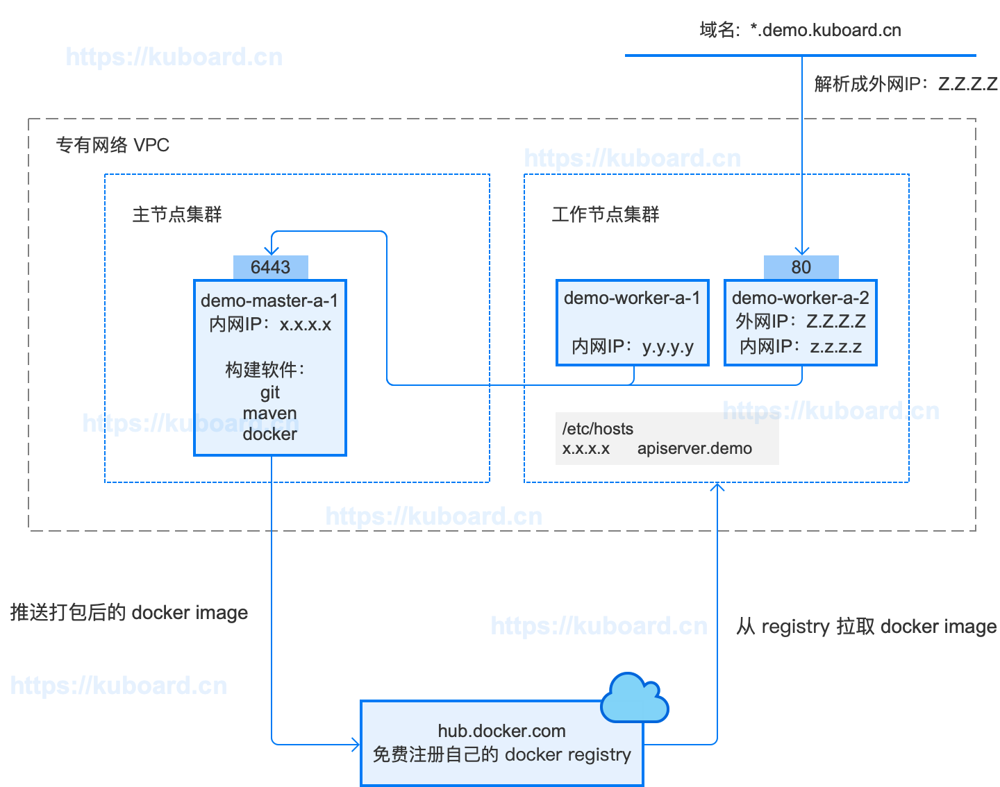

# 准备OCP的构建环境和部署环境

<AdSenseTitle/>

## 环境要求

Open Capacity Platform 是基于 Java Spring Cloud 的微服务架构，为了将其部署到 Kubernetes 上，我们需要准备如下环境：

* **硬件**
  * 1 台 Linux 服务器，配置不低于2核4G，CentOS 7.6，（本系列教程称该机器为 master 节点）用途：
    * Kubernetes master 节点
    * 编译 OCP 源码并打包 docker 镜像的构建机
  * 2 台 Linux 服务器，配置不低于2核4G，CentOS 7.6，（本系列教程称该机器为 worker 节点，前期可以只有一台，随着负载增加再增加节点）用途：
    * Kubernetes worker 节点
* **软件**
  * Kubernetes 集群及管理软件
    * Kubernetes 最新版本，参考 [安装Kubernetes单Master节点](/install/install-k8s.html)
    * Kuboard 最新版本，参考 [安装Kuboard](/install/install-kubernetes.html)
  * Master节点
    * Docker 已在安装 Kubernetes 时完成安装
    * JDK 1.8
    * maven
  * 镜像仓库
    * 选项一：在 [https://hub.docker.com](https://hub.docker.com) 上注册一个账号
    * 选项二：如果自己搭建 Harbor 作为镜像仓库，您可能还需要更多的 Linux 服务器

**构建环境和部署环境的结构** 如下：

<p>
  
</p>

::: tip 关于构建环境
您可以根据自己的情况将构建环境与部署环境分开，例如：
* 学习时，参考本教程，使用 kubernetes 的 master 节点完成 ***构建和镜像推送***
* 开发时，在自己的笔记本上完成 ***构建和镜像推送***
* 工作中，使用 Jenkins Pipeline 或者 gitlab-runner Pipeline 来完成 ***构建和镜像推送***
:::

**构建环境和部署环境分开**

  <p>
    
  </p>

本文假设您已经完成了 Kubernetes 集群的安装，假设您准备在 Kubernetes master 节点上执行构建过程，并将使用简短的篇幅介绍如何在 master 节点上做好构建环境准备
* 安装 JDK 1.8
* 安装 maven 3.6.2
* 安装 git
* 下载 open-capability-platform 的代码仓库

## 在 master 节点上安装 JDK1.8

以root身份在 master 节点上执行：

``` sh
yum install java-1.8.0-openjdk\* -y
```

## 在 master 节点上安装 maven

* 在 [maven ](http://maven.apache.org/download.cgi) 获取最新版 maven 的 binary 文件下载链接，例如 apache-maven-3.6.2-bin.tar.gz 的下载地址为 `http://mirrors.tuna.tsinghua.edu.cn/apache/maven/maven-3/3.6.2/binaries/apache-maven-3.6.2-bin.tar.gz`

* 以 root 身份在 master 节点上执行：
  ```sh
  #切换到 /root 用户目录
  cd /root
  # 下载 tar.gz
  wget http://mirrors.tuna.tsinghua.edu.cn/apache/maven/maven-3/3.6.2/binaries/apache-maven-3.6.2-bin.tar.gz
  # 解压 tar.gz
  tar -xvf apache-maven-3.6.2-bin.tar.gz
  ```
* 以root身份在 master 节点上执行 `vim /root/.bash_profile` 修改 .bash_profile 文件，向 `PATH=` 所在行的行尾增加 `:/root/apache-maven-3.6.2/bin` 如下所示：
  ``` {3}
  # User specific environment and startup programs

  PATH=$PATH:$HOME/bin:/root/apache-maven-3.6.2/bin

  export PATH
  ```
  ::: tip
  您可以把 apache-maven-3.6.2 放在您自己喜欢的位置
  :::

* **检查安装结果**：退出 master 节点的 shell 终端，并重新以 root 用户登录 master 节点的 shell 终端，执行命令 `mvn -version`，输出结果如下所示：
  ```
  Apache Maven 3.6.2 (40f52333136460af0dc0d7232c0dc0bcf0d9e117; 2019-08-27T23:06:16+08:00)
  Maven home: /root/apache-maven-3.6.2
  Java version: 1.8.0_222, vendor: Oracle Corporation, runtime: /usr/lib/jvm/java-1.8.0-openjdk-1.8.0.222.b10-1.el7_7.x86_64/jre
  Default locale: en_US, platform encoding: UTF-8
  OS name: "linux", version: "3.10.0-957.21.3.el7.x86_64", arch: "amd64", family: "unix"
  ```


## 在 master 节点上安装 git

* 以root身份在 master 节点执行：
  ```sh
  # 安装 git
  yum install -y git
  # 查看已安装版本
  git version
  ```

## 在 master 节点上克隆 ocp 代码仓库

* 以root身份在 master 节点上执行：

  ```sh
  # 切换到 /root 用户目录
  cd /root
  # 克隆 ocp 代码仓库
  git clone https://gitee.com/owenwangwen/open-capacity-platform.git
  ```

* 以root身份在 master 节点上执行：

  ```sh
  # 安装 tree
  yum install tree -y
  # 查看 ocp 代码目录
  tree /root/open-capacity-platform -L 2
  ```
  输出结果如下所示：
  ```
  /root/open-capacity-platform
  ├── api-gateway
  │   ├── pom.xml
  │   └── src
  ├── business-center
  │   ├── file-center
  │   ├── generator-center
  │   ├── pom.xml
  │   ├── sms-center
  │   ├── user-center
  │   └── workflow-center
  ├── inner-intergration
  │   ├── common-spring-boot-starter
  │   ├── db-spring-boot-starter
  │   ├── log-spring-boot-starter
  │   ├── pom.xml
  │   ├── rabbitmq-spring-boot-starter
  │   ├── redis-spring-boot-starter
  │   ├── swagger-spring-boot-starter
  │   ├── uaa-client-spring-boot-starter
  │   └── uaa-server-spring-boot-starter
  ├── job-center
  │   ├── doc
  │   ├── job-admin
  │   ├── job-core
  │   ├── job-demo
  │   └── pom.xml
  ├── LICENSE
  ├── monitor-center
  │   ├── admin-server
  │   ├── log-center
  │   ├── pom.xml
  │   ├── transaction-center
  │   └── zipkin-center
  ├── new-api-gateway
  │   ├── pom.xml
  │   └── src
  ├── oauth-center
  │   ├── auth-server
  │   ├── auth-sso
  │   └── pom.xml
  ├── pom.xml
  ├── README.en.md
  ├── README.md
  ├── register-center
  │   ├── eureka-server
  │   └── pom.xml
  ├── sql
  │   ├── 01.user-center.sql
  │   ├── 02.oauth-center.sql
  │   ├── 03.file-center.sql
  │   ├── 04.sms-center.sql
  │   ├── 05.log-center.sql
  │   ├── 06.job-center.sql
  │   ├── 07.workflow-center.sql
  │   ├── 08.transaction-center.sql
  │   └── 09.batch-center.sql
  ├── tuning-center
  │   ├── pom.xml
  │   ├── test-common-spring-boot-starter
  │   ├── test-log-spring-boot-starter
  │   ├── test-redis-spring-boot-starter
  │   └── test-spring-boot-starter
  └── web-portal
      ├── back-center
      └── pom.xml

  42 directories, 23 files
  ```

## 下一步

[构建Java项目、打包docker image、推送到docker registry](./build.html)
