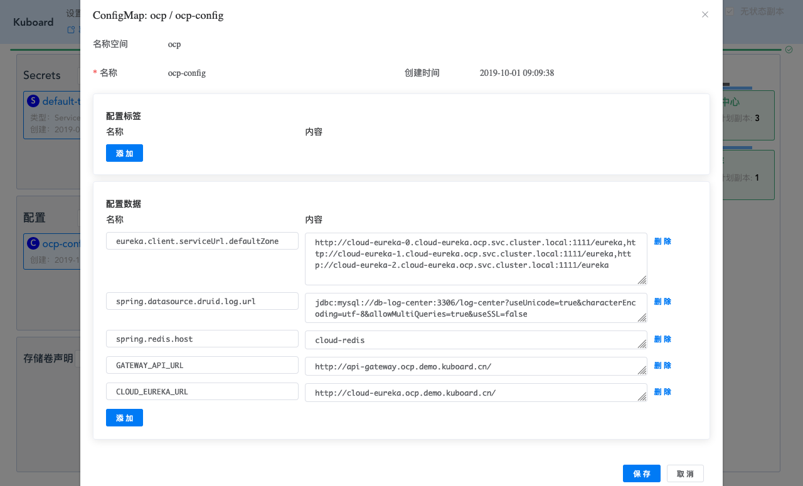
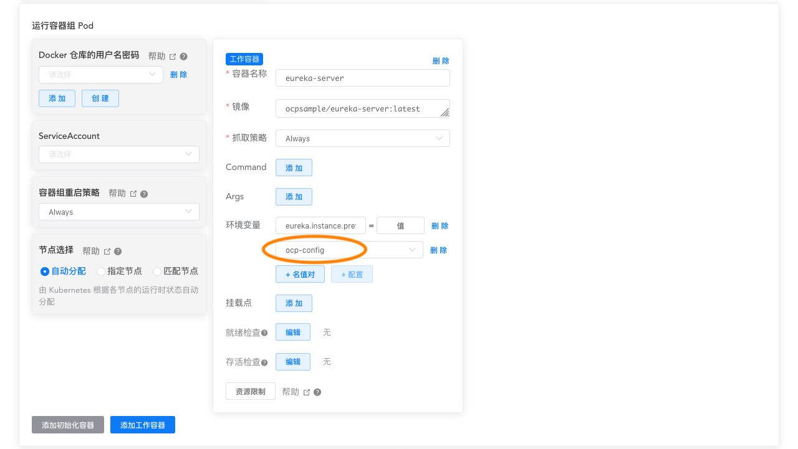

# 重新审视配置信息

<AdSenseTitle/>

在本系列文章的前面部分，我们已经完成了在 Kubernetes 上部署 Spring Cloud OCP 的主要组件：eureka-server、auth-server、user-cetner、api-gateway、back-center。

## 提取相同的参数

### 各模块中的环境变量
部署过程中，主要使用环境变量向容器内注入具体环境相关的信息，以便容器内应用程序可以使用特定于环境的配置。具体来说，主要有如下信息通过环境变量替换：

* eureka-server
  * 使用环境变量覆盖 `eureka.client.service-url.defaultZone` 取值，将其设置为： 
    ```
    http://cloud-eureka-0.cloud-eureka.ocp.svc.cluster.local:1111/eureka,http://cloud-eureka-1.cloud-eureka.ocp.svc.cluster.local:1111/eureka,http://cloud-eureka-2.cloud-eureka.ocp.svc.cluster.local:1111/eureka
    ```
* 使用环境变量覆盖 `eureka.instance.prefer-ip-address` 取值，将其设置为：`false`
  
* auth-server
  
  部署auth-server时，通过环境变量覆盖了如下参数：

  * eureka.client.serviceUrl.defaultZone 覆盖为

    ```
    http://cloud-eureka-0.cloud-eureka.ocp.svc.cluster.local:1111/eureka,http://cloud-eureka-1.cloud-eureka.ocp.svc.cluster.local:1111/eureka,http://cloud-eureka-2.cloud-eureka.ocp.svc.cluster.local:1111/eureka
    ```
  * spring.datasource.druid.core.url 覆盖为
    
    ```
    jdbc:mysql://db-auth-center:3306/oauth-center?useUnicode=true&characterEncoding=utf-8&allowMultiQueries=true&useSSL=false
    ```
  * spring.datasource.druid.log.url 覆盖为
    
    ```
    jdbc:mysql://db-log-center:3306/log-center?useUnicode=true&characterEncoding=utf-8&allowMultiQueries=true&useSSL=false
    ```
  * spring.redis.host 覆盖为 `cloud-redis`

* user-center

  部署user-center时，通过环境变量覆盖了如下参数：

  * eureka.client.serviceUrl.defaultZone 覆盖为

    ```
    http://cloud-eureka-0.cloud-eureka.ocp.svc.cluster.local:1111/eureka,http://cloud-eureka-1.cloud-eureka.ocp.svc.cluster.local:1111/eureka,http://cloud-eureka-2.cloud-eureka.ocp.svc.cluster.local:1111/eureka
    ```
  * spring.datasource.druid.core.url 覆盖为
    
    ```
    jdbc:mysql://db-user-center:3306/user-center?useUnicode=true&characterEncoding=utf-8&allowMultiQueries=true&useSSL=false
    ```
  * spring.datasource.druid.log.url 覆盖为
    
    ```
    jdbc:mysql://db-log-center:3306/log-center?useUnicode=true&characterEncoding=utf-8&allowMultiQueries=true&useSSL=false
    ```
  * spring.redis.host 覆盖为 `cloud-redis`

* api-gateway

  部署api-gateway时，通过环境变量覆盖了如下参数：

  * eureka.client.serviceUrl.defaultZone 覆盖为

    ```
    http://cloud-eureka-0.cloud-eureka.ocp.svc.cluster.local:1111/eureka,http://cloud-eureka-1.cloud-eureka.ocp.svc.cluster.local:1111/eureka,http://cloud-eureka-2.cloud-eureka.ocp.svc.cluster.local:1111/eureka
    ```
  * spring.datasource.druid.core.url 覆盖为
    
    ```
    jdbc:mysql://db-auth-center:3306/oauth-center?useUnicode=true&characterEncoding=utf-8&allowMultiQueries=true&useSSL=false
    ```
  * spring.datasource.druid.log.url 覆盖为
    
    ```
    jdbc:mysql://db-log-center:3306/log-center?useUnicode=true&characterEncoding=utf-8&allowMultiQueries=true&useSSL=false
    ```
  * spring.redis.host 覆盖为 `cloud-redis`

* back-center

  部署back-center时，通过环境变量覆盖了如下参数：
  * GATEWAY_API_URL
  * CLOUD_EUREKA_URL

### 相同的参数
回顾一下，可以发现如下相同的参数：
* eureka.client.service-url.defaultZone
  
  使用到此参数，且取值相同的模块有：
  * eureka-server
  * auth-server
  * user-center
  * api-gateway
* spring.datasource.druid.core.url 

  使用到此参数的模块有，（但是他们的参数值不同）
  * auth-server
  * user-center
* spring.datasource.druid.log.url 
  
  使用到此参数，且取值相同的模块有：
  * auth-server
  * user-center
  * api-gateway

* spring.redis.host

  使用到此参数，且取值相同的模块有：
  * auth-server
  * user-center
  * api-gateway

### 提取参数到ConfigMap

可参考文档 [使用ConfigMap配置您的应用程序](/learning/k8s-intermediate/config/config-map.html#configmap-%E5%AE%B9%E5%99%A8%E7%9A%84%E7%8E%AF%E5%A2%83%E5%8F%98%E9%87%8F%EF%BC%88configmap%E7%9A%84%E6%89%80%E6%9C%89%E5%90%8D%E5%80%BC%E5%AF%B9%EF%BC%89)

* 在 Kuboard 界面中进入 `ocp` 名称空间
* 创建ConfigMap，并填入五个名值对：
  * <span style="color: blue">eureka.client.serviceUrl.defaultZone</span> = `http://cloud-eureka-0.cloud-eureka.ocp.svc.cluster.local:1111/eureka,http://cloud-eureka-1.cloud-eureka.ocp.svc.cluster.local:1111/eureka,http://cloud-eureka-2.cloud-eureka.ocp.svc.cluster.local:1111/eureka`
  * <span style="color: blue">spring.datasource.druid.log.url</span> = `jdbc:mysql://db-log-center:3306/log-center?useUnicode=true&characterEncoding=utf-8&allowMultiQueries=true&useSSL=false`
  * <span style="color: blue">spring.redis.host</span> = `cloud-redis`
  * <font color="blue">GATEWAY_API_URL</font> = `http://api-gateway.ocp.demo.kuboard.cn/`
  * <font color="blue">CLOUD_EUREKA_URL</font> = `http://cloud-eureka.ocp.demo.kuboard.cn/`
  
  

* 修改 eureka-server、auth-server、user-center、api-gateway 的部署信息，将上面创建的 ConfigMap 中所有名值对注入到容器的环境变量，并去除已经在 ConfigMap 中包含的环境变量。

  以 eureka-server 为例，编辑该工作负载的界面截图如下所示：

  

::: tip
将相同的参数提炼到 ConfigMap 可以使配置更简洁。
:::

## 为谁定义变量

在本教程中，为了避免对 OCP 已有代码的修改，因此以直接注入 `spring.datasource.druid.log.url` 类似的环境变量的方式，使docker镜像适应不同的环境（开发环境、测试环境、生产环境等）。这种做法就会碰到一个比较尴尬的情况，例如，对于参数 `spring.datasource.druid.core.url` 键值相同，而不同模块中（auth-server、user-center、api-gateway）取值却不同。这是从参数使用者视角来看不可避免的现象。

一个建议的方式是，从参数提供者的视角来定义环境变量参数，并由参数使用者引用。例如，我们定义如下几个ConfigMap属性：
* <font color="blue">EUREKA_URLS</font> = `http://cloud-eureka-0.cloud-eureka.ocp.svc.cluster.local:1111/eureka,http://cloud-eureka-1.cloud-eureka.ocp.svc.cluster.local:1111/eureka,http://cloud-eureka-2.cloud-eureka.ocp.svc.cluster.local:1111/eureka`
* <font color="blue">DB_AUTH_CENTER_URL</font> = `jdbc:mysql://db-auth-center:3306/auth-center?useUnicode=true&characterEncoding=utf-8&allowMultiQueries</font>=true&useSSL=false`
* <font color="blue">DB_USER_CENTER_URL</font>= `jdbc:mysql://db-user-center:3306/user-center?useUnicode=true&characterEncoding=utf-8&allowMultiQueries=true&useSSL=false`
* <font color="blue">DB_LOG_CENTER_URL</font> = `jdbc:mysql://db-log-center:3306/log-center?useUnicode=true&characterEncoding=utf-8&allowMultiQueries=true&useSSL=false`
* <font color="blue">REDIS_HOST</font> = `cloud-redis`
* <font color="blue">GATEWAY_API_URL</font> = `http://api-gateway.ocp.demo.kuboard.cn/`
* <font color="blue">CLOUD_EUREKA_URL</font> = `http://cloud-eureka.ocp.demo.kuboard.cn/`

然后在参数使用者的 `application.xml` 中引用这些环境变量参数，以 auth-center 的 `application.xml` 为例：

```yaml {10,15,20}
spring:
  session:
    store-type: redis  
  datasource:
    dynamic:
      enable: true
    druid: 
      # JDBC 配置(驱动类自动从url的mysql识别,数据源类型自动识别)
      core:
        url: ${DB_AUTH_CENTER_URL}
        username: root
        password: root
        driver-class-name:  com.mysql.jdbc.Driver
      log:
        url: ${DB_LOG_CENTER_URL}
        username: root
        password: root

  redis:
    host: ${REDIS_HOST}
    port: 6379    
    timeout: 6000
```
