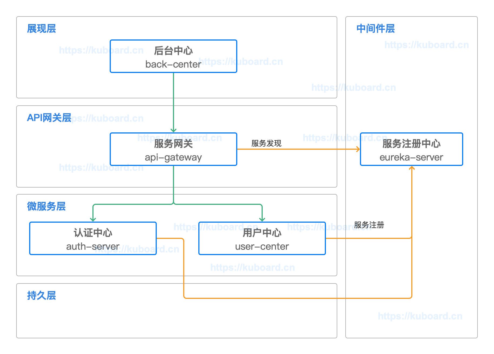

# 部署顺序

<AdSenseTitle/>

## 部署顺序的确定

本教程将在 KUbernet是上部署 Spring Cloud - Open Capacity Platform 微服务架构的如下模块：

* 服务注册中心 eureka-server  -- **【中间件层】**
* 用户中心 user-center -- **【微服务层】**
* 认证中心 auth-server -- **【微服务层】**
* 服务网关 api-gateway -- **【API网关层】**
* 后台中心 back-center -- **【展现层】**

他们之间的依赖关系如下图所示：

  

本教程将按照如下顺序部署这些微服务模块：

1. 服务注册中心 eureka-server
2. 用户中心 user-center
3. 认证中心 auth-server
4. 服务网关 api-gateway
5. 后台中心 back-center

在决定按照什么顺序部署这些微服务组件时，主要考虑的因素有：

* **依赖关系**
  * 0 依赖（不依赖任何其他模块）的最先部署
  * 按依赖链条顺序部署
    * 上图的依赖顺序为：eureka-server <-- (auth-server / user-center) <-- api-gateway <-- back-center
  * 依赖链条末端的最后部署
* **分层关系**
  * 一个模块可以依赖处于下一层的模块
  * 一个模块可以依赖处于同一层的模块
  * 尽量避免跨层依赖，例如 back-center 直接依赖 auth-server
  * 展现层、API网关层、微服务层、持久层的组件都有可能依赖中间件层，在本例中，API网关层的 api-gateway 和 微服务层的 auth-server、user-center 都依赖于中间件层的 eureka-server
* **解耦关系**
  * 如果从服务注册/服务发现的角度来审视服务调用者 api-gateway、服务提供者 auth-server/user-center、服务注册中心 eureka-server 三者的关系：
    * 服务注册中心 eureka-server 必须先于服务调用者和服务提供者存在，否则调用者和提供者都有可能启动失败
    * 服务提供者先于服务调用者存在，遵循了依赖关系
    * 服务调用者可以先于服务提供者存在并正常启动，此时，如果服务提供者完成启动并向注册中心注册，服务调用者后续才发现提供者的存在，并进一步向服务提供者发送接口调用请求。此时服务注册中心使得我们可以向一个已经运行多时（api-server已存在）的情况下添加新的微服务（比方说 product-center）
  ::: tip
  按照解耦关系这几个微服务模块的部署顺序也可以调整为：
  1. 服务注册中心 eureka-server
  2. 服务网关 api-gateway
  3. 用户中心 user-center
  4. 认证中心 auth-server
  5. 后台中心 back-center
  :::

## 服务编排工具的特点

### docker-compose

需要严格定义不同模块之间的依赖关系，依赖链条前序的模块没有完成启动，将不会尝试后续模块的启动。

### Kubernetes

Kubernetes 中，不定义模块之间的依赖关系。你把控制器（Deployment/StatefulSet/DaemonSet 等）按任意顺序部署到 Kubernetes 中，Kubernetes 就开始尝试为你维持期望的 Pod 副本数。如果依赖模块不存在，被依赖模块会启动失败？是的，但是，没关系，Kubernetes 会先等一下然后再尝试启动，直到被依赖模块出现以后，依赖模块正常启动为止。请参考 [重启策略](/learning/k8s-intermediate/workload/pod-lifecycle.html#重启策略)

::: tip
在测试验证阶段，我们仍然严格按照期望的顺序进行部署，否则，虽然 Kubernetes 会不知疲倦地尝试维持期望的 Pod 副本数，但是开发者仍然期望快速看到正常运行的结果。
:::
