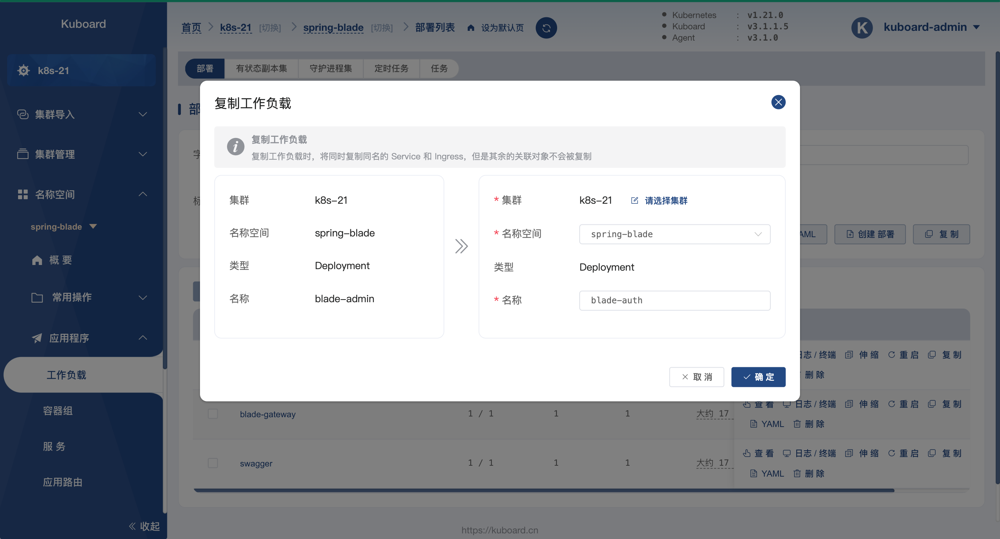
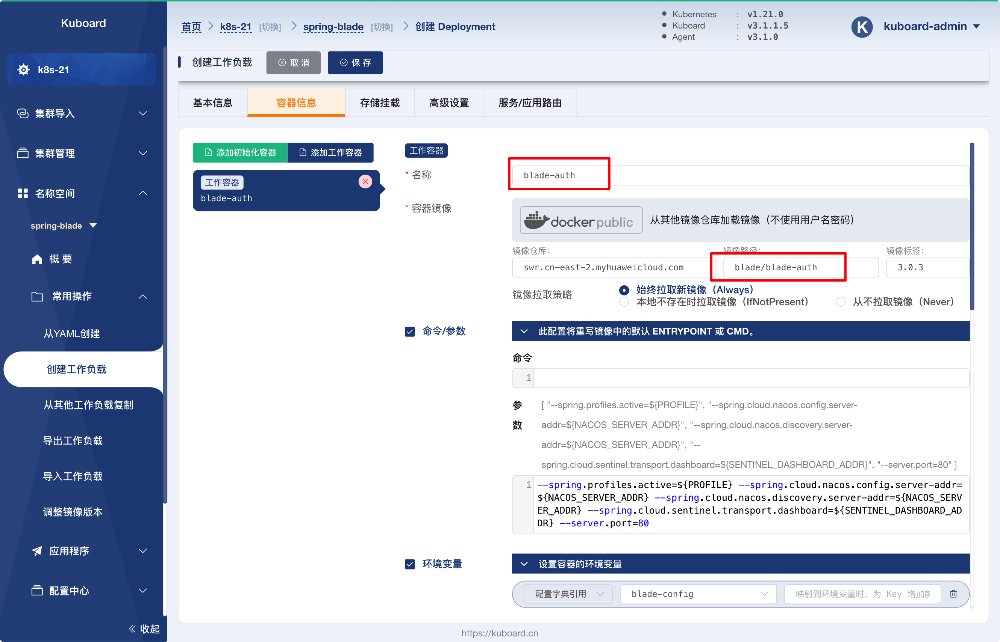
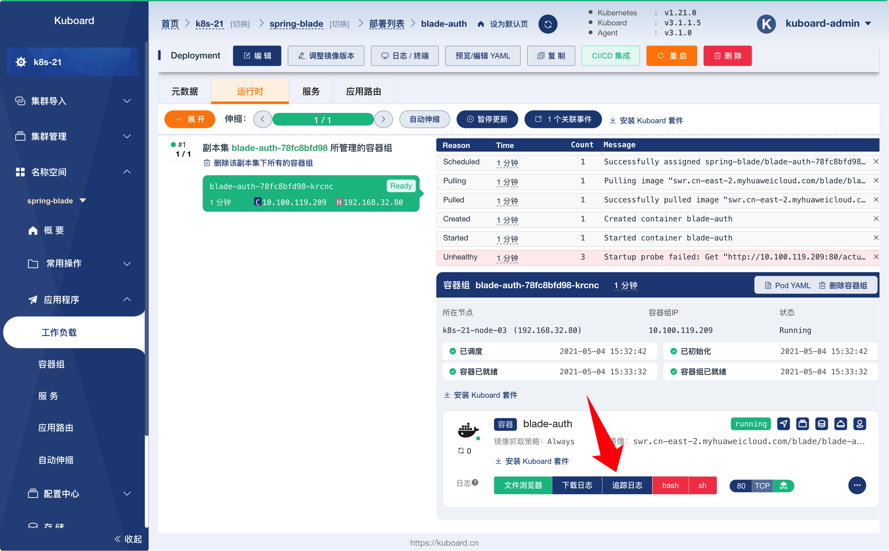
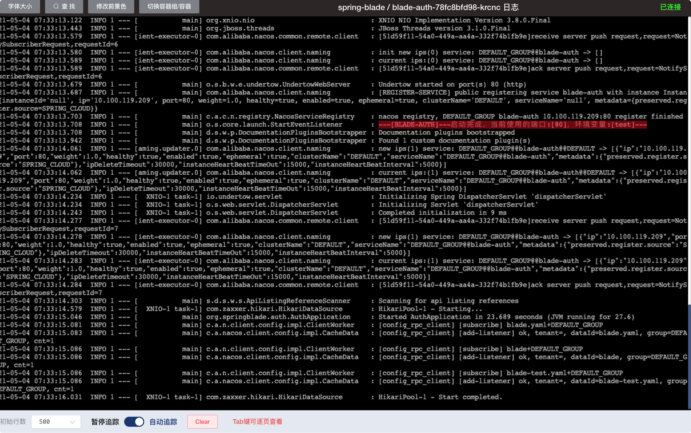
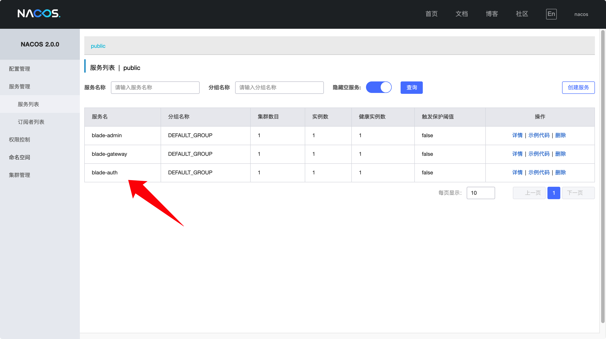
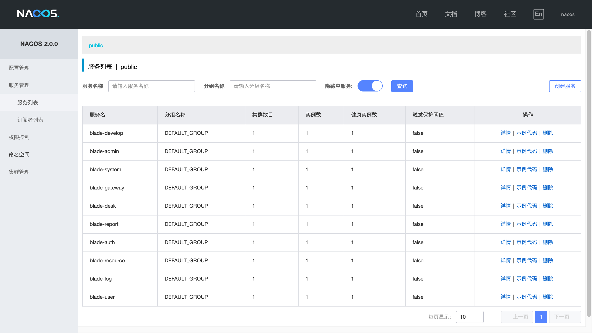

# 部署其他微服务

<AdSenseTitle/>

::: tip 前提条件

部署其他微服务之前，请确保您：
* 您的环境已经满足 [环境准备](../prepare/prepare.html) 中的要求
* 您已经完成了：
  * [部署 blade-admin](./blade-admin.html)

:::

除了已经完成部署的 `blade-admin`，还剩下 8个微服务尚未部署：

`blade-auth`、`blade-desk`、`blade-develop`、`blade-log`、`blade-report`、`blade-resource`、`blade-system`、`blade-user`

由于每一个微服务在 K8S 中的部署信息大同小异，本文将按照如下步骤完成其他 8 个微服务的部署：

* 复制并部署 `blade-auth`
* 验证 `blade-auth` 的部署结果
* 验证 `blade-auth` 已成功注册到 nacos
* 复制并部署其他 7 个微服务


## 复制并部署 blade-auth

* 在 Kuboard 中导航到菜单 ***名称空间*** --> ***spring-blade*** --> ***工作负载***，如下图所示：

  

* 点击上图中 `blade-admin` 所对应的 ***复制*** 按钮，如下图所示：

  填写表单：

  | 字段名   | 字段值       | 备注                     |
  | -------- | ------------ | ------------------------ |
  | 名称空间 | spring-blade | 目标工作负载所在名称空间 |
  | 名称     | blade-auth   | 目标工作负载名称         |

  

* 点击上图中的 ***确定*** 按钮，将跳转到工作负载创建页面，然后，切换到 ***容器信息*** 标签页，如下图所示：

  修改如下两个字段：

  | 字段名       | 字段值             | 备注                   |
  | ------------ | ------------------ | ---------------------- |
  | 工作容器名称 | `blade-auth`       | 原为 blade-admin       |
  | 镜像路径     | `blade/blade-auth` | 原为 blade/blade-admin |

  

* 点击 ***保存*** 按钮，创建 `blade-auth` Deployment

## 验证 blade-auth 的部署结果

* 在完成 `blade-auth` Deployment 的保存以后，将跳转到 `blade-auth` 的工作负载详情页，如下图所示：

  

* 点击上图中的 ***追踪日志*** 按钮，可以看到 blade-auth 的日志信息，如下图所示，日志将提示：

  ```
  ---[BLADE-AUTH]---启动完成，当前使用的端口:[80]，环境变量:[test]---
  ```

  

## 验证 blade-auth 已成功注册到 nacos

按照下面的步骤，可以验证 `blade-auth` 是否已经成功注册到 nacos 服务注册中心：

* 切换到  `nacos`  StatefulSet 的详情页，如下图所示：
  
  


* 点击上图中，容器端口 `8848` 后面对应的绿色图标，如下图所示：

  修改 ***访问路径*** 字段为 `/nacos`；

  


* 在上图中修改 ***访问路径*** 字段后，点击 ***在浏览器窗口打开*** 按钮，将会打开一个新的窗口，如下图所示：

  填写登录信息：

  用户名：`nacos`

  密码： `nacos`

  

* 在上图中点击 ***提交*** 按钮，完成 nacos 登录，并切换到 ***服务管理*** --> ***服务列表*** 菜单项， 如下图所示：

  

* 至此，我们可以认为 blade-auth 已经部署成功。


## 复制并部署其他 7 个微服务

重复前面的步骤：

* 复制并部署 `blade-xxx`
* 验证 `blade-xxx` 的部署结果
* 验证 `blade-xxx` 已成功注册到 nacos

完成其余 7 个微服务的部署：`blade-desk`、`blade-develop`、`blade-log`、`blade-report`、`blade-resource`、`blade-system`、`blade-user`

完成所有微服务的部署以后，nacos 的服务列表界面如下图所示：



至此，我们完成了所有微服务的部署。

接下来，请 [部署 saber-web](./saber-web.html)