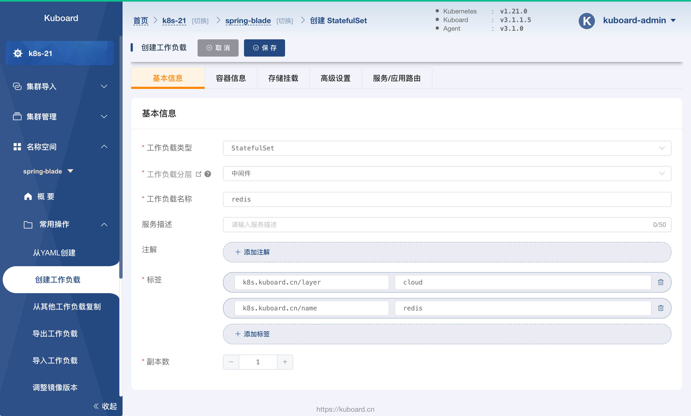
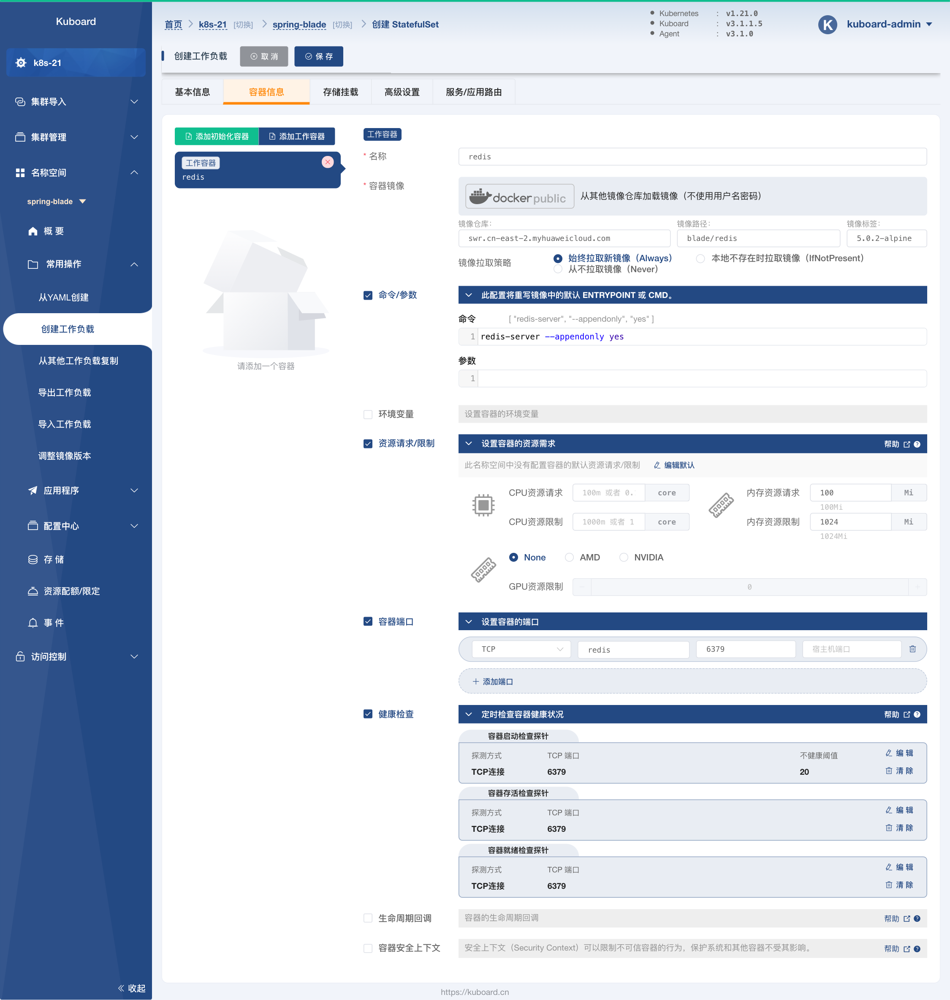
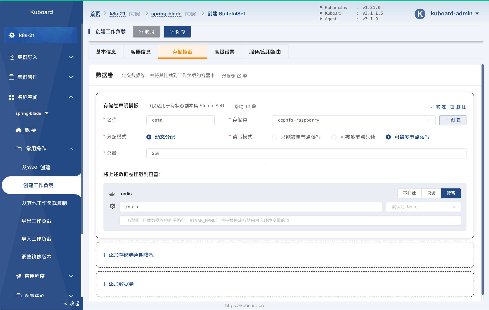
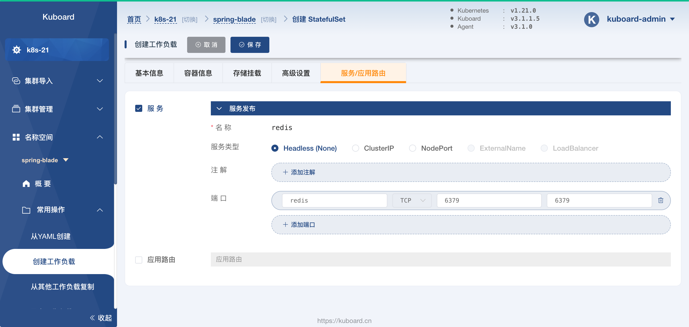
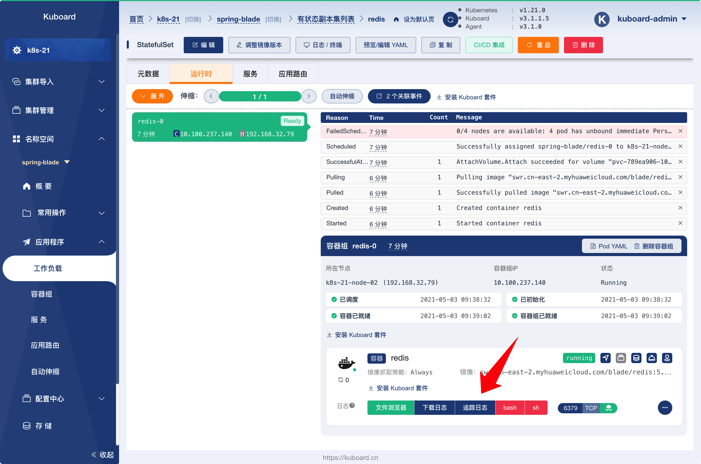
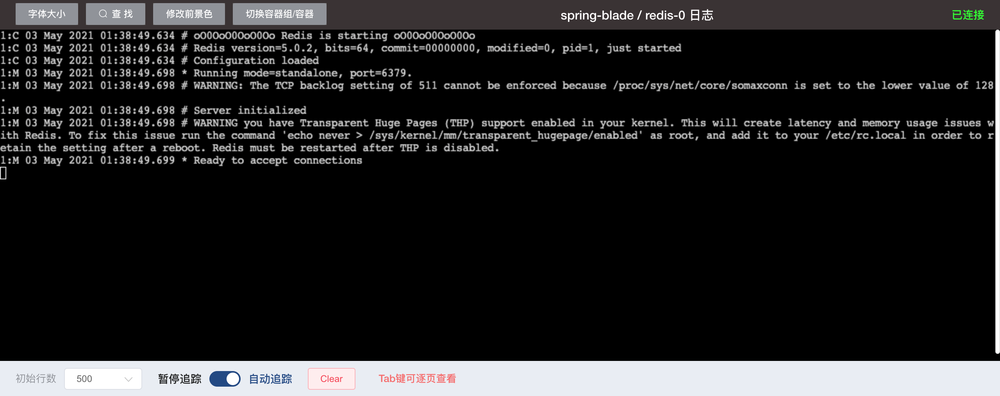
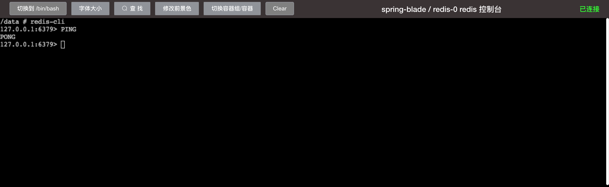

# 部署 redis

<AdSenseTitle/>

::: tip 前提条件

* 部署 `redis` 之前，请确保您的环境已经满足 [环境准备](../prepare/prepare.html) 中的要求；
* `redis` 的部署并不依赖于 `nacos`，您也可以先部署 `redis` 再部署 `nacos`。

:::

## 创建 StatefulSet

按照如下步骤创建 `redis` StatefulSet：

* 在 Kuboard 界面进入名称空间 `spring-blade` 之后，点击菜单 ***名称空间*** -> ***spring-blade*** -> ***常用操作*** -> ***创建工作负载*** ，如下图所示：

  并填写表单：

  | 字段名称     | 字段值        | 备注                                         |
  | ------------ | ------------- | -------------------------------------------- |
  | 工作负载类型 | `StatefulSet` |                                              |
  | 工作负载分层 | `持久层`      | 填写后将自动添加 `k8s.kuboard.cn/layer` 标签 |
  | 工作负载名称 | `redis`       | 填写后将自动添加 `k8s.kuboard.cn/name` 标签  |
  | 副本数       | `1`           |                                              |

  

  

* 切换到 ***容器信息*** 标签，如下图所示：

  点击左侧的 ***添加工作容器*** 按钮，添加一个工作容器，并填写表单：

  | 字段名称                    | 字段值                                                       | 备注 |
  | --------------------------- | ------------------------------------------------------------ | ---- |
  | 名称                        | `redis`                                                      |      |
  | 容器镜像                    | `从其他镜像仓库加载镜像（不使用用户名密码）`                 |      |
  | 容器镜像-->镜像仓库         | `swr.cn-east-2.myhuaweicloud.com`                            |      |
  | 容器镜像-->镜像路径         | `blade/redis`                                                |      |
  | 容器镜像-->镜像标签         | `5.0.2-alpine`                                               |      |
  | 镜像拉取策略                | `始终拉取新镜像（Always）`                                   |      |
  | 命令参数                    | 命令 `redis-server --appendonly yes`                         |      |
  | 资源请求/限制               | 内存资源请求：`100Mi`<br />内存资源限制：`1024Mi`            |      |
  | 容器端口                    | `TCP`<br />`redis`<br />`6379`                               |      |
  | 健康检查-->容器启动检查探针 | 探测方式： `TCP连接`<br />TCP端口： `6379`<br />不健康阈值：`20` |      |
  | 健康检查-->容器存活检查探针 | 探测方式： `TCP连接`<br />TCP端口： `6379`                   |      |
  | 健康检查-->容器就绪检查探针 | 探测方式： `TCP连接`<br />TCP端口： `6379`                   |      |

  

* 切换到 ***存储挂载*** 标签页，并点击其中的 ***添加存储卷声明模板*** 按钮，如下图所示：

  填写表单：

  | 字段名称              | 字段值             | 备注                                                         |
  | --------------------- | ------------------ | ------------------------------------------------------------ |
  | 名称                  | `data`             |                                                              |
  | 存储类                | `cephfs-raspberry` | * 下拉选择，根据您集群环境的不同，此参数的值可以<br />不一样，但是对应的存储类必须为有效的存储类，并<br />能够动态提供存储卷 |
  | 分配模式              | `动态分配`         |                                                              |
  | 读写模式              | `可被多节点读写`   |                                                              |
  | 总量                  | `2Gi`              |                                                              |
  | redis容器中的挂载类型 | `读写`             |                                                              |
  | redis容器中的挂载路径 | `/data`            |                                                              |

  > * 要完成这一步骤，您必须有一个有效的存储类，关于存储类的介绍请参考 [StorageClass](/learning/k8s-intermediate/persistent/storage-class.html)
  > * 如果您的集群中尚未配置存储类，请参考如下三种存储类配置中的任意一种：
  >   * [使用 CephFS 作为存储类](/learning/k8s-intermediate/persistent/ceph/k8s-config.html)
  >   * [使用 CephFS 作为存储类 - Rook](/learning/k8s-intermediate/persistent/ceph/rook-config.html)
  >   * [使用 NFS 作为存储类](/learning/k8s-intermediate/persistent/nfs.html)

  


* 切换到 ***高级设置*** 标签页，如下图所示：

  并填写表单：

  | 字段名称       | 字段值                      | 备注                                                         |
  | -------------- | --------------------------- | ------------------------------------------------------------ |
  | 容器组管理策略 | `Parallel`                  | 不按容器组的序号顺序更新容器组。（此为测试环境，mysql 只部署<br />一个副本，不考虑主从的情况，否则此参数不能选择  `Parallel`） |
  | 历史版本数量   | `10`                        |                                                              |
  | 更新策略       | `滚动更新（RollingUpdate）` |                                                              |
  | 分割点         | `0`                         | 从序号为 `0` 的容器组开始更新 StatefulSet 中的所有容器组     |

  


* 切换到 ***服务/应用路由*** 标签页，如下图所示：

  并填写表单：

  | 字段名称 | 字段值                                     | 备注                                              |
  | -------- | ------------------------------------------ | ------------------------------------------------- |
  | 服务类型 | `Headless`                                 | 无头 Service，专用于 StatefulSet                  |
  | 端口     | `redis`<br />`TCP`<br />`6379`<br />`6379` | 将容器的 `6379` 端口映射到 Service 的 `6379` 端口 |

  


* 点击 ***保存*** 按钮，完成 `redis` StatefulSet 的创建


## 验证部署结果

* 在上面的步骤中，完成 StatefulSet 的保存以后，将会进入该 StatefulSet 的详情页面，如下图所示：
  * 启动过程中，会看到一个 `FailedSchedule` 事件，是因为 StatefulSet ***存储卷声明模板*** 指定的 ***存储卷声明*** 尚未成功创建和绑定，只要对应的存储类是没有问题的，稍等片刻即可；

  


* 点击上图中的 ***追踪日志*** 按钮，可以看到 redis 的日志信息，如下图所示，日志将提示：

  ```
  Ready to accept connections
  ```

  

* 点击上图中的 ***sh*** 按钮，可以进入 redis 容器的命令行终端界面，如下图所示：
  执行命令：
  ```sh
  redis-cli
  PING
  ```
  

  如果打印出 `PONG`，我们可以认为 Redis 已经部署成功。

  下一步，请 [部署 sentinel](./m-sentinel.html)
