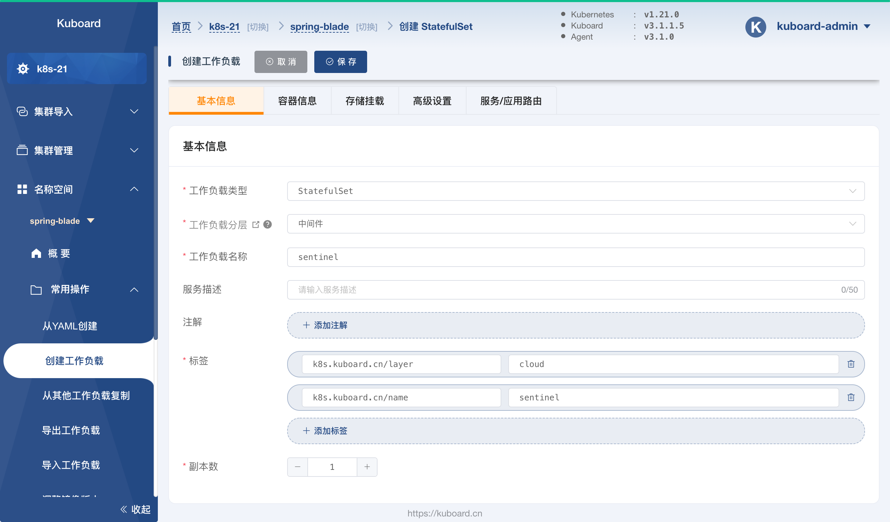
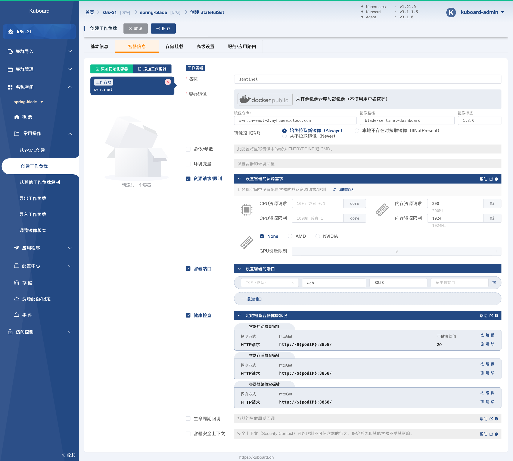
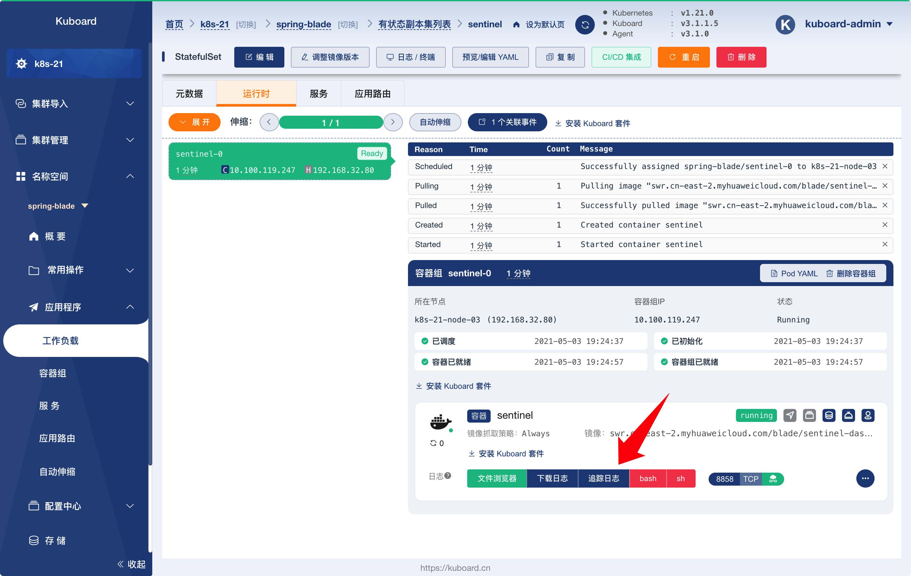
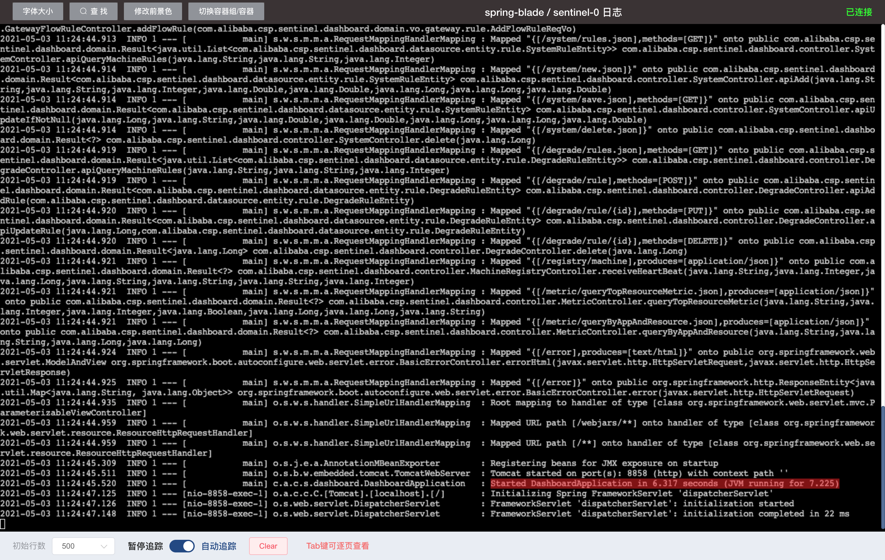
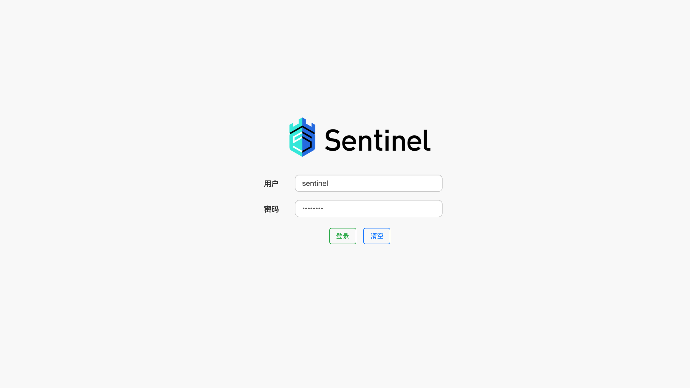
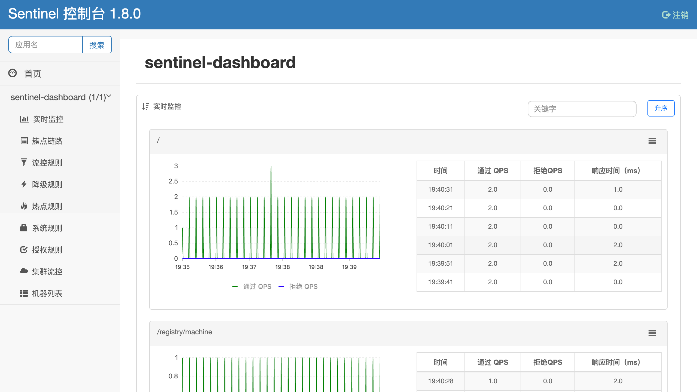

# 部署 sentinel

<AdSenseTitle/>

::: tip 前提条件

* 部署 `sentinel` 之前，请确保您的环境已经满足 [环境准备](../prepare/prepare.html) 中的要求；
* `sentinel` 的部署并不依赖于 `nacos`、`redis`，您也可以先部署 `sentinel` 再部署 `nacos`、`redis`。

:::

## 创建 StatefulSet

按照如下步骤创建 `sentinel` StatefulSet：

* 在 Kuboard 界面进入名称空间 `spring-blade` 之后，点击菜单 ***名称空间*** -> ***spring-blade*** -> ***常用操作*** -> ***创建工作负载*** ，如下图所示：

  并填写表单：

  | 字段名称     | 字段值        | 备注                                         |
  | ------------ | ------------- | -------------------------------------------- |
  | 工作负载类型 | `StatefulSet` |                                              |
  | 工作负载分层 | `持久层`      | 填写后将自动添加 `k8s.kuboard.cn/layer` 标签 |
  | 工作负载名称 | `sentinel`       | 填写后将自动添加 `k8s.kuboard.cn/name` 标签  |
  | 副本数       | `1`           |                                              |

  

* 切换到 ***容器信息*** 标签，如下图所示：

  点击左侧的 ***添加工作容器*** 按钮，添加一个工作容器，并填写表单：

  | 字段名称                    | 字段值                                                       | 备注 |
  | --------------------------- | ------------------------------------------------------------ | ---- |
  | 名称                        | `sentinel`                                                   |      |
  | 容器镜像                    | `从其他镜像仓库加载镜像（不使用用户名密码）`                 |      |
  | 容器镜像-->镜像仓库         | `swr.cn-east-2.myhuaweicloud.com`                            |      |
  | 容器镜像-->镜像路径         | `blade/sentinel-dashboard`                                   |      |
  | 容器镜像-->镜像标签         | `1.8.0`                                                      |      |
  | 镜像拉取策略                | `始终拉取新镜像（Always）`                                   |      |
  | 资源请求/限制               | 内存资源请求：`100Mi`<br />内存资源限制：`1024Mi`            |      |
  | 容器端口                    | `TCP`<br />`web`<br />`8858`                                 |      |
  | 健康检查-->容器启动检查探针 | 探测方式： `HTTP请求`<br />HTTP请求端口： `8858`<br />HTTP请求路径：`/`<br />不健康阈值：`20` |      |
  | 健康检查-->容器存活检查探针 | 探测方式： `HTTP请求`<br />HTTP请求端口： `8858`<br />HTTP请求路径：`/` |      |
  | 健康检查-->容器就绪检查探针 | 探测方式： `TCP连接`<br />HTTP请求端口： `8858`<br />HTTP请求路径：`/` |      |

  

  


* 切换到 ***高级设置*** 标签页，如下图所示：

  并填写表单：

  | 字段名称       | 字段值                      | 备注                                                         |
  | -------------- | --------------------------- | ------------------------------------------------------------ |
  | 容器组管理策略 | `Parallel`                  | 不按容器组的序号顺序更新容器组。（此为测试环境，mysql 只部署<br />一个副本，不考虑主从的情况，否则此参数不能选择  `Parallel`） |
  | 历史版本数量   | `10`                        |                                                              |
  | 更新策略       | `滚动更新（RollingUpdate）` |                                                              |
  | 分割点         | `0`                         | 从序号为 `0` 的容器组开始更新 StatefulSet 中的所有容器组     |

  


* 切换到 ***服务/应用路由*** 标签页，如下图所示：

  并填写表单：

  | 字段名称 | 字段值                                                     | 备注                                              |
  | -------- | ---------------------------------------------------------- | ------------------------------------------------- |
  | 服务类型 | `NodePort`                                                 | NodePort，可将端口映射到任意节点的指定节点端口    |
  | 端口     | `sentinel`<br />`TCP`<br />`8858`<br />`32100`<br />`8858` | 将容器的 `8858` 端口映射到 Service 的 `8858` 端口 |

  


* 点击 ***保存*** 按钮，完成 `sentinel` StatefulSet 的创建


## 验证部署结果

* 在上面的步骤中，完成 StatefulSet 的保存以后，将会进入该 StatefulSet 的详情页面，如下图所示：

  


* 点击上图中的 ***追踪日志*** 按钮，可以看到 sentinel 的日志信息，如下图所示，日志将提示：

  ```
  Started DashboardApplication in 6.317 seconds (JVM running for 7.225)
  ```

  

* 在浏览器中输入地址 `http://任意节点IP:32100` ，并打开该页面，如下图所示：
  
  使用默认用户名密码完成登录：
  
  用户名： `sentinel`
  
  密码： `sentinel`

  

* 登录成功后，界面显示如下：

  

* 至此，我们可以认为 sentinel 已部署成功。

  下一步，请 [部署 saber-db](./m-saber-db.html)