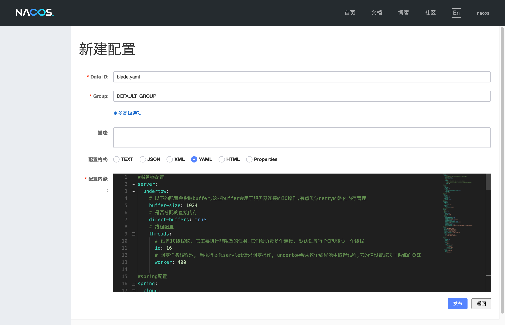
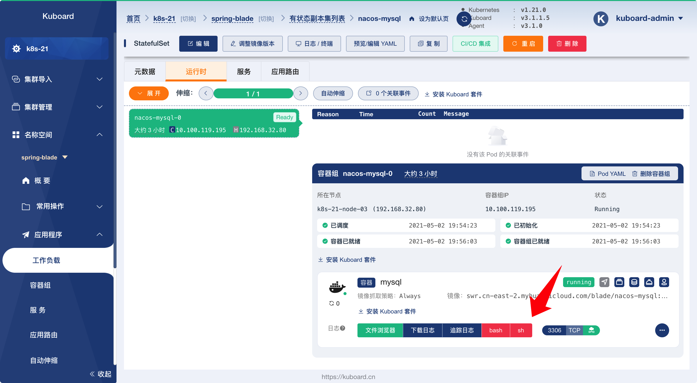
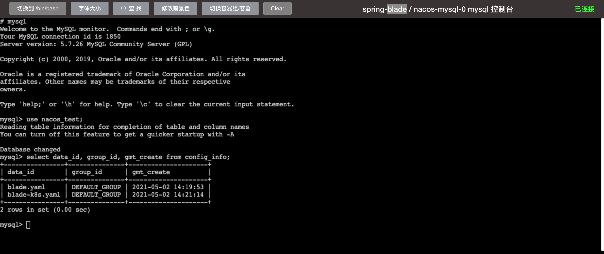

# 导入配置到 nacos

<AdSenseTitle/>

::: tip 前提条件

导入配置到 nacos 之前，请确保您已完成：
* [部署 nacos-mysql](./nacos-mysql.html)
* [部署 nacos](./nacos-install.html)

:::

SpringBlade 使用 nacos 作为微服务配置中心，按照本文描述的步骤，可以将 SpringBlade 的微服务配置文件导入到 nacos 配置中心。

## 导入配置文件

* 依据 [部署 nacos](./nacos-install.html#验证部署结果) 中描述的方式登录 Nacos 界面，如下图所示：

  

* 点击上图中红色箭头指向的按钮，结果如下图所示：

  填写表单：

  | 字段名   | 字段值                                                       | 备注                                                         |
  | -------- | ------------------------------------------------------------ | ------------------------------------------------------------ |
  | Data ID  | `blade.yaml`                                                 |                                                              |
  | Group    | `DEFAULT_GROUP`                                              |                                                              |
  | 配置格式 | `YAML`                                                       |                                                              |
  | 配置内容 <div style="width: 80px;"></div> | 链接 <a href="https://gitee.com/smallc/SpringBlade/raw/v3.0.3/doc/nacos/blade.yaml" target="_blank">https://gitee.com/smallc/SpringBlade/raw/v3.0.3/doc/nacos/blade.yaml</a> 中的内容 | 在浏览器打开该链接，并将其内容复制粘贴到 ***配置内容*** 字段 |

  

* 点击 ***发布*** 按钮，并重复上述过程，添加一个新的配置 ***blade-test.yaml***

  表单如下：

  | 字段名   | 字段值                                                       | 备注                                                         |
  | -------- | ------------------------------------------------------------ | ------------------------------------------------------------ |
  | Data ID  | `blade-test.yaml`                                            | <div style="color: red; font-weight: bold;">此处为 `blade-test.yaml` 不要写错</div> |
  | Group    | `DEFAULT_GROUP`                                              |                                                              |
  | 配置格式 | `YAML`                                                       |                                                              |
  | 配置内容 <div style="width: 80px;"></div> | 链接 <a href="https://gitee.com/smallc/SpringBlade/raw/v3.0.3/script/kuboard/blade-k8s.yaml" target="_blank">https://gitee.com/smallc/SpringBlade/raw/v3.0.3/script/kuboard/blade-k8s.yaml</a> | 在浏览器打开该链接，并将其内容复制粘贴到 ***配置内容*** 字段；<br /><div style="color: red; font-weight: bold;">此处使用 `blade-k8s.yaml` 文件中的内容，不要弄错</div> |


## 验证配置存储

* 在 Kuboard 中切换到 StatefulSet `nacos_mysql` 的详情页，如下图所示：

  

* 点击上图中的 ***sh*** 按钮，打开终端界面，如下图所示：

  在终端界面中执行如下命令，可以看到前面步骤中向 nacos 添加的配置信息被存到了 `nacos_test` 数据库中的 `config_info` 表中。

  ``` sh
  mysql
  use nacos_test;
  select data_id, group_id, gmt_create from config_info;
  ```

  

* 至此，我们可以认为 nacos 的配置导入成功。
  
  下一步，请 [部署 redis](./redis.html)