# 部署 nacos

<AdSenseTitle/>

::: tip 前提条件

部署 nacos 之前，请确保
* 您的环境已经满足 [环境准备](../prepare/prepare.html) 中的要求；
* 您已经完成了 [部署 nacos-mysql](./nacos-mysql.html)；

:::

## 创建 StatefulSet

按照如下步骤创建 `nacos-mysql` StatefulSet：

* 在 Kuboard 界面进入名称空间 `spring-blade` 之后，点击菜单 ***名称空间*** -> ***spring-blade*** -> ***常用操作*** -> ***创建工作负载*** ，如下图所示：

  并填写表单：

  | 字段名称     | 字段值        | 备注                                         |
  | ------------ | ------------- | -------------------------------------------- |
  | 工作负载类型 | `StatefulSet` |                                              |
  | 工作负载分层 | `持久层`      | 填写后将自动添加 `k8s.kuboard.cn/layer` 标签 |
  | 工作负载名称 | `nacos`       | 填写后将自动添加 `k8s.kuboard.cn/name` 标签  |
  | 副本数       | `1`           |                                              |

  

* 切换到 ***容器信息*** 标签，如下图所示：

  点击左侧的 ***添加工作容器*** 按钮，添加一个工作容器，并填写表单：

  | 字段名称            | 字段值                                                       | 备注                                                |
  | ------------------- | ------------------------------------------------------------ | --------------------------------------------------- |
  | 名称                | `nacos`                                                      |                                                     |
  | 容器镜像            | `从其他镜像仓库加载镜像（不使用用户名密码）`                 |                                                     |
  | 容器镜像-->镜像仓库 | `swr.cn-east-2.myhuaweicloud.com`                            |                                                     |
  | 容器镜像-->镜像路径 | `blade/nacos-server`                                         |                                                     |
  | 容器镜像-->镜像标签 | `2.0.0`                                                      |                                                     |
  | 镜像拉取策略        | `始终拉取新镜像（Always）`                                   |                                                     |
  | 环境变量            | `MODE` = `standalone` `PREFER_HOST_MODE` = `hostname` `SPRING_DATASOURCE_PLATFORM` = `mysql` `MYSQL_SERVICE_HOST` = `nacos-mysql-0.nacos-mysql` `MYSQL_SERVICE_DB_NAME` = `nacos_test` `MYSQL_SERVICE_PORT` = `3306` `MYSQL_SERVICE_USER` = `nacos` `MYSQL_SERVICE_PASSWORD` = `nacos` | 类型为 `值`，点击 ***名值对***  按钮可添加一组 |
  | 资源请求/限制       | 内存资源请求：`200Mi` 内存资源限制：`2048Mi`            |                                                     |
  | 容器端口            | `client` `8848` `client-rpc` `9848` `raft-rpc` `9849` |                                                     |
  
  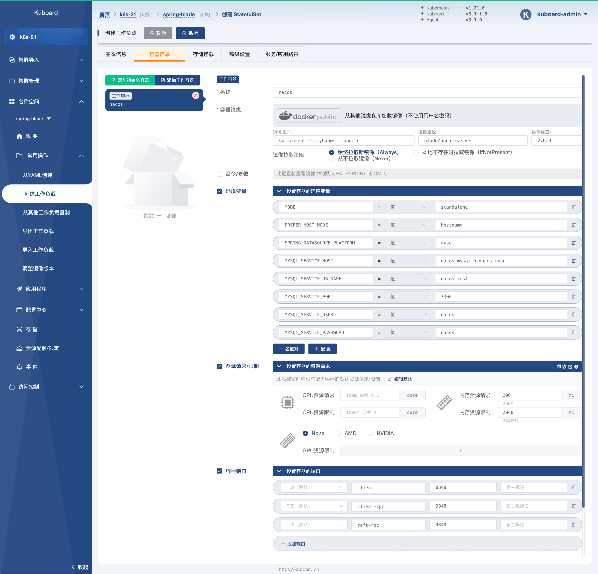

  点击 ***容器启动检查探针*** 的 ***启用*** 按钮：

  并填写表单：

  | 字段名称       | 字段值                                                       | 备注                                                         |
  | -------------- | ------------------------------------------------------------ | ------------------------------------------------------------ |
  | 探针类型       | `HTTP请求`                                                   |                                                              |
  | HttpGet        | 端口 `8848` 路径`/nacos/v1/ns/instance/list?serviceName=nacos` 

|                                                              |
  | 初始延迟（秒） | `30`                                                         |                                                              |
  | 不健康阈值     | `20`                                                         | 执行探测频率 * 不健康阈值 = 10 * 20 = 200秒，容器创建 200 秒后，HttpGet  `http://${podIP}:8848/nacos/v1/ns/instance/list?serviceName=nacos` 如果仍未执行成功，kubelet 将认为该容器启动失败，并强制重启该容器。 |

  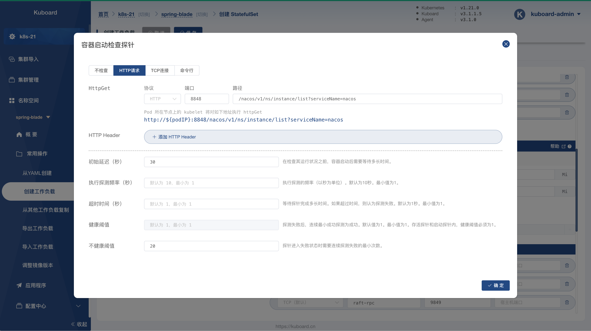

  按照同样的方式，启用 ***容器存活检查探针*** ，表单内容如下所示：
  
  | 字段名称         | 字段值                                                       | 备注                                                         |
  | ---------------- | ------------------------------------------------------------ | ------------------------------------------------------------ |
  | 探针类型探针类型 | `HTTP请求`                                                   |                                                              |
  | HttpGetCommand   | 端口 `8848` 路径 `/nacos/v1/ns/instance/list?serviceName=nacos` 

 |                                                              |
  | 初始延迟（秒）   | `30`                                                         |                                                              |
  | 不健康阈值       | `3`                                                          | 连续3此失败后，kubelet 将认为该容器已经不健康，并强制重启该容器 |

  按照同样的方式，启用 ***容器就绪检查探针*** ，表单内容如下所示：
  
  | 字段名称         | 字段值                                                       | 备注                                                         |
  | ---------------- | ------------------------------------------------------------ | ------------------------------------------------------------ |
  | 探针类型探针类型 | `HTTP请求`                                                   |                                                              |
  | HttpGetCommand   | 端口 `8848` 路径 `/nacos/v1/ns/instance/list?serviceName=nacos` 

 |                                                              |
  | 初始延迟（秒）   | `30`                                                         |                                                              |
  | 健康阈值         | `2`                                                          | 探针连续执行成功 2 次以后，kubelet 认为该容器已就绪，并将其添加到对应 Service （如果有）的 Endpoint 中，Service 此时可以分发流量到该容器 |
  | 不健康阈值       | `3`                                                          | 探针连续执行失败 3 此以后，kubelet 认为该容器已经不健康，并强制重启该容器 |
  
  完成 ***健康检查*** 的设置以后，界面截图如下所示：
  
  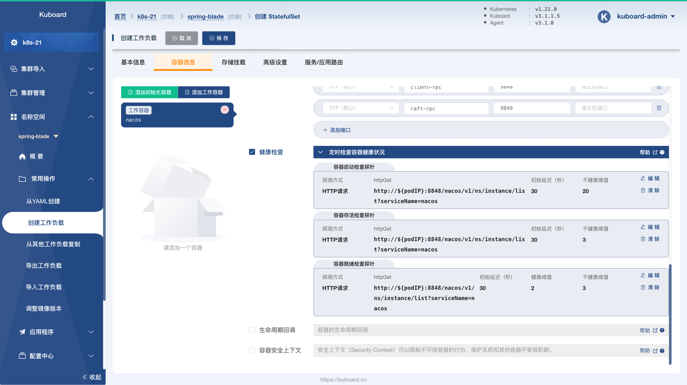

* 切换到 ***存储挂载*** 标签页，如下图所示：
  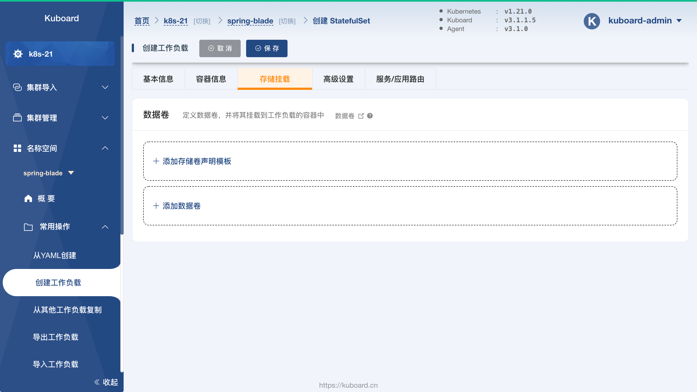
  点击上图中 ***添加存储卷声明模板*** 按钮，如下图所示：

  填写表单：

  | 字段名称              | 字段值             | 备注                                                         |
  | --------------------- | ------------------ | ------------------------------------------------------------ |
  | 名称                  | `logs`             |                                                              |
  | 存储类                | `cephfs-raspberry` | * 下拉选择，根据您集群环境的不同，此参数的值可以 不一样，但是对应的存储类必须为有效的存储类，并 能够动态提供存储卷 |
  | 分配模式              | `动态分配`         |                                                              |
  | 读写模式              | `可被多节点读写`   |                                                              |
  | 总量                  | `2Gi`              |                                                              |
  | nacos容器中的挂载类型 | `读写`             |                                                              |
  | nacos容器中的挂载路径 | `/home/nacos/logs` | Nacos 存储日志的位置。StatefuSet 的 ***存储卷声明模板*** 会为每个容器组分配一个存储卷声明，以便存在多个 nacos 副本时，每个副本的日志文件不会产生冲突。 |

  > * 要完成这一步骤，您必须有一个有效的存储类，关于存储类的介绍请参考 [StorageClass](/learning/k8s-intermediate/persistent/storage-class.html)
  > * 如果您的集群中尚未配置存储类，请参考如下三种存储类配置中的任意一种：
  >   * [使用 CephFS 作为存储类](/learning/k8s-intermediate/persistent/ceph/k8s-config.html)
  >   * [使用 CephFS 作为存储类 - Rook](/learning/k8s-intermediate/persistent/ceph/rook-config.html)
  >   * [使用 NFS 作为存储类](/learning/k8s-intermediate/persistent/nfs.html)
  
  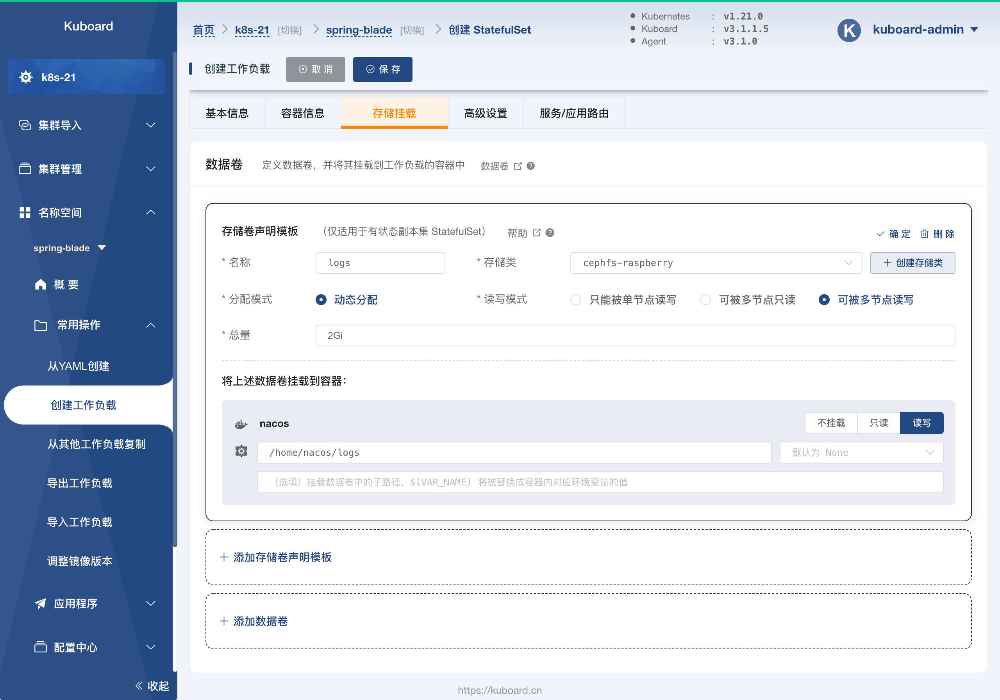
  
  点击上图中 ***添加数据卷*** 按钮，如下图所示：
  
  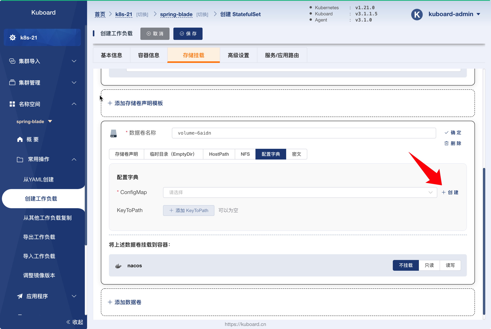
  
  在上图中切换到 ***配置字典*** 标签页，并点击 ***创建*** 按钮，如下图所示：
  
  填写表单：
  
  | 字段名称 | 字段值                                                       | 备注                                                     |
  | -------- | ------------------------------------------------------------ | -------------------------------------------------------- |
  | 名称     | nacos-config                                                 | 配置字典的名称                                           |
  | 数据     | `custom.properties` 
 #spring.security.enabled=false #management.security=false #security.basic.enabled=false #nacos.security.ignore.urls=/** #management.metrics.export.elastic.host=http://localhost:9200 # metrics for prometheus management.endpoints.web.exposure.include=*  # metrics for elastic search #management.metrics.export.elastic.enabled=false #management.metrics.export.elastic.host=http://localhost:9200  # metrics for influx #management.metrics.export.influx.enabled=false #management.metrics.export.influx.db=springboot #management.metrics.export.influx.uri=http://localhost:8086 #management.metrics.export.influx.auto-create-db=true #management.metrics.export.influx.consistency=one #management.metrics.export.influx.compressed=true
 | nacos的配置文件内容作为  `custom.properties` 的取值 |
  
  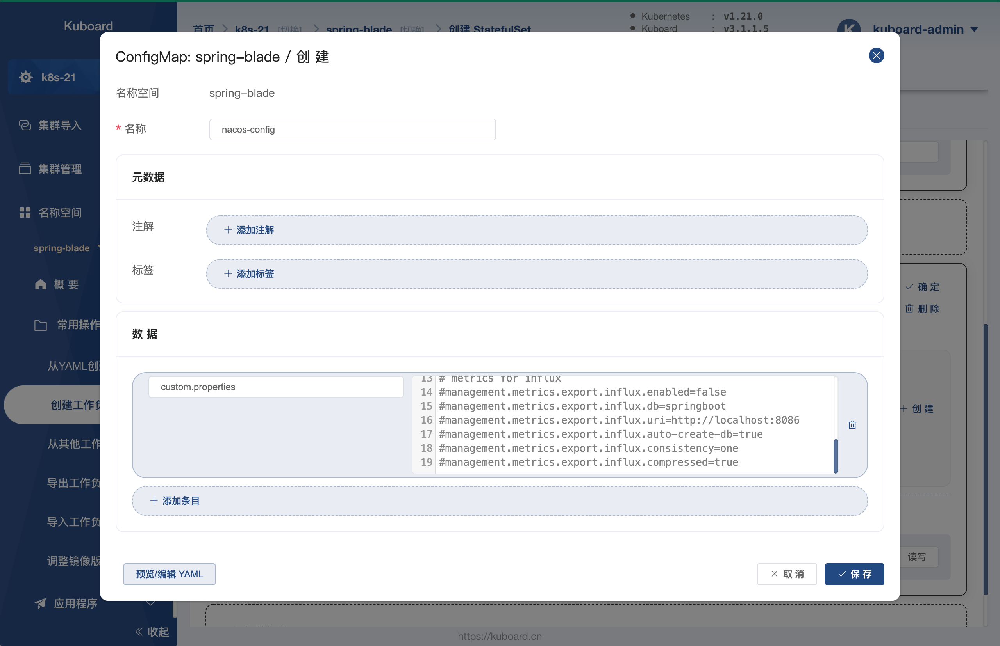
  
  点击上图中的 ***保存*** 按钮，将完成配置字典 `nacos-config` 的创建，您也可以在菜单 ***名称空间*** -> ***spring-blade*** -> ***配置中心*** -> ***配置字典*** 中管理刚才创建的配置字典。
  
  完成配置字典 `nacos-config` 的创建后，该对话框将关闭，我们继续完善 StatefulSet 的数据卷配置，如下图所示：
  
  填写表单：
  
  | 字段名称                | 字段值                                 | 备注               |
  | ----------------------- | -------------------------------------- | ------------------ |
  | 名称                    | `volume-6aidn`                         | 自动生成的名称即可 |
  | 数据卷类型              | `配置字典`                             |                    |
  |                         |                                        |                    |
  | 分配模式                | `动态分配`                             |                    |
  | 读写模式                | `可被多节点读写`                       |                    |
  | 总量                    | `2Gi`                                  |                    |
  | nacos容器中的挂载类型   | `只读`                                 |                    |
  | nacos容器中的挂载路径   | `/home/nacos/init.d/custom.properties` |                    |
  | nacos容器中的挂载子路径 | `custom.properties`                    |                    |
  
  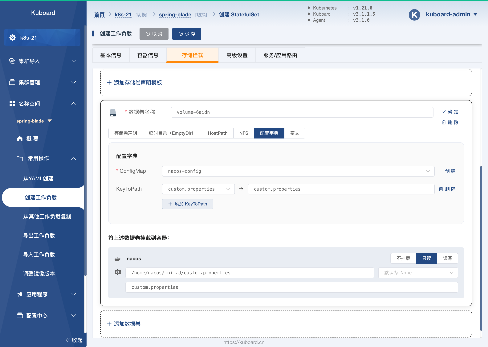

* 切换到 ***高级设置*** 标签页，如下图所示

  并填写表单：

  | 字段名称       | 字段值                      | 备注                                                         |
  | -------------- | --------------------------- | ------------------------------------------------------------ |
  | 容器组管理策略 | `Parallel`                  | 不按容器组的序号顺序更新容器组。（此为测试环境，mysql 只部署 一个副本，不考虑主从的情况，否则此参数不能选择  `Parallel`） |
  | 历史版本数量   | `10`                        |                                                              |
  | 更新策略       | `滚动更新（RollingUpdate）` |                                                              |
  | 分割点         | `0`                         | 从序号为 `0` 的容器组开始更新 StatefulSet 中的所有容器组     |

  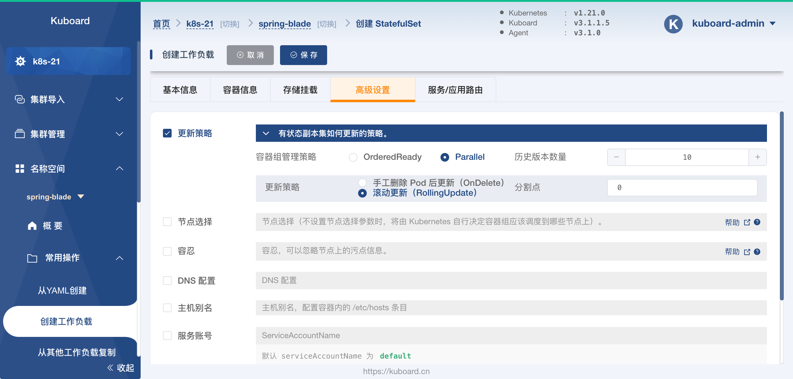

* 切换到 ***服务/应用路由*** 标签页，如下图所示：

  并填写表单：

  | 字段名称 | 字段值                                                       | 备注                                                         |
  | -------- | ------------------------------------------------------------ | ------------------------------------------------------------ |
  | 服务类型 | `NodePort`                                                   | `NodePort` 类型的Service，可以将容器端口映射到集群中任意节点的节点端口 |
  | 端口     | 端口名称： `nacos-client` 协 议：`TCP` 服务端口： `8848` 节点端口： `32000` 容器端口： `8848` 

| 将容器的 `8848` 端口映射到 Service 的 `8848` 端口以及任意节点的  `32000` 端口 |
  | 会话保持 | `ClientIP` timeoutSeconds：`10800`                      |                                                              |
  
  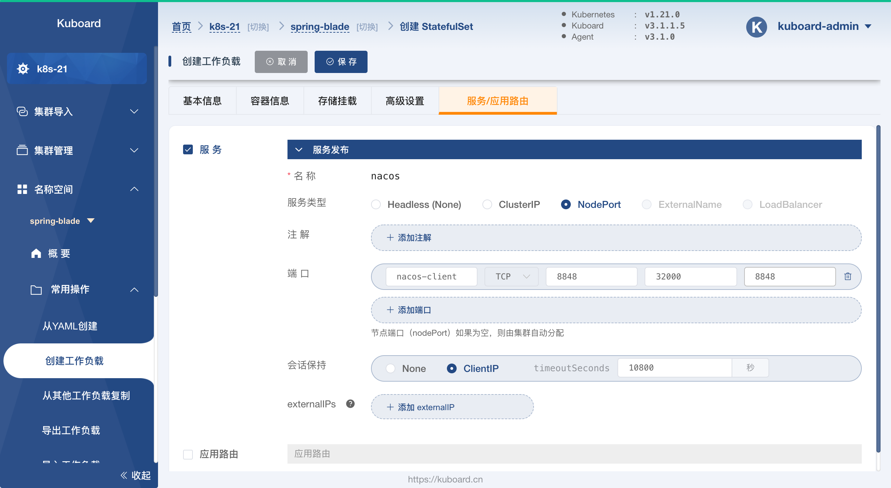

* 点击 ***保存*** 按钮，依据界面提示完成保存操作

## 验证部署结果

* 在上面的步骤中，完成 StatefulSet 的保存以后，将会进入该 StatefulSet 的详情页，如下图所示：
  * 启动过程中，会看到两个 `FailedSchedule` 事件，是因为 StatefulSet ***存储卷声明模板*** 指定的 ***存储卷声明*** 尚未成功创建和绑定，只要对应的存储类是没有问题的，稍等片刻即可；

  

* 点击上图中，容器端口 `8848` 后面对应的绿色图标，如下图所示：

  修改 ***访问路径*** 字段为 `/nacos`；

  

* 在上图中修改 ***访问路径*** 字段后，点击 ***在浏览器窗口打开*** 按钮，将会打开一个新的窗口，如下图所示：

  填写登录信息：

  用户名：`nacos`

  密码： `nacos`

  

* 在上图中点击 ***提交*** 按钮，完成 nacos 登录，如下图所示：

  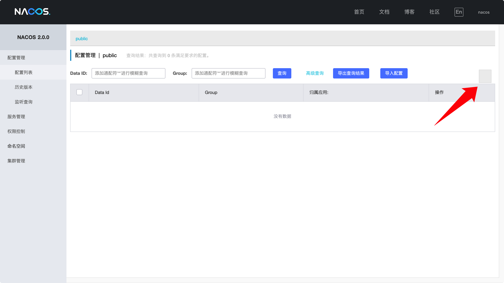

  ::: warning KuboardProxy 的使用

  * 在本例中，我们使用 KuboardProxy 访问 Nacos 的界面，然而，这种访问方式在绝大多数情况下是可以满足使用要求的（尤其是接口调用测试时），但并不是完美的，因为少部分应用可能会使用绝对路径来加载静态资源。例如 Nacos 就从路径 `/nacos/console-ui/public/icons/icon-font.woff` 加载一些图标，但是 KuboardProxy 必须把应用重新指向了一个比较长的相对路径才能工作；在缺失 `icon-font.woff` 静态资源的情况下，Nacos 界面中的部分图标不能正常显示（例如上图红色箭头指向的按钮中，原本有一个加号图标），但是所有的应用功能仍然能够正常操作。

  * 按照本文描述的 Nacos 部署方式，您也可以用下面的地址访问 Nacos 界面：

    `http://任意节点IP地址:32000/nacos`

  :::

* 至此，我们可以认为 `nacos` 部署成功。

  下一步，请 [导入配置到 nacos](./nacos-config.html)