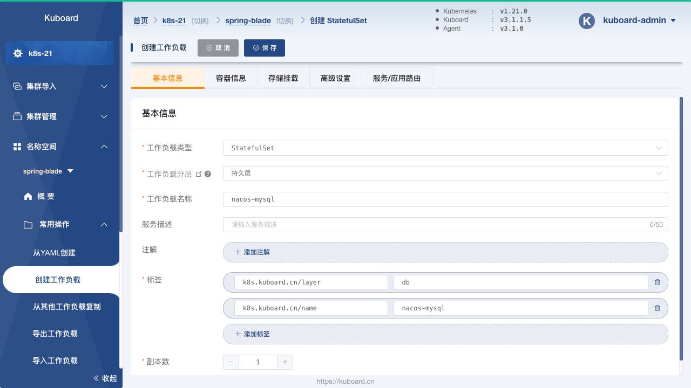
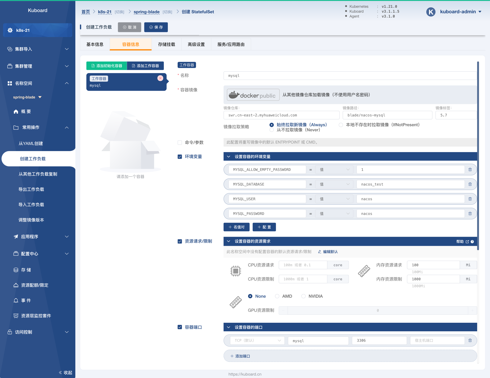
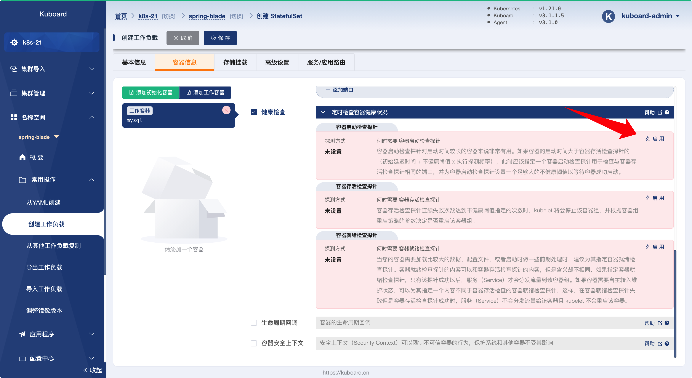
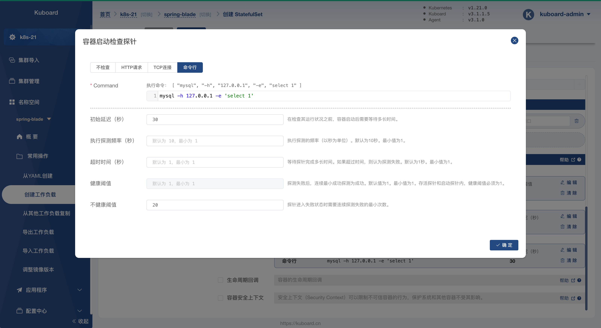
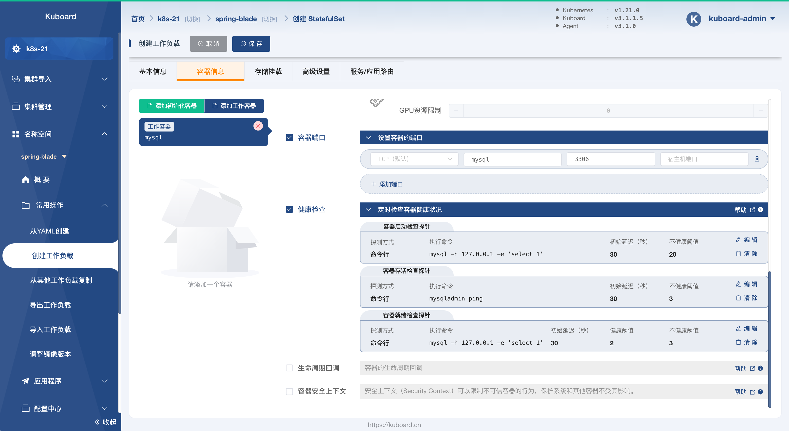
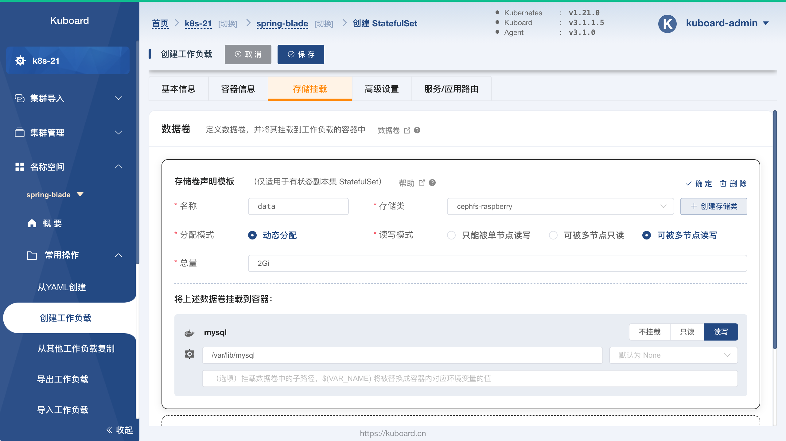
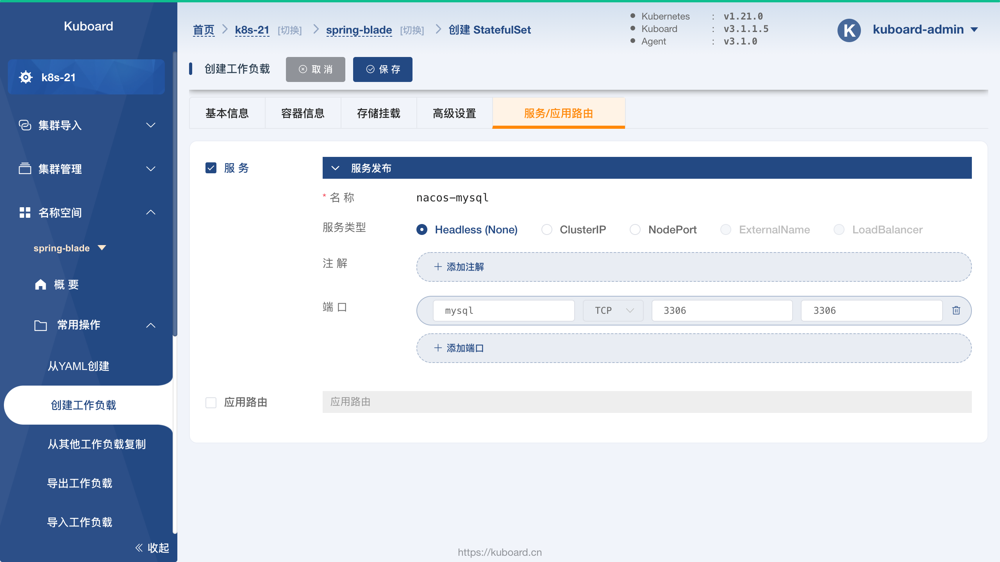
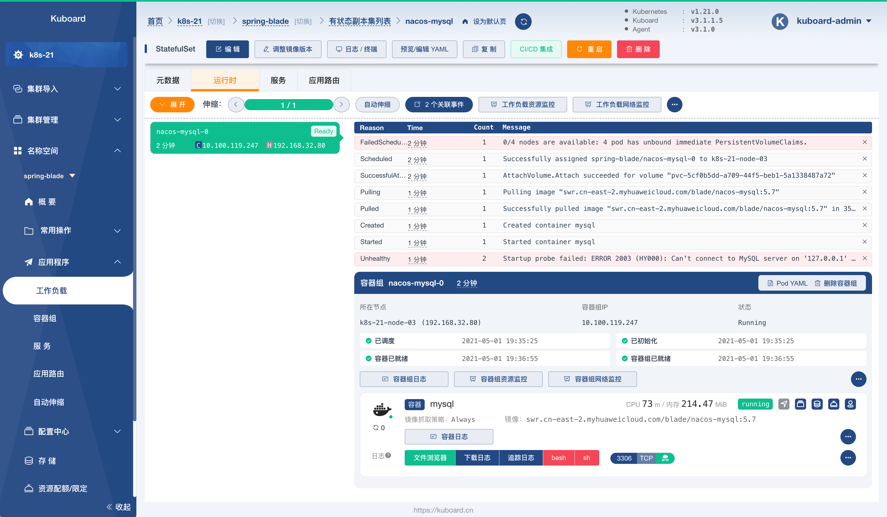
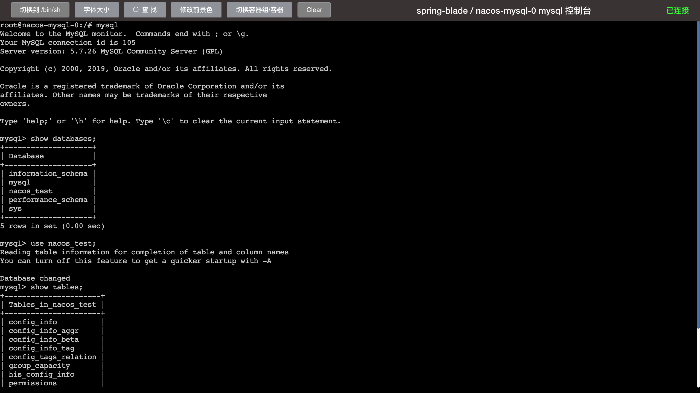

# 部署 nacos-mysql

<AdSenseTitle/>

::: tip 前提条件

部署 nacos-mysql 之前，请确保您的环境已经满足 [环境准备](../prepare/prepare.html) 中的要求。

:::

## 创建 StatefulSet

按照如下步骤创建 `nacos-mysql` StatefulSet：

* 在 Kuboard 界面进入名称空间 `spring-blade` 之后，点击菜单 ***名称空间*** -> ***spring-blade*** -> ***常用操作*** -> ***创建工作负载*** ，如下图所示：

  并填写表单：

  | 字段名称     | 字段值      | 备注                                         |
  | ------------ | ----------- | -------------------------------------------- |
  | 工作负载类型 | `StatefulSet` |                                              |
  | 工作负载分层 | `持久层`      | 填写后将自动添加 `k8s.kuboard.cn/layer` 标签 |
  | 工作负载名称 | `nacos-mysql` | 填写后将自动添加 `k8s.kuboard.cn/name` 标签  |
  | 副本数       | `1`           |                                              |

  

* 切换到 ***容器信息*** 标签，如下图所示：

  点击左侧的 ***添加工作容器*** 按钮，添加一个工作容器，并填写表单：

  | 字段名称            | 字段值                                                       | 备注 |
  | ------------------- | ------------------------------------------------------------ | ---- |
  | 名称                | `mysql`                                                      |      |
  | 容器镜像            | `从其他镜像仓库加载镜像（不使用用户名密码）`                   |      |
  | 容器镜像-->镜像仓库 | `swr.cn-east-2.myhuaweicloud.com`                            |      |
  | 容器镜像-->镜像路径 | `blade/nacos-mysql`                                          |      |
  | 容器镜像-->镜像标签 | `5.7`                                                        |      |
  | 镜像拉取策略        | `始终拉取新镜像（Always）`                                     |      |
  | 环境变量            | `MYSQL_ALLOW_EMPTY_PASSWORD`=`1`<br />`MYSQL_DATABASE`=`nacos_test`<br />`MYSQL_USER`=`nacos`<br />`MYSQL_PASSWORD`=`nacos` | 类型为 `值`，点击 ***名值对*** 按钮可添加一组     |
  | 资源请求/限制       | 内存资源请求：`100Mi`<br />内存资源限制：`1000Mi`            |      |
  | 容器端口            | `mysql`<br />`3306`                                          |      |

  

  启用 ***健康检查*** ，如下图所示：

  

  点击 ***容器启动检查探针*** 的 ***启用*** 按钮，如下图所示：

  并填写表单：

  | 字段名称       | 字段值                             | 备注                                                         |
  | -------------- | ---------------------------------- | ------------------------------------------------------------ |
  | 探针类型       | `命令行`                           |                                                              |
  | Command        | `mysql -h 127.0.0.1 -e 'select 1'` |                                                              |
  | 初始延迟（秒） | `30`                               |                                                              |
  | 不健康阈值     | `20`                               | 执行探测频率 * 不健康阈值 = 10 * 20 = 200秒，<br />容器创建 200 秒后，Command<br /> `mysql -h 127.0.0.1 -e 'select 1'` <br />如果仍未执行成功，kubelet 将认为该容器启动失败，<br />并强制重启该容器。 |

  

  按照同样的方式，启用 ***容器存活检查探针*** ，表单内容如下所示：

  | 字段名称       | 字段值            | 备注                                                         |
  | -------------- | ----------------- | ------------------------------------------------------------ |
  | 探针类型       | `命令行`          |                                                              |
  | Command        | `mysqladmin ping` |                                                              |
  | 初始延迟（秒） | `30`              |                                                              |
  | 不健康阈值     | `3`               | 连续3此失败后，kubelet 将认为该容器已经不健康，并强制重启该容器 |

  按照同样的方式，启用 ***容器就绪检查探针*** ，表单内容如下所示：

  | 字段名称       | 字段值                             | 备注                                                         |
  | -------------- | ---------------------------------- | ------------------------------------------------------------ |
  | 探针类型       | `命令行`                           |                                                              |
  | Command        | `mysql -h 127.0.0.1 -e 'select 1'` |                                                              |
  | 初始延迟（秒） | `30`                               |                                                              |
  | 健康阈值       | `2`                                | 探针连续执行成功 2 次以后，kubelet 认为该容器已就绪，并将其添加到对应 Service （如果有）的 Endpoint 中，Service 此时可以分发流量到该容器 |
  | 不健康阈值     | `3`                                | 探针连续执行失败 3 此以后，kubelet 认为该容器已经不健康，并强制重启该容器 |
  
  完成 ***健康检查*** 的设置以后，界面截图如下所示：
  
  


* 切换到 ***存储挂载*** 标签页，如下图所示：
  
  点击上图中 ***添加存储卷声明模板*** 按钮，如下图所示：

  填写表单：

  | 字段名称               | 字段值             | 备注                                                         |
  | ---------------------- | ------------------ | ------------------------------------------------------------ |
  | 名称                   | `data`             |                                                              |
  | 存储类                 | `cephfs-raspberry` | * 下拉选择，根据您集群环境的不同，此参数的值可以<br />不一样，但是对应的存储类必须为有效的存储类，并<br />能够动态提供存储卷 |
  | 分配模式               | `动态分配`         |                                                              |
  | 读写模式               | `可被多节点读写`   |                                                              |
  | 总量                   | `2Gi`              |                                                              |
  | mysql 容器中的挂载类型 | `读写`             |                                                              |
  | mysql 容器中的挂载路径 | `/var/lib/mysql`   |                                                              |

  > * 要完成这一步骤，您必须有一个有效的存储类，关于存储类的介绍请参考 [StorageClass](/learning/k8s-intermediate/persistent/storage-class.html)
  > * 如果您的集群中尚未配置存储类，请参考如下三种存储类配置中的任意一种：
  >    * [使用 CephFS 作为存储类](/learning/k8s-intermediate/persistent/ceph/k8s-config.html)
  >    * [使用 CephFS 作为存储类 - Rook](/learning/k8s-intermediate/persistent/ceph/rook-config.html)
  >    * [使用 NFS 作为存储类](/learning/k8s-intermediate/persistent/nfs.html)

  

* 切换到 ***高级设置*** 标签页，如下图所示：

  并填写表单：

  | 字段名称       | 字段值                      | 备注                                                         |
  | -------------- | --------------------------- | ------------------------------------------------------------ |
  | 容器组管理策略 | `Parallel`                  | 不按容器组的序号顺序更新容器组。（此为测试环境，mysql 只部署<br />一个副本，不考虑主从的情况，否则此参数不能选择  `Parallel`） |
  | 历史版本数量   | `10`                        |                                                              |
  | 更新策略       | `滚动更新（RollingUpdate）` |                                                              |
  | 分割点         | `0`                         | 从序号为 `0` 的容器组开始更新 StatefulSet 中的所有容器组     |

  

* 切换到 ***服务/应用路由*** 标签页，如下图所示：

  并填写表单：

  | 字段名称 | 字段值                                     | 备注                                              |
  | -------- | ------------------------------------------ | ------------------------------------------------- |
  | 服务类型 | `Headless`                                 | 无头 Service，专用于 StatefulSet                  |
  | 端口     | `mysql`<br />`TCP`<br />`3306`<br />`3306` | 将容器的 `3306` 端口映射到 Service 的 `3306` 端口 |

  

* 点击 ***保存*** 按钮，依据界面提示完成保存操作


## 验证部署结果

* 完成保存后，并等候一定的时间，界面显示如下：

  从界面中我们可以看到多个失败事件：

  * `FailedSchedule`，原因是容器组所需要的存储卷声明尚未成功绑定，待存储类动态提供存储卷之后，容器组就立刻进入 ***已调度*** 的状态；
  * `Unhealthy`，点击 ***追踪日志*** 的按钮，可以看到，此 mysql 容器在第一次启动时会执行数据初始化的工作，因此启动过程耗时较长，图中显示，整个启动过程中，kubelet 执行了 2 次失败的 `Startup probe failed` ***容器启动检查探针***，只要这个次数在前面定义的 ***容器启动检查探针*** --> ***不健康阈值*** 的范围之内，kubelet 仍将继续等待该容器的启动，否则 kublet 将强制重启该容器。
    > 在截图中，***容器启动检查探针*** 只失败了两次（实际执行了三次，第三次执行结果为成功，并为生成事件，但是变更了容器的状态），容器就成功启动了；
    > 在您的安装过程中，依据容器启动的时间长短，***容器启动检查探针*** 失败的次数可能所有不同。

  

* 点击上图中的 ***bash*** 按钮，界面显示如下：

  下图显示的内容为进入 ***bash*** 界面之后执行了如下指令的结果：

  ```sh
  mysql
  show databases;
  show tables;
  ```

  

  

* 至此，我们可以认为 `nacos-mysql` 部署成功。

  下一步，请 [部署 nacos](./nacos-install.html)

