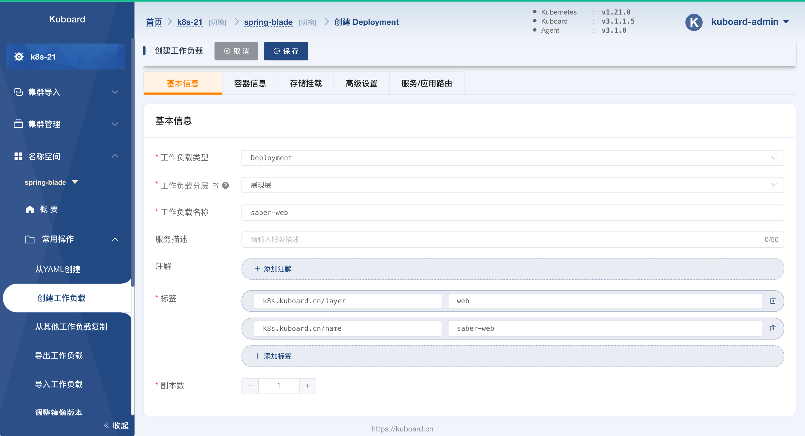
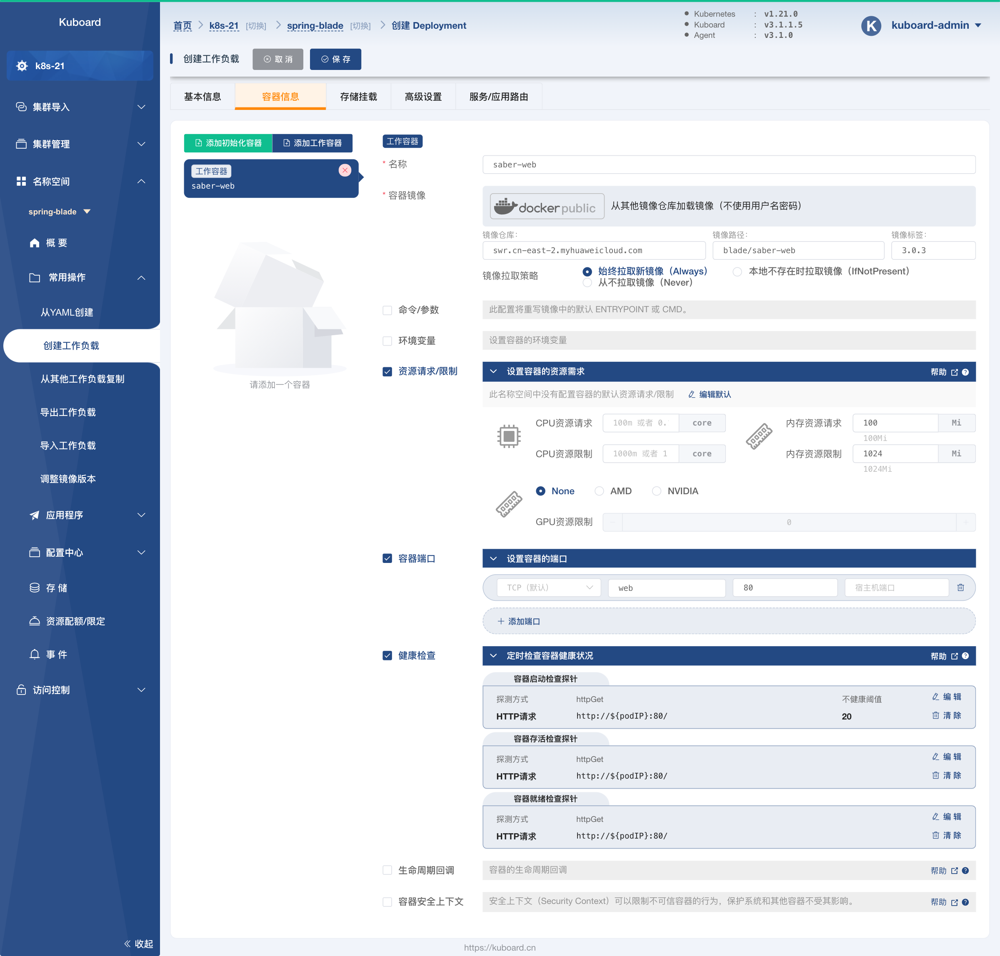
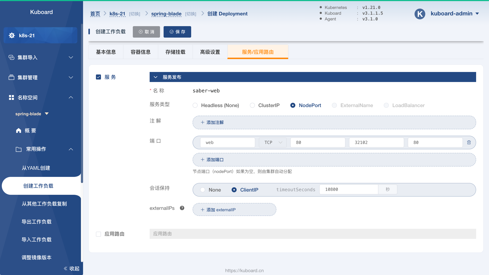
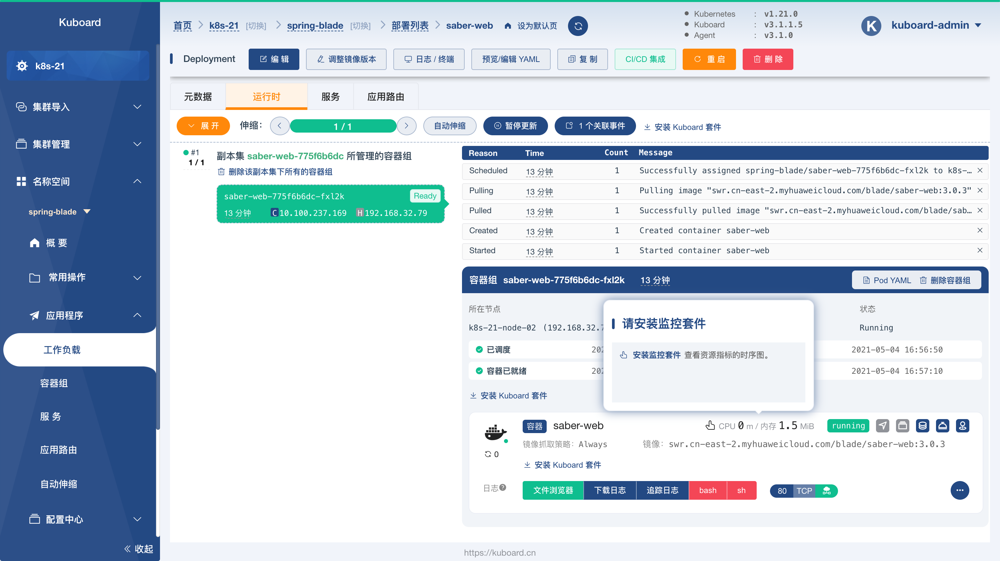
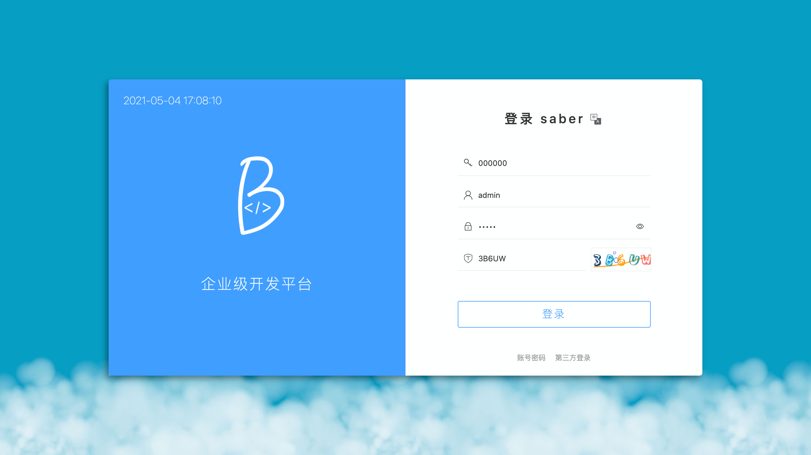
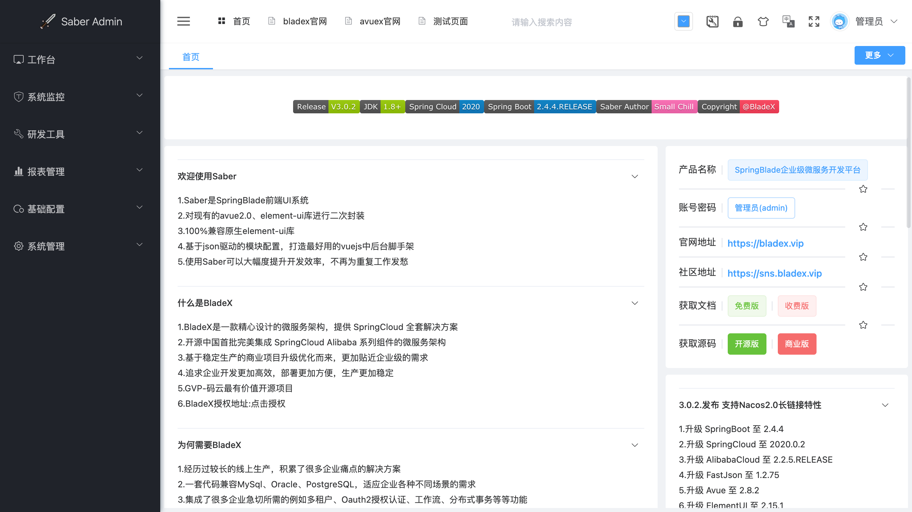

# 部署 saber-web

<AdSenseTitle/>

::: tip 前提条件

部署 saber-web 之前，请确保：

* 您的环境已经满足 [环境准备](../prepare/prepare.html) 中的要求
* 您已经完成了：
  * [部署所有的微服务](./blade-svc.html)

:::

## 创建 Deployment

按照如下步骤创建 `saber-web` Deployment：

* 在 Kuboard 界面进入名称空间 `spring-blade` 之后，点击菜单 ***名称空间*** -> ***spring-blade*** -> ***常用操作*** -> ***创建工作负载*** ，如下图所示：

  并填写表单：

  | 字段名称     | 字段值        | 备注                                         |
  | ------------ | ------------- | -------------------------------------------- |
  | 工作负载类型 | `Deployment` |                                              |
  | 工作负载分层 | `持久层`      | 填写后将自动添加 `k8s.kuboard.cn/layer` 标签 |
  | 工作负载名称 | `saber-web`       | 填写后将自动添加 `k8s.kuboard.cn/name` 标签  |
  | 副本数       | `1`           |                                              |

  

  

* 切换到 ***容器信息*** 标签，如下图所示：

  点击左侧的 ***添加工作容器*** 按钮，添加一个工作容器，并填写表单：

  | 字段名称                    | 字段值                                                       | 备注 |
  | --------------------------- | ------------------------------------------------------------ | ---- |
  | 名称                        | `saber-web`                                                  |      |
  | 容器镜像                    | `从其他镜像仓库加载镜像（不使用用户名密码）`                 |      |
  | 容器镜像-->镜像仓库         | `swr.cn-east-2.myhuaweicloud.com`                            |      |
  | 容器镜像-->镜像路径         | `blade/saber-web`                                            |      |
  | 容器镜像-->镜像标签         | `3.0.3`                                                      |      |
  | 镜像拉取策略                | `始终拉取新镜像（Always）`                                   |      |
  | 资源请求/限制               | 内存资源请求：`100Mi` 内存资源限制：`1024Mi`            |      |
  | 容器端口                    | `web` `80`                                              |      |
  | 健康检查-->容器启动检查探针 | 探测方式： `HTTP请求` httpGet端口： `80` httpGet路径：`/` 不健康阈值：`20` |      |
  | 健康检查-->容器存活检查探针 | 探测方式： `HTTP请求` httpGet端口： `80` httpGet路径：`/` |      |
  | 健康检查-->容器就绪检查探针 | 探测方式： `HTTP请求` httpGet端口： `80` httpGet路径：`/` |      |

  

  

* 切换到 ***服务/应用路由*** 标签页，如下图所示：

  并填写表单：

  | 字段名称 | 字段值                                            | 备注                                                 |
  | -------- | ------------------------------------------------- | ---------------------------------------------------- |
  | 服务类型 | `NodePort`                                        | NodePort，可以将容器端口映射到所有节点的指定节点端口 |
  | 端口     | `web` `TCP` `80` `32102` `80` | 将容器的 `80` 端口映射到节点的 `32102` 端口          |

  

* 点击 ***保存*** 按钮，完成 `saber-web` Deployment 的创建

## 验证部署结果

* 在上面的步骤中，完成 Deployment 的保存以后，将会进入该 Deployment 的详情页面，如下图所示：

  

  > 如果通过 KuboardProxy 打开 `80` 端口对应的网页，将会因为部分资源必须从根路径加载的问题导致页面不能正常显示。

* 在浏览器中打开地址 `http://任意节点IP:32102`，如下图所示：

  

* 输入验证码后，点击登录，如下图所示：

  

* 至此，我们可以认为 `saber-web` 已成功部署

  下一步，请 [验证 SpringBlade 部署结果](./saber-web.html)