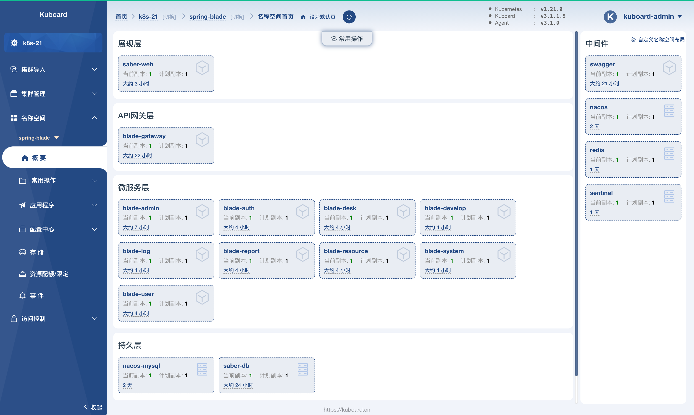
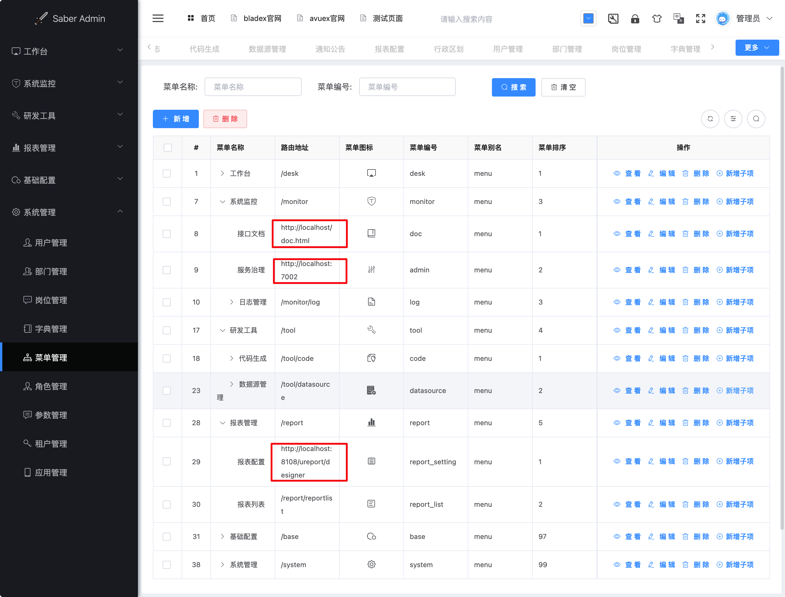
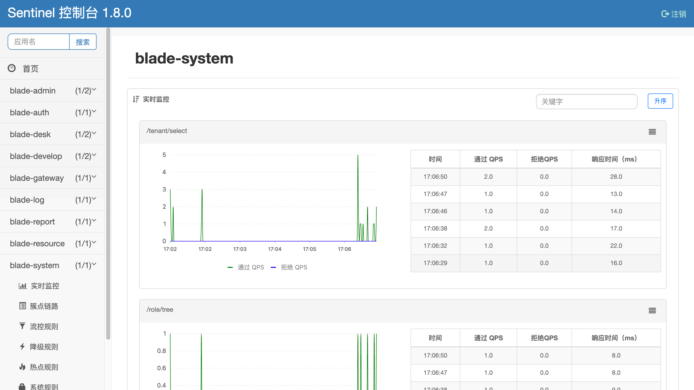

# 验证 SpringBlade 部署结果

<AdSenseTitle/>

::: tip 前提条件

验证 SpringBlade 部署结果之前，请确保您已经完成了 [部署 saber-web](./saber-web.html)

:::

## 名称空间首页

* 在 Kuboard 界面中导航到菜单项 ***名称空间*** --> ***spring-blade*** --> ***概要***，可以查看到已经部署的所有的 SpringBlade 工作负载，如下图所示：

  

## 验证 saber-web 的各项功能

* 在浏览器打开 `http://任意节点IP:32102`，完成登录后，可以尝试点击 saber-web 的各项功能菜单，检验 saber-web 的各项功能是否正常

  [参考此处了解如何登录](./saber-web.html#验证部署结果)

  ::: tip saber-web路由

  导航到 ***系统管理*** --> ***菜单管理*** 菜单项，部分菜单的路由地址以 `http://localhost` 开头，这类菜单项会因为路由地址的问题不能正常打开。

  本文档不对此类路由问题做进一步探讨。如何解决，请到 [SpringBlade](https://gitee.com/smallc/SpringBlade) 的社群中进行讨论。

  :::

  

## 验证 sentinel

* 在 saber-web 界面中，多次（例如，30次）刷新 ***系统管理*** 下的菜单项

* 在浏览器打开 `http://任意节点IP:32100`，并登录 sentinel，切换到 ***blade-system*** 菜单项，如下图所示：

  Sentinel 的默认用户名密码如下：

  用户名： `sentinel`

  密 码： `sentinel`

  

下一步，请 [导入导出 SpringBlade 部署文件](../import/)