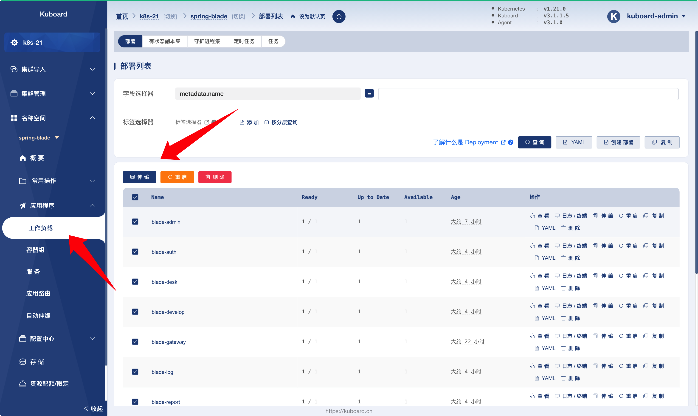
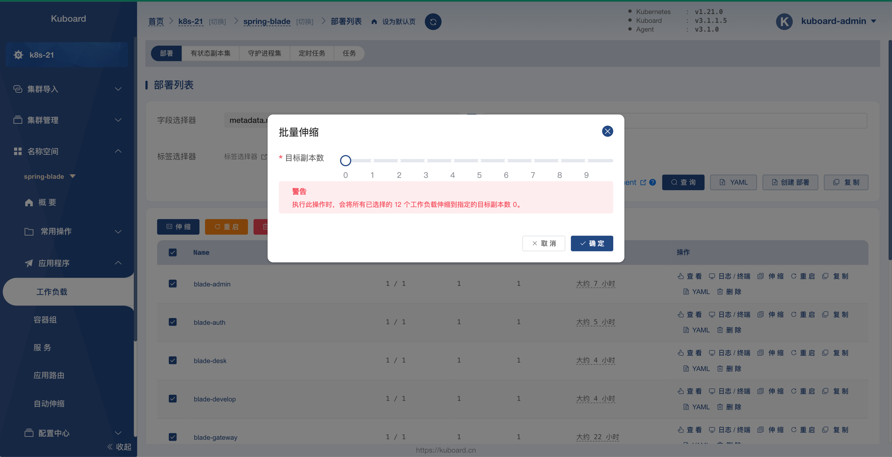
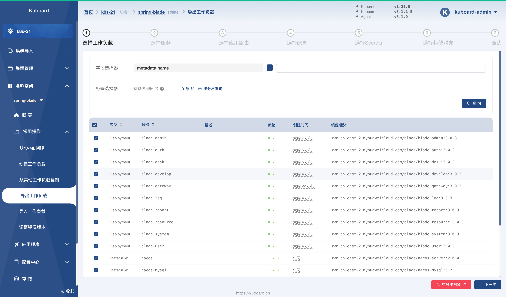
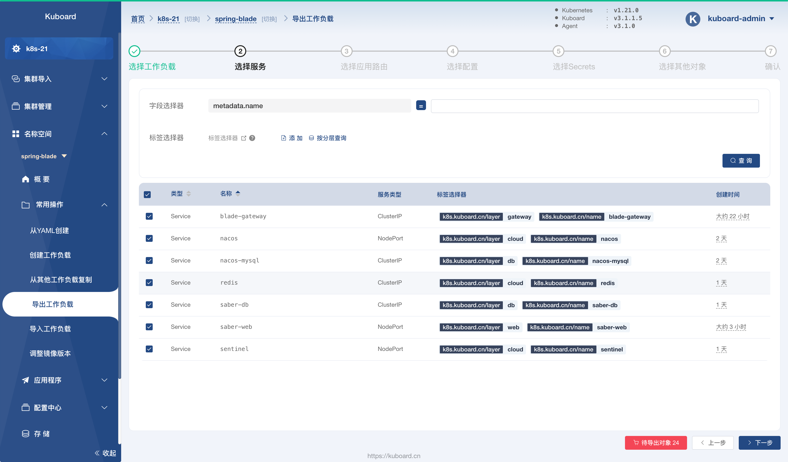
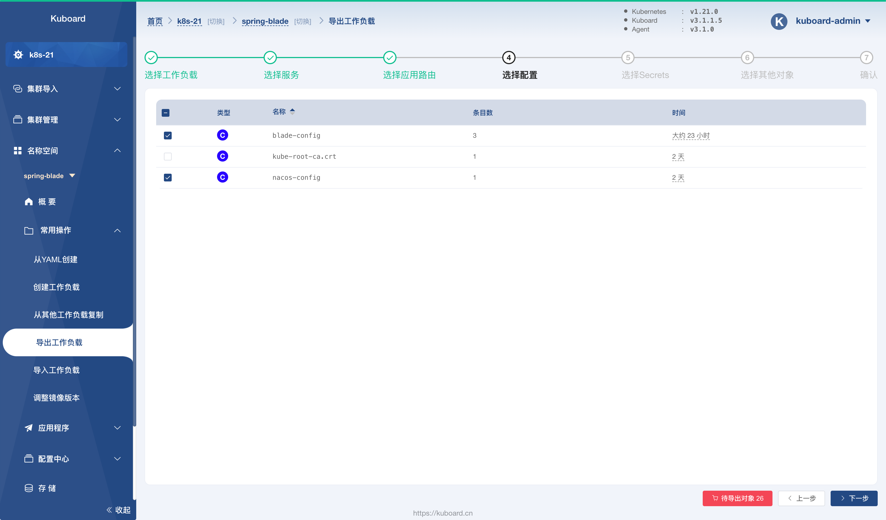
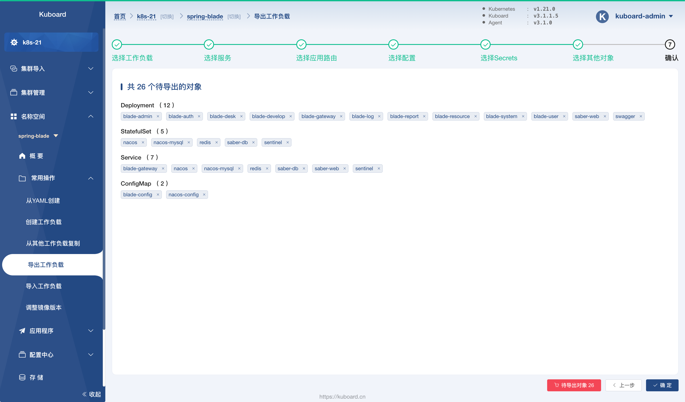

# 导出 yaml

<AdSenseTitle/>

::: tip 前提条件

验证 SpringBlade 部署结果之前，请确保您已经完成了
* [部署所有微服务](../deploy/blade-svc.html)
* [部署 saber-web](../deploy/saber-web.html)
* [验证 SpringBlade 部署结果](../deploy/validate.html)

:::

按照如下步骤，可以导出已经部署的微服务到 YAML 文件，并且通过 [导入 yaml](./import.html) 快速再另外一个名称空间或者 Kubernetes 集群部署微服务。

## 导出微服务到 YAML

* 在 Kuboard 界面中导航到菜单项 ***名称空间*** --> ***spring-blade*** --> ***应用程序*** --> ***工作负载*** 页面，如下图所示：

  

* 在 ***工作负载*** 界面中勾选所有 ***部署***，点击 ***伸缩*** 按钮，如下图所示：

  将 ***目标副本数*** 调整为 `0`，然后点击 ***确定*** 按钮，执行完此操作后，所有 Deployment 的副本数都将被修改为 0。

  > 这个操作的必要性是特定于 ***SpringBlade*** 项目的，因为在 SpringBlade 项目中，完成 nacos 的部署之后，启动微服务项目之前，需要手动通过 nacos 界面导入 ***SpringBlade*** 的配置文件到 nacos 配置中心。

  

* 导航到菜单项 ***名称空间*** --> ***常用操作*** --> ***导出工作负载***，如下图所示：

  在 ***选择工作负载*** 这一步骤中，勾选所有的条目

  

* 点击 ***下一步*** 按钮，如下图所示：

  在 ***选择服务*** 这一步骤中，勾选所有的条目

  

* 点击两次 ***下一步*** 按钮，如下图所示：

  在 ***选择配置*** 这一步骤中，勾选 `blade-config` 和 `nacos-config` 这两个条目

  

* 点击三次 ***下一步*** 按钮，进入 ***确认*** 步骤，如下图所示：

  

* 点击 ***确定*** 按钮，导出 26 个对象，并将结果保存到本地文件夹。

  默认情况下，导出的 yaml 文件命名规则为 `kuboard_名称空间_年_月_日_时_分.yaml`，例如：`kuboard_spring-blade_2021_05_04_20_27_16.yaml`

* 接下来，请 [导入 yaml](./import.html)