# 导入 yaml

<AdSenseTitle/>

::: tip 前提条件

验证 SpringBlade 部署结果之前，请确保: 
* 您的环境已经满足 [环境准备](../prepare/prepare.html) 中的要求；
* 您已经完成了 [导出 yaml](./export.html) 这个步骤，或者从这里下载已提前为您准备的 <a :href="$withBase('/kuboard_spring-blade.yaml')" download="kuboard_spring-blade.yaml">kuboard_spring-blade.yaml</a>

:::

## 创建 spring-blade-2 名称空间

在 Kuboard 中，创建一个名称空间用于导入 SpringBlade，例如 `spring-blade-2`

创建名称空间的步骤如下：

* 打开 Kuboard 首页，如下图所示：

  > 假设您已经导入了至少一个 Kubernetes 集群到 Kuboard

  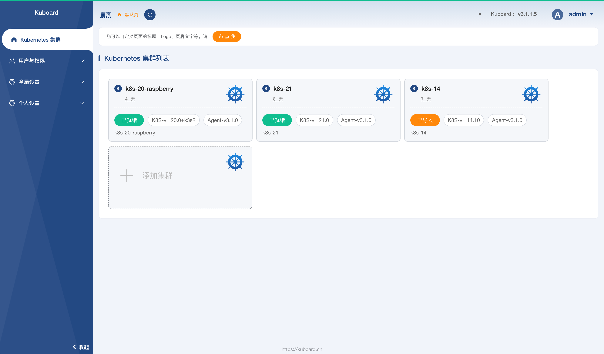

* 点击其中的一个 `已就绪` 状态的集群，如下图所示：

  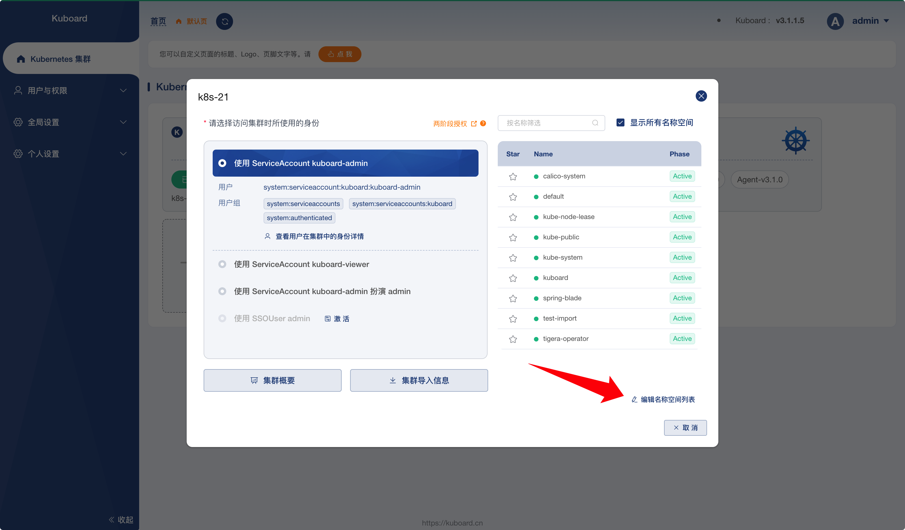

* 点击上图中 ***编辑名称空间列表*** 的按钮，结果如下图所示：

  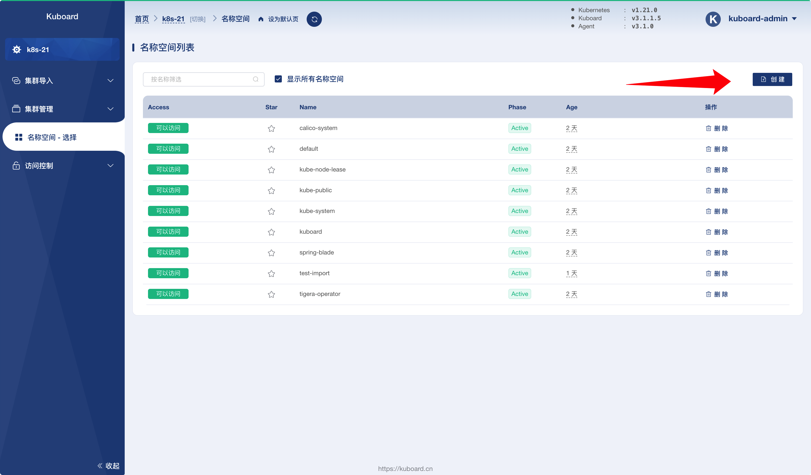

* 点击上图中的 ***创建*** 按钮，根据界面提示，完成名称空间 `spring-blade-2` 的创建。

## 导入 spring-blade 到 K8S 名称空间

* 在 Kuboard 界面中，导航到菜单项 ***名称空间*** --> ***spring-blade-2*** --> ***常用操作***  --> ***导入工作负载***

  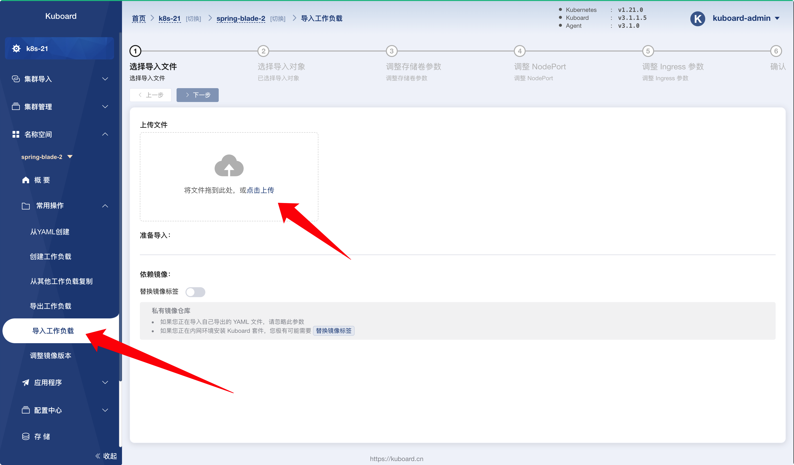

* 在 ***选择导入文件*** 这个步骤中，点击 ***上传*** 按钮，并选择 [导出 yaml](./export.html) 步骤中获得的 YAML，或者下载 <a :href="$withBase('/kuboard_spring-blade.yaml')" download="kuboard_spring-blade.yaml">kuboard_spring-blade.yaml</a> 得到的 YAML 文件，如下图所示：

  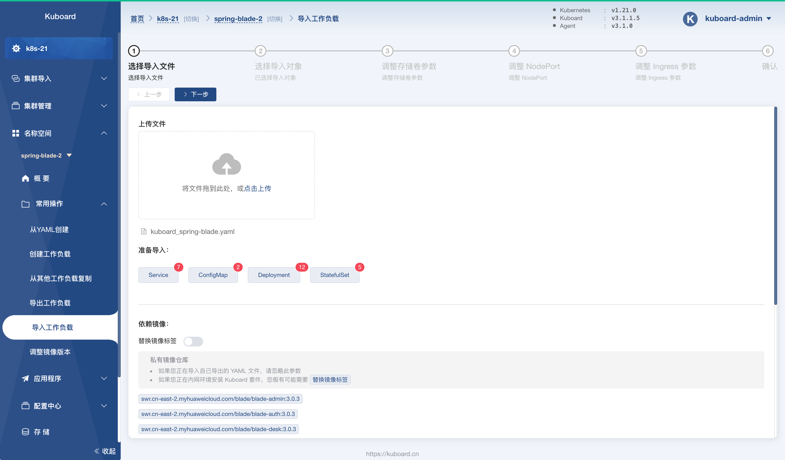

* 点击 ***下一步*** ，在 ***选择导入对象*** 这个步骤中，选择所有对象，如下图所示：

  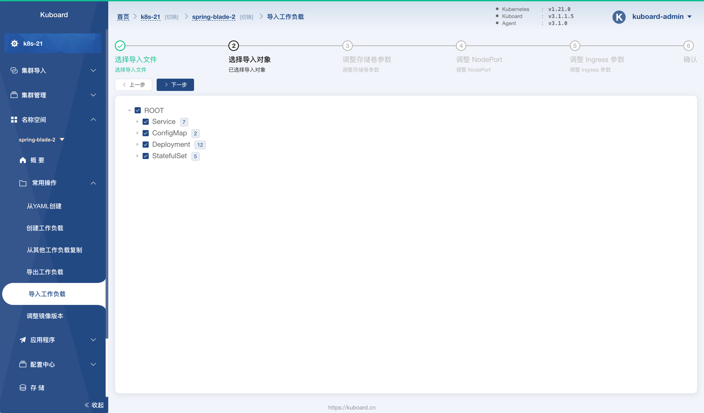

* 点击 ***下一步***， 在 ***调整存储卷参数*** 这个步骤中，为所有的 ***存储卷声明模板*** 选择一个有效的 ***存储类***，如下图所示：

  

* 点击 ***下一步***， 在 ***调整存储卷参数*** 这个步骤中，为每个节点端口设置一个新的端口取值，如下图所示：

  新的节点端口映射如下表（修改节点端口，是为了避免节点端口冲突，如果原来的节点端口未被占用，也可以不修改）

  | 工作负载名称 | 新的节点端口 | 备注 |
  | ------------ | ------------ | ---- |
  | `nacos`      | `32200`      |      |
  | `sentinel`   | `32201`      |      |
  | `saber-web`  | `32202`      |      |

  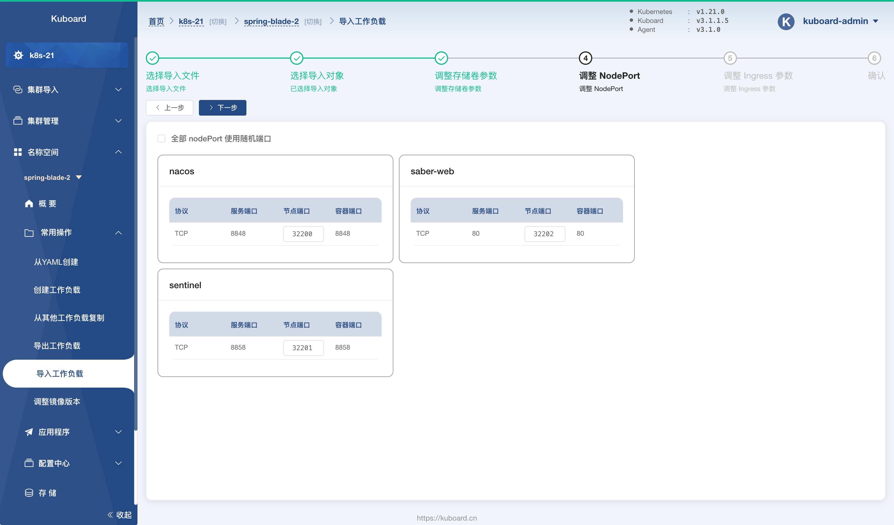

* 点击两次 ***下一步*** 按钮，在 ***确定*** 这个步骤中，点击 ***确定*** 按钮，然后在界面的提示下完成工作负载的导入。

  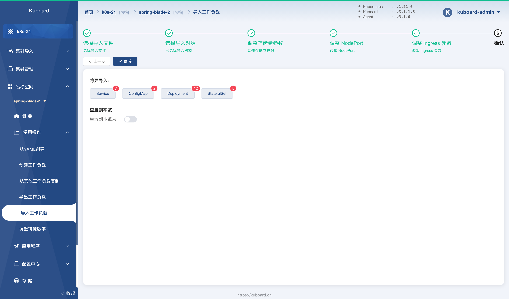

## 导入配置到 nacos

* 完成工作负载的导入后，`spring-blade-2` 名称空间的 ***概要*** 如下图所示：

  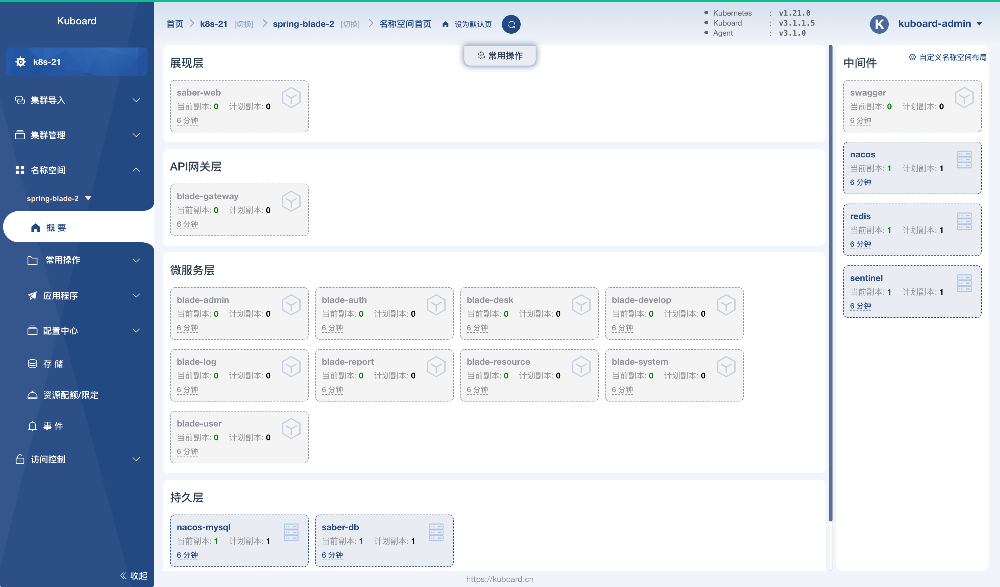

* 在浏览器中打开 `http://任意节点IP:32200/nacos`，并登陆 nacos，默认用户名密码为：

  用户名： `nacos`

  密码： `nacos`

* 在 nacos 中导航到菜单项 ***配置管理*** --> ***配置列表*** ，如下图所示：

  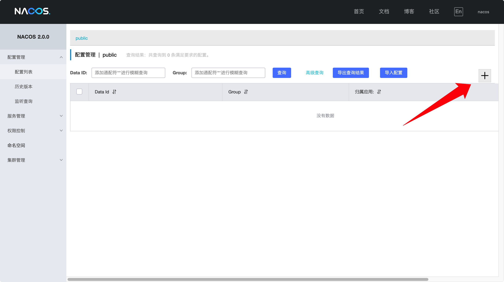

* 在 ***配置列表*** （如上图）中点击加号按钮，如下图所示：

  填写如下表单：
  
  | 字段名   | 字段值                                                       | 备注                                                         |
  | -------- | ------------------------------------------------------------ | ------------------------------------------------------------ |
  | Data ID  | `blade.yaml`                                                 |                                                              |
  | Group    | `DEFAULT_GROUP`                                              |                                                              |
  | 配置格式 | `YAML`                                                       |                                                              |
  | 配置内容 

 | 链接 <a href="https://gitee.com/smallc/SpringBlade/raw/v3.0.3/doc/nacos/blade.yaml" target="_blank">https://gitee.com/smallc/SpringBlade/raw/v3.0.3/doc/nacos/blade.yaml</a> | 在浏览器打开该链接，并将其内容复制粘贴到 ***配置内容*** 字段 |
  
  
  
* 点击 ***发布*** 按钮，并重复上述过程，添加一个新的配置 ***blade-test.yaml***

  表单如下：

  | 字段名   | 字段值                                                       | 备注                                                         |
  | -------- | ------------------------------------------------------------ | ------------------------------------------------------------ |
  | Data ID  | `blade-test.yaml`                                            | 
此处为 `blade-test.yaml` 不要写错
 |
  | Group    | `DEFAULT_GROUP`                                              |                                                              |
  | 配置格式 | `YAML`                                                       |                                                              |
  | 配置内容 

 | 链接 <a href="https://gitee.com/smallc/SpringBlade/raw/v3.0.3/doc/nacos/blade-k8s.yaml" target="_blank">https://gitee.com/smallc/SpringBlade/raw/v3.0.3/doc/nacos/blade-k8s.yaml</a> | 在浏览器打开该链接，并将其内容复制粘贴到 ***配置内容*** 字段； 
此处使用 `blade-k8s.yaml` 文件中的内容，不要弄错
 |

## 启动微服务工作负载

* 在 Kuboard 界面中导航到菜单项 ***名称空间*** --> ***spring-blade*** --> ***应用程序*** --> ***工作负载*** 页面，如下图所示：

  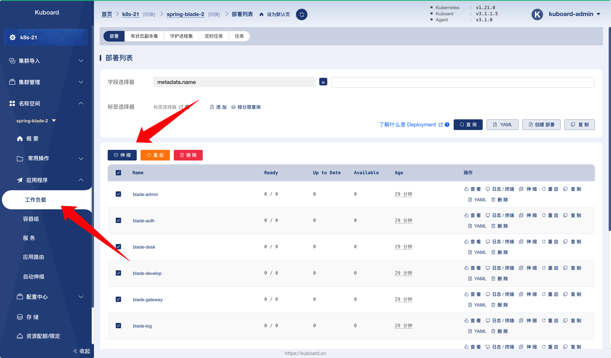

* 选中 ***工作负载*** 中所有的 ***部署***，并点击 ***伸缩*** 按钮，如下图所示：

  将目标副本数调整为 `1`，并点击确定按钮，此后，所有微服务工作负载将逐渐启动。

  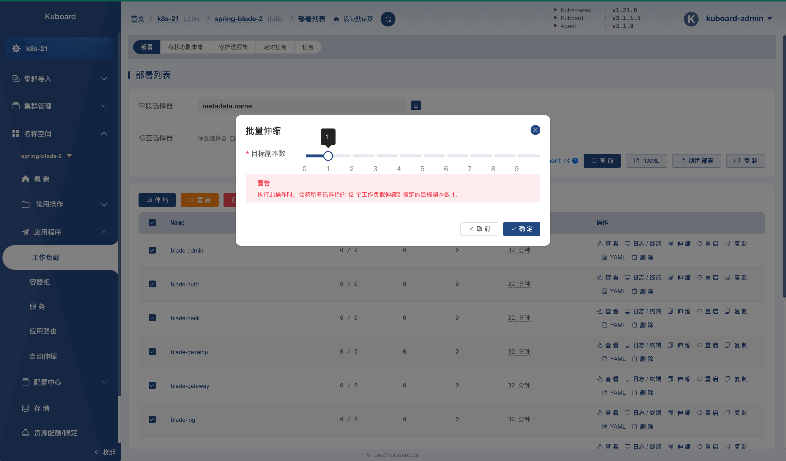

## 验证部署结果

* 在 nacos 界面中，导航到菜单项 ***服务管理*** --> ***服务列表***，如下图所示：

  如果所有微服务工作负载都正常启动，服务列表中应该有 10 个条目。

  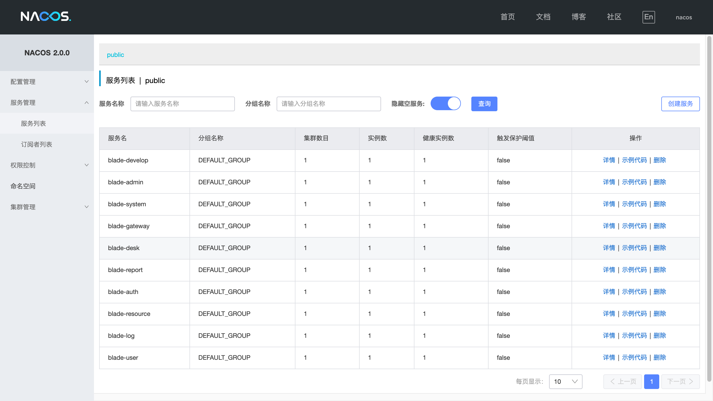

* 在浏览器打开 `http://任意节点IP:32202`

  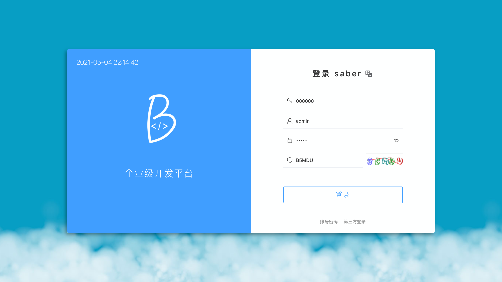

* 进一步验证部署结果，请参考 [验证 SpringBlade 部署结果](../deploy/validate.html)

  ::: tip 端口差异

  导入时，所使用的节点端口与逐步部署时所使用的节点端口有所不同，具体来说，导入后，各个主要界面的打开方式如下：

  | 软件        | URL                       |
  | ----------- | ------------------------- |
  | `nacos`     | `http://任意节点IP:32200/nacos` |
  | `sentinel`  | `http://任意节点IP:32201` |
  | `saber-web` | `http://任意节点IP:32202` |

  :::
