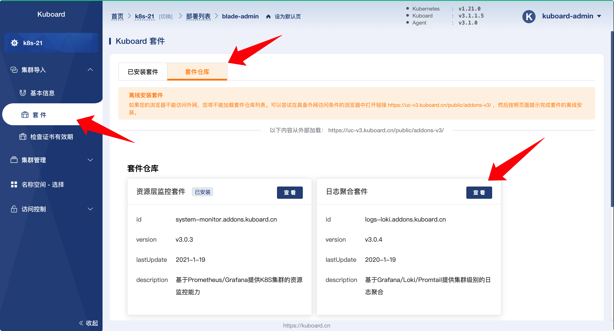
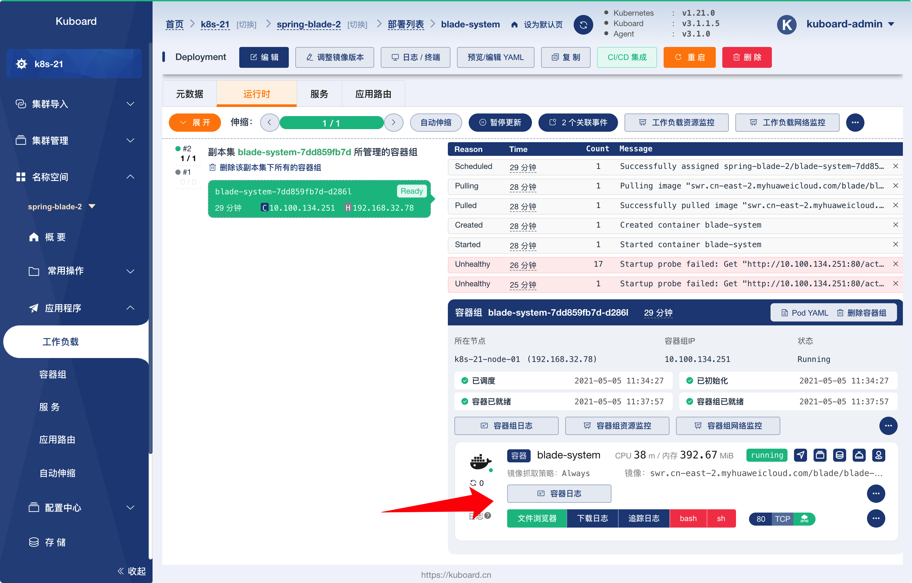
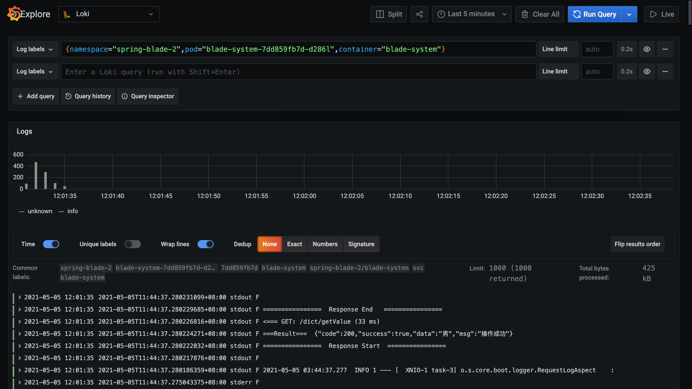

---

layout: LearningLayout
description: Kubernetes教程_使用Kuboard在Kubernetes上部署Spring_Cloud微服务平台SpringBlade
meta:
  - name: keywords
    content: Kubernetes教程,K8S教程,Kubernetes微服务,Kubernetes Spring Cloud
---

# 聚合日志

<AdSenseTitle/>

## 安装日志聚合套件

* 在 Kuboard 界面中，导航到菜单项 ***集群导入*** --> ***套件***，并切换到 ***套件仓库*** 标签页，如下图所示：

  

* 点击上图中的 ***资源层监控套件*** ，进入资源监控套件详情页，并切换到 ***在线安装*** 标签页，点击 ***安装*** 按钮，然后在界面的引导下，完成监控套件的安装。

## 查看日志

* 安装完 ***日志聚合套件*** 之后，在 Kuboard 的工作负载详情页中，可以查看到日志聚合套件的入口按钮，如下图所示：

  

* 点击 ***容器日志*** 按钮，将在新窗口打开 ***grafana*** 日志聚合界面，如下图所示：

  