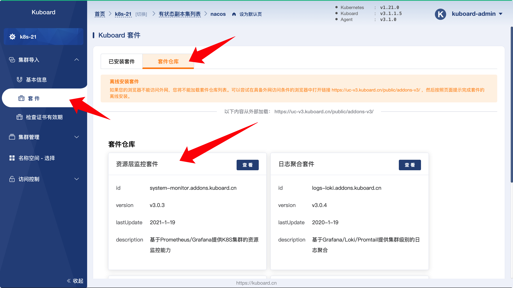
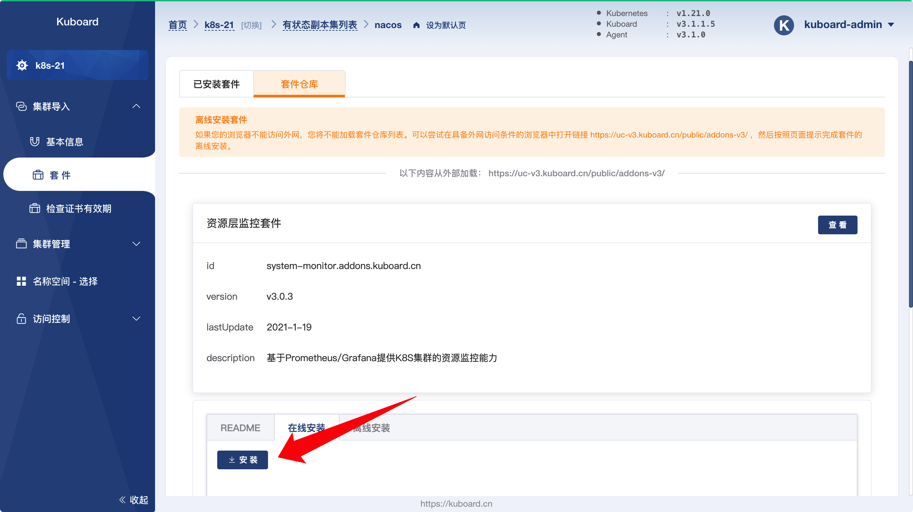
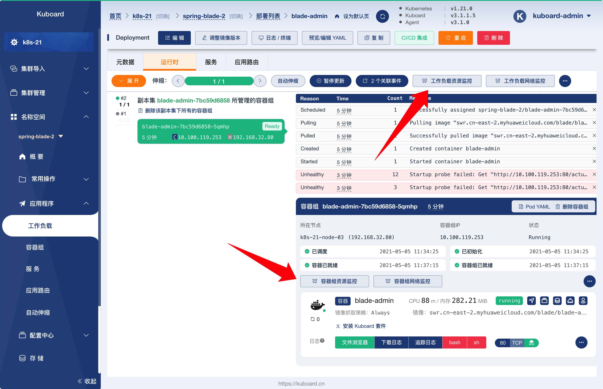
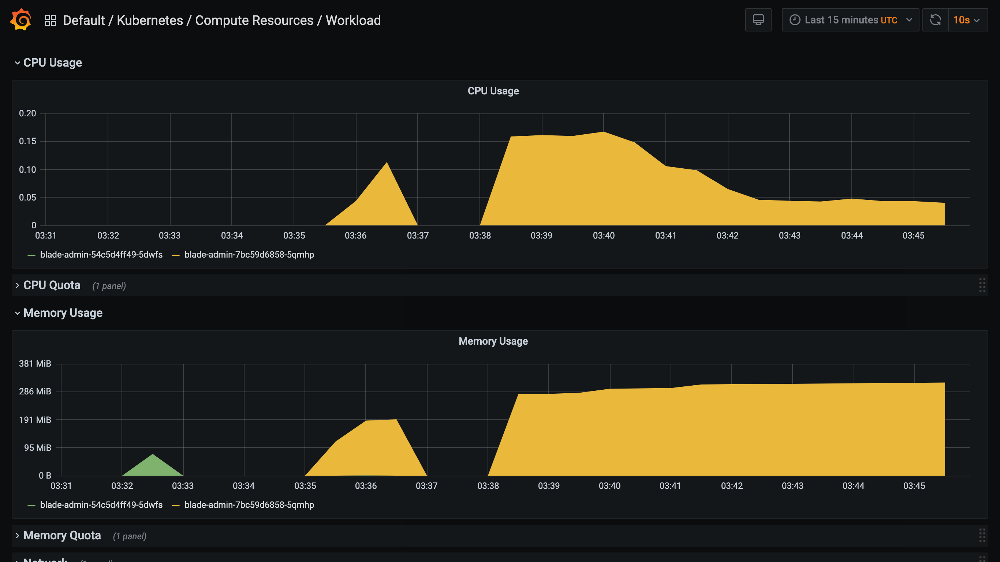

# 监控

<AdSenseTitle/>

## 安装监控套件

通过 Kuboard 界面，可以快速安装监控套件，步骤如下：

* 在 Kuboard 界面中，导航到菜单项 ***集群导入*** --> ***套件***，并切换到 ***套件仓库*** 标签页，如下图所示：

  

* 点击上图中的 ***资源层监控套件*** ，进入资源监控套件详情页，并切换到 ***在线安装*** 标签页，点击 ***安装*** 按钮，然后在界面的引导下，完成监控套件的安装。

  

## 查看监控结果

* 完成监控套件安装之后，在 Kuboard 界面的工作负载详情页中，可以看到监控套件界面的入口按钮，如下图所示：

  

* 点击 ***工作负载资源监控*** 按钮，将在新窗口打开 ***Grafana*** 监控界面，如下图所示：

  