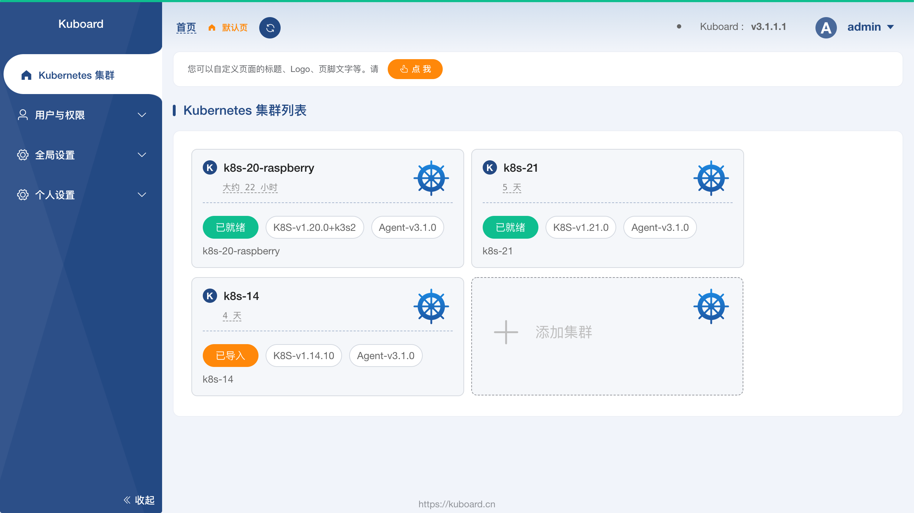
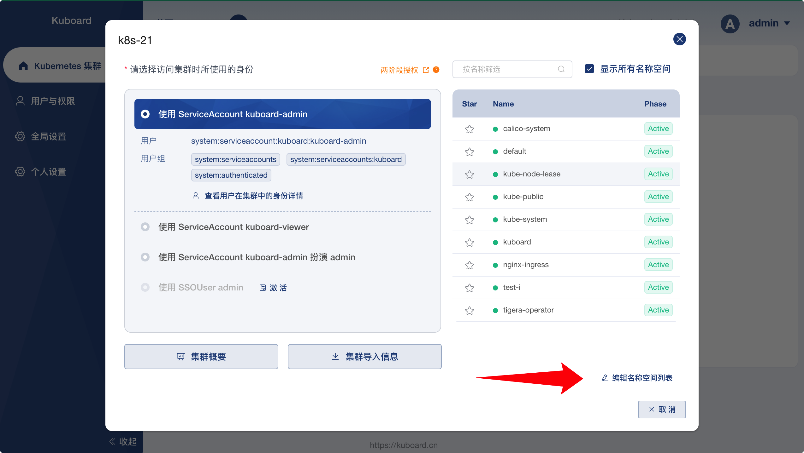
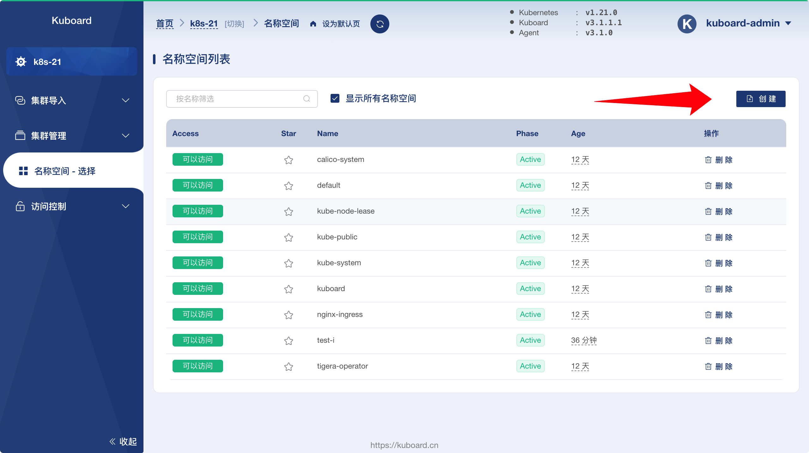
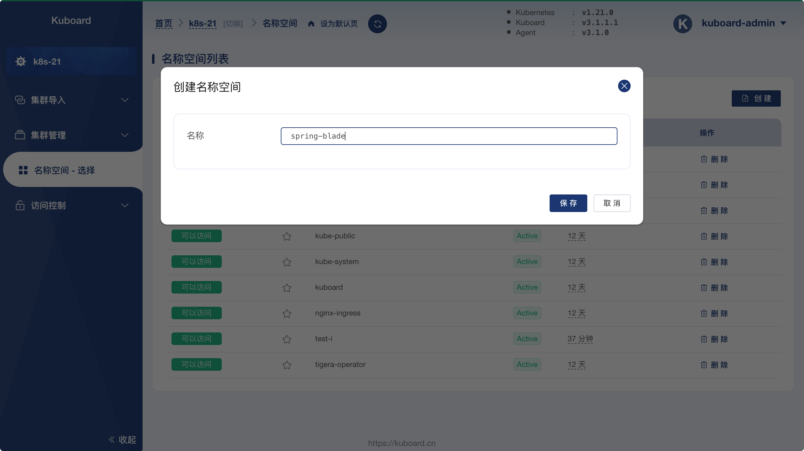

# 环境准备

<AdSenseTitle/>

按照本系列文档在 Kubernetes 上部署 SpringBlade 时，需要准备如下内容：`Kubernetes`、`Kuboard`、`docker 镜像`、`Kubernetes 名称空间`。

## Kubernetes

* 版本不低于 `v1.16.0`；
  * [使用kubeadm安装kubernetes](/install/install-k8s.html)
* 可用的总内存不低于 10GiB；
* 有效的存储类
  * 关于存储类的介绍请参考 [StorageClass](/learning/k8s-intermediate/persistent/storage-class.html)
  * 如果您的集群中尚未配置存储类，请参考如下三种存储类配置中的任意一种：
    * [使用 CephFS 作为存储类](/learning/k8s-intermediate/persistent/ceph/k8s-config.html)
    * [使用 CephFS 作为存储类 - Rook](/learning/k8s-intermediate/persistent/ceph/rook-config.html)
    * [使用 NFS 作为存储类](/learning/k8s-intermediate/persistent/nfs.html)

## Kuboard

* 版本不低于 `v3.1.1.5`
  * 请参考 [安装 Kubernetes 多集群管理工具 - Kuboard v3](/install/v3/install.html)

## docker 镜像

本系列文档中所用到的镜像已经被提前发布到一个公共镜像仓库，标签如下：

如果您想要自己构建这些镜像，请参考文档 [构建 SpringBlade 容器镜像](./build.html)

```sh
swr.cn-east-2.myhuaweicloud.com/blade/blade-admin:3.0.3
swr.cn-east-2.myhuaweicloud.com/blade/blade-auth:3.0.3
swr.cn-east-2.myhuaweicloud.com/blade/blade-desk:3.0.3
swr.cn-east-2.myhuaweicloud.com/blade/blade-develop:3.0.3
swr.cn-east-2.myhuaweicloud.com/blade/blade-gateway:3.0.3
swr.cn-east-2.myhuaweicloud.com/blade/blade-log:3.0.3
swr.cn-east-2.myhuaweicloud.com/blade/blade-report:3.0.3
swr.cn-east-2.myhuaweicloud.com/blade/blade-resource:3.0.3
swr.cn-east-2.myhuaweicloud.com/blade/blade-swagger:3.0.3
swr.cn-east-2.myhuaweicloud.com/blade/blade-system:3.0.3
swr.cn-east-2.myhuaweicloud.com/blade/blade-user:3.0.3
swr.cn-east-2.myhuaweicloud.com/blade/blade-web:3.0.3
swr.cn-east-2.myhuaweicloud.com/blade/saber-db:3.0.3
swr.cn-east-2.myhuaweicloud.com/blade/sentinel-dashboard:1.8.0    # 同 bladex/sentinel-dashboard:1.8.0
swr.cn-east-2.myhuaweicloud.com/blade/redis:5.0.2-alpine          # 同 redis:5.0.2-alpine
swr.cn-east-2.myhuaweicloud.com/blade/nacos-server:2.0.0          # 同 nacos/nacos-server:2.0.0
swr.cn-east-2.myhuaweicloud.com/blade/nacos-mysql:5.7             # 同 nacos/nacos-mysql:5.7
```

## Kubernetes 名称空间

创建一个 Kubernetes 名称空间用于部署 SpringBlade，例如 `spring-blade`。

创建名称空间的步骤如下：

* 打开 Kuboard 首页，如下图所示：

  > 假设您已经导入了至少一个 Kubernetes 集群到 Kuboard

  

* 点击其中的一个 `已就绪` 状态的集群，如下图所示：

  

* 点击上图中 `编辑名称空间列表` 的按钮，结果如下图所示：

  

* 点击上图中的 `创 建` 按钮，结果如下图所示：

  

* 在上图中输入名称空间的名称 `spring-blade`，并点击 `保存` 按钮，完成名称空间的创建。


::: tip 开始部署

至此，您已经做好了所有准备，可以使用 Kuboard 在 Kubernetes 上 [部署 SpringBlade](../deploy/index.html) 了

:::
