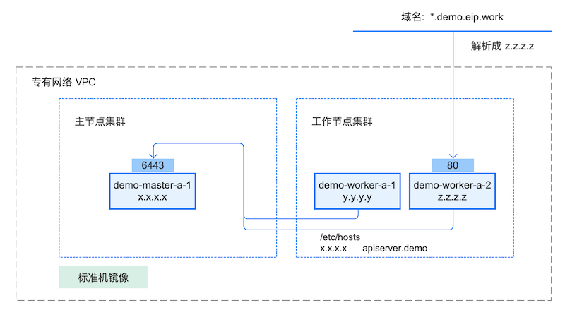

# 最快速的Kubernetes+微服务落地方案

## Kubernetes 落地难

**Kubernetes 是趋势**

Kubernetes 是一个全新的基于容器技术的分布式架构领先方案。Kubernetes(k8s)是Google开源的容器集群管理系统（谷歌内部:Borg）。在Docker技术的基础上，为容器化的应用提供部署运行、资源调度、服务发现和动态伸缩等一系列完整功能，提高了大规模容器集群管理的便捷性。

Kubernetes是一个完备的分布式系统支撑平台，具有完备的集群管理能力，多扩多层次的安全防护和准入机制、多租户应用支撑能力、透明的服务注册和发现机制、內建智能负载均衡器、强大的故障发现和自我修复能力、服务滚动升级和在线扩容能力、可扩展的资源自动调度机制以及多粒度的资源配额管理能力。同时Kubernetes提供完善的管理工具，涵盖了包括开发、部署测试、运维监控在内的各个环节。

2016、2017年开始，各大互联网厂商就已经进行了各种容器化 + Kubernetes的尝试，请参考 [案例介绍](https://www.kubernetes.org.cn/tags/%E4%BC%81%E4%B8%9A%E6%A1%88%E4%BE%8B)，各种实践证明 Kubernetes 越来越成熟。

**Kubernetes 门槛高**

然而，Kubernetes 在更大范围内落地的过程却困难重重，原因主要在于其过高的学习门槛：

* 基础知识要求多，Linux、网络、Docker等；
* 集群安装管理复杂；
* Kubernetes 的配置文件 YAML 冗长，对象类型繁多、关联关系复杂

请参考 [如何降低 Kubernetes 学习门槛](concepts.html)

## Kuboard 助力

Kuboard 从以下几方面解决 Kubernetes 落地的难题：

### Kubernetes 安装手册

通过对 Kubernetes 安装步骤的反复研究，提供了精简的 Kubernetes 安装手册，并且听取网友实际安装过程中的反馈，多次修改和优化，逐渐形成经过检验的、简洁的 Kubernetes 安装手册。请参考 [安装 Kubernetes 单Master节点](/install/install-k8s.html) ， [安装 Kubernetes 高可用](/install/install-kubernetes.html)。

### 图形化管理界面

提炼 Kubernetes 各核心概念之间的关系，帮助用户理解如何配置 Kubernetes，并以此为依据设计了 Kuboard 工作负载编辑器。使用 Kuboard，用户无需手工编写和维护冗长的 YAML 文件，配合 Kuboard 提供的其他辅助手段，完全通过图形界面就可以实现微服务的部署和维护。

### Spring Cloud 微服务部署实战案例

Kuboard 提供 Spring Cloud 在 Kubernetes 上部署的实战案例分析，手把手帮助技术团队完成 Spring Cloud 微服务在 Kubernetes 上的部署和维护。请参考 [Spring Cloud on Kubernetes](/micro-service/spring-cloud/)

### 免费自助

这么好的东西卖多少钱？您完全无需为了使用此方案而进入漫长的商务谈判、内部审批流程。

使用 https://kuboard.cn 网站上提供的任何文档、资源、方案、软件 **完全免费**，已经有许多技术团队参考这些资料，结合其已有经验，顺利地完成 Kubernetes + 微服务的落地交付。碰到问题时，您也可以通过 Kuboard 社群获得支持。

Kuboard 团队的盈利方式是为企业提供业务、IT咨询和定制化开发的服务。主要服务内容包括：
* 业务架构设计及领域建模
* 应用架构设计、数据架构设计
* 微服务架构设计
* 微服务开发技术培训
* DevOps 体系建设及培训

商务联系请表明您的意图：

